_Estimated reading time: 12 minutes_ ☕☕☕

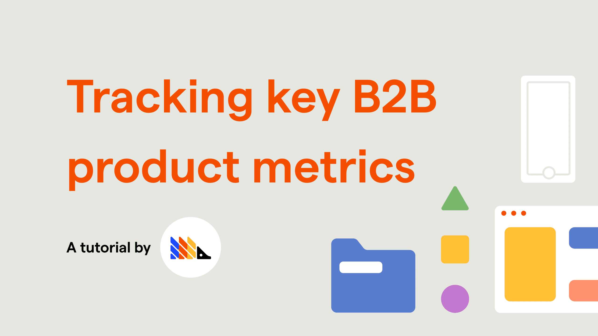

If you run a B2B business, it is especially important to track group usage of your product, since, by definition, you have multiple clearly-defined groups as your clients. 

Since usage may vary from company to company in your clients list, digging deeper into how these different teams and businesses use your product is essential to developing a platform that meets the use-case of your core audience well.

As such, this tutorial will walk you through how to track usage of your B2B product, going over key metrics and how you can set up your analytics views to reflect them.

### Prerequisites

To follow this tutorial along, you need to:

1. Have [deployed PostHog](/docs/deployment).
1. Have started receiving events via our [snippet](/docs/integrate/client/js), one of our [integrations](/docs/integrate/overview), or our [API](/docs/api/overview)

> **Pro tip:** To make the most out of this tutorial, we recommend that you have some [actions](/docs/tutorials/actions#sorting-through-your-events-with-actions) set up, as well as have tried sending some [custom events](/docs/tutorials/actions#using-custom-events-to-track-advanced-behaviors). These are explained in detail in our [Complete guide to event tracking](/docs/tutorials/actions). Additionally, it is also beneficial to be familiar with [Cohorts](/docs/tutorials/cohorts).
 
### Determining B2B product/market fit

Determining product/market fit is a key step to making your product successful, and, in order to do so, you need to understand if your product is being used, who is using it, and how it's being used. 

#### Is my product being used?

To determine if your product is being used, let's start in 'Trends' (under 'Insights').

##### How many users do I have?

By default, 'Trends' will give you a chart of pageviews over time, which is a reasonable start to understand if your product is being used. However, this chart might include a lot of data that doesn't tell you much about the usage of your product.

This can be the case if you use PostHog to track multiple websites or applications, such as your landing page and your web app. Thus, as a first step, we can set a filter for the 'Current URL' property to focus only on our product pageviews. 

At PostHog, for example, we set a filter for 'Current URL does not contain `https://posthog.com`'. This filters out pageviews from our website so that we can focus on actual product usage.

Next, you might also want to filter your own team out of the data. The best way to do so is by using a [Cohort](/docs/tutorials/cohorts). Your cohort can define who your team is or isn't by matching properties such as `company_name`, `email`, or `team_id`, depending on the logic you use to identify users. Keep in mind that these are [properties that you have to set yourself](/docs/integrate/client/js#sending-user-information).

Here's what your chart might look like after the aforementioned setup:

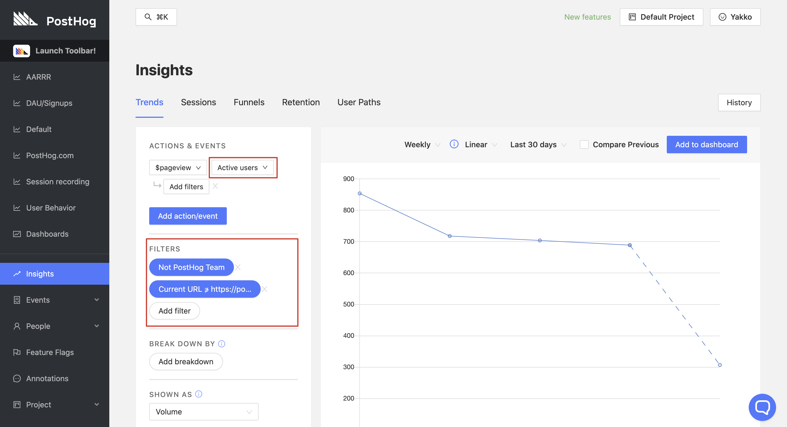

Depending on your PostHog setup, you might need or want to narrow this view even further. For this, you can set as many filters you like, to ensure you're measuring users that really did use your product. For example, you might want to filter based on a specific URL, or change the event from `$pageview` to a custom action that you set up. You could, for instance, determine that to count an active user, the user needs to use a certain part of your product. As such, you could represent that by a button click or [custom event](/docs/tutorials/actions#using-custom-events-to-track-advanced-behaviors).

##### We set up a free trial for a user. Have they been using the product?

###### Individual Users

When you onboard a user, you probably want to track their specific usage on the platform. For example, you may want to know:

- Has the user has logged in after the onboarding?
- What features have they used?
- Have they invited their team?

In order to track this, you should first ensure you are sending relevant user data to PostHog. For example, when a user signs up, you should consider adding their email as a property to PostHog, as well as other valuable information such as their company name.

With our [JavaScript Library](/docs/integrate/client/js), this might look something like this:

```js
const login = (userEmail, userPassword, userCompanyName) => {
    /* Your authentication logic here */
    posthog.people.set({
        email: userEmail
        company: userCompanyName
    })
}
```

This way, you can then find the user on PostHog's 'People' page and access their individual page to analyze their events and watch their recorded sessions.

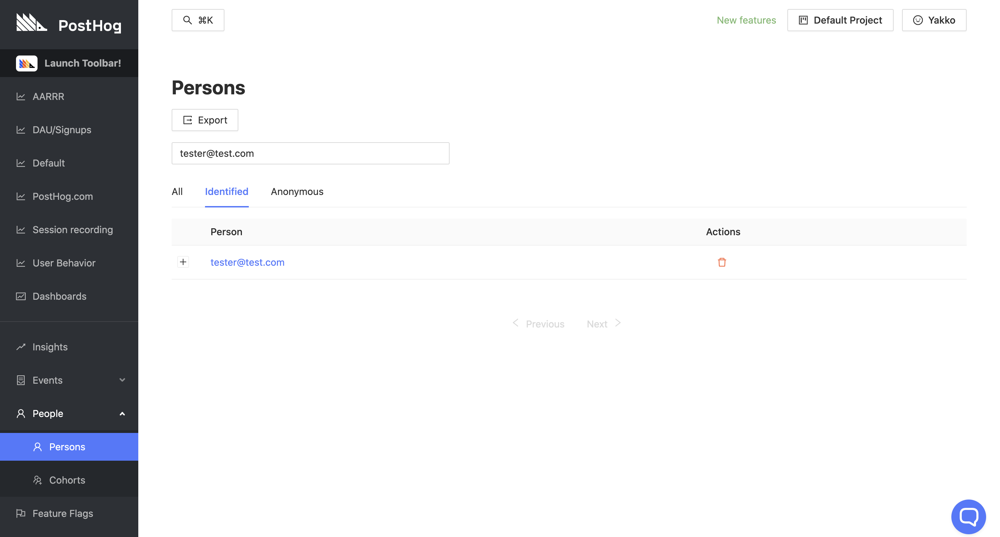

Additionally, you will also then be able to filter charts in 'Insights' to find the data on that specific user, by setting a filter like 'Email equals `tester@test.com`'. Here's an example:

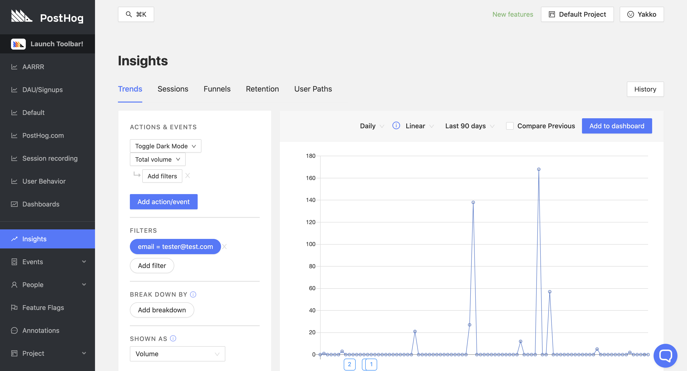

On the chart above, we can see how often the user performed the action 'Toggle Dark Mode'. However, you could do the same for the actions that you set which are valuable to you, such as 'Invited Team Member', 'Logged In', and 'Used Feature X'.

And remember, you can set this filter on any 'Insights', including 'Retention':

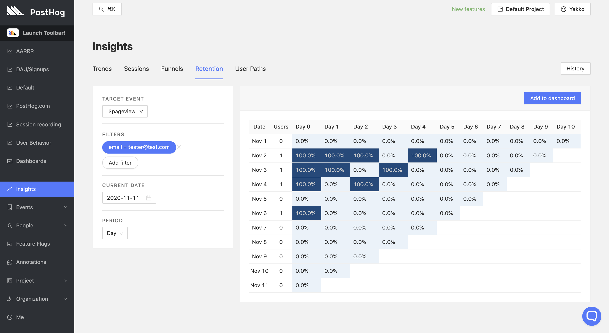

And 'Paths':

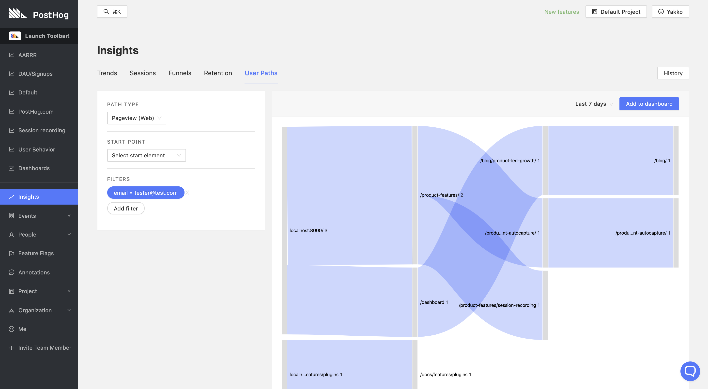

PostHog also remembers your filters, so flipping through tabs in 'Insights' ensures your views are filtered accordingly by default.

###### Teams

When you onboard teams, you can make use of the same views mentioned above, but you should filter them by [cohort](/docs/tutorials/cohorts). By creating a cohort for the new team, you can track how the group uses the product as a whole, as well as determine who are the people within the team that are most engaged. 

This way, you can determine how to approach specific users in a team, and who might be the "champion" of your product within the company. You can also derive insights as to what types of roles use your product the most - for example, is your retention better with people from marketing or product teams within that company?

#### What clients use my product the most?

Understanding how much your product is being used is a great first step, and so is looking at users individually to see how they interact with your platform.

However, as a B2B business, you can also derive valuable insights from looking at your metrics across the companies that use your product.

##### Breaking down product usage by client teams

Using the breakdown functionality is useful to segment your data into groups of users that share certain relevant characteristics, so you can derive conclusions about what groups of users engage the most with your product.

As a B2B business, an obvious yet valuable segmentation would be a breakdown by the different companies that use your product. To do this, you first need to make sure you are setting a property to identify this on your users. Internally, you might track the different businesses that use your product by a specific ID, by company name, or some other identifier. By passing this internal identifier to PostHog, you will then be able to segment your data by the companies that use your product. 

For example, at PostHog, we use the properties `team_id` and `company_name` to do this. As such, we can create a chart like the following:

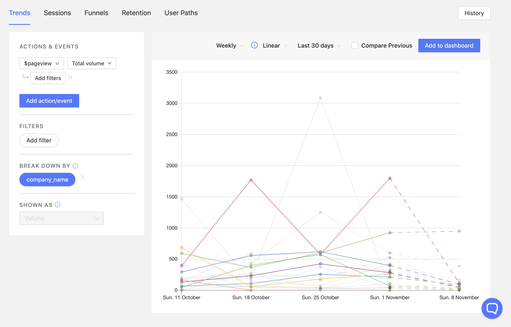

Here, we can clearly see the usage of our product by company. This can be useful for a variety of reasons, such as:

- It can help you determine what types of companies use your product the most
- It lets you contact companies that have not been using the product much
- It allows you to determine what companies you have a better chance of converting to a premium plan

Additionally, you can also break down data by any other property you like, as well as by specific cohorts you have set. This lets you compare metrics across marketing campaigns, referral domains, software version, browser, and anything else that is valuable to you. You are also able to compare between features when using [feature flags](/docs/tutorials/feature-flags).

##### What company is most likely to convert into a paying customer?

Let's say you have two different companies doing a free trial. You want to know which of them is most likely to convert into a paying user, so you can better allocate your resources and concentrate your sales efforts. 

Having established some key metrics, you can then compare the two to determine which one to approach and suggest an upgrade.

For example, here's some real PostHog data (with company names anonymized):

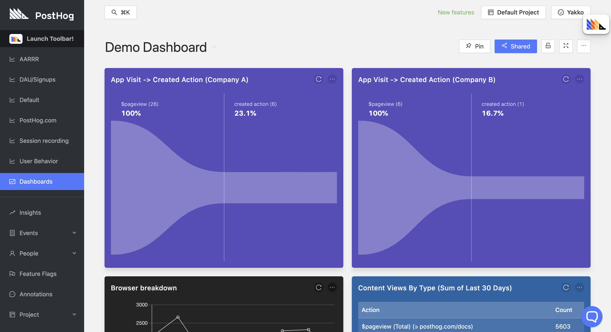

Users creating an action in PostHog is something we care about because it shows that a team has dedicated some time to understanding how PostHog works and want to leverage actions to perform more advanced analytics.

With the funnels above, we can see which of the two companies converts better from initial visit of our app to creating an action. In this case, there are two values that stand out about Company A, which may trigger a sales effort from our end:

- They have  26 team members on the platform (Compared to Company B's 6)
- Their conversion rate on this specific metric is better and more statistically significant 

Once again, this should be tailored to the metrics you care about, be it retention, conversion on a five-step funnel, or aggregate usage volume numbers. The key here is to compare how your KPIs differ from client to client, so you can determine:

- What types of companies fit your product best
- What companies you can approach with a sales pitch
- What companies are likely to churn and not worth chasing
- What companies can be nudged to understand their use-case better


#### Which features are important to my users?

PostHog can also help you be data-driven in your decisions about features, allowing you to determine:

- What features should be worked on more
- What features can be dropped
- If your new features are useful

##### What features should we invest more in?

Tracking your specific features can be done through tracking pageviews that match the feature's URL, button clicks related to the feature, or any other custom event that suits you better.

This is useful to determine if your features are performing as expected, and if there are any features that your users particularly like which should be invested in more.

In our case, feature flags are a great example:

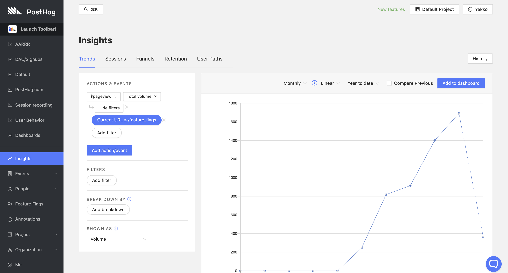

Originally rolled out as an experimental feature, our [feature flags](/docs/user-guides/feature-flags) functionality has seen its usage grow consistently month after month, indicating to us that it is worth improving and expanding the feature - something we have been doing actively.

##### Are there features we should drop?

After some time discussing if our 'Live Actions' feature has been useful to users, we [finally decided to drop it](https://github.com/PostHog/posthog/pull/2303).

While this was initially driven by our internal sentiment about the feature, looking at different metrics for the feature's performance was helpful in confirming that the feature indeed was barely being used:

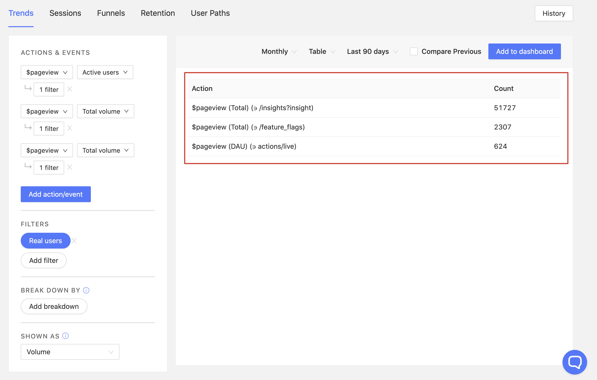

Keeping an eye on how your features are performing is key to determining if there are any that are worth dropping altogether, or that require special attention to be developed further.

##### Rolling out new features by company

B2B businesses can also greatly benefit from using feature flags. 

> **Note:** For an in-depth walkthrough of our Feature Flags functionality, check out the [dedicated tutorial](/docs/tutorials/feature-flags).

If you're unaware, feature flags are a PostHog feature that allows you to safely deploy and roll back new features. It means you can deploy features and then slowly roll them out to your users. If something has gone wrong, you can roll back new features without having to re-deploy your application.

Feature flags make sense especially for B2B businesses because they allow you to roll out features by company, in order to meet the specific use cases of your clients. For example, a company might need a feature quickly and be willing to be a Beta tester for it, 
while another company might be more conservative and want to always be using a stable version of your product.

As such, you can roll out certain features to some companies first, as well as roll them back easily if there's ever an issue.

You can then see how the new feature impacted your key retention, conversion, and aggregate usage metrics, in order to determine if it should be rolled out to all users or not. 

At PostHog, we rolled out our session recording feature using feature flags.

### Your key metrics in one place

Rather than flipping back and forth between tabs, you probably want to have your key metrics in one place, so you can quickly get an overview of how your product is performing. 

What should be in each of your dashboards is entirely up to you, and they could look something like this:

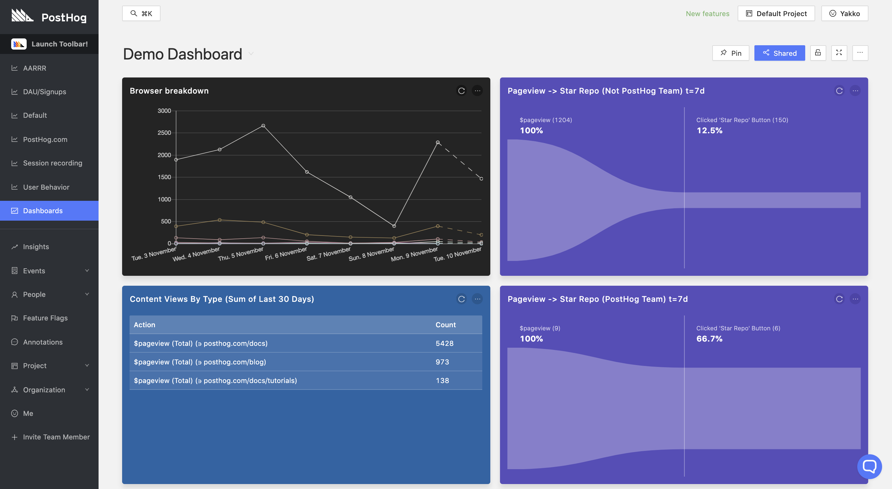

Any chart, table, funnel, and graph from our 'Insights' can be added to a dashboard. To do so, once you are happy with a certain view you created, just click 'Add to Dashboard' on the top-right corner. This will let you select what dashboard you want to add the panel to. 

> **Pro tip:** We found it very useful to create a dashboard to represent AARRR metrics - Acquisition, Activation, Retention, Referral, and Revenue. You need to determine how to track each of these metrics for your product, but it provides a great overview of performance and is a good first step for setting context-specific KPIs. 

Dashboards can be customized as you wish - you can change the color, size, and name of panels, as well as you can update their content whenever you want. You are also able to pin dashboards that you especially care about to the sidebar, as well as create a shareable link for each dashboard. These links can be used to share dashboards across teams, such as between Sales and Marketing teams within your company.

> **Note:** If you want to learn more about dashboards, check out our [Dedicated Dashboards page](/docs/user-guides/dashboards).

### Helping your teams stay on top of usage

If you want to stay on top of new signups (or any other specific action), you can use webhooks to send messages to platforms like Slack and Microsoft Teams.

> **Note:** To set up webhooks, visit our dedicated documentation pages for [Slack](/docs/integrate/webhooks/slack) and [Microsoft Teams](/docs/integrate/webhooks/microsoft-teams)

Once configured in setup, you are able to set custom messages to be sent to you when a certain action is triggered. You can set this on each new action that you create, on the action creation page:

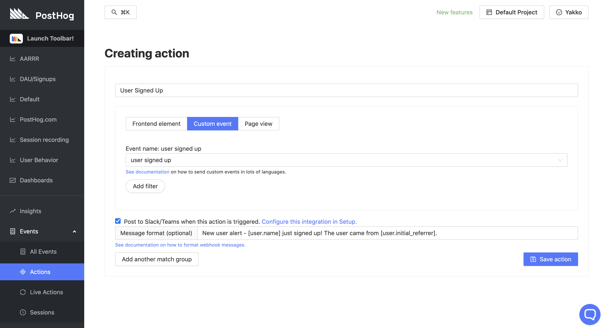

If you create actions with our [Toolbar](/docs/tutorials/toolbar), you can set this up by clicking on the desired action from the 'Actions' page ('Events' -> 'Actions').

With everything configured, you will start receiving messages like these:


These messages can help keep your team up-to-date with key user events such as signups without leaving the team's chat platform. For example, it can be useful for:

- Your sales team to spot new sign ups that could become paying users 
- Your customer success team to monitor customers' product usage so they know who needs training
- Your marketing team to monitor the quality of sign ups from a new campaign in real-time

### Providing metrics for your own users

Depending on your type of product, you may also want to provide usage metrics for your own clients using PostHog. 

If you serve a few large enterprise clients, you can do this via setting up personalized dashboards for each client, which you can share with them as a customized report of their performance. This can be a premium service you provide to top clients, giving them valuable insights as to how your product has impacted their metrics.

However, to do this dynamically, you can also use our [API](/docs/api/overview) to pull relevant data that you then display to your clients as you wish. This is yet to be documented as an established use-case, but our team will be happy to help you set this up if it is something you think would be particularly valuable to you. You can contact us on [Slack](/slack) for more information.

### Conversion and retention

Finally, two important metrics you should have a grasp of are retention and conversion. If you would like some help setting these up, you can refer to our step-by-step tutorials:

- [Measuring retention and tracking churn](/docs/tutorials/retention)
- [Analyzing your conversion with Funnels](/docs/tutorials/funnels)
