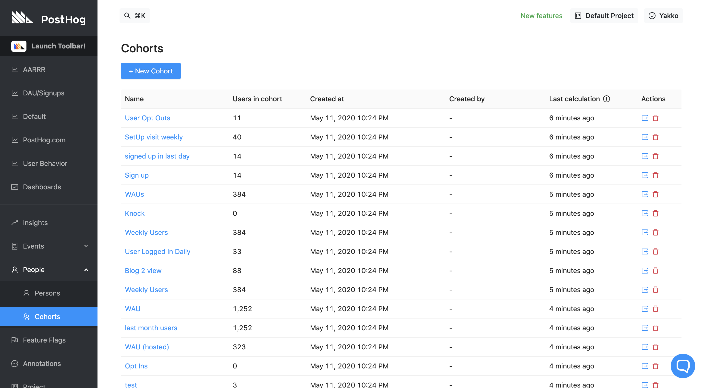
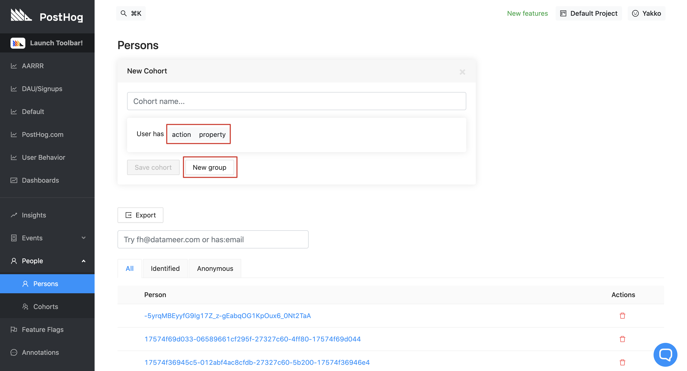
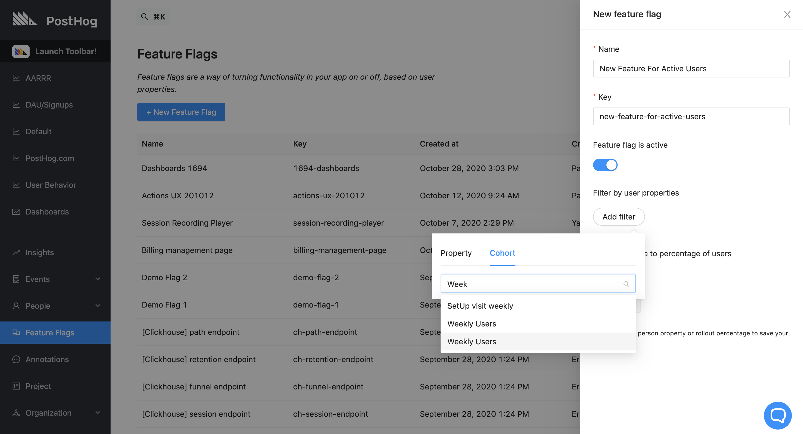
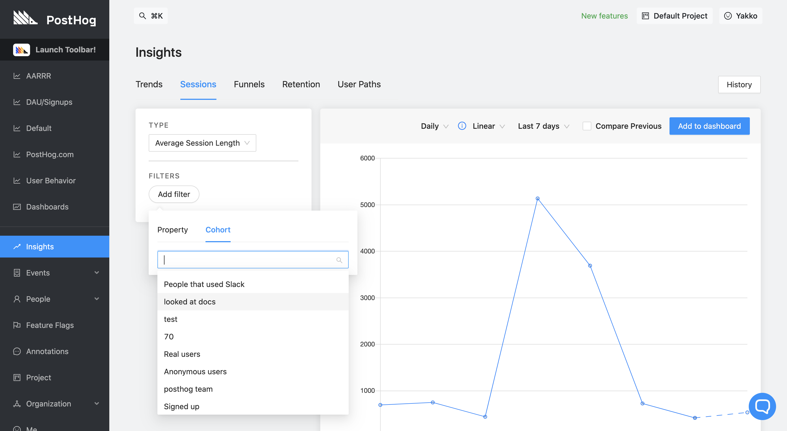
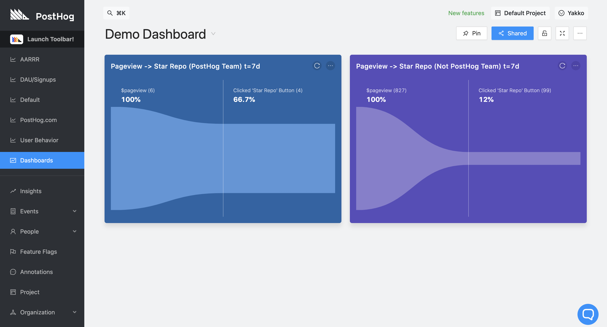
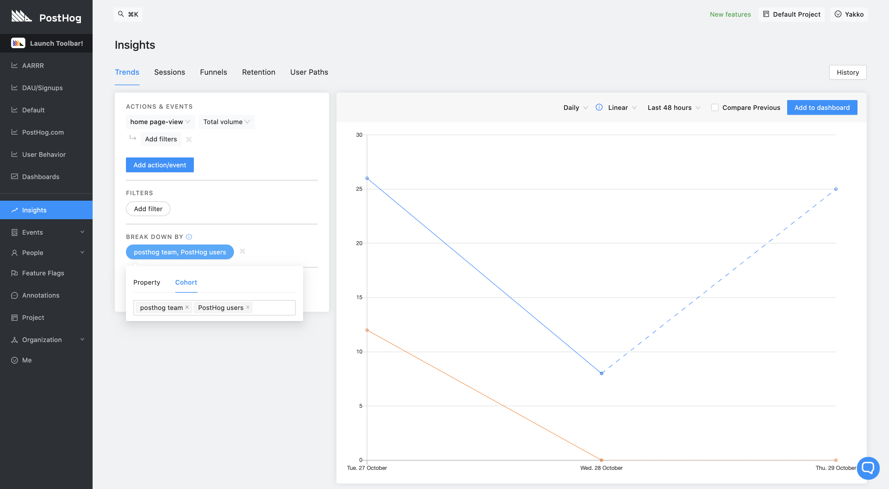

_Estimated reading time: 8 minutes_ ☕☕

Each user uses your product slightly differently from the next, and some user groups might use your app in a completely distinct way from others.

This happens for a variety of reasons, including software, user profiles, accessibility needs, culture, understanding of the product, individual goals, among many other variables.

As such, an established technique for performing analytics is cohort analysis. When doing cohort analysis, users are split into different groups according to certain characteristics, and you can then derive metrics for each specific group (cohort), rather than only performing your analytics on the entire collection of users.

This is extremely useful for comparing metrics across cohorts in order to determine areas for improvement, and maybe even product/market fit.

Here are some examples:

**Segmenting by engagement level**

Another useful way of grouping users is by their engagement with your product. How do power users use your product when compared to free trial users? 

**Segmenting by profile data**

When you sign up, websites like GitHub will ask you about your goals with the platform, as well as your level of experience in a certain field. This information can be used to group users, and you can then see which users are best suited for your platform. For instance, in GitHub's case, you'd expect retention to be higher amongst people who use GitHub for their jobs instead of hobbyists. Through profile segmentation, you can then tailor your onboarding flows and UX to better meet the use case for the profiles you care about.

**Segmenting by previous behavior**

Users who performed a certain defining action might use your product differently from those who haven't. At PostHog, for example, we have a dedicated cohort for people who have accessed our Docs. We can then use that cohort to see if people who have read our documentation use our product in a specific way e.g. are they more comfortable navigating around the features?

**Segmenting by team**

As a B2B tool, PostHog has various companies using our product. This allows us to segment our analytics by the different teams using the platform and understand how each group of users uses the product differently. This not only lets us get a broader perspective of how different companies use our product internally, but also allows us to reach out and help teams take full advantage of the features with data that provides context about their usage.  

**Segmenting by marketing source**

PostHog grabs [UTM tags](https://en.wikipedia.org/wiki/UTM_parameters) from URLs by default, as well as it captures information such as 'Referrer URL' and 'Initial Referrer Domain' as properties on events. This allows you to segment users based on where they came from, so you can determine if users from a certain marketing campaign retain better than others, for instance.

**Segmenting by browser**

Allows you to determine if your UX is particularly poor on certain browsers. This can be indicated by a lower retention, bad conversion on your funnels, or a lack of certain events being captured. 

### Defining a group of users: Setting up a cohort in PostHog

User group segmentation for cohort analysis is built into PostHog via our cohorts feature.

Cohorts let you group users by properties in common, as well as by shared actions over a time period.

For example, you could define the following cohorts:

- Users who did action 'Sign Up' in the last month
- Users with property `email` containing `@posthog.com` _or_ property `company` equal to `PostHog`
- Users who have property `role` equal to `Software Engineer` _or_ triggered action `Used API` in the last 7 days

These cohorts can then be used in 'Insights' to compare metrics across groups. 

**Creating a cohort**

To create a cohort, navigate to 'People' -> 'Cohorts' on the sidebar. This will bring you to the Cohorts page, where you can create a cohort by clicking '+ New Cohort':

Clicking the button will open up the following page:

Here, you have a few options:

**Action**

You can group users by an [action](/docs/user-guides/actions) they have in common, as well as the timeframe they performed that action in. This means that users who have performed that action at least once in the specified time period will be added to the cohort.

**Property**

Creating cohorts by property works by using the same property filter from 'Insights'. That means you can specify cohorts of users by a property that they have, a property that they do not have, as well as more complex operations such as "property matches regex" or "property doesn't contain". 

You can also specify a filter by cohort here, allowing you to create cohorts that are subsets of others. For example, "power users" would be a subset of "users who signed up".

**New group**

New group let's you add another match condition for the cohort, allowing you to mix and match actions and properties as you like. 

> **Note:** This is an `OR` operation. Users who match _any_ of the specified conditions will be added to the cohort.

### Using cohorts to determine important metrics

Cohorts can be used in most of PostHog's features, so let's go over some of the key places where they might be useful:

#### Feature flags

You can create [feature flags](/docs/tutorials/feature-flags) that target specific cohorts in order to roll out features to specific user groups first, or simply to see how features perform with different cohorts. 

Examples:

- Rolling out Beta features to cohort "Beta Testers"
- Rolling out new functionality to 50% of the cohort "Power Users"
- Testing an improved UX on cohort "Inactive users"

Not only are you able to roll out features by cohort, but you are also able to concretely measure the impact of each flag by cohort using Insights, which we'll go through next.

#### Insights

Cohorts can be used on filters on all PostHog Insights, and they can also be used for breakdowns in [Trends](/docs/user-guides/trends).

Regarding business metrics, cohorts are especially useful to determine retention and conversion of different groups. They can help answer questions like:

- Are we retaining more users from Company A or Company B?
- Do 'Software Developers' convert better than 'Product Managers' from sign up to payment?

To answer questions like these, just filter your queries by cohort when using Insights (by clicking 'Add filter'), like so:

This will give you the same query as before but only including events from users in that specific cohort.

Additionally, if you want to see comparisons across cohorts side-by-side, you can add the designated panels to a dashboard, creating a view like the picture below, which works for charts, tables, and [funnels](/docs/user-guides/funnels).

[_Access a full dashboards tutorial here_](/docs/user-guides/dashboards/)

Finally, you are also able to see how different cohorts perform on the same chart/table when in 'Trends'.

To do so, rather than filtering, you should add a breakdown by cohort, selecting the relevant cohorts to include in the chart:

This is a useful way of seeing metrics for different cohorts in one single chart, helping you determine what user groups perform better with respect to your KPIs, for example.

### **Recap**
- Cohorts are a way of segmenting users by shared characteristics.
- Users can be grouped by shared actions or properties
- Cohort matching conditions operate on an `OR` basis
- Cohorts can be used in all of PostHog's insights, as well as Feature Flags 
