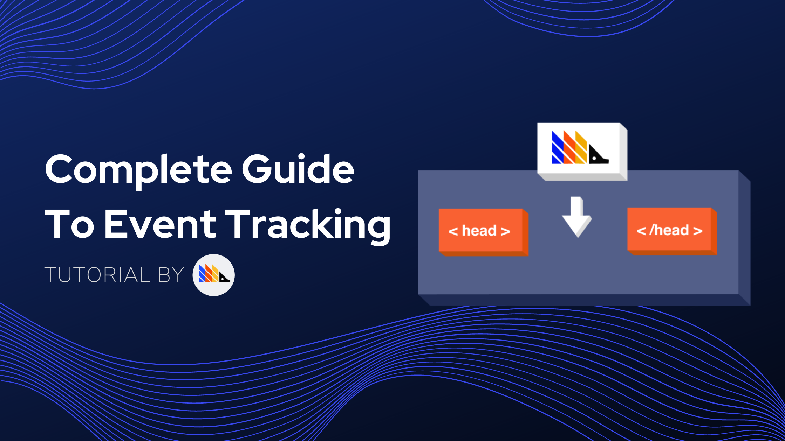
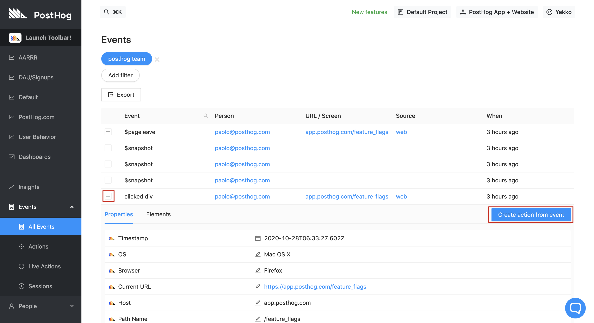
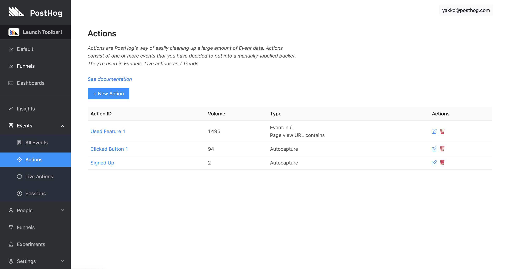

_Estimated reading time: 7 minutes_ ☕☕



One of the features we're very proud of at PostHog is event autocapture.

Autocapture is great because it ensures you don't miss out on any data that could potentially be relevant to your product. If you restructure your frontend, for example, autocapture will continue to collect relevant events without you needing to update your codebase each time. 

However, for more advanced product analytics, autocapture is not enough. 

First, event autocapture can be a bit overwhelming. On high volume instances, where events come in by the thousands every minute, the events table provided by PostHog can contain so much information that it can be difficult to determine exactly what you care about. 

Second, autocapture is a general solution that provides value for most users, but, to get the most out of PostHog, you should be using custom events. Custom events let you track _exactly_ the things that you care about, ranging from a user hovering over a certain part of your app, to a specific function being called on your backend.

This tutorial will address these two points, walking you through how to create actions and send relevant custom events step-by-step, so you can make the most out of PostHog.

### Prerequisites

To follow this tutorial along, you need to:

1. Have [deployed PostHog](/docs/deployment).

### Sorting through your events with Actions

With the goal of making it easier to sort through your events, PostHog introduced the concept of [actions](/docs/user-guides/actions), which are a way to tag and combine events you care about. They are an important part of other features in PostHog, such as Cohorts. <!-- Link to Cohorts Tutorial Here -->

The relationship between events and actions can be both one-to-one or many-to-one. What this means is that you can create an action from one event only, such as a "Pageview" action for a `$pageview` event, as well as an action targeting multiple events, like a "Sign Up" action targeting the events `clicked button with text "Sign Up"` and `clicked button with text "Sign Up Now"`.

Not only that, you can also create actions based on the URL where an event happened. This could lead to actions such as "Clicked Sign Up on About Page".

There are two main reasons for creating actions:

#### 1. Tagging events that you especially care about**

Filter out the noise from all your events to make it easier for you to execute your analytics processes.

#### 2. Combining multiple events into one action**

Let's say you have multiple sign up buttons spread across your website. For some types of analysis it could be useful to know which specific button was clicked, however, it might also be the case that you just care that the user signed up, irrespective of what they clicked to do so.

Actions fit this use-case perfectly, since events are combined using `OR` operations. That means that if an action is composed of multiple events, it will be registered if _any of the events composing it_ are triggered. 

In other words, using the example from above, if you have an action called "Sign Up" that targets the clicks on all your sign up buttons, if your user clicks any of the buttons, the action will be registered.

> **Note:** Actions also work retroactively, meaning that they also tag events that happened in the past, not only events that happened after the action was created.

### Creating Actions

There are many ways to create actions in PostHog. These are:

**1. Through our toolbar (recommended for actions based on frontend elements)**

To learn how to create actions using our toolbar, you can visit our [dedicated tutorial](/docs/tutorials/toolbar/#creating-actions).

**2. From the events table**

To create actions from the events table, just click on the plus sign on the left of any event to reveal a button allowing you to create an action from that specific event. You will also be able to customize the action further in the following steps (such as add another event). 


<small class='centered'>_Creating actions from the events table_</small>


**3. From the 'Actions' page**

Lastly, you can of course create actions from the 'Actions' page under 'Events':



#### Action options

Visit our [dedicated actions page](/docs/user-guides/actions/) for a comprehensive explanation of all the options available when creating an action.

### Using custom events to track advanced behaviors 

Now that we've learned how to sort through events, let's go through how to create events that PostHog doesn't automatically capture for you.

Custom events can be created from any of our [libraries](/docs/integrate/overview), as well as our [API](/docs/api/overview). They can be triggered from both the backend and the frontend. We recommend looking through our libraries and only using our API if there isn't a suitable library for you, since using our libraries ensure you are always up-to-date.

#### Using JavaScript event listeners to track user focus and exceptions

Frontend JS is heavily event-based by nature, a paradigm that pairs up well with PostHog events.

For example, to trigger an event when an element is hovered, you can do:

```js
// Vanilla JS

const paymentButtonEl = document.getElementById('payment-btn')

paymentButtonEl.addEventListener('mouseover', () => {
    posthog.capture('payment button hovered')
})

```

Another useful custom event might be tracking exceptions, like so:

```js
// Vanilla JS

window.onerror = (errorMsg, url, lineNumber) => {
    // Pass exception details as event properties
    posthog.capture('frontend exception', {"message": errorMsg, "url": url, "lineNumber": lineNumber})
    return false;
}
```

These exceptions can then be correlated with [feature flags](/docs/user-guides/feature-flags) and app usage, to determine if a new feature increased the incidence of exceptions, or if a certain exception harms conversion in a funnel, for example. 

Essentially, it's entirely up to you what events you capture and what properties you pass to them. You can also add more complex logic to determine when to trigger an event, as well as what properties to pass to it.

#### Using backend libraries to track function calls and HTTP status codes

Custom events are not limited to your frontend, however! You can also send events from your backend, which is very useful for going deeper into how your app is being used. 

You can track what functions are being called, for example:

```python
# Python

def my_func():
    do_stuff() # Your own logic
    timestamp = get_timestamp() # Logic for getting current timestamp

    posthog.capture(
        'user_distinct_id', 
        event='my_func_called', 
        properties={'foo': 'bar'},
        timestamp=timestamp
    )

    return True
```

Another useful event could potentially be tracking endpoints that returned a status code not in the 200s. Here's an example for tracking 404s:

```go
// Go + Martini Web Framework

// Triggered when route is not found
m.NotFound(func(req *http.Request) string) {
    // Send event to PostHog 
    client.Enqueue(posthog.Capture{
      DistinctId: "user_distinct_id",
      Event:      "404_error",
      Properties: posthog.NewProperties().Set("route", req.RequestURI)
    })
    
    return "404: Page Not Found"
}
```

> **Note:** Unlike exception tracking platforms such as [Sentry](https://sentry.io/) (which we use), tracking exceptions with PostHog is beneficial to correlate error metrics with your product's UX and usage rather than for debugging purposes.

Once again, you can track anything that you like, and you can do so with any of our 10+ [integrations](/docs/integrate/overview), as well as our [API](/docs/api).

#### Using custom events in PostHog

Custom events in PostHog are treated just like any other event. 

You will be able to see them in the events table as well as select them for your analysis in 'Insights'.

No extra setup is required, just start sending events and watch them flow in!

## **Recap**

To make the most out of PostHog, you should:

- Create actions from your events
  - Actions work retroactively and can tag one or more events
  - You can easily create actions with our toolbar
- Send custom events
  - Custom events let you track exactly what you care about in your product
  - They can be captured from any of our 10+ integrations
  - You can use them in PostHog just like autocaptured events
