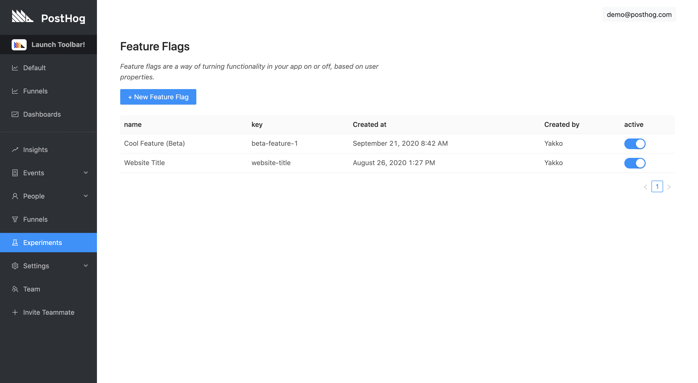
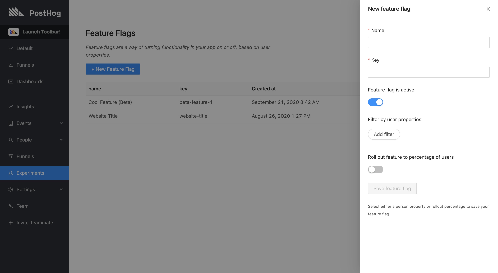
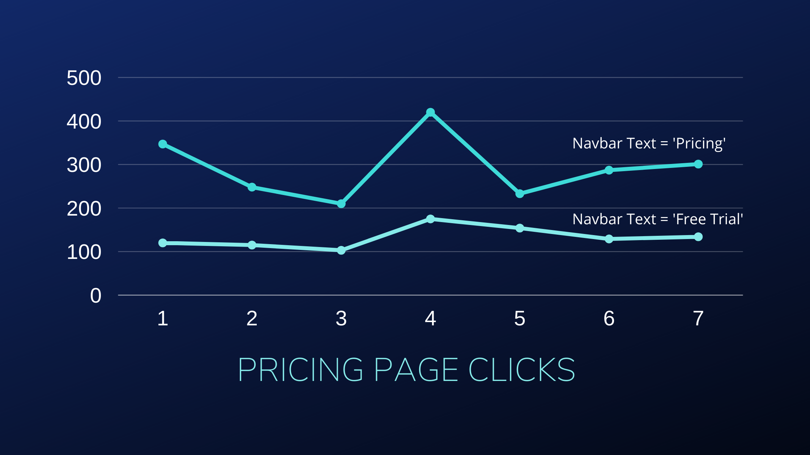

<br />

<small class="note-block centered">_Estimated Reading Time: 8 minutes ☕☕_</small>

<br />


<br />

Rolling out new features in your product can really be a pain.

As a company that is growing fast and [consistently putting out new functionality](/blog/we-ship-whenever), we know this very well. 

You might have great tests and robust CI/CD workflows in place, but there's always the chance that something will go wrong, or that your users may not appreciate the change.

To make this process less painful and safer, you can use feature flags.

Feature flags allow you to safely deploy and roll back new features. It means you can deploy features and then slowly roll them out to your users. If something has gone wrong, you can roll back new features without having to re-deploy your application.

This tutorial will walk you through creating and using a feature flag with PostHog, cover some basic use cases, and answer some of the questions you may have when using them.

<span class='centered'>...</span>

_Prefer to watch a video? Check out the [Feature Flags section of our demo video](https://youtu.be/aUILrrrlu50?t=950) for a shorter overview of this functionality._

## Creating Feature Flags

### Step 1: Navigate to 'Experiments'

To find the feature flags page, click on 'Experiments' on the left sidebar in PostHog.



### Step 2: Creating a New Flag

While on the 'Experiments' page, click on the blue '+ New Feature Flag' button. This will open up a menu on the right side of the page, like so:



### Step 3: Configuring Your Flag

With the menu open, you will see there are a few options you can configure for your flag. Here's the purpose of each one:

**Name**

A memorable name for you and your team to refer to the flag. 

**Key**

Used to refer to your flag in your codebase. While the flag name does not affect the implementation, the key does. When adding the feature flag to your code, you will always use the key, never the name. In addition, changing a flag key may [affect the persistence of your flag](/docs/features/feature-flags#feature-flag-persistence).

<div class='note-block'><b>Pro tip:</b> Make sure you choose a key for your flag that is descriptive and styled consistently with your codebase. Changing a flag key will require you to update your codebase and may harm persistence, so it's best to avoid doing so.</div><br />

**Active**

This toggle is an important part of feature flags. It means you can turn feature flags on only when you're ready to do so, or off if something goes wrong. It can be used as a "kill switch" for features.

**Filter by user properties**

Feature flags can be rolled out based on a wide variety of filters. These are:

1. User properties
1. Cohorts
1. Percentage of users
1. A combination of the above

Under 'Filter by user properties', you can specify various properties and/or cohorts that a user must match in order to have the flag active. This works on an `AND` basis, meaning that a user must match all of the specified filters. 

These filters are very powerful, allowing you to both offer a tailored UX to your users, as well as gather powerful insights into how different groups of user might behave. For example, you could define logic such as:

* Show technical content to users who have the `has_read_docs` property equal to `true`
* Roll out the new design only to users in the 'Dark Mode Users' cohort
* Show advanced options by default to users in the 'Organization Admins' cohort who have `@bigcompany.com` in their `email` property

**Roll out to a percentage of users**

This option can be used either by itself or in combination with the property/cohort filters.

When used by itself, it means that `X%` of your users will have the flag on and the other `(100-X)%` will have it off.

This mechanism is _random but deterministic_. What this means is that it is a weighted random selection that establishes which users will have the flag on or off, but a given flag _will persist_ for a every user (if nothing else changes). This ensures that users don't have a different experience each time they visit your app.

When used in conjunction with property filters, PostHog will first check if the user matches all the filters, and then apply the rollout percentage. This means that `X%` of the users who match the filters will see the flag, rather than `X%` of overall users.


<div class='note-block'><b>Technical Note:</b> Our rollout percentage mechanism works by hashing the distinct ID of a user with the flag key, casting it to an integer, and dividing it by 100. That gives us a number between 0 and 1 which we compare to the rollout percentage value (also between 0 and 1) to determine if a user should have the flag on or off. This ensures an acceptable degree of randomness and accuracy while allowing flags to persist.</div>


### Step 4: Saving Your Flag

Just click 'Save feature flag' and that's it! Your flag will now be active. Clicking on it will also allow you to edit it as you wish.

## Implementing the Feature Flag

When you create a feature flag, PostHog displays an example snippet that you can plug into your codebase. It looks something like this:

```js
if (posthog.isFeatureEnabled('new-beta-feature')) {
    // do something
}
```

This snippet refers to our [JavaScript Integration](/docs/integrations/js-integration), which is also what we will be using for this tutorial. However, you can also use feature flags via our [API](/docs/api/overview) as well as other libraries, such as our [Python Integration](/docs/integrations/python-integration) (we're working to add this functionality to as many of our libraries as possible). 

With that snippet, you can then do whatever you wish inside of it. You might change the CSS of a button, hide an entire section, or move things around. A simple example implementation would be:

```js
// Header text is blue by default
// If flag is on, make the text red
if (posthog.isFeatureEnabled('red-header-text')) {
    document.getElementById('header-text').style['color'] = 'red'
}
```

While this is a trivial example, you can have as much logic as you want being powered by the feature flag. You can also combine flags with `OR` & `AND` operations to create more complex logic.

## Advanced Controls

### Loading Flags

Every time a user loads a page we send a request in the background to an endpoint to get the feature flags that apply to that user. We store those flags as a cookie. 

This means that for most page views the feature flags will be available immediately, *except* for the very first time a user visits your site.

To combat that, there's a callback you can use to wait for the flags to come in:

```js
posthog.onFeatureFlags(function() {
    // feature flags are guaranteed to be available at this point
    if (posthog.isFeatureEnabled('new-beta-feature')) {
        // do something
    }
})
```

In our JS Integration, the reason we store flags as a cookie is to reduce the load on the server and improve the performance of your app, as it doesn't need to always make an HTTP request, it can simply refer to data stored locally in the browser. 

While this makes your app faster, it means that if your user does something mid-session which causes the flag to turn on for them, this will not be immediately updated. As such, if you expect your app to have scenarios like this _and_ you want flags to update mid-session, you can reload them yourself, by using the `reloadFeatureFlags` function.

```js
posthog.reloadFeatureFlags()
```

Calling this function will force PostHog to hit the endpoint for the updated information, and allows you ensure changes are reflected mid-session.

## Feature Flag Uses

Feature flags are a very powerful piece of functionality that can be used in a wide variety of ways. How you use them will depend on your particular painpoints and internal best practices.

For us, here are some suggestions of use cases that could fit nicely with feature flags:

### A/B Testing



<br />

In simple terms, A/B testing is a method for determining how to provide the best user experience or meet other product goals by testing how different features perform. 

This could be used to answer questions such as "Do users click a button more often if it is blue or red?" or more complex questions like "How much more time do active users who have signed up for a free trial spend on our blog pages if we add a banner image?".

At PostHog, we're still working to provide built-in specific A/B Testing functionality. However, with feature flags, there's already a lot you can do in this regard.

A great way to do this is by using [Cohorts](/docs/features/cohorts). If you filter your flags by cohort, you can then easily see the differences in behavior across different cohorts. 

Here's an example view of Trends in PostHog filtering pageview events that contain the term "blog" in the URL, showing a breakdown between Cohort A (Beta Feature On) and Cohort B (Beta Feature Off):


### Gradual Rollouts

There are many occasions when you might want to roll out a feature to your users slowly. Maybe you only want to enable it for Beta users, or you simply want to give users a transtion period.

Whatever the case may be, feature flags let you easily roll out features in an incremental way, increasing the portion of users that have the feature as fast or slow as you wish. 

### "Master Toggles"

If you have to ship a big piece of functionality, chances are that you'll be doing it across multiple PRs.

As such, rather than attempt to coordinate a merge spree to ensure everything is live at once, you can create a feature flag that wraps all the new logic in all the pull requests. Then, once everything is merged and ready to go, you can simply flip the switch to release it.

Better yet, you can then release it slowly to make sure nothing breaks, and, if it does, you can easily turn it off with one click.

And this brings us to the next example.

### Kill Switches

You don't need feature flags _per se_ to implement kill switches, but having the ability to immediately turn a flag off is a nice add-on to the functionality.

Perhaps your goal all along was to do A/B testing for your UX, but, when something breaks, you can always roll it back safely with minor consequences (if implemented correctly).


## Example Code & Playground

Coming soon.