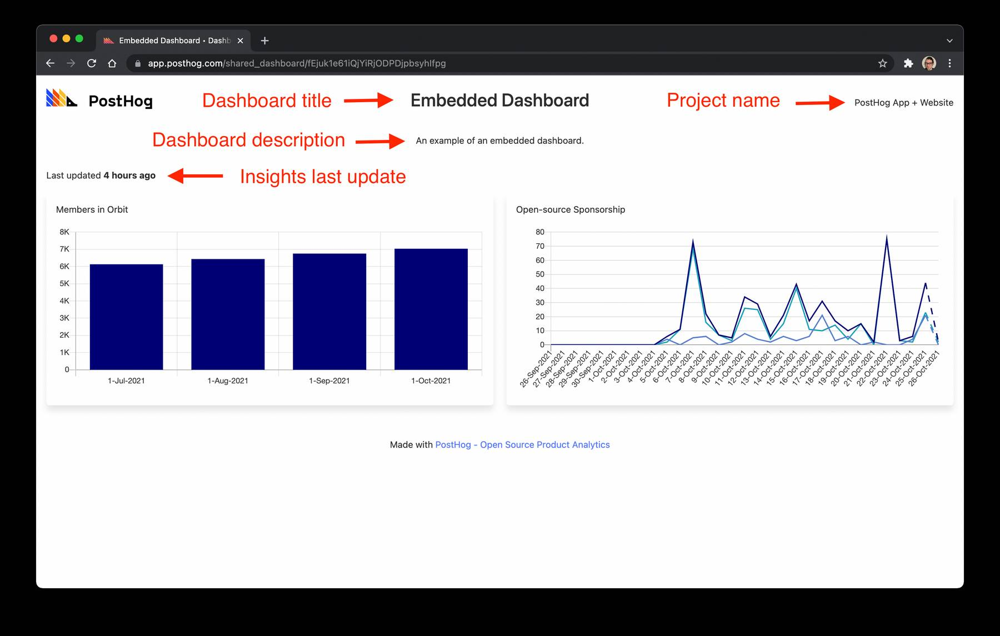

_Estimated reading time: 3 minutes_ ☕

[Dashboards](/docs/user-guides/dashboards) let you bring together a number of charts and Insights into a single view. Dashboards are available to anyone with access to the Project that they are part of. However, you may want to share a Dashboard with other people who do not have a PostHog login. In these situations you can [share a link to the Dashboard](/docs/user-guides/dashboards#send-or-share-a-dashboard) or you could decide to embed the Dashboard within a publicly accessible web page.

In this short tutorial we'll cover how to be embed a dashboard within a web page.

## Embed with an iframe

A shared Dashboard contains:

-   The PostHog logo
-   The Dashboard title
-   The Dashboard description
-   The Project name
-   When the Insights within the Dashboard were last updated
-   The Insight charts



To embed a shared Dashboard using an `<iframe />` set the `src` attribute to the URL of the public Dashboard.

For example, the following code:

```html
<iframe
    style="max-width: 800px; height: 700px;"
    src="https://app.posthog.com/shared_dashboard/fEjuk1e61iQjYiRjODPDjpbsyhIfpg"
/>
```

Produces the following embedded dashboard:

<center>
    <iframe
        style="max-width: 800px; height: 700px;"
        src="https://app.posthog.com/shared_dashboard/fEjuk1e61iQjYiRjODPDjpbsyhIfpg"
    />
</center>
