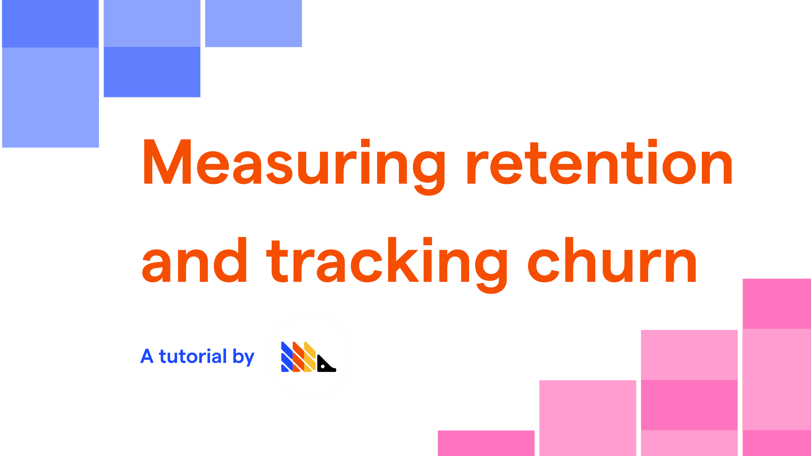
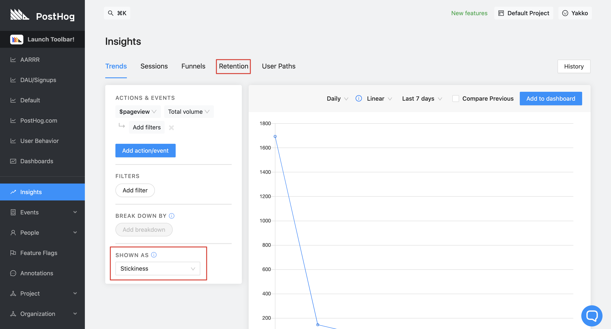
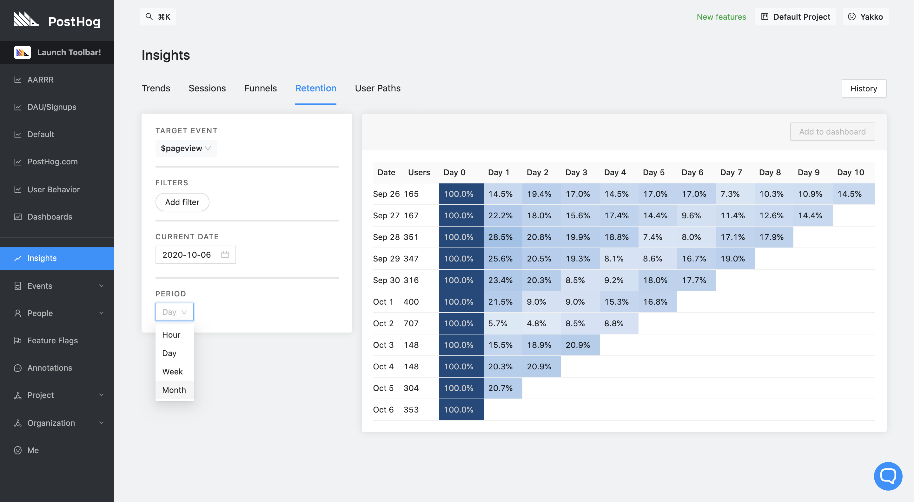

_Estimated reading time: 8 minutes_ ☕☕

For most businesses, retention is one of the top metrics to track and use to inform decisions.

Think about it: if you try to fill a bucket of water with holes in it, it doesn't matter how much water you put in, the bucket will never get full.

Tracking retention is about measuring how big those holes are and identifying them, so you can then fix them and verify the impact of doing so. 

This tutorial will introduce you to the basic concepts of retention and churn and teach you how to use PostHog's many features to track retention at various stages.

### Prerequisites

To follow this tutorial along, you need to:

1. Have [deployed PostHog](/docs/deployment).
1. Have started receiving events via our [snippet](/docs/integrate/client/js), one of our [integrations](/docs/integrate/overview), or our [API](/docs/api/overview)

### Determining how your business should measure retention

Retention metrics aren't one-size-fits-all. Your business needs to determine how to measure retention in a way that is aligned with the company's strategy and product, since an ill-informed retention metric can lead to poor decisions. 

To provide some context as to how different businesses may look at retention, let's look at some examples:

#### Social media & content platforms

**Examples:** Twitter, Facebook, YouTube

Platforms that are focused on content and user interactions can benefit greatly from the most straightforward retention metrics. Essentially, with businesses like these, you want to know if your users are coming back day after day. 

It is not enough to have users that use the platform monthly, or even biweekly, even if they do so regularly. Social media and content platforms, for the most part, need users to be using the platform multiple times a week in order to be successful. 

#### Infrequent use businesses

**Examples:** Airbnb, airlines, hardware manufacturers

Imagine if airlines looked at their retention numbers on a daily timescale. They would probably see extremely low retention rates.

That is because airlines are a business which provides a product that the individual consumer uses infrequently. Thus, a broader view of retention is needed. A given user, if satisfied with a certain airline, or the experience of booking an Airbnb home, might book again once or twice in the same year, and sometimes even less. 

As such, it is more important to focus on retention for the core product over a longer timespan, as well as consider supporting retention metrics for smaller time periods, such as retention on the searches for flights on the website.

However, this does not mean retention on the core offering is not an important metric for these businesses. In fact, it is arguably more important. Consider phone manufacturers, for example, who need to look at retention over years (with respect to the main product: the phones themselves). If such businesses are unable to retain users, they lose customers for years, and potentially even forever. Once a user decides to switch brands for their new phone, it is much harder to get them back. 

#### One-off products and services

**Example:** Real estate brokers

Finally, on the very end of the spectrum, there are certain businesses that should focus more on other metrics like referrals instead of retention.

Take a real estate broker that only does sales (no rentals), for example. Once the customer purchases a property, it is unlikely you will have them as a customer again any time soon. Rather, you want that customer to be happy with the service and recommend it to others. 

There is still some retention tracking that can be done, however. Let's say you have an online platform with listed properties. While you are not too interested in retention post-purchase, you can (and should) still measure retention on the platform pre-purchase. How often are users coming into your platform to check for listings? Do you appear to be their top choice for searches? After they use the platform for the first time, do they come back?

#### Tracking retention metrics in PostHog

Having determined how to measure retention in a way that is relevant to your business, you then need to ensure those goals are reflected in your analytics processes within PostHog. 

#### Key concepts

Before we proceed to walkthroughs of PostHog's functionality, you should be aware that PostHog offers two different retention metrics that you may want to use. These are:

[**Retention**](/docs/user-guides/retention)

Retention tracks repeated usage of your product over set time periods. For example, you can look at retention for a given event over the past week, visualizing how retention changed on each specific day of that week. Retention can be found as a tab in 'Insights'.

[**Stickiness**](/docs/user-guides/trends/#trend-segmentation-by-stickiness)

Stickiness is also a metric of repeated usage, but it disregards the absolute time period in favor of a relative metric. In practical terms, while retention will give you an answer for how many users visited your page on October 22nd and then visited again on October 23rd, stickiness doesn't care about the dates, rather offering an answer for how many users came back to your site on day 2 after visiting on day 1 (irrespective of what the exact dates were). Tracking stickiness in PostHog is done in the 'Trends' tab in 'Insights'.

> **Pro tip:** Stickiness is particularly useful at the early stages of your product tracking when you do not have a lot of data. In this case, it makes sense to focus on the overall repeated usage of features rather than looking at retention over specific time periods. 

This tutorial will focus on 'retention' specifically, but the majority of concepts is also applicable to stickiness views.

#### Configuring retention tables for your metrics

To start calculating your retention, head over to the 'Retention' tab in 'Insights'.

This will show you a retention table for the `$pageview` event, like so:

If this table is a bit confusing to you, check out our dedicated [retention](/docs/user-guides/retention) page for a full walkthrough of how it works.

Here, you have a few settings you can tweak to meet your desired use-case:

#### Track retention on the events that matter to you

The first thing you can do is select any action or event to track retention on. This can be:

- A website visit: Shows you if your users are coming back repeatedly
- A button click: Can be used to track usage of important features you want users to use often, such as comment on a post 
- A custom event: Anything you want users to do regularly (see [custom events](/docs/integrate/client/js/#capture))

Remember that here you are tracking how often users come and do the same thing again over a period of time. To track subsequent actions or events, you should use [funnels](/docs/user-guides/funnels).

#### Setting relevant filters

Even if you don't have complex metrics in place, the filter functionality should not be overlooked. It can be used to:

**Segregate events by URL**

If you have multiple domains being tracked in PostHog at once, you might want to look at their retention metrics separately. This can be done through filtering by 'Current URL'. In our case, for example, to look at retention for [app.posthog.com](https://app.posthog.com) (our product) separately, we set a filter of `Current URL contains app.posthog.com`.

In addition, you could also look at retention for specific pages on your website, such as for your blog or documentation.

**Determining product/market fit**

Informing product direction for better product/market fit is one of the main use cases for retention.

Traditionally, you are supposed to focus on your ability to sell a product to work out if you have product/market fit. However, we believe it is _just_ as important that users are coming back to your product repeatedly. If you can get both of those things right, you know you are in a position to scale your business. Retention tells you if people are coming back. It's also key to recognize that you may have stronger product market fit with a subset of your users - for example, those in a certain group or cohort. 

> If you have time, check out [Superhuman's explanation for finding product/market fit](https://firstround.com/review/how-superhuman-built-an-engine-to-find-product-market-fit/). They used surveys, but we believe that whilst both have value, what people do is more important than what they say.

To understand what groups you retain better, you can filter your retention table by specific user properties, as well as by [cohort](/docs/user-guides/cohorts). This allows you to answer questions like:

- Is our `$pageview` retention better with cohort 'Users who contacted support'?
- Over the last month, did users in cohort 'Technical Users' have better or worse retention for event `new feature used`?
- Is retention on our blog better for users with `utm_source` equal to `twitter` or `facebook`?
- For our in-browser design tool, does retention vary significantly across browsers? 

By setting the appropriate filters you can derive metrics for each relevant group in order to decide if:

- You want to tailor your product towards high-retention users 
- There are improvements to be done that can reduce churn of a particular group
- Your intended target audience is retaining better or worse than other groups

In addition, following the segmentation of your retention metrics, you can then use the results of your retention analysis to 
decide which users to contact, either from the churned or high-retention groups. 

Using the filters from the retention table, you can filter users on our 'People' page, in order to conduct further analysis on what user properties lead to good retention, do sales calls with users who could become paying customers, or contact churned users for feedback.

Finally, another great way to use retention filters is by pairing it with [feature flags](/docs/user-guides/feature-flags). As you roll out a new feature to specific groups or a percentage of your overall users, you can then directly measure the impact of the feature flag on retention over time. 

> **Pro tip:** Setting up [cohorts](/docs/user-guides/cohorts) is the best way to roll out feature flags to a specific group of users and perform analytics on the performance of the feature, including retention metrics.

#### See how your retention evolves over time

If you set retention KPIs, or are looking to improve your retention in general, you should be comparing retention across periods. Setting the 'Current Date' allows you to do this. 

To keep track of major changes that may affect your retention, you should also consider using [annotations](/docs/user-guides/annotations).

#### Tailor your retention view to your business

As mentioned in the introductory section of this tutorial, different businesses need to look at retention over different time periods. By setting the 'period' appropriately, you can ensure that you are looking at retention in the time frame that is relevant to your business. 

#### **Recap**

- Your business should set appropriate retention metrics that are specific to your product
- PostHog allows you to view retention on any event or action
- Filtering retention by event properties or cohorts is a great way to improve product/market fit
