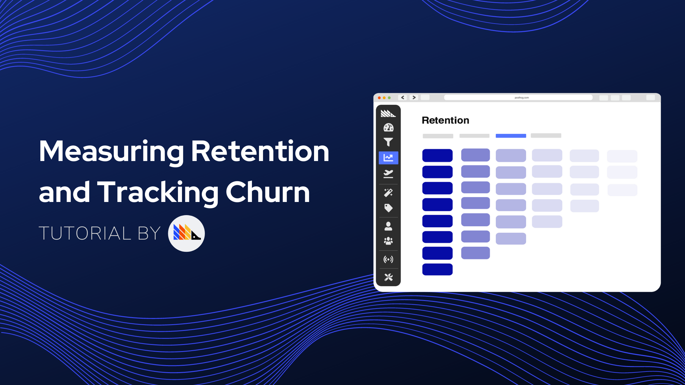

 

<small class="note-block centered">_Estimated Reading Time: 8 minutes ☕☕_</small>

 

 

For most businesses, retention is one of the top metrics to track and use to inform decisions.

Think about it: if you try to fill a bucket of water with holes in it, it doesn't matter how much water you put in, the bucket will never get full.

Tracking retention is about measuring how big those holes are and identifying them, so you can then fix them and verify the impact of doing so. 

This tutorial will introduce you to the basic concepts of retention and churn and teach you how to use PostHog's many features to track retention at various stages.

### Pre-Requisites

To follow this tutorial along, you need to:

1. Have [deployed PostHog](/docs/deployment).
1. Have started receiving events via our [snippet](/docs/integrations/js-integration), one of our [integrations](/docs/integrations), or our [API](/docs/api/overview)

#### Determining How Your Business Should Measure Retention

Retention metrics aren't one-size-fits-all. Your business needs to determine how to measure retention in a way that is aligned with the company's strategy and product, since an ill-informed retention metric can lead to poor decisions. 

To provide some context as to how different businesses may look at retention, let's look at some examples:

##### Social Media & Content Platforms

**Examples:** Twitter, Facebook, YouTube

Platforms that are focused on content and user interactions can benefit greatly from the most straighforward retention metrics. Essentially, with businesses like these, you want to know if your users are coming back day after day. 

It is not enough to have users that use the platform monthly, or even biweekly, even if they do so regularly. Social media and content platforms, for the most part, need users to be using the platform multiple times a week in order to be successful. 

##### Infrequent Use Businesses

**Examples:** Airbnb, Airlines, Hardware Manufacturers

Imagine if airlines looked at their retention numbers on a daily timescale. They would probably see extremely low retention rates.

That is because airlines are a business which provides a product that the individual consumer uses infrequently. Thus, a broader view of retention is needed. A given user, if statisfied with a certain airline, or the experience of booking an Airbnb home, might book again once or twice in the same year, and sometimes even less. 

As such, it is more important to focus on retention for the core product over a longer timespan, as well as consider supporting retention metrics for smaller time periods, such as retention on the searches for flights on the website.

However, this does not mean retention on the core offering is not an important metric for these businesses. In fact, it is arguably more important. Consider phone manufacturers, for example, who need to look at retention over years (with respect to the main product: the phones themselves). If such businesses are unable to retain users, they lose customers for years, and potentially even forever. Once a user decides to switch brands for their new phone, it is much harder to get them back. 

##### One-Off Products and Services

**Example:** Real Estate Brokers

Finally, on the very end of the spectrum, there are certain businesses that should focus more on other metrics like referrals instead of retention.

Take a real estate broker that only does sales (no rentals), for example. Once the customer purchases a property, it is unlikely you will have them as a customer again any time soon. Rather, you want that customer to be happy with the service and recommend it to others. 

There is still some retention tracking that can be done, however. Let's say you have an online platform with listed properties. While you are not too interested in retention post-purchase, you can (and should) still measure retention on the platform pre-purchase. How often are users coming into your platform to check for listings? Do you appear to be their top choice for searches? After they use the platform for the first time, do they come back?

#### Tracking Retention Metrics in PostHog

Having determined how to measure retention in a way that is relevant to your business, you then need to ensure those goals are reflected in your analytics processes within PostHog. 

##### Key Concepts

Before we proceed to walkthroughs of PostHog's functionality, you should be aware that PostHog offers two different retention metrics that you may want to use. These are:

**Retention** 

Retention tracks repeated usage of your product over set time periods. For example, you can look at retention for a given event over the past week, visualizing how retention changed on each specific day of that week. Retention can be found as a tab in 'Insights'.

**Stickiness** 

Stickiness is also a metric of repeated usage, but it disregards the absolute time period in favor of a relative metric. In practical terms, while retention will give you an answer for how many users visited your page on October 22nd and then visited again on October 23rd, stickiness doesn't care about the dates, rather offering an answer for how many users came back to your site on day 2 after visiting on day 1 (irrespective of what the exact dates were). Tracking stickiness in PostHog is done in the 'Trends' tab in 'Insights'.

#### Configuring Retention Tables 

> ##### **Recap**
>
> - Cohorts are a way of segmenting users by shared characteristics.
> - Users can be grouped by shared actions or properties
> - Cohort matching conditions operate on an `OR` basis
> - Cohorts can be used in all of PostHog's insights, as well as Feature Flags 

