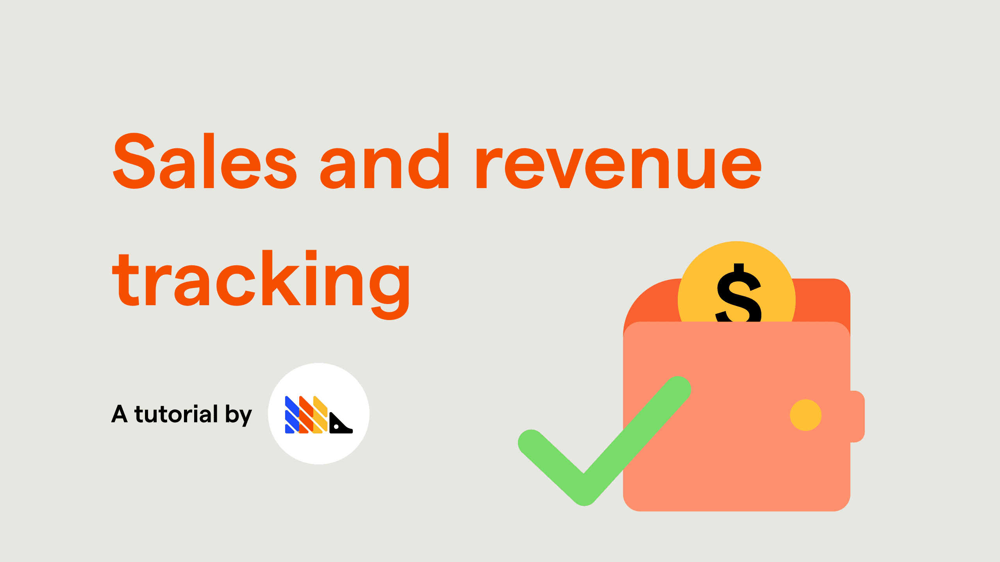
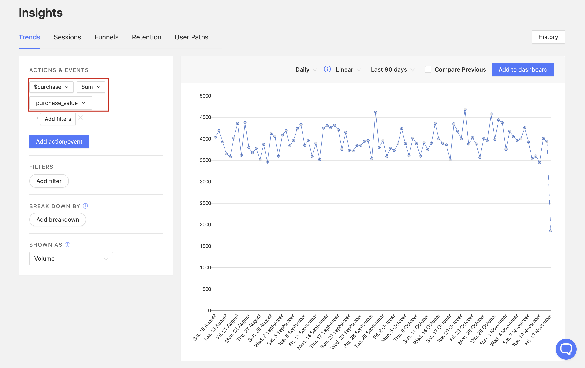
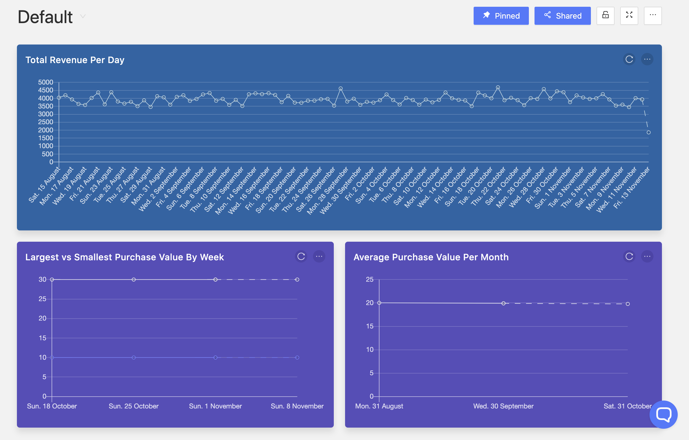
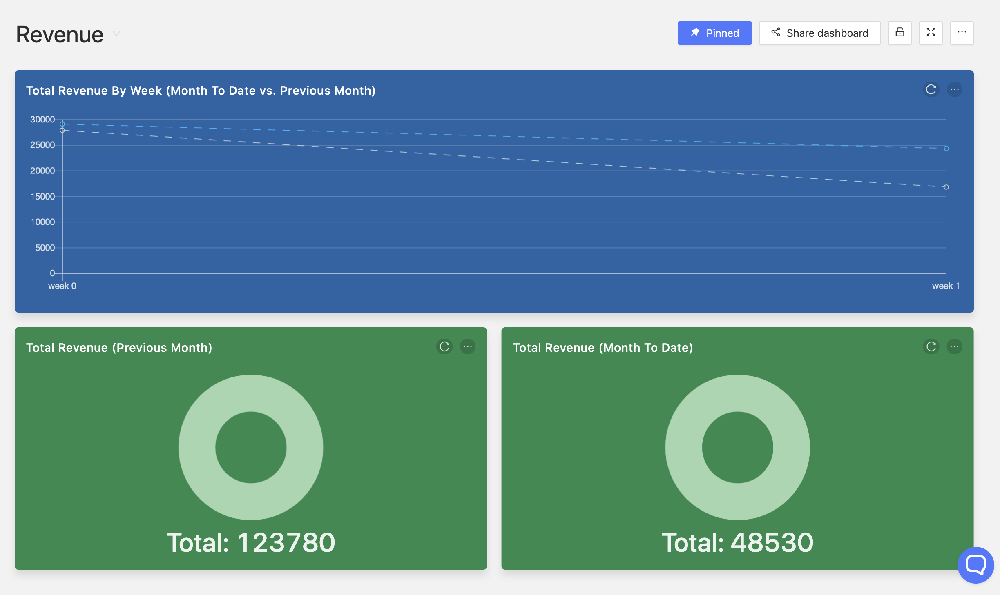
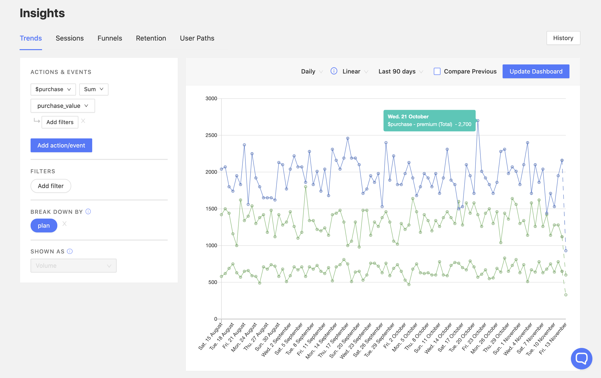
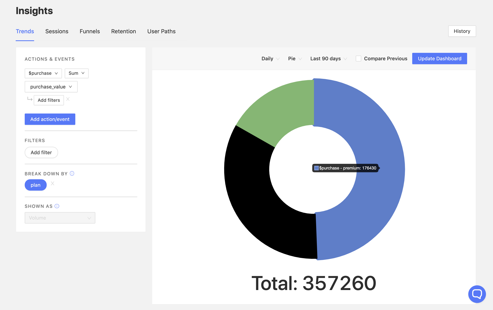
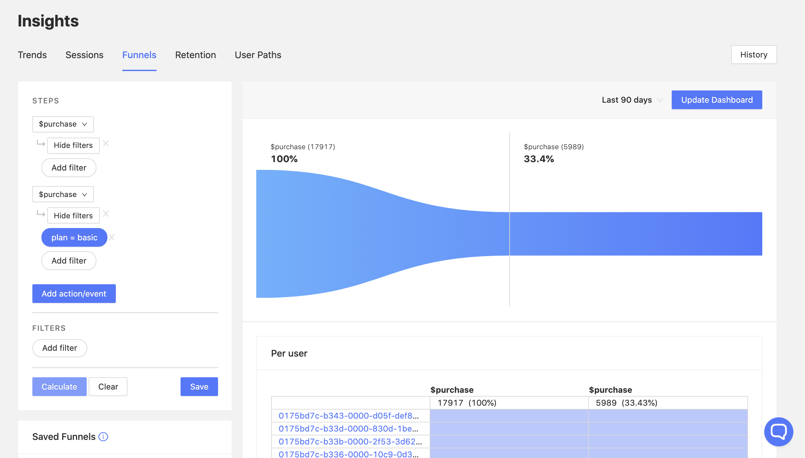
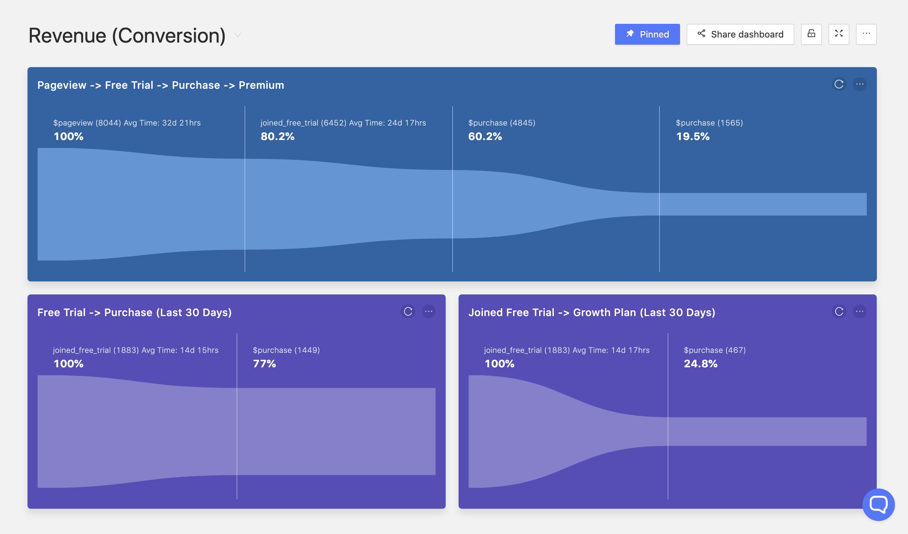
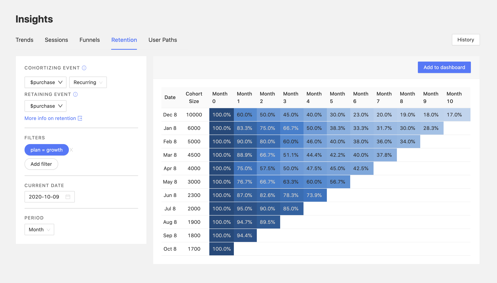

_Estimated reading time: 12 minutes_ ☕☕☕



To determine the quality of your product, and if you have a good product/market fit, one of the best metrics you can use is:

_Are people paying for it?_

With this tutorial, we'll give you a full guide to getting started with tracking your sales and revenue through PostHog, so you can:

- Determine sales KPIs
- Understand who your paying customers are
- Analyze your revenue and its main sources
- Track conversion and retention across subscription plans

### Prerequisites

To follow this tutorial along, you need to:

1. Have [deployed PostHog](/docs/deployment).
1. Have started receiving events via our [snippet](/docs/integrate/client/js), one of our [integrations](/docs/integrate/overview), or our [API](/docs/api/overview).

> **Note:** For sending events with revenue data, we recommend you integrate PostHog in your backend, given that, by nature, client-side code can be modified by the user. 

### Setting up events to track revenue

The first thing you need to do to start tracking revenue and sales is set up events that trigger when a relevant operation occurs.

Essentially, when a sale operation completes successfully, you want to capture a PostHog event with the useful information from that sale.

For example:

```python
# Python Example Implementation

# Internal function on a specific API endpoint
def _sale_completed(user, sale_data):
    posthog.capture(
        user.id, # Distinct ID that identifies the user in PostHog
        event="purchase"
        properties={
            "plan": sale_data["plan_name"],
            "price": sale_data["price"],
            "currency": sale_data["currency"]
        },
    )
```

In the example above, `_sale_completed` would be called after your existing logic for purchases determines a sale has been successfully completed. An event will then be sent to PostHog with the information you want to include about the sale, such as the plan, the price, the currency, and anything else you may find relevant. 

> **Note:** The most important thing here is to ensure you only send the event to PostHog when you are sure a sale completed. This ensures your tracking data matches your actual revenue, preventing an event from being captured for a sale that later gets cancelled. 

### Visualizing your revenue over time

Having started to send events that track sales to PostHog, the first thing to do is visualize your revenue over time. This can be done in ['Trends'](/docs/user-guides/trends), and might look something like this:



The chart above is targeting a `$purchase` event over the time period of "Last 90 days". However, instead of tracking the total volume of the event, it is tracking a sum of the value of one of its properties, called `purchase_value`.

The way you can achieve this view is by clicking on the dropdown to the right of the property name, which is set to `Total volume` by default. Once selected, this will reveal the following options:

- Total volume
- Active users
- Sum
- Average
- Maximum
- Minimum

The first two options target the event itself, showing either the volume of events or the number of active users who triggered the event. 

However, the last four options target numerical properties on events. When tracking revenue, this allows you to visualize:

- The total revenue per time period (e.g. by hour, day, or month)
- The largest (and smallest) purchase per time period
- The average purchase value per time period

Here are is an example [dashboard](/docs/user-guides/dashboards) combining charts that use all four of the numerical operations:



### Total revenue in the last month

If you want to see agreggate values for periods, you can change the time frame on line charts, or you can also display data as a table or pie chart, which combines the aggregate values of the periods and displays it as one value. 

To see the total revenue of the previous month, for instance, you can set your time frame to 'Previous Month' and your chart type to 'Pie'. You can pair this with a view of this month's total month-to-date revenue, as well as compare performance on a week-by-week basis. 

Here's what a dashboard with these views might look like:



> **Note:** With a view like this, you can then fire up your ad platform of choice to work out your ROIs, or better yet, [build a plugin](/docs/plugins/overview) to automate this.

### Breaking down revenue by source

Another important metric is determining the contribution of each revenue source to your total revenue.

You can visualize this by using our 'Break Down By' feature. 

For example, for a company with the following pricing structure:

| Plan Name | Price  |
| : ------ :| : --- :|
| Basic     | 10     |
| Growth    | 20     |
| Premium   | 30     |

We can break down revenue by the property `plan` and see how each plan is performing:



If, rather than plans, your company has different revenue sources altogether, you could, for instance, substitute the `plan` property for `source`. This would allow you to have the same view, broken down by source, such as `in_app` or `desktop`.

This can also be visualized as a pie, in order to see more clearly the actual _contribution_ of a plan to TR:



> **Note:** If you have revenue data in various currencies, or simply want to convert your values to another currency, you can use our [Currency Normalization Plugin](/plugins/currency-normalization) to do so.

### Conversion funnels

When tracking revenue, there are various useful conversion metrics to explore. Here are some examples:

#### What percentage of my paid users pick 'Plan X'?

One of the simplest metrics you can start with when using PostHog funnels is determining what plans are most popular.

To do so, you can set up a funnel with the following two events:

1. `purchase` event or equivalent
2. `purchase` event or equivalent filtered by `plan equals 'X'` or equivalent properties

This gives you the following view:



The funnel above shows us that, out of all unique users who paid for a plan (had a `$purchase` event), 33.4% pick plan `basic`.

#### Measuring conversion to paid plans

Let's answer the following two questions with funnels:

1. What percentage of my total users convert to a paid plan?
2. What percentage of my free trial users convert to a paid plan?

Here's an example dashboard that answers these questions: 



##### Pageview -> Free trial -> Purchase -> Premium plan

The top funnel in blue shows us the journey of our users from pageview to upgrading to a premium plan. It was created with the following steps:

1. PostHog's `$pageview` event
2. A `joined_free_trial` event
3. A `$purchase` event
4. A `$purchase` event filtered by `plan equals 'premium'`

From this funnel we can establish that:

- ~80% of the users that visited our website got a free trial
- ~60% of the total users made a purchase
- ~20% of our users purchased the premium plan

##### Free trial -> Purchase

This funnel in purple on the bottom left was created from some of the same steps as the main funnel, but it is more concise. It targets:

1. A `joined_free_trial` event
1. A `$purchase` event

From it, we can determine that 77% of our free trial users from the last 30 days signed up for a paid plan, which is a great conversion rate.

##### Free trial -> Growth plan

Lastly, this funnel is the most specific out of the three, giving us the conversion from the free trial to a specific plan. It was built as follows:

1. A `joined_free_trial` event
2. A `$purchase` event filtered by `plan equals 'growth'`

It shows us that in the last 30 days, ~25% of our users who had a free trial signed up for a growth plan afterwards.

### Measuring retention per subscription plan

Having users pay you for your product is great, however, if you have a subscription plan, it is just as important to keep a customer as it is to acquire a customer. 

For this, we need to calculate retention. This can be done either on purchases as a whole, to see if your users consistently keep _a_ subscription, or filtered by plan, to see if users consistently keep the same subscription. The latter is particularly relevant for your top plans, since users can't upgrade, so you want to make sure they don't downgrade.

Here's an example of a monthly retention table (recurring) for a specific plan:



Here we can see the retention on the 'Growth' plan, which appears to be improving over time.

While only 17% of the users from the previous December have continued with the subscription until now, the retention from Month 0 to Month 1 improved from 60% in December to over 90% across the past 3 months, indicating a positive trend.

This retention view also pairs well with funnels, so that when you determine that your retention for a plan is poor, you can find out where those users are going. Are they cancelling their subscription? Are they downgrading? 

To test for this, you could create a funnel starting with a subscription to a specific plan, and ending with a `cancel_subscription` event, or equivalent, in order to determine the percentage of users out of those that churned from a plan who churned from your platform altogether.

> **Note:** If you are tracking subscriptions, make sure to send a PostHog event at every billing event, rather than simply one purchase event upfront. Following the same principle, you can set the `cancel_subscription` event when a subscription has been successfully cancelled, in order to track churn more accurately.

### Correlate revenue data with usage data

This tutorial provides a good foundation for you to start tracking your revenue and understanding the underlying data better.

However, you can have great insights from correlating revenue data with your overall usage data, such as determining how the number of errors thrown affects your revenue, as well as how different features impact your subscription numbers and retention.

Tracking revenue is just the start.

### Other relevant tutorials

- [How to safely roll out new features](/docs/tutorials/feature-flags)
- [Analyzing your conversion with Funnels](/docs/tutorials/funnels)
