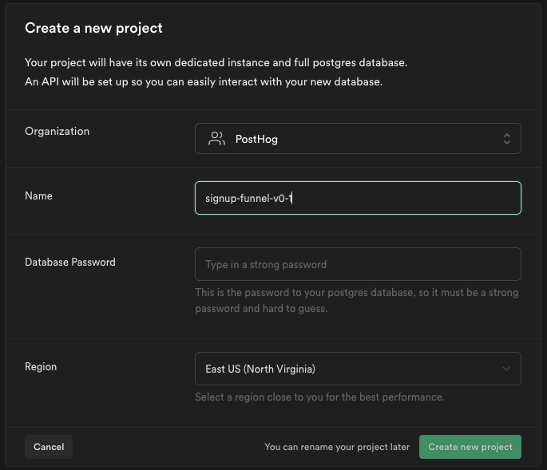
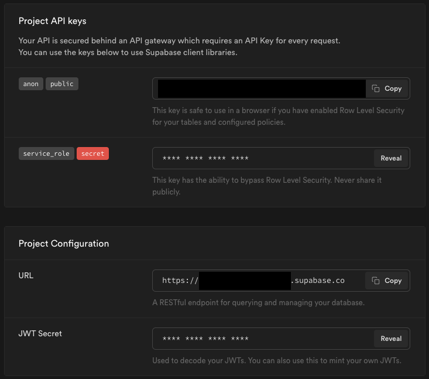
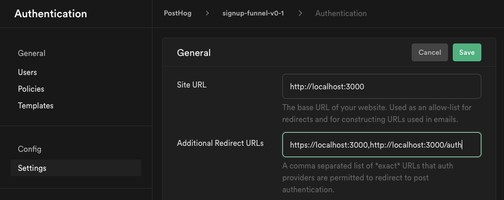
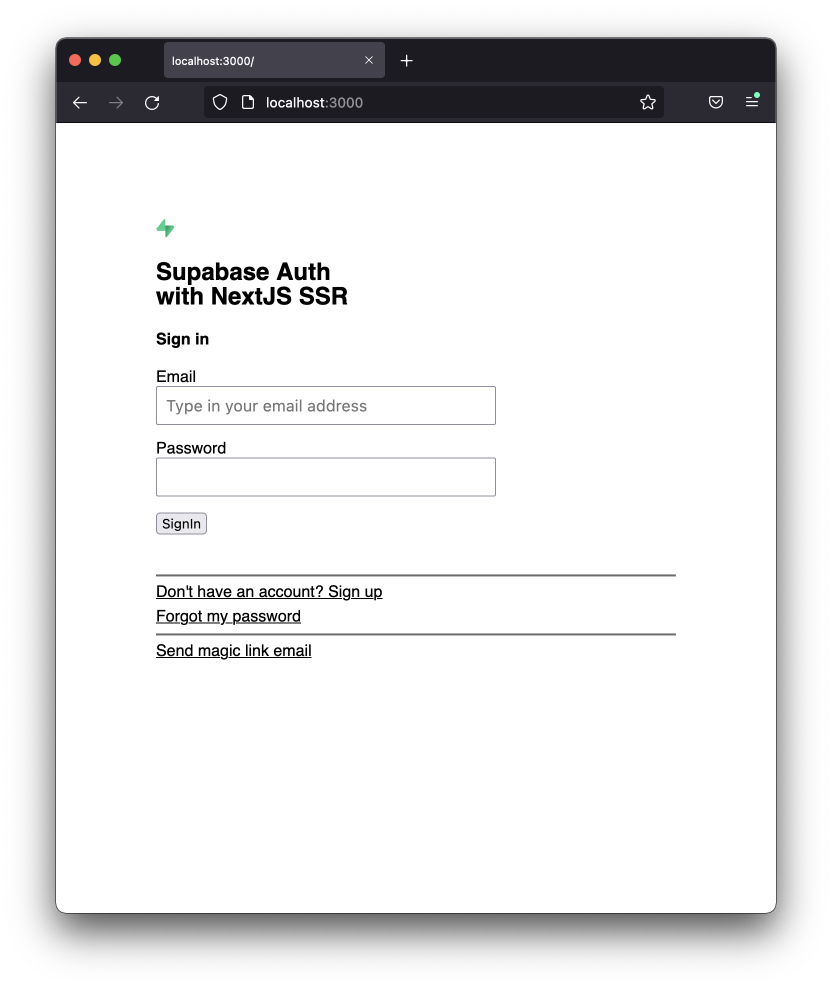
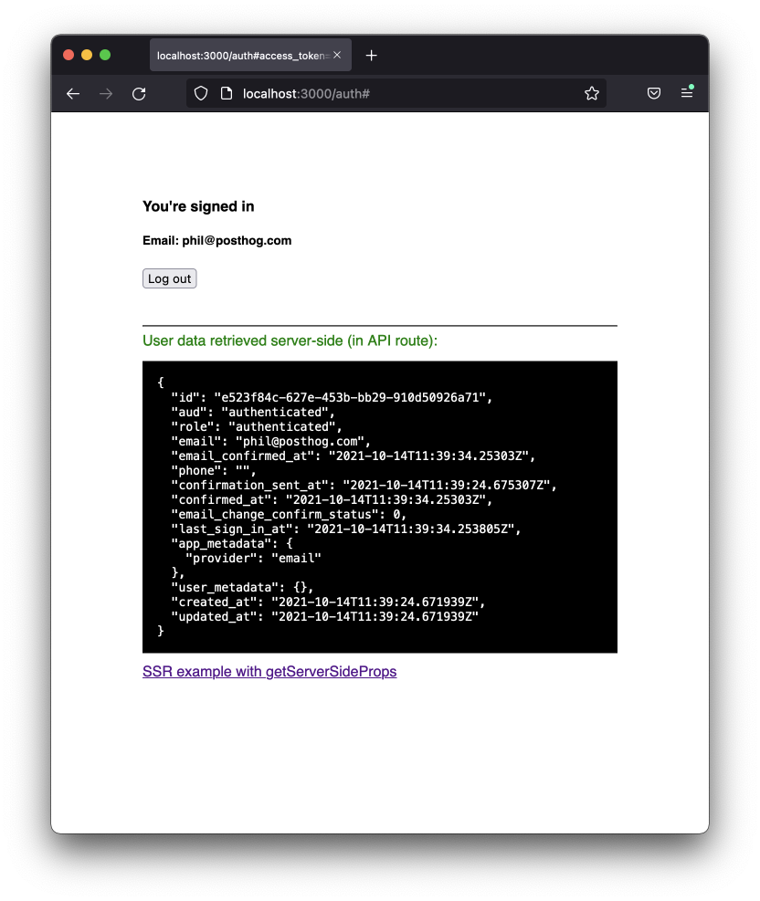
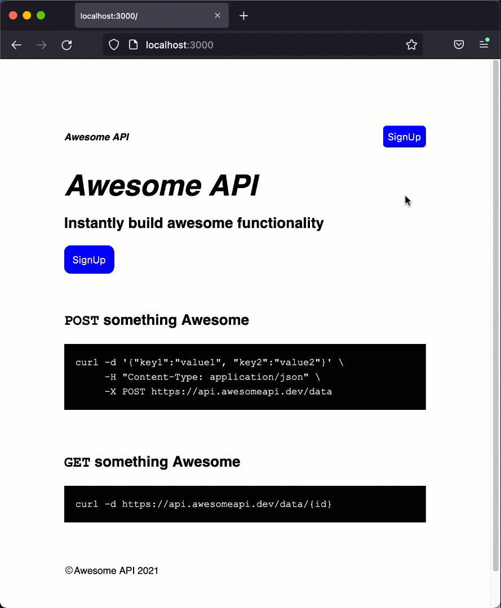
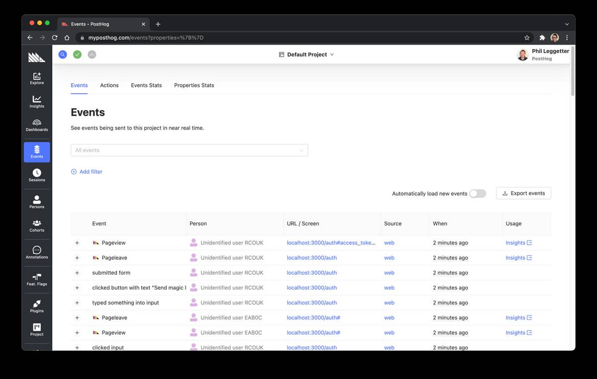
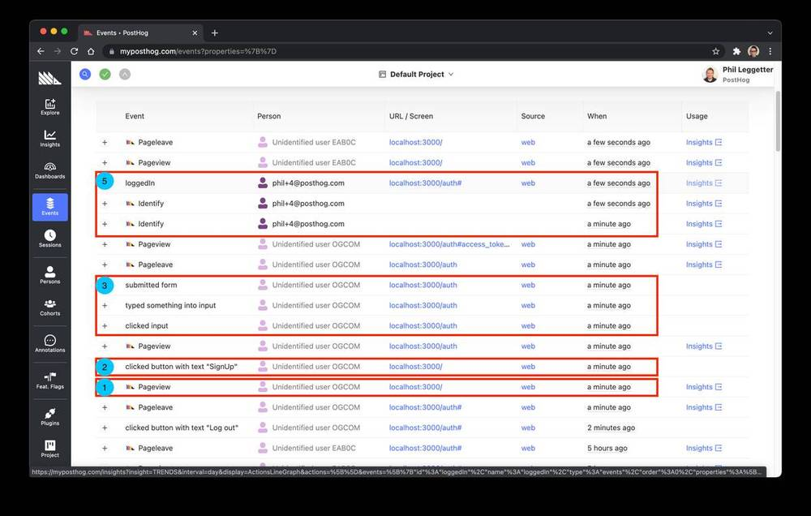

_Estimated reading time: TODO minutes_ ☕☕


With the number of software frameworks and services available to help with developer productivity and feature building, it's never been a better time to be a software developer. One of most important things you'll have to build, whether building a SaaS, developer tool, or consumer app, is a signup flow that begins on a landing page and ideally results in a successful signup. The purpose of this signup flow is to get as many real users through to being successfully signed up on your app or platform. So, it's important that you can measure whether your signup flow is converting and where any potential signups are dropping out. This is where PostHog can help.

In this tutorial, we'll create a simple signup flow in a [Next.js](https://nextjs.org/) app, starting with a [Supabase](https://supabase.io/) example for authentication. We'll then look at how you can instrument that signup flow using the PostHog JavaScript SDK and create a signup funnel visualization within the PostHog open-source product analytics platform to analyze the success - or failure - of the signup flow.

## Before you begin

To follow this tutorial along, you need to:

1. Have a [self-hosted instance of PostHog](/signup/self-host) or [sign up for PostHog Cloud](https://app.posthog.com/signup)
1. Have a [self-hosted instance of Supabase](https://supabase.io/docs/guides/hosting/overview) or [sign up for a hosted Supabase account](https://app.supabase.io/api/login)

It's easier to get up an running with the cloud hosted options. If you want to go with self-hosted then the [DigitalOcean PostHog 1-click deployment](https://posthog.com/docs/self-host/deploy/digital-ocean) makes getting started with PostHog much easier. For Supabase, [the Docker setup](https://supabase.io/docs/guides/hosting/docker) appears to be the best option.

## Bootstrap signup with Supabase Auth

Rather than building signup from scratch, let's instead start with an existing Supabase-powered example.

Run the following in your terminal to bootstrap a Next.js application with pre-built signup and login functionality:

```bash
npx create-next-app --example https://github.com/PostHog/posthog-js-examples/tree/main/supabase-signup-funnel
```

The output will look similar to the following:

```
$ npx create-next-app --example https://github.com/PostHog/posthog-js-examples/tree/main/supabase-signup-funnel
✔ What is your project named? … nextjs-supabase-signup-funnel
Creating a new Next.js app in /Users/leggetter/posthog/git/nextjs-supabase-signup-funnel.

Downloading files from repo https://github.com/PostHog/posthog-js-examples/tree/main/supabase-signup-funnel. This might take a moment.

Installing packages. This might take a couple of minutes.

Initialized a git repository.

Success! Created nextjs-supabase-signup-funnel at /Users/leggetter/posthog/git/nextjs-supabase-signup-funnel
```  

You'll be prompted for a name for your app and the files will be downloaded into a directory with that name. Navigate into that new directory (for example, `cd nextjs-supabase-signup-funnel`) and run the following to ensure you have the latest version of the Supabase JavaScript SDK:

```bash
npm install -S @supabase/supabase-js
```

The directory structure of your app will look as follows:

```bash.
.
├── README.md
├── components
│   └── Auth.js
├── lib
│   └── UserContext.js
├── package.json
├── pages
│   ├── _app.js
│   ├── api
│   │   ├── auth.js
│   │   └── getUser.js
│   ├── auth.js
│   └── profile.js
├── .env.local.example
├── style.css
└── utils
    └── initSupabase.js
```

- `components/Auth.js` is the signup, login, magic link, and forgot password component that makes use of Supabase Auth.
- `lib/UserContext.js` provides functionality to get the current user from within a component wrapped in a `<UserContext />`, if a user is logged in.
- `pages/_app.js` a Next.js [custom app component](https://nextjs.org/docs/advanced-features/custom-app) used to initialize all pages.
- `pages/api/*` serverless API endpoints used within the Supabase authentication.
- `pages/auth.js` is the authentication page that uses the `Auth` component.
- `pages/profile.js` is a page used to demonstrate server-side rendering.
- `.env.local.example` environment variables/configuration.
- `styles.css` basic styling.
- `utils/initSupabase.js` initializes a [Supabase client](https://supabase.io/docs/reference/javascript/supabase-client) used to interact with Supabase.

Now we understand the basic structure of the bootstrapped application, let's get it up and running.

The one last piece of setup that's required before running the app is to create a Supabase project, set some auth config, and add the credentials from that to a `.env.local`. To create the `.env.local` run:

```bash
cp .env.local.example .env.local
```

Now, head to the [Supabase dashboard](https://app.supabase.io/) to create a project. Click the **New project** button and you'll be presented with a "Create new project" dialog.



You may need to select an Organization. You will need to enter details for a project name, database password, and choose a deployment region. Once done, click the **Create new project** button.

You'll then be presented with a page showing **Project API keys** and **Project Configuration**.



Update the contents of `.env.local` as follows:

- Update the `NEXT_PUBLIC_SUPABASE_URL` value to be the URL from **Project Configuration**
- Update the `NEXT_PUBLIC_SUPABASE_ANON_KEY` value to be the API key tagged with `anon` and `public` from **Project API keys**

Next, within the Supabase dashboard project settings select **Auth settings** and add `http://localhost:3000/auth` to the **Additional Redirect URLs** field.



With the Supabase configuration in place, we can run the app with:

```bash
npm run dev
```

You can then navigate to `http://localhost:3000/auth` to try out the Supabase authentication functionality including signup, login, login/signup with magic link (email), and forgot password.



When you're signed up and logged in the UI will look like this:



We'll focus on signup for our application so try out the signup with email and password functionality as well as the magic link signup (note magic link emails for a single email address can be sent once per 60 seconds). Once you're familiar with Supabase Auth functionality, we're ready to start to build a simple traditional signup funnel.

## Create a signup funnel

The goal of this tutorial is to demonstrate how to instrument and measure a signup flow. So, let's create a very simple signup flow as follows:

1. User lands on the main website landing page which has two CTAs (call-to-actions) of **SignUp**. One in the header and one in the landing page hero.
1. User clicks on one of the signup buttons and is taken to the signup page.
1. User enters their details to signup and submits the form.
1. User receives registration verification email.
1. User clicks the link in the email and successfully signs up.

### Signup flow landing page

We'll keep the landing page really simple. Create a new file, `pages/index.js`, with the following content:

```js
import Link from 'next/link'

const curlPostCmd = `
curl -d '{"key1":"value1", "key2":"value2"\}' \\
     -H "Content-Type: application/json" \\
     -X POST https://api.awesomeapi.dev/data
`

const curlGetCmd = `
curl -d https://api.awesomeapi.dev/data/{id}
`

const Index = () => {
  return (
    <div style={{ maxWidth: '520px', margin: '96px auto', fontSize: "14px" }}>

        <nav>
            <ul>
                <li className="logo">
                    <Link href="/">
                        <a>Awesome API</a>
                    </Link>
                </li>
                <li>
                    <Link href="/auth">
                        <a>
                            <button>
                                SignUp
                            </button>
                        </a>
                    </Link>
                </li>
            </ul>
        </nav>

        <header>
            <h1 className="logo">Awesome API</h1>
            <h2>Instantly build awesome functionality</h2>
            <Link href="/auth">
                <a>
                    <button>
                        SignUp
                    </button>
                </a>
            </Link>
        </header>

        <main>
            <h2><code>POST</code> something Awesome</h2>
            <pre>
                <code>
                    {curlPostCmd.trim()}
                </code>
            </pre>

            <h2><code>GET</code> something Awesome</h2>
            <pre>
                <code>
                    {curlGetCmd.trim()}
                </code>
            </pre>
        </main>

        <footer>©️Awesome API 2021</footer>

    </div>  
  )
}

export default Index
```

As planned, the page has two CTA `<button>` elements that send the user to the `/auth` page for signup. One button is in the header and one is in what you could class as a "hero" location.

This will result in an "Awesome API" landing page that looks as follows:


Feel free to rebrand!

Now that a landing page is in place we have a basic signup flow that we want the user to successfully navigate through.



## Integrate with PostHog

A user can now signup with our app but there are a number of potential drop-off points within the funnel. So, let's integrate the PostHog JavaScript SDK to instrument the user signup journey.

Add two new environment variables to `.env.local` that will be used with the PostHog JavaScript SDK:

```
NEXT_PUBLIC_POSTHOG_API_KEY=your_posthog_api_key
NEXT_PUBLIC_POSTHOG_HOST=your_posthog_host
```

The value for `NEXT_PUBLIC_POSTHOG_API_KEY` can be found via **Project** in the left-hand menu of your PostHog app, underneath the **Project API Key** heading.

The value for `NEXT_PUBLIC_POSTHOG_HOST` is the public URL for your running PostHog instance. If you're using cloud, this is `https://app.posthog.com`.

With the required config in place we can install the PostHog JavaScript SDK:

```bash
npm i -S posthog-js
```

Create a new file, `utils/initPostHog.js`, and within it add code to initialize the PostHog JavaScript client:

```js
import posthog from 'posthog-js'

export const initPostHog = () => {
    if(typeof window !== 'undefined') {
        posthog.init(process.env.NEXT_PUBLIC_POSTHOG_API_KEY, {
            api_host: process.env.NEXT_PUBLIC_POSTHOG_HOST,
        })
    }

    return posthog
}
```

The file exports a single function, `initPostHog`, that checks to ensure that the current runtime is the browser and, if so, initializes the PostHog JavaScript client with the config we've just stored. It also returns the `posthog` client instance so we can use within our app.

PostHog JS has an auto-capture feature that automatically captures browser events (this can be disabled). However, it won't capture navigation events in Next.js that where the window doesn't reload so we need to add some custom code to capture navigations. Open up `pages/_app.js` and add this code within the `MyApp` function:

```js
import { useEffect } from 'react'
import { useRouter } from 'next/router'
import { initPostHog } from '../utils/initPostHog'

export default function MyApp({ Component, pageProps }) {

  const router = useRouter()

  useEffect(() => {
    // Init for auto capturing
    const posthog = initPostHog()

    const handleRouteChange = () => {
      if(typeof window !== 'undefined') {
        posthog.capture('$pageview')
      }
    }

    router.events.on("routeChangeComplete", handleRouteChange)

    return () => {
      router.events.off("routeChangeComplete", handleRouteChange)
    };
  }, [router.events])
```

Here, we import the [React `useEffect`](https://reactjs.org/docs/hooks-effect.html) and [Next.js Router](https://nextjs.org/docs/api-reference/next/router) hooks. Within the `useEffect` hook we initialize the PostHog JS client using the function we've just created and bind to a `routeChangeComplete` on the Next.js router, handling the event within the `handleRouteChange` function. When this function is called, we manually trigger a page view event using PostHog js with `posthog.capture('$pageview')`.

Now, head over to the **Events** section within your PostHog instance and you'll see new events appear as you test out the signup flow.



Here's how some of the events can tie in to the flow we're trying to build:

| Step                                                           | Event                                | Url / Screen                    |
| -------------------------------------------------------------- | ------------------------------------ | --------------------------------|
| 1. User lands on the main website landing page                 | Pageview                             | locahost:3000/                  |
| 2. User clicks on one of the signup buttons                    | clicked button with text "SignUp"    | locahost:3000/                  |
| 3. User enters their details to signup and submits the form    | submitted form                       | localhost:3000/auth             |
| 4. User receives registration verification email               | _no event_                           | _outside of app_                |
| 5. User clicks the link in the email and successfully signs up | _no event_                           | localhost:3000/auth             |

From the above table, you can see that we can track everything up until the signup form submission.

It is theoreticaly possible to track the step 4. email verification if the email sender provides a sent notification mechanism such as a webhook. So, if Supabase offered a webhook when auth emails were sent we could track this from the server.

However, we need to, and should be able to, track step 5. when the user has successfully signed up. We know that the user lands on `/auth` when they are logged in. If we look at the code for that page there is a `user` variable that is set if the user is logged in. So, let's update `/pages/auth.js` so we can track a logged in user. First, include the `initPostHog` utility:

```js
import { initPostHog } from '../utils/initPostHog'
```

Next, update the `Index` definition:

```js
const Index = () => {
  const { user, session } = useUser()
  const { data, error } = useSWR(session ? ['/api/getUser', session.access_token] : null, fetcher)
  const [authView, setAuthView] = useState('sign_up')

  const posthog = initPostHog()

  if(user) {
    posthog.identify(user.email, user)
    posthog.capture('loggedIn')
  }

```

In the above code we utilize the `initPostHog` function again to reference an initialized PostHog JS instance. We then make two function calls:

1. `posthog.identify(user.email, user)` - since the user is logged in we can identify them. We pass in `user.email`, their email address, as a destinct identifier. We also pass in the Supabase `user` variable so PostHog has access to additional user data.
2. `posthog.capture('loggedIn')` - this triggers a simple `loggedIn` event that we can use to identify the user as successfully having logged in.

If you now go through the login flow, you can map events in PostHog to the signup funnel that we're building.



You'll also see the point at which `posthog.identify` is called since the **Person** associated with the event listed with each event entry.

_Note: **Identify** is being called twice as the `Index` function is likely being called twice during the React component life cycle as the values of state variables change._

## Create a signup funnel in PostHog

Now that we have all the events for our signup flow we can define a funnel to analyze the user journey and identify drop-off points.