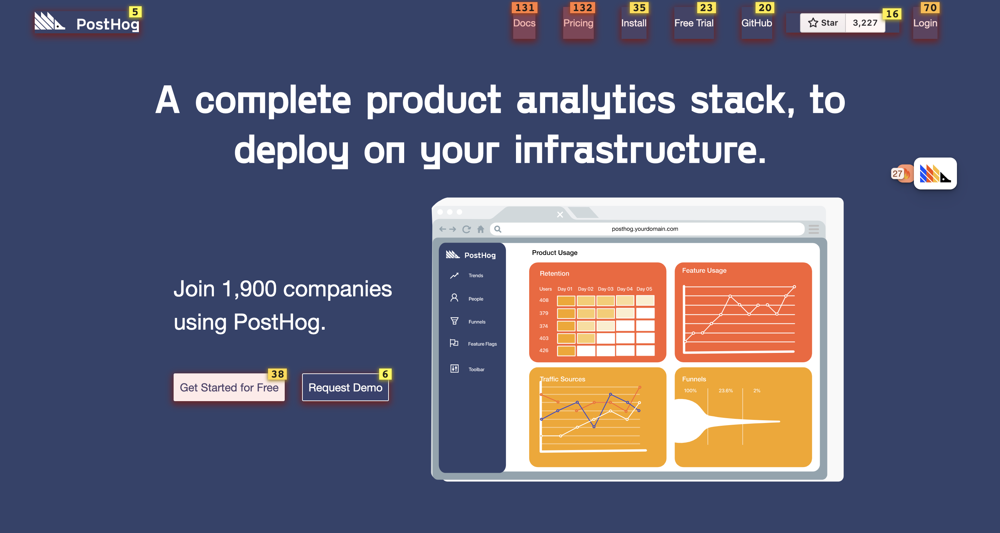
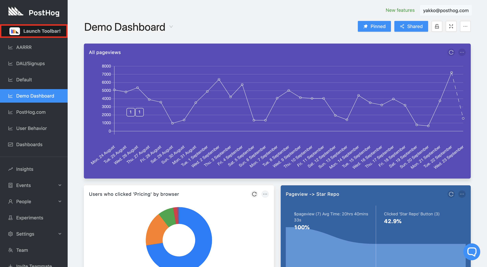
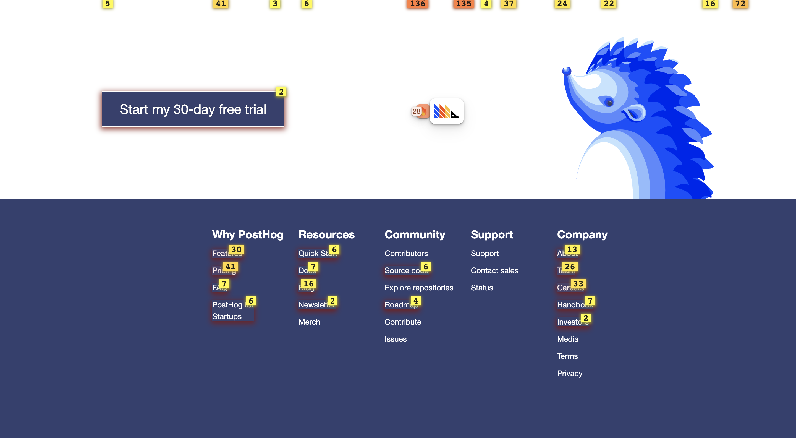

_Estimated reading time: 6 minutes_ ☕☕

An underlying purpose of analytics is to answer questions by utilizing data.

_"Who's using my website?"_ 

_"What type of people pay for my product?"_

_"Why am I not retaining users?"_

Often times, these questions don't have a simple answer, and, more often than not, just getting _any_ answer to your questions requires a good amount of effort. 

However, there are some questions that have straightforward answers - the difficulty comes in getting that answer across. 

Enter the PostHog Toolbar. 

Consider the question: _"Where are my users clicking?"_

How's that for an answer?

This tutorial will walk you through using the PostHog Toolbar to answer some of your analytics questions, as well as show you step-by-step how to create actions with it, so that you can sort through your events and level up your PostHog game. 

...

_Prefer to watch a video? Check out the [Toolbar sections of our demo video](https://youtu.be/aUILrrrlu50?t=48) for a shorter overview of this functionality._

## Prerequisites

To follow this tutorial along, you need to:

1. Have [deployed PostHog](/docs/deployment).
1. Have added the [PostHog snippet](/docs/integrate/client/js) to your website. 

> **Note:** Our Toolbar only works with our [JavaScript library](/docs/integrate/client/js), so you will not have access to it without the PostHog snippet. Additionally, a Segment snippet is unable to load the toolbar.

## Why use the toolbar

Before we go right into how to use the PostHog Toolbar, it's useful to understand why you'd want to do so.

Our toolbar is still in Beta, and there are exciting new features for it on our roadmap. However, in its current form, it can:

1. Display user clicks on your website/web app in a visual way
1. Tell you what element is the most clicked on a given page
1. Create actions in a simple way
1. Display all actions you have on a page (based on frontend elements)

Our team uses the toolbar daily, mostly to get a quick overview of clicks (and therefore decide what pages need attention) as well as create actions. This helps us to do things like prioritize which parts of our website or product to redesign, as any PostHog user can easily see the potential impact of their work. 

Overall, the toolbar gives valuable context regarding how users are navigating your website or application, helping you design the menus, determine how to display information, and structure your product in a way that steers users towards the actions you would like them to perform.

## Launching the Toolbar

The PostHog Toolbar will only be enabled for you - not your users. Effectively, the little floating hedgehog will only appear on your website if the current visitor is authenticated into your PostHog instance i.e. this can be you or anyone on your team. 

To launch the toolbar, you can just access your website and it should appear for you. If that does not work, you can go over to PostHog and click the 'Launch Toolbar' button on the top left of the sidebar:

This will prompt you to select the URL you'd like to launch it on (in case you are tracking multiple websites). Once you've clicked the desired URL, you will then be taken to a new tab where your website will load with the toolbar enabled.

<b>Note:</b> The toolbar is now enabled for all new PostHog users by default, even though it is still in Beta. However, if you are a user from before our 1.13.0 release, you might need to enable the toolbar in 'Settings' -> 'Setup'.
 

## Using the heatmap

### Step 1: Enabling the heatmap

The heatmap is the most exciting feature of our toolbar. To use it, just hover over the hedgehog, and click on the red fire (🔥) icon. 

The process is the same for toggling any functionality on or off. By default, you might have actions toggled on. Just click on the green flag icon to toggle that off and reduce noise on the page.

### Step 2: Understanding the heatmap

With the heatmap on, you should now see that clickable elements on your website have a red overlay on them, with numbers on small yellow/orange boxes on the top right of each element. The bottom and/or top of your screen might also have these boxes.

Here's another example from our website with the heatmap enabled:

What the toolbar is doing here is displaying the number of clicks on each of those elements over the past 7 days. 

Numbers at the bottom or top of the screen just indicate that there are more elements that are not currently being displayed on the page. 

With the heatmap enabled, if you then click on an element, you will also be able to see its ranking on the page and create an action from it.

## Creating actions

Actions are PostHog's way of allowing you to sort through your events. If you have not used them, you can find more information in the [dedicated Actions page](/docs/user-guides/actions). 

### Step 1: Using 'Inspect'

When you're on your website with the toolbar enabled, you're able to create actions with just a few clicks.

If you're in PostHog, when you click to create an action, we will also give you the option to 'Inspect element on your site', which makes use of the toolbar.

To create an action from an element, toggle on 'Inspect' after hovering over the hedgehog. This is the blue button with the magnifying glass (🔍).

Example from our website:

Just like the heatmap, this will also add an overlay to the elements, albeit a blue one.

Then, if you click on an element, you will be given the option to create an action from it, on the bottom of the modal. 

This will open up an action creation modal, like this:

You should then fill in the name of the action under 'What did your user do?', scroll down, and click 'Create Action'.

If you want to create a more advanced action, you can also create it here. 

Here are the options you have for creating an action:

**Element filters**

These are used by PostHog to find the specific element you're creating the action for. 

_Link href_

Where a click on the element leads to (if available). 

_Text_

Inner text of the element (if available). 

_Selector_

Path to the element on the page. If you're not happy with the selector PostHog is using automatically, you could, for example, select elements based on their `id` or `data-attr`. This is useful if the path to the element is too complicated and not sufficiently robust to withstand website changes. 

_URL_

If you have the same element at the same position in various pages (e.g. navbar elements), the default action will capture them all. To prevent this, you can set an exact URL or specify a pattern for pages where this exact action should be recorded.

**Add another element**

If you want your action to cover more than one element, you can click 'Add another element' right above 'Create Action'. 

This is an `OR` operation, meaning that the action will be recorded if Element A _or_ Element B is clicked. 

This is useful if you have various buttons that take you to the same page, for instance, and just care that the user clicks one of them.

A good use case for this is leveraging the action as a [funnel step](/docs/user-guides/funnels). 

### Step 2: Seeing your existing actions

Once you have created an action, it will be available for you in PostHog.

However, you can also visualize your actions with the toolbar.

By toggling on 'Actions' (green flag icon), you should have a view of all actions on the page. 

Here, you can click an element and see all actions that use it. This is a great way of making sure the relevant elements to you have an action associated with them. 

Additionally, by clicking a specific action on an element, you can update or delete it.

## Just the beginning...

That's it! You've now learned to use the main functionalities of our toolbar. 

We would like to note once more that the PostHog Toolbar is in Beta (and we mean it!), so if you do find any issues, please report them to us on [GitHub](https://github.com/PostHog/posthog/issues). 

The toolbar should also be getting new features soon, so stay tuned.
