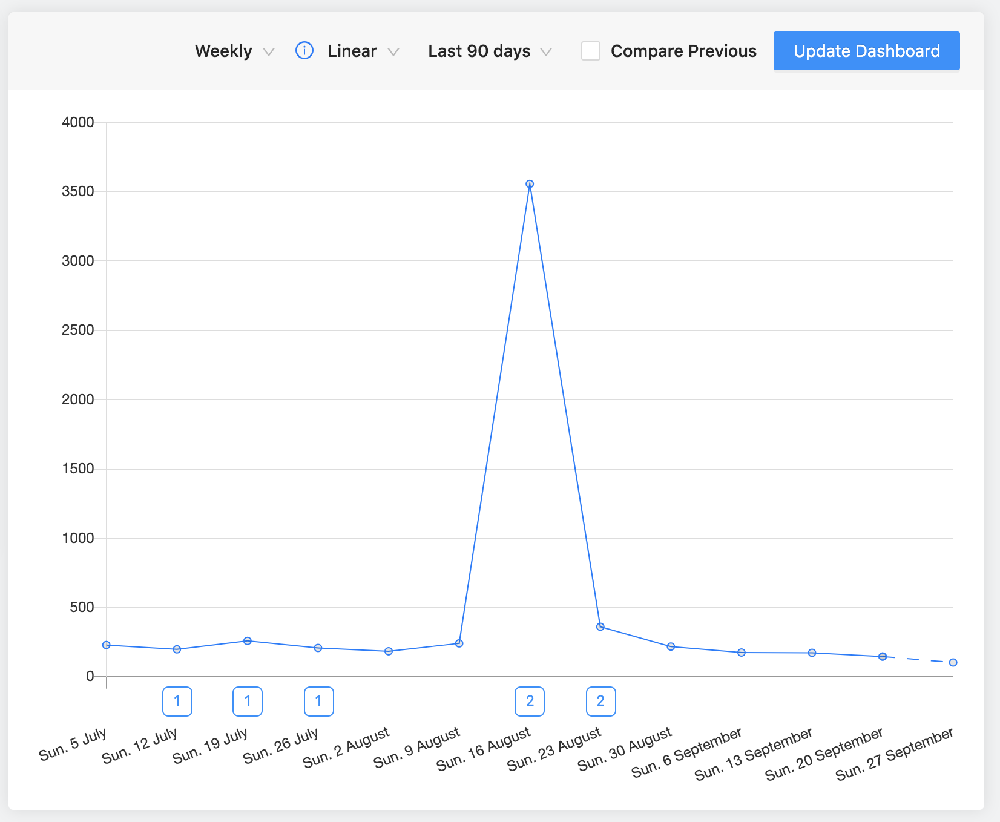
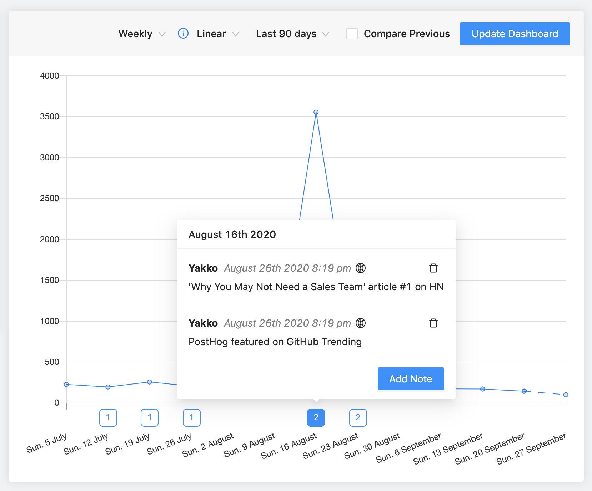
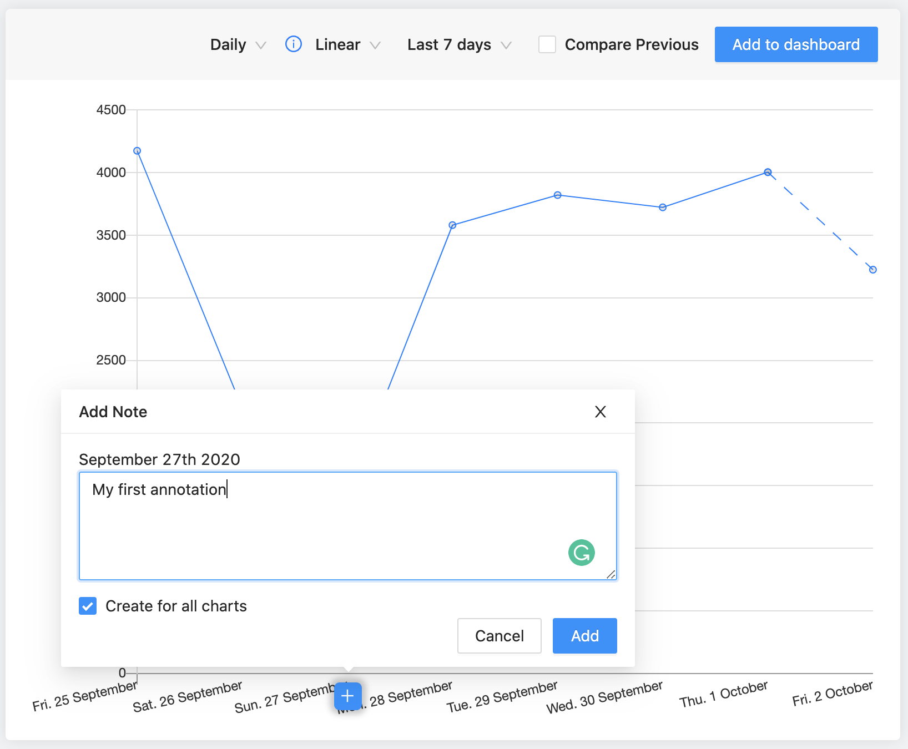
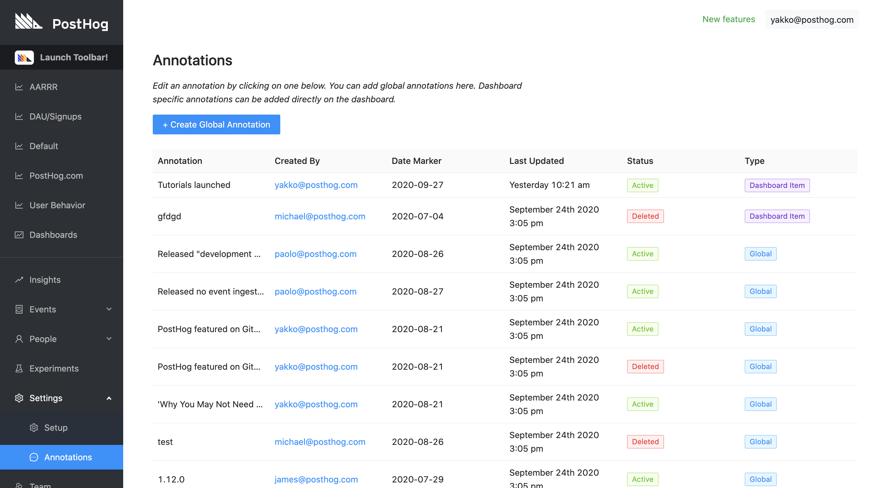

Annotations allow you to leave notes on your charts that can help you understand the driving factors behind the changes that happen over time.

For example, at PostHog, we use annotations to mark things like version releases and new blog posts, so we can easily explore the impact of these events on our metrics. 

Here's an example from our own dashboards:

 

The chart above shows us the number of unique users who visited our blog. You can see there is a clear spike in mid-August.

On the day of that spike, there were 2 important things that happened for us. You will see that at the bottom of the chart there are numbers inside squares (actually [squircles](https://en.wikipedia.org/wiki/Squircle)). These represent annotations.

On the day of the spike, we have 2 saved annotations. If I hover over them, I can see what they are:

 

On that day, PostHog was listed on GitHub's trending page, and there was an even more relevant event: our article ['Why You May Not Need a Sales Team'](/blog/product-led-growth/) was ranked #1 on [HackerNews](https://news.ycombinator.com/), which brought a lot of new viewers to our blog.

In this case, the annotations were done after the fact (the next day), which makes them useful for future reference. However, annotations are especially powerful if you create a habit of annotating events you think _could_ be relevant, and then analyzing their impact. 

This could help you determine a specific version release that caused you to lose or gain a lot of users, for example.

## Creating an Annotation

When editing a chart in Trends or Sessions (or a chart from Trends/Sessions on a Dashboard), hover your cursor over the dates at the bottom of the chart to reveal a button with a `+` symbol. Clicking it will then open up a modal where you can create your annotation, as well as choose to have it specifically for the current chart or all of your charts.

 

With your annotation created, it will now be available at the bottom of your chart, and you can also view all of your existing annotations in `/annotations`:

