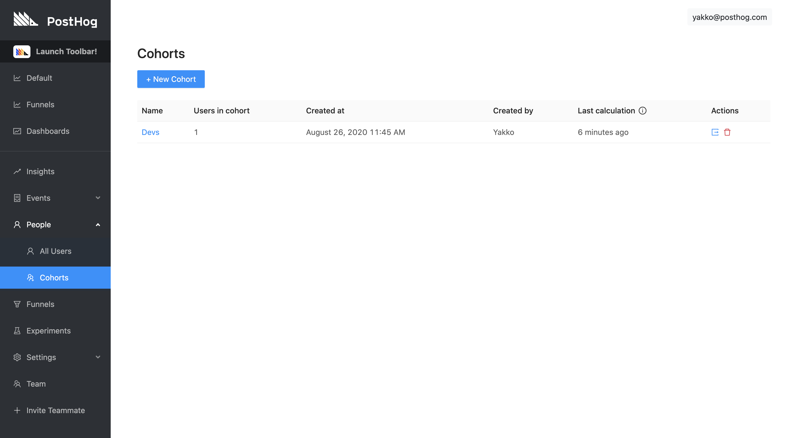
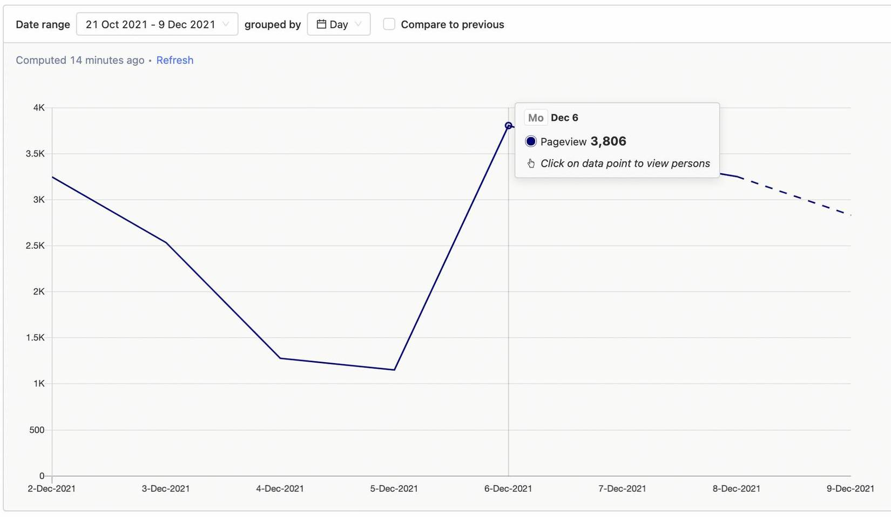
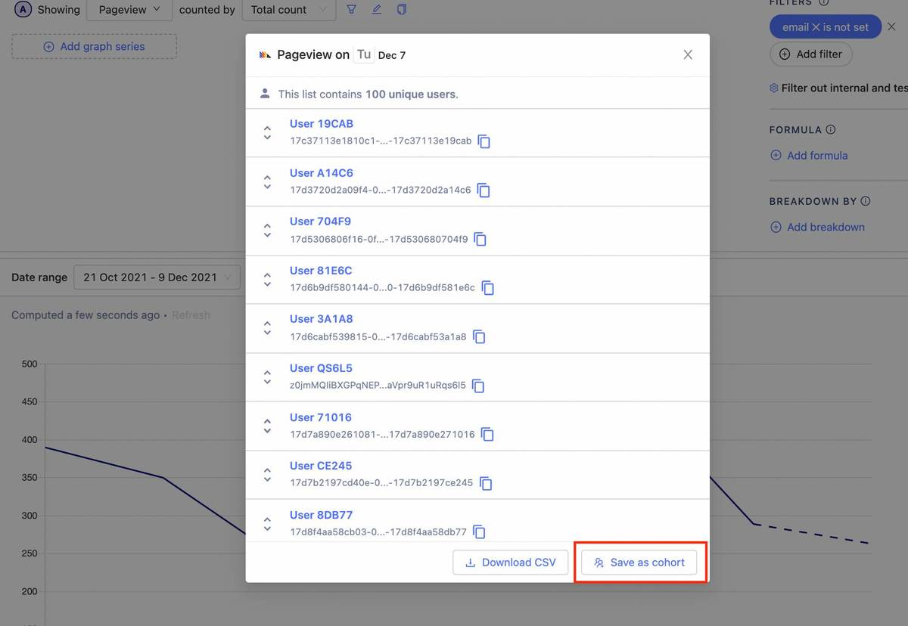
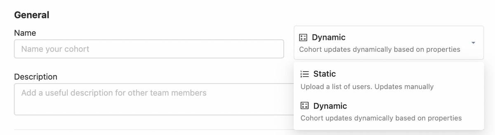
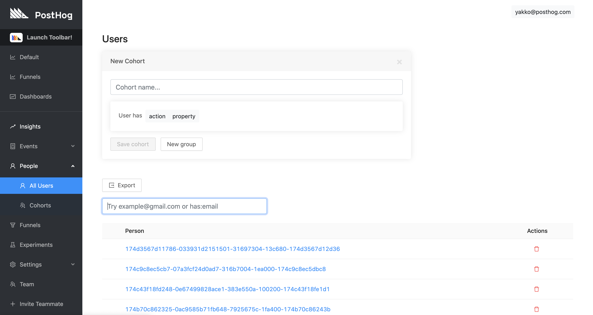
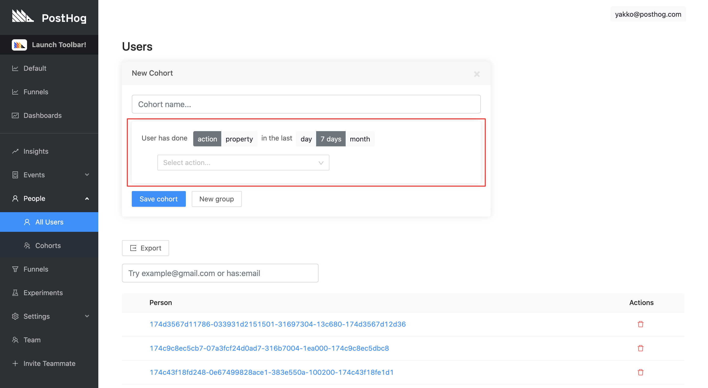

<FeatureAvailability allPlans restrictedPlans={['free', 'openSource']} />

Cohorts are PostHog's way of letting you easily create a list of users who have something in common.

You can use the cohorts to:

* View a list of users who all did the same action or have the same property. A few examples of how you might use this are:
  * "Which users used the app today?"
  * "Which users work at the same company?"
  * "Who used the app once but never came back?"
* Segment other statistics. For example, to view user paths or action trends. This let's you understand things like:
  * "Are people at company X using the app much?"
  * "Is the number of Daily Active Users going up or down over time?"

## Demo video

<iframe width="560" height="315" src="https://www.youtube.com/embed/GtSSxmOdyk4" frameborder="0" allow="accelerometer; autoplay; clipboard-write; encrypted-media; gyroscope; picture-in-picture" allowfullscreen></iframe>

## Creating a new cohort

There are two ways to create a new cohort:
#### Creating a new cohort from the cohorts page

**Step 1:** Navigate to the 'Cohorts' page in the sidebar:

**Step 2:** Click '+ New Cohort' on the top right.

#### Creating a new cohort directly from an insight

It is also possible to create a cohort using data from a trend. Currently, this feature is only available from within trends, but [funnels](/docs/user-guides/funnels) and other insights will soon offer this as well. 

**Step 1:** Go to insights, create a new trend, and click any data point on the graph to view persons represented in the underlying data.

**Step 2:** In the modal popup, click 'Save as cohort' in the bottom right.

## Cohort types

When creating a cohort from scratch, you'll first choose between two type of cohorts, static and dynamic: 

### Static cohorts

You might want to batch users together based on based on the value of some mutable property at a certain point in time. So, for example, if you wanted to save a cohort of users you experimented on, and selected them based on usage at a given point in time, you might want to 'freeze' that list and have it accessible to track them at a later point in time. To do so, you can upload a csv of users. Unlike a dynamic cohort, a static cohort will not change as user properties/events change.

### Dynamic cohorts 

##### Match users who performed action or event
Sometimes, you'll want to group users that have performed a certain event or [actions](/docs/user-guides/actions) within a given time. For example, you might want to track 'daily active' or 'weekly active' users, based on the frequency of them performing a given action. For this, you'll want a list that dynamically updates, moving users in or out as they meet criteria or not. 

##### Match users who have properties
Or, you might select a user property to filter on, and then update that property, and with a dynamic cohort, the user could be filtered in or out. Commonly, this used to combine users at a certain team, from a certain marketing campaign (via their UTM tags), email, etc.

**'Add matching criteria'** adds another group of filters that a user must match to be a part of the cohort, as an `OR` operation. This means that if a user matches _any_ of the groups you add, they will be added to the cohort. 

## Adjusting time frames

You may only want users who have performed a certain action within a certain timeframe.

On setting the cohort to match users who '*performed action or event*', you will be presented with the following:

You can match users on actions/events performed within the last day, week, 2 weeks, or month. 

## Viewing users in a cohort

Go to 'Cohorts' in the left-hand navigation (as shown [here](/docs/user-guides/cohorts#creating-a-new-cohort-from-the-cohorts-page) and select the cohort you want to view by clicking it, and you'll be presented with a list.

## Differentiating team vs. users traffic
From the initial setup, [PostHog is tracking various events](/docs/integrate/client/js#autocapture) from all users. However, you may want to differentiate between traffic from your team and traffic from your users.

To do so, you can identify your team members in PostHog either through a [`posthog.identify`](/docs/integrate/client/js#identifying-users) (e.g. by setting an email as the ID) call or by [associating properties](/docs/integrate/client/js#sending-user-information) with your team member users (e.g. `is_team = true`). 

With that done, you can then create a cohort of your team and/or a cohort that does not include any of your team members, so that you can continue to gather data on all users, but can differentiate between them when performing your analytics processes.

This is the recommended method for differentiating between team and user traffic if you want to keep receiving events. However, if you wish to stop receiving events on your team altogether, you should consider using [`posthog.opt_out_capturing`](/docs/integrate/client/js#opt-users-out).