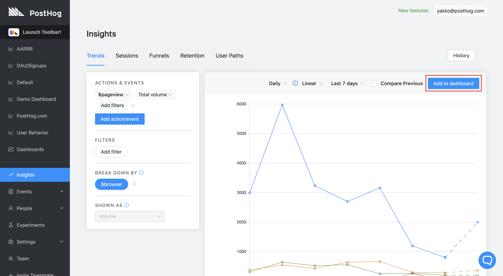
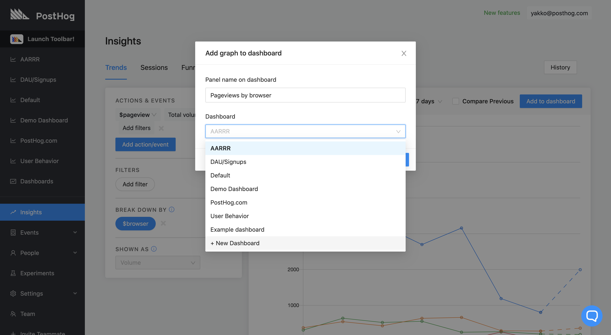
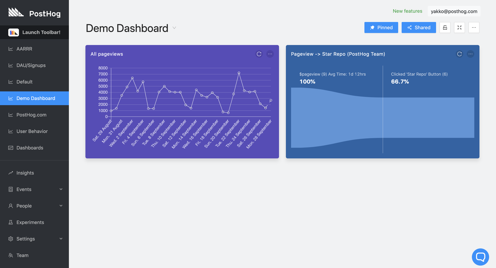

<FeatureAvailability allPlans />

You can create dashboard panels to display information you are collecting with PostHog. It will be the first thing you see when you log on so that you can easily access the most important performance metrics in your product.

Dashboard panels can be created from any tab in 'Insights', and they can be tables, line charts, funnels, and pie charts.

## Demo video

<iframe width="560" height="315" src="https://www.youtube.com/embed/XUKQvXrE96k" frameborder="0" allow="accelerometer; autoplay; clipboard-write; encrypted-media; gyroscope; picture-in-picture" allowfullscreen></iframe>

## Creating a dashboard

**Step 1: Navigate to 'Insights' in the navigation**

'Insights' is located just above 'Events' on the navigation.

**Step 2: Create a chart, funnel, or table**

On any of the tabs available, create a chart you'd like to easily access again in the future.

**Step 3: Add to dashboard**

Click the blue 'Add to dashboard' button on the top right corner of the card 

**Step 4: Configure and save your panel**

Clicking 'Add to dashboard should bring up the following modal:

Here you can choose a name for your panel and pick the Dashboard you'd like to display it on (you can also create a new one).

## Editing a dashboard

With your dashboard created, you can now view and edit it.

**Step 1: Accessing your dashboard**

To access your dashboard, loook for it on the left sidebar. If it cannot be found there, click 'dashboards' and select it from there.

**Step 2: Editing the dashboard**

Once on the dashboard view, there's a lot that you can edit here. 

Let's go through the main options available in the picture:

**Top right: Dashboard management**

On the top right you can, in order:

* "Pin" your dashboard to the navigation
* Generate a link to share it publicly 
* Lock it to prevent changes
* Display the dashboard in full screen
* Rename and delete the dashboard

**Moving and resizing panels**

To resize a panel, all you need to do is take your cursor to the edge of the panel and a little arrow will appear. This will then allow you to resize it as you wish. You can hover your cursor over any edge to do this, except the top one. In the image, this is shown by the red circle.

Additionally, to move a panel, just click on it and hold. Then move your cursor and the panel should move with it.

**Panel options**

Each panel has two buttons on the top right. The circular arrow is used to refresh the panel, and the clicking the three dots reveals a variety of options. These are:

* View chart/funnel/table: Takes you to the Insights tab where you can update the panel
* Rename: Give your panel a new name
* Set color: Change a color that hurts your eyes less 
* Copy to: Copy the panel to another dashboard
* Move to: Move the panel to another dashboard 
* Duplicate: Copy and create a duplicate of the panel on the same dashboard
* Delete: Get rid of the panel

## Send or share a Dashboard

You can generate a public link to a Dashboard using the **Send or share** button on a Dashboard page. To use this feature, click the button, toggle the **Share your dashboard** switch, copy the public URL, and share the link with others.

import shareDashboardAnimation from '../../images/user-guides/dashboards/share-dashboard.gif'

  

