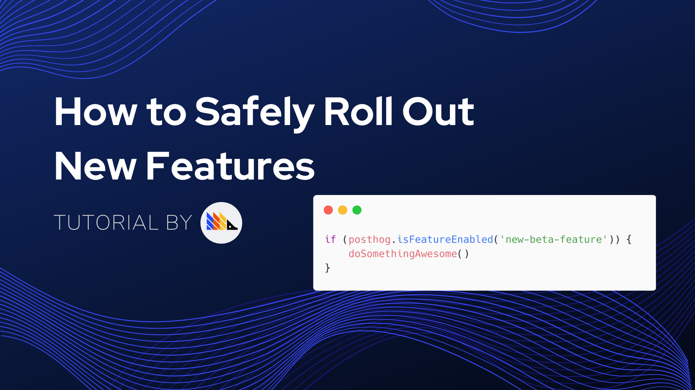
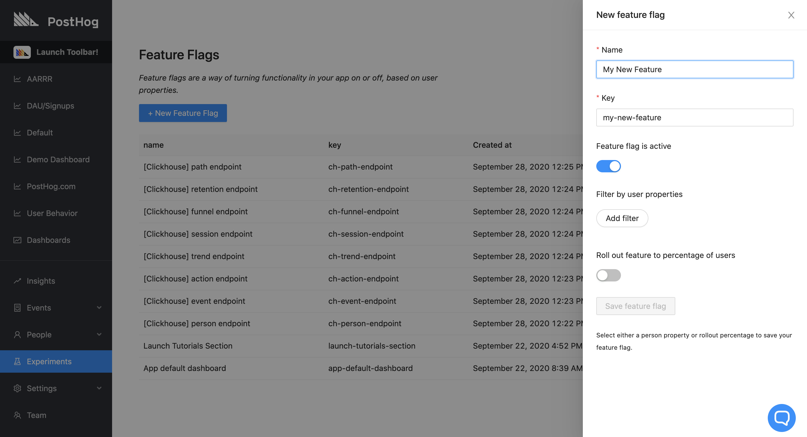

Feature flags allow you to safely deploy and roll back new features. It means you can deploy features and then slowly roll them out to your users. If something has gone wrong, you can roll back new features without having to re-deploy your application.

> **Note:** Feature Flags are currently available with our [JavaScript](/docs/integrate/client/js#feature-flags) and [Python](/docs/integrate/server/python) libraries. We're working to support this feature on all of our libraries, but, for the moment, you can also use [our API](/docs/api/overview#feature-flags) to implement feature flags in your backend.

## Learning resources

### Tutorial

For a comprehensive step-by-step tutorial on how to use feature flags, check out [How to safely roll out new features](/docs/tutorials/feature-flags).



### Demo video

<iframe width="560" height="315" src="https://www.youtube.com/embed/a6WEuVncYok" frameborder="0" allow="accelerometer; autoplay; clipboard-write; encrypted-media; gyroscope; picture-in-picture" allowfullscreen></iframe>

<br />

## Creating feature flags

In the sidebar, go to 'Experiments' and click '+ New Feature Flag'.

Think of a descriptive name and select how you want to roll out your feature.



## Implementing the feature flag

When you create a feature flag, we'll show you an example snippet. It'll look something like this:

```js
if(posthog.isFeatureEnabled('new-beta-feature')) {
    // do something
}
```

What you do inside that if statement is up to you. You might change the CSS of a button, hide an entire section, or move things around.

Behind the scenes, every time a user loads a page we call an endpoint to get the feature flags that apply to that user. We store those flags as a cookie. This means that for most page views the feature flags will be available immediately, *except* the very first time a user visits your site.

To combat that, there's a callback you can use to wait for the flags to come in:

```js
posthog.onFeatureFlags(function() {
    // feature flags are guaranteed to be available at this point
    if(posthog.isFeatureEnabled('new-beta-feature')) {
        // do something
    }
})
```

> **Note:** To avoid `posthog has no attribute isFeatureEnabled` errors, make sure you're using the latest snippet. You can find that in the 'Project Settings' page in PostHog.

## Develop Locally

To test feature flags locally, you can open your developer tools and override the feature flags given. You will get a warning that you're manually overriding feature flags.

```js
posthog.feature_flags.override(['feature-flag-1', 'feature-flag-2'])
```

This will persist until you call override again with the argument `false`:

```js
posthog.feature_flags.override(false)
```

To see the feature flags that are currently active for you, you can call:

```js
posthog.feature_flags.getFlags()
```

<br />

## Roll out the feature flag

There are three options for deciding who sees your new feature. You can roll out the feature to:

1. A fixed percentage of users,
1. A set of users filtered based on their user properties,
1. A combination of the two

### Roll out to a percentage of users

By rolling out to a percentage of users you can slowly ramp up who sees a new feature. The way this works is we "hash" a combination of the key of the feature flag and the unique distinct ID of the user.

This way a user will always fall on the same place between 0 and 100%, so they will consistently see or not see the feature controlled by the flag. As you move the slider towards 100%, more users will start seeing your feature.

The hashing means that the same user will fall along different points of the line for each new feature. For example, Alice will start seeing the feature at 5% for feature A, but only at 80% for feature B.

### Filter by user properties

This works just like any other filter in PostHog. You can select any property and users that match those filters will see your new feature.

By combining user properties and percentage of users you can determine something like:

> "Roll out this feature to 80% of users that have an email set"

## De-activating properties

If the feature has caused a problem (like a huge server load), or you don't need the feature flag anymore, you can disable it instantly and completely. Doing so ensures **no users** will have the flag enabled.

## Feature flag persistence

For feature flags that filter by user properties only, a given flag will always be on if a certain user meets all the specified property filters.

However, for flags using a rollout percentage mechanism (either by itself or in combination with user properties), the flag will persist for a given user as long as the rollout percentage and the flag key are not changed. 

As a result, keep in mind that changing those values will result in flags being toggled on and off for certain users in a non-predictable way. 

## Multivariate feature flags (alpha)

> Multivariate feature flags are only available when using PostHog >= 1.28 (if self-hosting) and [posthog-js](https://github.com/PostHog/posthog-js) >= 1.13.

PostHog 1.28 introduces support for multivariate feature flags which can return string values according to a specified distribution. (Some examples for a 3-variant case would be 33/33/34%, 50/25/25%, 70/20/10%, and so on.) This is ideal for when you want to test multiple variants of the same interchangeable content, such as marketing taglines, colors, or page layouts. Currently, this is a beta feature for paying customers. Contact us through one of our [support options](https://posthog.com/support) to try this out!

### Creating a feature flag with multiple variants

Create a multivariate feature flag just like you would a standard flag, and then change the "Served value" option to "a string value". You will then be prompted to enter a few keys with optional descriptions and set the distribution percentages for each.

Note that the rollout percentage of feature flag variants must add up to 100%. If you wish to exclude some users from your test, i.e. have some users receive no value at all, configure the **release condition groups**. While the release condition groups determine how many users will be bucketed into **any** of the given variants, the rollout percentage of each variant determines the portion of the overall release group that will be assigned to that particular variant.

### Using multivariate feature flags in your code

With the latest version of our JS library, you can call:

```js
if(posthog.getFeatureFlag('checkout-button-color') === 'black') {
    // do something
}
```

`getFeatureFlag` also returns true or false for standard (Boolean) feature flags, meaning that the following statements are equivalent:

```js
posthog.isFeatureEnabled('new-beta-feature')
posthog.getFeatureFlag('new-beta-feature') === true
```

### `getFlagVariants`

Just as you can call `getFlags()` to return an array of feature flags that are currently active, you can call:

```js
posthog.feature_flags.getFlagVariants()
```

`getFlagVariants` returns an object:

```json
{
    "new-beta-feature": true,
    "checkout-button-color": "black",
}
```

### `onFeatureFlags`

`onFeatureFlags(callback)` now passes the feature flag variants object as the second argument to `callback`, which looks like this:

```js
posthog.onFeatureFlags(function(flags, flagVariants) {
    // do something useful
    console.log(flags)         // ["new-beta-feature", "checkout-button-color"]
    console.log(flagVariants)  // { "new-beta-feature": true, "checkout-button-color": "black" }
})
```

Note that `getFlags()` and the callback argument `flags` will include the key names of all truthy feature flags, including active multivariate feature flags.

### Querying data by multivariate feature flag values

With the latest version of our JS library, we send each feature flag's value as a separate property on every event. This means the values can be used in filters and breakdowns in Insights queries or wherever else you may choose to filter incoming events.

We send the event properties as `$feature/your-feature-name`, for example `$feature/checkout-button-color`. Standard (Boolean) flags are captured in this format as well.

For example, if you have a Trends graph of button click events and you'd like to narrow it down to clicks only when the checkout button is blue, apply a filter to your graph series such that `$feature/checkout-button-color = blue`.

If you'd like to compare all variants for which we have data in one graph, apply a breakdown by `$feature/checkout-button-color`.
