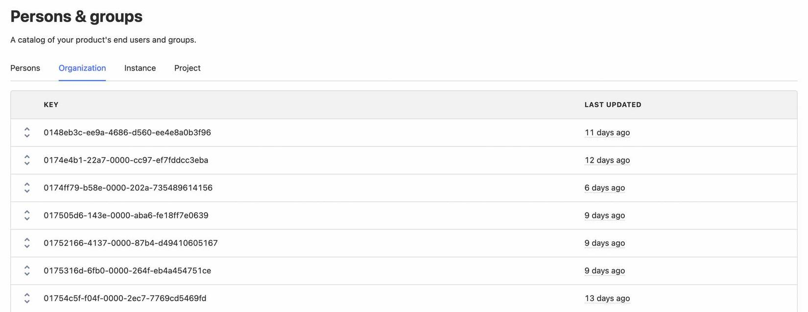
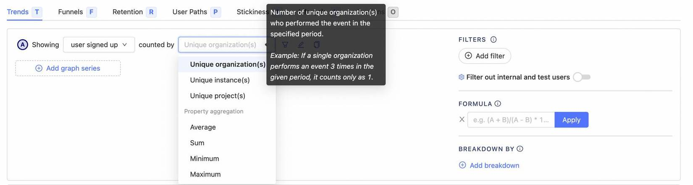
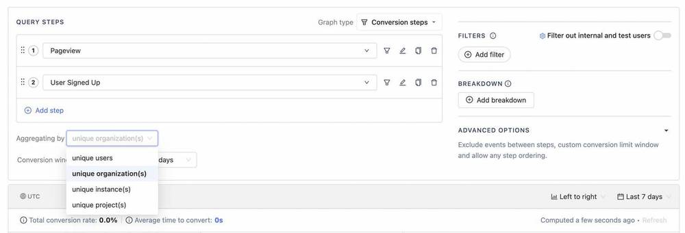

# What are groups and how are they different to cohorts?
Groups are how you track and perform analysis on an aggregation of something. The simplest example of a group is a company, you have users from multiple companies that might use your product - groups allows you do to analytics (and much more) on companies rather than only users - e.g. Daily Active Companies.

Groups are not limited to companies they can be of any type you determine

Groups differ from cohorts, a cohort is a essentially a list of users, whereas a group represents multiple entities which multiple users might be associated with. Following the company example again from above, you can might a cohort of users who belong to a certain company. But you could create a type of group which represent all companies and the users associated with them.

# What can you do with groups? @marcushyett-ph
* **Group Analytics** - You can perform any type of analytics (e.g. Trends, Funnels, Retention, etc.) based on groups rather than users (e.g. Number of companies who signed up in the last 28days)
* **Feature flags** - You can use groups to roll-out your feature flags more consistently, instead of giving different users in the same organization a different experience, roll out the feature flag to whole organizations

# How our solution works? @neilkakkar

## Groups vs Group Types @neilkakkar
Terminology: group types (e.g. company) vs groups (e.g. Company X whose your client)


## ... @neilkakkar

*Any additional information about groups (like tracked by users), and then an example of the problem mentioned above solved using the new terminology we introduced (to drive the point home re: how to think about groups).*

# How do I get started? @marcushyett-ph

## Getting access
Groups is a paid feature, so you'll need to be on our [Scale or Enterprise plans](https://posthog.com/pricing) for self-hosted or have entered your credit-card on cloud.

On-self hosted you must also be on the latest release: 1.31.0 or above.

## Integrating tracking
To make use of group analytics, you need to update your event capture code. See the sections below for how to set it up depending on how you are sending data to PostHog.

The following examples use `company` as a group type and `id:5` as the group key. Replace these with your particular values.

> **Tip:** Use a singular form of the group type throughout ingestion

### [posthog-js](https://posthog.com/docs/integrate/client/js)

Update to version 1.16.0 or above to make use of the new functionality.

In posthog-js it's possible to declare that a user is currently "active" in a particular group. This means all events (both normal and autocaptured) are considered to be for that group.

To make sure all events get attached to groups, we recommend calling `posthog.group` in `loaded` callback.

```js
posthog.init('[your api key]', {
    api_host: 'https://posthog.[your-domain].com',
    loaded: function(posthog) {
        posthog.identify('[user unique id]');

        posthog.group('company', 'id:5');
        posthog.group('playlist', 'id:77', {
            length: 77,
            some: 'properties'
        });
    }
});
```

Subsequent calls to `posthog.group()` with the same group type but a different group key make the new group be active.

#### Handling logging out

When the user logs out it's important to call `posthog.reset()` to avoid new events being registered under registered groups and the logged in user.

### [posthog-python](https://posthog.com/docs/integrate/server/python)

Update to version 1.4.3 or above to make use of the new functionality.

```python
# Capturing an event with groups
posthog.capture('[distinct id]', 'some event', groups={'company': 'id:5'})

# Updating group properties
posthog.group_identify('company', 'id:5', {
    'company_name': 'Awesome Inc',
    'employees': 11
})
```

### [posthog-php](https://posthog.com/docs/integrate/server/php)

Update to version 2.1.0 or above to make use of the new functionality.

```c
# Capturing an event with groups
PostHog::capture(array(
    'distinctId' => '[distinct id]',
    'event' => 'some event',
    '$groups' => array("company" => "id:5")
));

# Updating a groups properties
PostHog::groupIdentify(array(
    'groupType' => 'company',
    'groupKey' => 'id:5',
    'properties' => array("company_name" => "Awesome Inc", "employees" => 11)
));
```

### [posthog-go](https://posthog.com/docs/integrate/server/go)

```go
// Capturing an event with groups
client.Enqueue(posthog.Capture{
    DistinctId: "[distinct id]",
    Event:      "some event",
    Groups: posthog.NewGroups().
        Set("company", "id:5").
})

// Updating a groups properties
client.Enqueue(posthog.GroupIdentify{
    Type: "company",
    Key:  "id:5",
    Properties: posthog.NewProperties().
        Set("company_name", "Awesome Inc").
        Set("employees", 11),
})
```

Using groups with go requires latest version of `posthog-go`. Update dependencies via:

```shell
go get -u github.com/posthog/posthog-go
```

### [posthog-node](https://posthog.com/docs/integrate/server/node)

Update to version 1.2.0 or above to make use of the new functionality.

```javascript
// Capturing an event with groups
posthog.capture({
    event: "some event",
    distinctId: '[distinct id]',
    groups: { company: 'id:5' }
})

// Updating a groups properties
posthog.groupIdentify({
    groupType: 'company',
    groupKey: 'id:5',
    properties: {
        company_name: 'Awesome Inc',
        employees: 11
    }
})
```

### Other libraries

Not all libraries support group analytics yet, but you can work around this issue by sending events in specific formats.

This section uses our [Capture APIs](https://posthog.com/docs/api/post-only-endpoints) for examples but you can adapt this
approach to any library.

#### Capturing events with groups

```shell
POST https://[your-instance].com/capture/
Content-Type: application/json
Body:
{
    "api_key": "<ph_project_api_key>",
    "event": "[event name]",
    "properties": {
        "distinct_id": "[your users' distinct id]",
        "key1": "value1",
        "key2": "value2",
        "$groups": {
            "company": "id:5"
        }
    }
}

```

#### Updating group properties

```shell
POST https://[your-instance].com/capture/
Content-Type: application/json
Body:
{
    "api_key": "<ph_project_api_key>",
    "event": "$groupidentify",
    "properties": {
        "distinct_id": "[your users' distinct id]",
        "$group_type": "company",
        "$group_key": "id:5",
        "$group_set": {
            "company_name": "Awesome Inc",
            "employees": 11
        }
    }
}

```

## Analysing group insights
Once you have integrated tracking for groups this will unlock the ability to analyze based on them.

## Viewing groups and their properties
To view groups and their properties, head to the "Persons and Groups" tab on the navigation bar.

From here you can select the group type you are interested in and view the groups and properties (by clicking the chevrons on the left).



### Organizations signed up in last week
If we wanted to see how many organizations signed up in the last week we can create a trends insight and set the event to be our sign up event and the "counted by" "unique organization(s)", you should see all of your group types here.

This will show us the trend of sign ups by organization as opposed to per user.



### Organization signup funnel
You can use groups in many insights, for example in a funnel you may want to understand how an organization moves from their first visit to signing up. You can set the "aggregating by" to be the group type you wish to aggregate by.

This will show how many organizations have made it through the funnel as opposed to individual users.



# Feature Flags @neilkakkar

# Limitations @neilkakkar