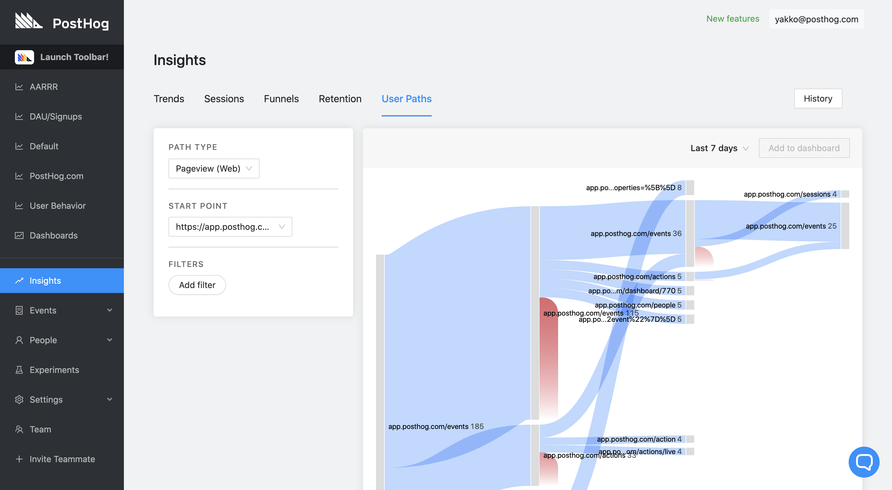

Paths are PostHog's way of letting you inspect free form how traffic is flowing through your application. A path can be comprised of any action (such as pageviews, button clicks, or a combination of both). 

The kind of ways Paths can be helpful are as follows:

* Understand where traffic is landing into your application or website
* Understand where traffic is quitting your application
* Understand which parts of your application people are actually using

We provide a visual representation of the paths taken by users on your product, so that you can easily identify these patterns.

## Viewing paths

Go to the 'User Paths' tab after visiting 'Insights' in the left-hand navigation:

There is no set up in the PostHog UX needed for paths - they appear automatically if you are tracking pageviews with our snippet, or pushing page view events.

## Filters

In order to determine patterns between groups of users who, at least in theory, may behave similarly, our Paths functionality also provides filtering. This way, you can visualize the overall paths taken by all your users, or sort them according to any filter you would prefer, including our built-in filters for OS, Browser, Time, IP, among many others.

To use filters, just access your 'Paths' page on PostHog and you should be able to see a 'New Filter' option at the top of the page.

Filters can also be combined in order to define more complex groups, creating statements equivalent to "Show me users that run MacOS and visited my website using Firefox".

If you want us to help improve 'Paths', you can take a look at [this issue](https://github.com/PostHog/posthog/issues/223). Feel free to comment, upvote, or pick up this as a PR.

### Multiple domains

Paths work across subdomains, even with the basic snippet installation. We see it's common for a website to be the landing page, then traffic to move into app.example.com, once a user starts interacting with the product. Just set up the root domain as the URL in your [tracking settings](/docs/integrate/client/snippet-installation).

We recommend tracking across everything so you can understand where your most engaged users come from.