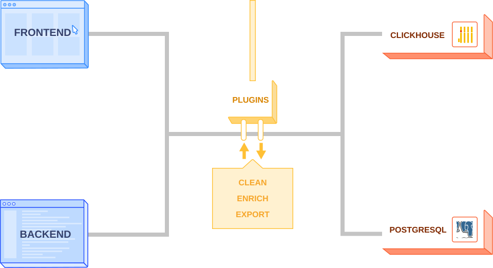

_Interested in what plugins we have available? Check out our [Plugin Library](/plugins)._

<hr /><br />

Plugins are a way to extend PostHog's functionality by either pulling data into or sending data out of PostHog. 

Our goal with plugins is to allow anyone to extend and customize PostHog in order to better fit their analytics and business needs.

Plugins serve three key purposes:

- **Enriching:** Getting data into PostHog
- **Exporting:** Getting data out of PostHog
- **Cleaning:** Data parsing and filtering at the ingestion step



> **Note:** We now have a [dedicated Plugins section](/docs/plugins/overview) in our Docs with a lot more information about the functionality.
## Architecture

When an event is sent to PostHog, it is added to a task queue, after which it is picked up by a worker that processes and ingests the event, storing it into the database. 

When plugins are enabled, an extra step is added to the pipeline. Instead of creating `process_event` tasks that ingest the event, `process_event_with_plugins` tasks are created first, processed by a Node.js server, and then added back into the pipeline as `process_event` tasks.

This makes it so that our Celery workers continue to handle `process_event` tasks without any knowledge that an extra step has been added to the pipeline, making it easy to turn plugins off and circumvent that step.

Essentially, before an event is added to the database, plugins have access to the event, being able to modify it, prevent ingestion, or send the data somewhere else.

### Example Plugin

Configuration aside, a simple plugin might look like this:

```js
// Special function that processes event from the queue
async function processEvent(event) {

    // Add an additional property to the event
    if (event.properties) event.properties['hello'] = 'world'

    // Return the modified event
    return event
}
```

This plugin has 3 key parts:

- The `processEvent` function, which is a special function name used by PostHog to find the logic each plugin applies to the event.
- Logic that uses the event, in this case to add a property `hello` with value `world` to it. This logic can add properties to the event that are either hard-coded, configuration-based, or dynamically-loaded, as well as use that event for something else, like triggering an API call or sending the data somewhere else.
- A return statement, which will most often return a modified event, but could also not return anything (`void`), to prevent the event from being ingested.

## Example Use-Cases

Plugins can be used for a wide variety of use-cases, such as:

**Sending the event data to a data warehouse**

If you have a data lake or data warehouse, you can use plugins to send PostHog event data there, while ensuring you still have that data in PostHog to perform your analytics processes.

**Pulling data from a third-party API to enrich the event**

Plugins can pull in information like exchange rates, GeoIP location data, online reviews, and anything else you can think of and add it to your PostHog events, enriching the data to improve your analytics processes.
 
**Adding your own data from other sources to PostHog**

In addition to pulling data from third-parties, you might also want to bring in data from your own sources, such other tools and platforms you use. 

**Labeling events**

In order to facilitate sorting through your events, plugins can be used to determine arbitrary logic that can label an event (e.g. by setting a `label` property). This can help you tailor your metrics in PostHog, as well as facilitate data ordering if you ever use PostHog data somewhere else.

**Enforcing event schemas**

By default, PostHog does not enforce schemas on events it receives. However, a plugin could do so, preventing ingestion of events that do not match the specified schema in order to keep your data clean and following specific guidelines you need it to follow.

## Using plugins

To use plugins, go to the Plugins page using the navigation sidebar.
The possibilities differ slightly between self-hosetd PostHog and PostHog Cloud:
- On self-hosted access every organization starts out with only the basic preinstalled plugins (like GeoIP).  
  Preinstalled plugins are enabled by default for new projects.  
  Additional plugins can be freely installed from the Plugin Repository, or from npm/GitHub/GitLab, or even written
  directly in the PostHog app using a built-in code editor. They can then be enabled, configured, disabled, and also
  updated or uninstalled as desired.
- On PostHog Cloud every organization has access to verified plugins from the Plugin Repository, managed by PostHog.  
  That means all available plugins are guaranteed to be safe and sound, but installation of non-verified ones is
  not possible due to system safety considerations.  
  Such managed plugins can also be freely enabled, configured, and disabled. The update schedule on the other hand
  is managed by PostHog in this case.

### Installing plugins from private sources

To install plugins from private sources, like private npm packages or private repositories, you can:

1. Either use the following environment variables:

| Variable                   | Description                           | Default Value         |
| :------------------------: | :------------------------------------ | :-------------------: |
| `NPM_TOKEN`| [Access token for npm](https://docs.npmjs.com/about-access-tokens), used to allow installation of plugins released as a private npm package                                 | `None`
| `GITHUB_TOKEN`| GitHub personal access token, used to prevent rate limiting when using plugins and to allow installation of plugins from private repos                      | `None`
| `GITLAB_TOKEN`| GitLab personal access token, used to prevent rate limiting when using plugins and to allow installation of plugins from private repos                      | `None`

1. Or append `?private_token=<YOUR_TOKEN>` to the plugin URL

### Reordering plugins

PostHog will automatically create an order for your plugins based on the order of installation.

This order determines the sequence in which your plugins will run. For example, here's a model workflow:

1. You send an event to PostHog
2. Plugin 1 runs on the raw events
3. Plugin 2 runs on the results of Plugin 1's processing
4. Plugin 3 runs on the results of Plugin 2's processing
5. Events returned from Plugin 3 are ingested (inserted into the database)

Plugin ordering is important if you have a plugin that depends on another. For example, Plugin A might add the company name based on the email of the user, while Plugin B adds company data to the event based on the company name.
### Updating Plugins


Plugins can be updated to the latest version directly on the PostHog UI.

By default, PostHog will check if there are any updates available and notify you of them, but you can also force PostHog to check again by clicking 'Check again'.

Before updating a plugin, if you want to check what has changed between versions, simply click on the button that says 'Update available'. This will open a new tab and show you the diff between your current version and the latest one. 
