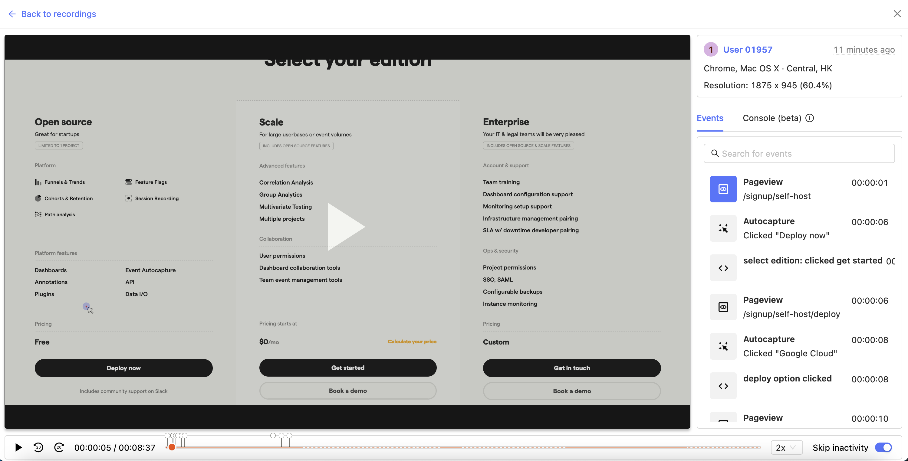
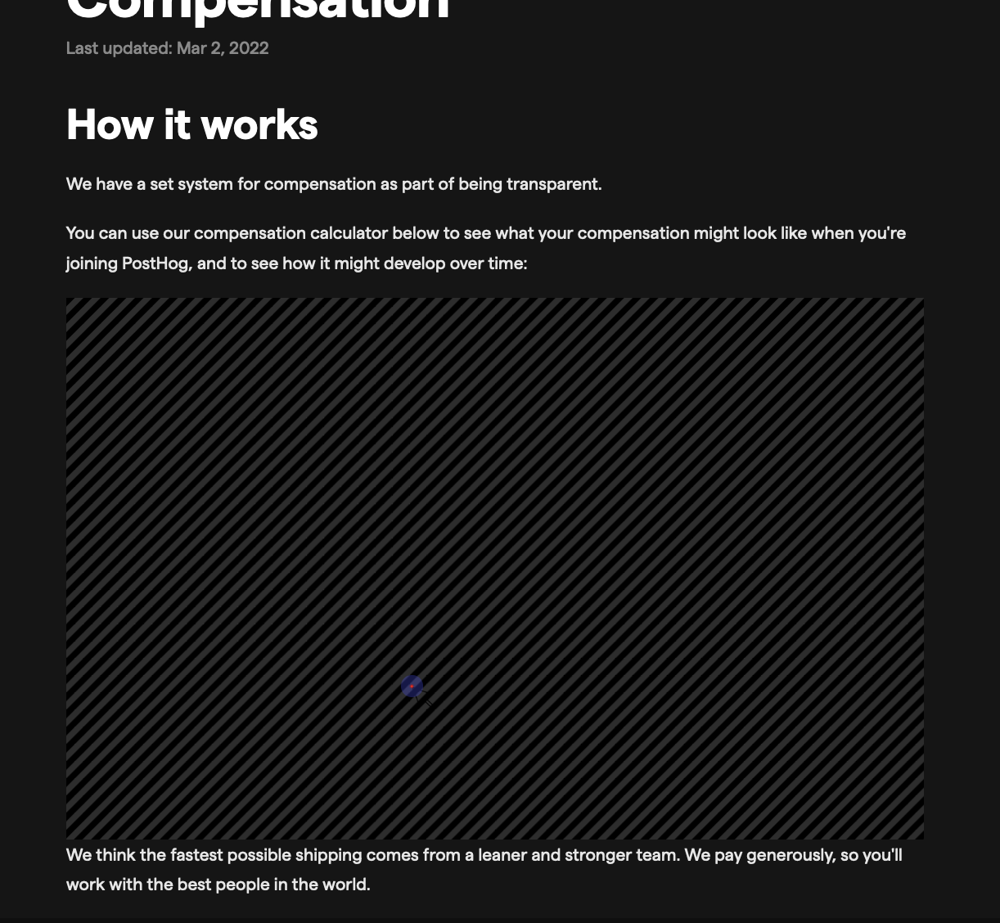

<FeatureAvailability allPlans />

The Recordings (or Session Recording) feature allows you to record users navigating through your website and play back individual sessions to watch how real users use your product. There are multiple use cases for this:

-   Troubleshooting bugs and UX issues: when a user runs into a problem, watch exactly what they did so you can reproduce and fix.
-   Obtaining qualitative information on your product: for example, when you notice a drop in conversion, watch recordings to understand the **why** of users dropping.
-   Understanding detailed interactions with your product so you can improve it.
-   ... and many more.

## How to enable

1. Add any URL where you wish to capture recordings to your Authorized URLs (`/project/settings#authorized-urls`) project settings. You can just add your entire domain (e.g. `myposthogapp.com`).
2. Go to your Project Settings (`/project/settings#recordings`) and enable Recordings.

A few things worth keeping in mind:

-   Recordings can **only be used** with our [JavaScript library](/docs/integrate/client/js).
-   In particular, this feature will not work with <b>Segment</b>, as Segment's SDK does not collect and send this data. _If you use
    Segment, you may want to add the PostHog library too (make sure to only send regular event data from one source)._
-   Recordings can also be toggled on and off in the JS library by setting the relevant [config](/docs/integrate/client/js/#config) attribute. This is useful if you want to enable/disable recordings conditionally based on custom conditions (e.g. only record a specific set of users). See [Further controls](#further-controls) for details on this.
-   Users who opt out of event capturing will not have their sessions recorded.

## How to watch

You can find relevant recordings in the following places:

-   The 'Recordings' page will contain a list of all recordings. Filter the list too to find particular recordings (e.g. recordings where an exception occurred).
-   Find recordings for a specific person by searching for them in the "Persons" page and then navigating to the 'Recordings' tab. Useful for troubleshooting particular issues for a user.
-   When figuring out why your users converted or dropped off on a funnel, you can click on any step or drop-off to find related recordings to the specific step or drop-off (e.g. watch what users did instead of converting).
-   For any other insight, you can always click on a specific data point and get a list of persons and recordings related to the data point.

### Playback experience



When watching recordings, here are some helpful things:

-   To make sure you focus on the relevant parts of a recording, you can change the speed as well as select the option 'skip inactive' - this will skip chunks of the recording where the user was inactive on the page.
-   You will see a list of events in the right side. This will include autocapture and custom events. If you're looking for an event in particular (e.g. `user signed up`) you can click on it to instantly jump to the point in time where the event happened.
-   The seekbar at the bottom acts as a timeline and shows pins where specific events occurred. Hover over each pin for details.
-   The seekbar shows a striped pattern when inactivity occurred and a solid pattern when activity occurred. If the pattern is red it means the recording has been buffered and loaded. If it's gray it means it's loading.
-   The top right hand side corner will include some helpful metadata on the recording like screen size, user details, browser & OS, and location (if you are on PostHog Cloud or have the GeoIP plugin enabled.)
-   Recordings you have watched will be shown grayed out. If you like to watch most or all the recordings for your users this will help you keep track.

## Billing

Billing for recordings is handled a bit differently than for regular events as a recording will include a lot of events. Billing is ...

In addition, if you have a credit card on file, you will always get <b>X recordings for free every month</b>.

## Additional configuration

### Ignoring sensitive elements

If recording your application may capture sensitive user information, you need to update your codebase to prevent PostHog from capturing this during session recordings.

To do so, you should add the CSS class name `ph-no-capture` to elements which should not be recorded. This will lead to the element being replaced with a block of the same size when you play back the recordings. Make sure everyone who watches recordings in your team is aware of this, so that they don't think your product is broken when something doesn't show up!

Additionally, when dealing with inputs, if you wish to still capture the input box but not its contents, you can use the class name `ph-ignore-input` instead.

Here's an example of how redacted elements show up in recordings.



### Recordings data retention

If you are on PostHog Cloud, recordings will be kept for <b>3 weeks</b>. We are working hard to enable the possibility of extending this.

If you are on self-hosted, depending on how your app or website is built, recordings can take a lot of disk space. To manage this, we have the following retention policy options in place.

-   By default, recordings are kept for 3 weeks and deleted afterwards with Clickhouse's <a target="_blank" href="https://clickhouse.com/docs/en/sql-reference/statements/alter/ttl/">Table TTL</a>.
-   If you wish to change this setting, you can easily do so with [Instance settings](/docs/self-host/configure/instance-settings). Just change the `RECORDINGS_TTL_WEEKS` setting to the number of weeks for which you wish to persist recordings.
    -   Please be mindful. If your Clickhouse storage is nearing capacity, you'll want to <b>temporarily increase your volume size before</b> updating the setting. Otherwise, the command can hang.

### Preserving recordings

We're working towards a solution for archiving and preserving recordings data for future reference. You can follow up on this [GitHub issue](https://github.com/PostHog/posthog/issues/2142).

### Further controls

If you want more granular controls, you can choose to enable session recording using [feature flags](feature-flags). This enables you to control session recordings based on users with certain previous events/actions or properties (or just to capture a percentage of all sessions).

To do this set `disable_session_recording` in our [JavaScript library config](/docs/integrate/client/js/#config) to `true`.

Then conditionally call the method `posthog.startSessionRecording` to enable it using the feature flag.

For example:

```javascript
    window.posthog.onFeatureFlags((function() {
        if (window.posthog.isFeatureEnabled("your-feature-flag")) {
            window.posthog.startSessionRecording()
        }
    })
```
