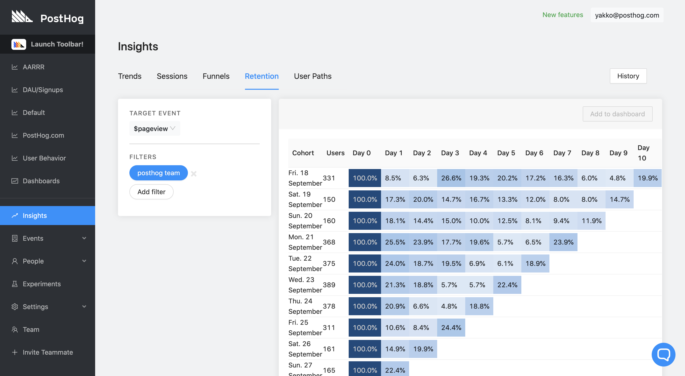
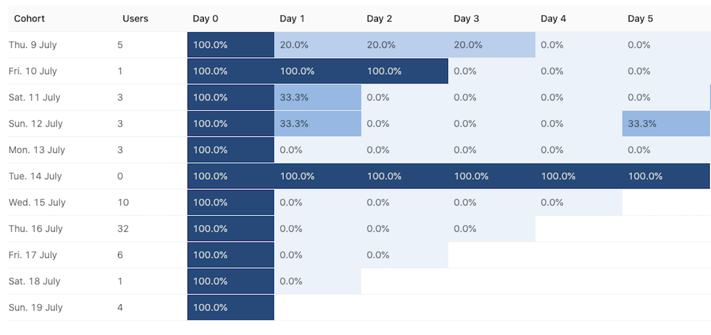

PostHog provides a Retention table to show you how many users return on subsequent days after visiting the website.

## Demo video

<iframe width="560" height="315" src="https://www.youtube.com/embed/VQhlkL6piKI" frameborder="0" allow="accelerometer; autoplay; clipboard-write; encrypted-media; gyroscope; picture-in-picture" allowfullscreen></iframe>

## Accessing Retention

1. Click 'Insights' on the left sidebar
2. Click the 'Retention' tab

## Understanding the retention table

The retention table is structured as follows:

#### Column 1: Cohort

The table starts from 11 days before the day you are viewing it, and each row is incremented by one day until "yesterday" (last row). 

For [Recurring Retention](#recurring-retention), the cohort is defined by the group of distinct users that performed the event on that time period. 

For [First Time Retention](#first-time-retention), the cohort is defined by the group of distinct users that performed the event _for the first time_ on that time period.

#### Column 2: Users

The number of users included in the cohort i.e. how many users visited your page on that day.

#### Remaining columns (3+)

The remaining columns are the ones displaying retention. Day 0 is the day represented under the column 'Cohort', so it will always be 100%. That's because all the users who visited your website on that day visited your website on that day! 

Now, the following columns will show you how many of the users who visited your webpage on the day marked under 'Cohort' came back and visited **again** on Day X.

Let's work through an example using the picture above to understand this concept better.

If I'm looking at the row for "Sun. 12 July", I can see that 3 users visisted the website on that day.

Then, the next day (Day 1), 33% of those users visited **again**. In other words, one of the distinct users who visited the website on the 12th also visited on the 13th. One of those users also visited once more on Day 5 (i.e. 5 days after the 12th -> 17th).

This tracks distinct users and is a great way to see how well you're retaining users. Do they come back often? Or do they just visit once? (More on this in the next section).

Finally, you should understand that the retention table is filled from the bottom up, in a queue-like manner. That means cohorts are added and removed on a First In First Out basis. They are added at the bottom of the table daily, and the first row (oldest) is removed from the top.

That's why your Retention Table's left edge will look like a set of stairs. For the last item (the day before the day you are viewing it), there is only one data point available. But as we go further "into the past", there are more data points because more days have passed. Thus, it is more useful to look at the values on the top of the table than the ones at the bottom, because they have more data points (days) available for analysis.

> **Note:** Users are distinct on each cohort, but not across cohorts. A user from the 12th who came back on the 15th will be represented in both rows.

## Uses

The Retention table is useful to determine if your users are indeed coming back to your website, and what percentage of them come back as the days pass. If your retention is too low, you may want to reconsider some of your design decisions. 

For instance, if you run a blog and your users barely come back after their first visit, they may have not been fond of the content, or they finished it all in one day! Nevertheless, you might want to do something about it so that you can make the visits from your users more frequent.

Products like email providers likely see very high rentention rates, since most people check their email daily. However, personal websites usually have low retention, since users can often go through all the information in one visit.

In conclusion, aim for high retention rates! And we'll help you identify that with colors. The darker the cell, the higher the retention.

## Retention types

### Recurring retention

Recurring Retention counts a user as part of a cohort if they performed the cohortizing event on that time period, irrespective of it was their first time or not.

### First time retention

Rirst time retention cohortizes users based on when they did an event for the first time, rather than adding a user to each cohort they had the event in.

## Retention events

### Cohortizing event vs. retaining event

The _cohortizing event_ is the event that determines if the user is a part of a cohort or not (i.e. adds the user to the first column). The _retaining event_, on the other hand, is the event retention is being calculated on (i.e. adds the user as a data point to one of the "percentage boxes").
