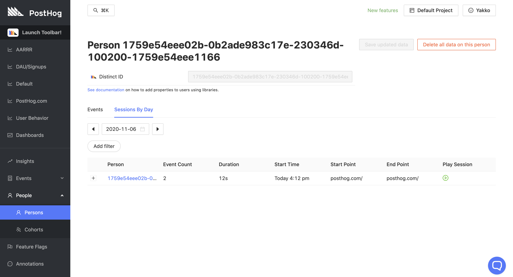

> **Important:** Our session recording functionality is still in **Beta** mode. Please report any issues you find [on GitHub](https://github.com/PostHog/posthog/issues). 

Session recording allows you record users navigating through your website and play back the individual sessions to watch how real users use your product. 

## Using session recording

Session recording can only be used with our [JavaScript library](/docs/integrate/client/js) and requires the feature to be enabled in PostHog's Project Settings (`project/settings`). Once enabled, the JS library will start recording sessions by default.  

Session recording can be toggled on and off in the JS library by appropriately setting the [config](/docs/integrate/client/js/#config). Users who opt out of event capturing will not have their sessions recorded.

To watch sessions, you can either visit the 'Sessions' page in PostHog ('Events' -> 'Sessions'):

Or go to an individual user page and select 'Sessions by day':

As shown in the screenshots above, sessions that were recorded have a green play button available on the 'Play Session' column, which opens a modal where you can watch the session.

When watching sessions, you can change the speed as well as select the option 'skip inactive' - this will skip chunks of the recording where the user was inactive on the page. 

## Ignoring sensitive elements

If recording your application may clead to capturing sensitive information on your users, you need to update your codebase to prevent PostHog from capturing this during session recordings.

To do so, you should add the class name `ph-no-capture` to elements which should not be recorded. This will lead to the element being replaced with a block of the same size when you play back the recordings. Make sure everyone who watches session recordings in your team is aware of this, so that they don't think your product is broken when something doesn't show up!

Additionally, when dealing with inputs, if you wish to still capture the input box but not its contents, you can use the class name `ph-ignore-input` instead.

