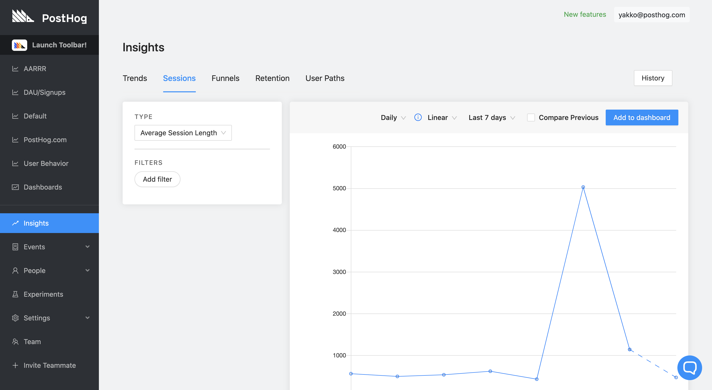
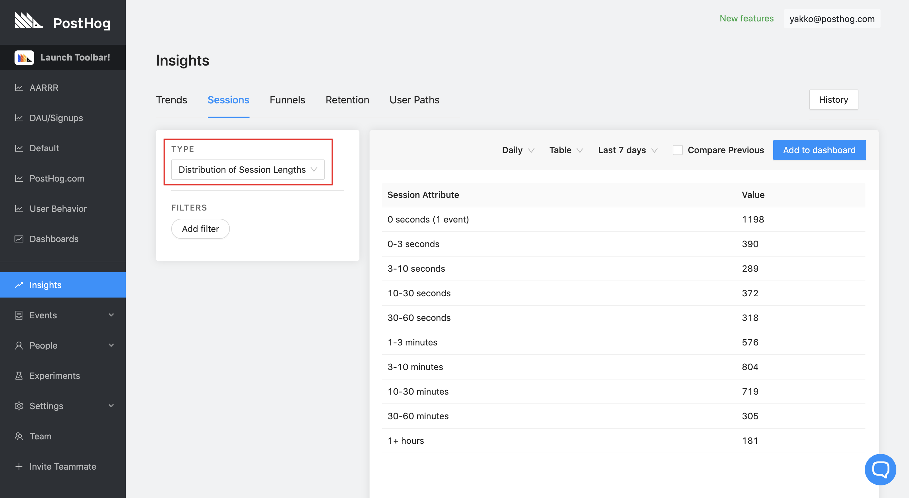

<blockquote class="warning-note">
We are currently evaluating the possibility of sunsetting this feature for the time being. We do have plans to eventually reintroduce fully supported session-based analytics to PostHog. Read more <a href="/blog/sessions-deprecation">in this blog post</a>, and <a href="/slack" target="_blank">reach out</a> if you have any thoughts.
</blockquote>

Sessions help you understand product usage by uncovering the amount of time users spend on your app or website.

This is useful as it gives you an engagement statistic of how long the average usage time of your app or website is along with the distribution of usage across certain time frames.

## Demo video

<iframe width="560" height="315" src="https://www.youtube.com/embed/LzrKZpMuONs" frameborder="0" allow="accelerometer; autoplay; clipboard-write; encrypted-media; gyroscope; picture-in-picture" allowfullscreen></iframe>

## Accessing sessions

1. Click 'Insights' on the left sidebar
2. Click the 'Sessions' tab

You can now see the 'Average Session Length', by default this will be over the last 7 days.

### Average session length

Average Session length takes the total number of sessions completed within the selected timeframe and the average duration of those sessions, you can change the interval to a date range by selecting the dropdown next 'Last 7 days' next to 'Add to dashboard'

You can filter average session length by the same properties as you any other feature in 'Insights'.

### Distribution of session lengths

Distribution of session lengths breaks down the total sessions in the selected time frame by a select number of time intervals raning from 0 seconds (in which only 1 event occurred during the session) to 1+ hours.

You can filter average session length by the same properties as you can in 'Trends'

## How are sessions calculated?

Sessions are calculated as soon as an event is recorded by a user, they end once there has been 30 minutes of inactivity.
