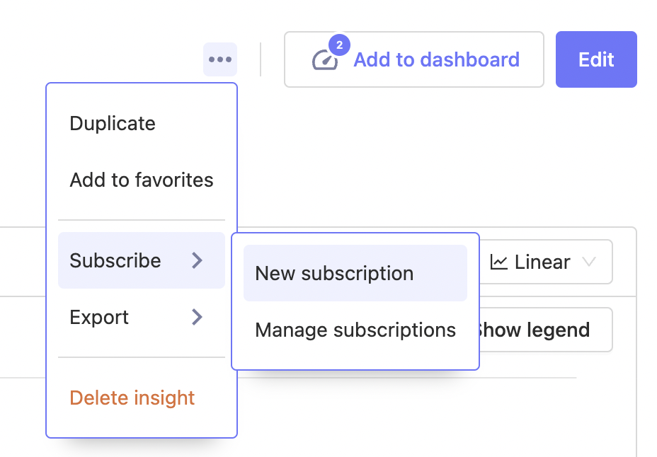

<FeatureAvailability availablePlans={['standard', 'enterpriseCloud', 'startup', 'scale', 'enterprise']} />

You can create a Subscription for any Insight or Dashboard in PostHog to receive regular reports.
 
## Email Subscriptions

> 🚧 **For Self-hosted plans, you need to have configured the SMTP Email settings in [instance settings](https://posthog.com/docs/self-host/configure/environment-variables#instance-settings).

From any Insight or Dashboard, you can create and manage subscriptions via the dropdown menu at the top right.

