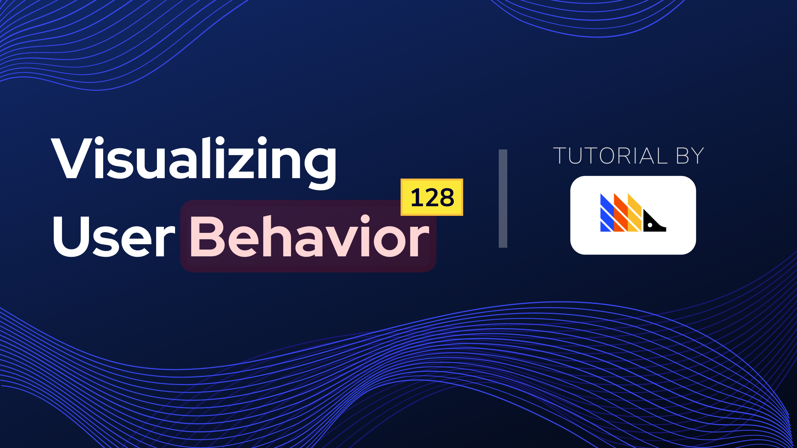
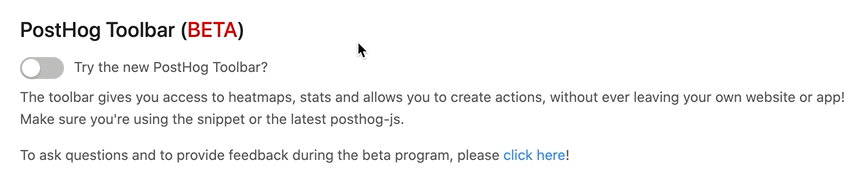
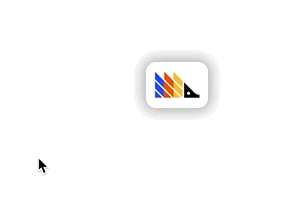
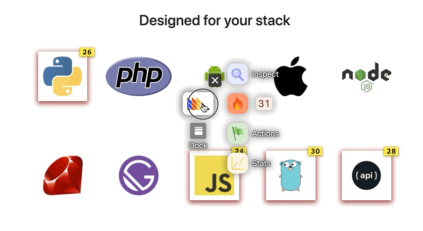

## PostHog Toolbar (Beta)

The PostHog Toolbar is a feature that we are especially excited about. We learned a ton about our product and website within minutes of trying it out for the first time.

In simple terms, the Toolbar is like 'Inspect Element' on Dev Tools, but for user data.

When enabled, the Toolbar will appear on your website (only for you, of course!) and you will be able to seamlessly interact with the elements on your page to create Actions, get information about the most frequently triggered events, visualize statistics, and much more! 

## Learning Resources

### Demo Video

<iframe width="560" height="315" src="https://www.youtube.com/embed/LD5TsEs5G-o" frameborder="0" allow="accelerometer; autoplay; clipboard-write; encrypted-media; gyroscope; picture-in-picture" allowfullscreen></iframe>

### Tutorial

[Visualizing User Behavior with the PostHog Toolbar](/docs/tutorials/toolbar)

 

## Uses

Our Toolbar is a versatile feature that allows for:
 

### Inspecting Elements

Inspecting elements with Dev Tools is a bit of a messy experience. With the PostHog Toolbar, you are able to get the `class` and `id` of an element much faster and without any extra noise. Click the element to inspect and you'll have access to everything you need to know about that element.
 

### Visualizing the Interactions Ranking

Easily see the ranking of which parts of the page your users are interacting with the most:

 

### Create Actions

Inspect an element, see how often it has triggered an event, and immediately create an action with that data.

Having to flip back and forth between multiple pages hinders our decision-making process. With the Toolbar, everything you need to tailor your analytics is right in front of you: your website, the user data, and the functionality to create an action.
 

### Statistics

Learn more about how users interact with your webpage. Coming soon!
 

## How to Use the Toolbar
 

#### Step 1: Go to your setup page and switch it on:

This little buddy will appear over your website, only if you are logged into PostHog (again, it will **NOT** appear for your regular visitors):

Once authenticated, hover over him to get started!

## Fair Warning: It's BETA! Really!

The toolbar is now in public Beta! No, not "Gmail Beta", **real** BETA! There's still a lot of work to be done ([follow along here!](https://github.com/PostHog/posthog/projects/7)). It **will** feel like a bumpy ride on an unpolished road, *especially* when you click the mysterious "dock" icon! 👀

However, as we already found so much value in using this toolbar ourselves, we felt it was ready to share with you all! 

When you're trying it out, please raise all issues that you find [here](https://github.com/PostHog/posthog/issues/1129)!
