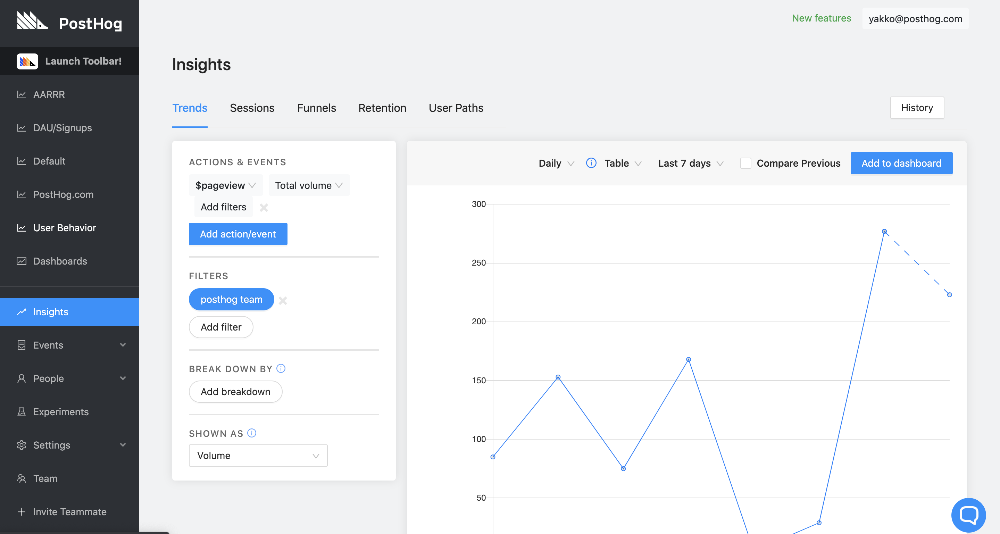
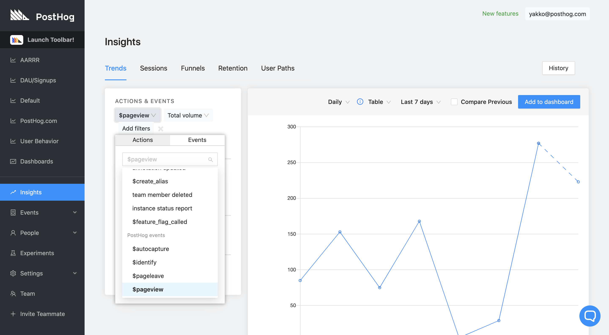
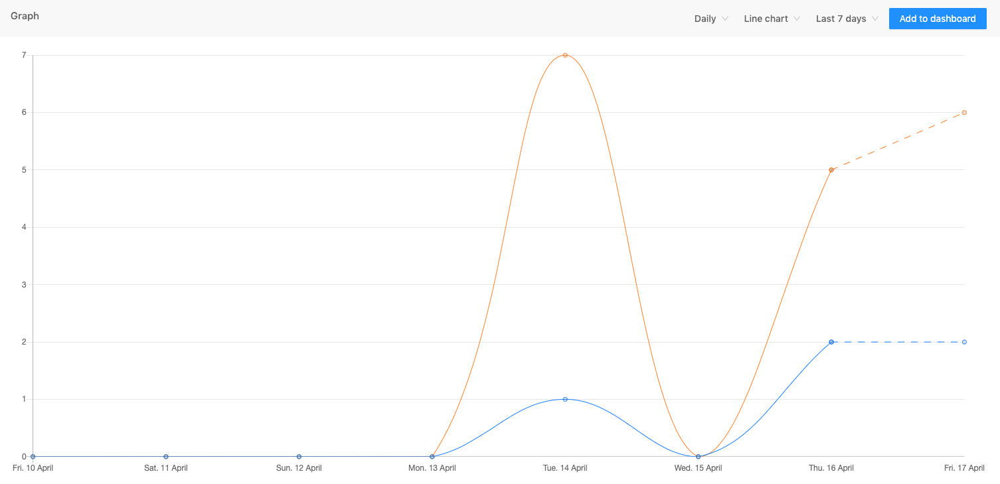
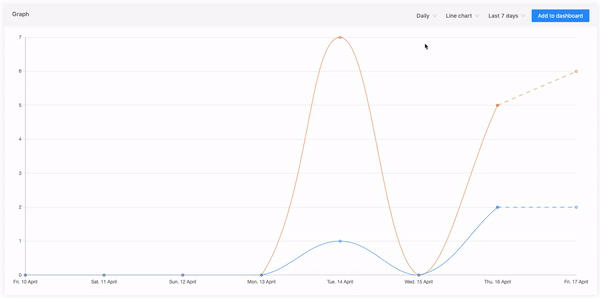
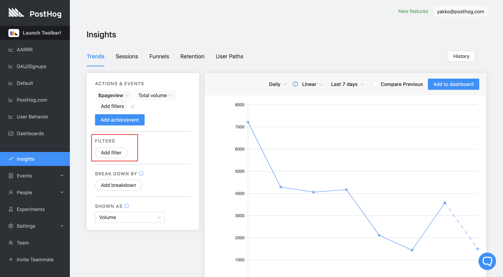
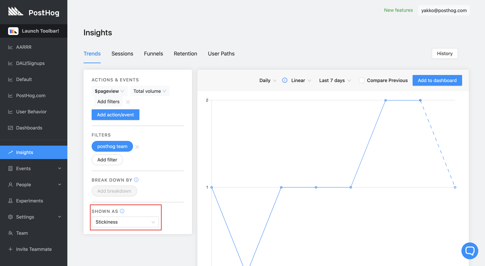

Trends are a very powerful way to visualize how actions or events are varying over time.

These are useful for monitoring which parts of your products are being used repeatedly, how usage is changing as well as the engagement levels of your users.

## Demo Video

<iframe width="560" height="315" src="https://www.youtube.com/embed/kyGgDbNQto4" frameborder="0" allow="accelerometer; autoplay; clipboard-write; encrypted-media; gyroscope; picture-in-picture" allowfullscreen></iframe>

## Accessing Trends

1. Click 'Insights' on the left sidebar
2. Click the 'Trends' tab (default)

 

## Using Trends

Select the actions or events you want to see trends of in the menu:

You can now see the trend in these actions over time.

 

Dotted lines show data collected so far but that which is not determined by the time interval selected.

## Trend Filtering

There are a few ways to filter this information.

- Date range
- Time interval
- Graphical Display
- Property

Date range, time intervals, and the graphical display can be changed at the top of the graph.

The date range can be selected as an actual date range or common time intervals like the last week or the last 90 days, the graphical display can be displayed as a line chart, table or pie graph. 

Depending on your segmentation and other filters not all graphical displays will be available.

Time intervals can be by the minute, hour, day, week or month.

 

Filtering by property can be selected underneath the actions or events you have selected. 

### Filtering Trend graphs by Active Users 

When selecting actions or trends PostHog will display the total count of those actions or events. 

You also have the option to filter this by active users, which will give you a count of unique users who have completed that action/event instead of the total count. 

Click on 'Total Volume' next to the selected event or action to reveal a dropdown menu where you can select 'Active Users', as well as:

* Sum
* Average
* Minimum
* Maximum

## Trend Segmentation

It is possible to segment the data using the ‘Breakdown by’ menu. This allows you to see how trends in Actions vary by the Event properties.

This segmentation has many use cases.

For example, one of the Event properties is the UTM tags – which allows you as a marketer to understand exactly how different ad campaigns are performing.

Another example is that as a product-person, you can see if different devices or different browsers affect usage. Maybe people using your web-based application on mobiles are generally inactive because the interface is hard to use:

 

You can filter the event data too, based on the Event property. This means instead of breaking out more lines or rows in the table, you can just display the exact Action trends you care about when the Event property is something specific.

You can also use this at the same time as the ‘Breakdown by’ option.

### Trend Segmentation by Event Property

For example, if you ran a movie streaming service, you could monitor ‘Play button – clicked’ for just one movie at a particular URL.

### Trend Segmentation by Stickiness

Trend graphs will show numbers by volume as default, it is possible to show this as stickiness. Instead of the total number of times this action had been completed it will chart the graph as the number of consecutive days a unique user has performed that action. This will allow you to optimize for repeatable actions. 

To do this, select 'Shown As' and click 'Stickiness'.

 

This pairs nicely with [Retention](/docs/user-guides/retention), which is essentially a stickiness metric that is date-specific. In other words, trend stickiness does not care about when an action or event happened, just about what happened on the following days after the first time. Retention, on the other hand, is measured specifically based on when a certain event happened.

 

### Trend Segmentation by User

When in trends, you can click on data points to reveal a modal with a table of all the unique users that make up that data. 

This way, you not only have access to the aggregate values, but can always inspect further and determine what users compose each data point.

