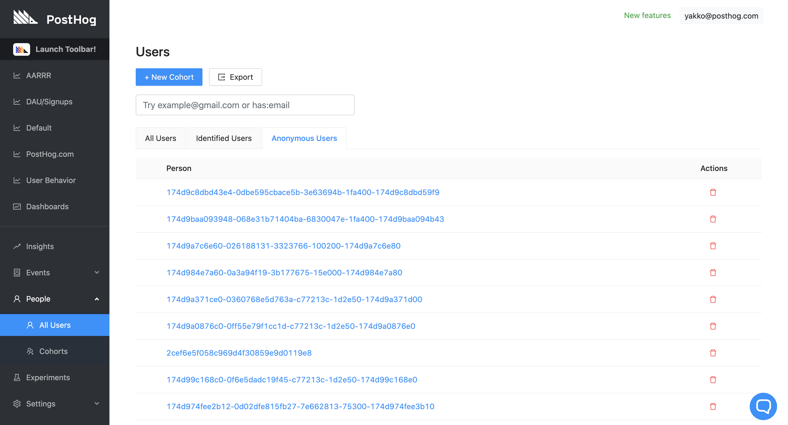
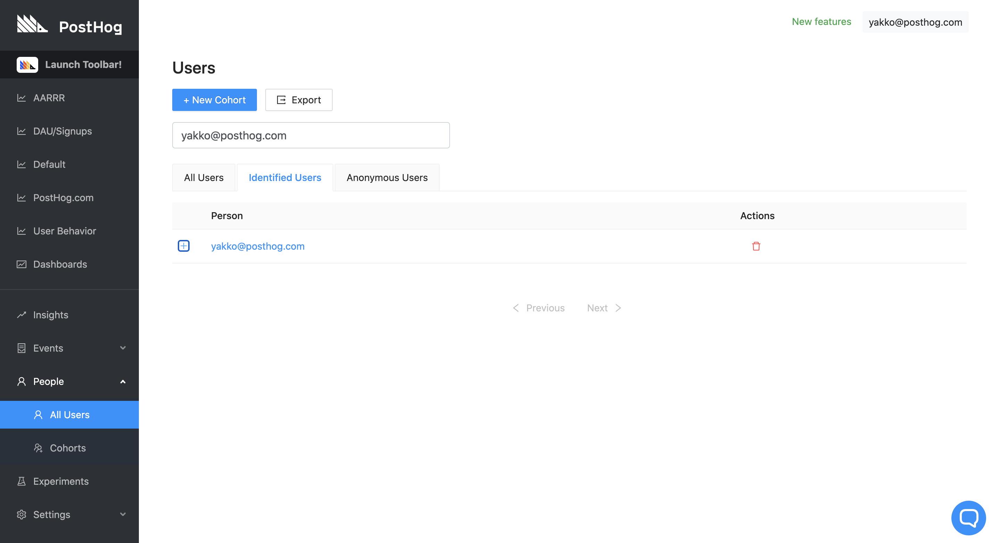
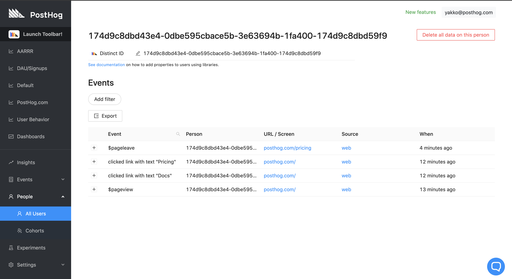

PostHog tracks user behaviour, whether or not the user is logged in and identifiable.

A short video on Users can be found [here](https://youtu.be/8_SsZW1v56Q);

## Demo video

<iframe width="560" height="315" src="https://www.youtube.com/embed/GtSSxmOdyk4" frameborder="0" allow="accelerometer; autoplay; clipboard-write; encrypted-media; gyroscope; picture-in-picture" allowfullscreen></iframe>

## Viewing user list

Click on 'People' on the left-hand navigation. This will open a submenu containing 'All Users', like so:

 

If you have added properties to your users, these will also appear here. 

For instance, if you have set an email, we will display that instead of the randomized Distinct ID:

Clicking the '+' button next to the user will show all of that user's properties. 

## User history

Clicking on an individual user brings up their entire event history, as well as their properties:

You can go even deeper by inspecting each event individually. Clicking on the event will bring up all the event properties. 

## Deleting user data

You can also delete data on a user with ease. This can be done if you have created data by yourself for testing purposes or if a user asks you to do so.

When in the user history you can select 'Delete all data on this person'. This will delete all information on that user permanently.
