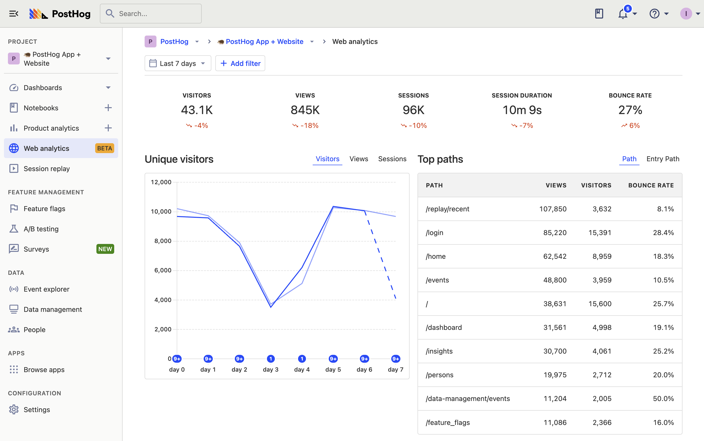

> Web analytics is currently an [opt-in public beta](/docs/getting-started/enable-betas). This means it's not yet a perfect experience, but we'd love to know your thoughts. Please [share your feedback](http://app.posthog.com/home#supportModal) and [follow our roadmap](https://github.com/PostHog/posthog/issues/18547).

Web analytics enables you to easily track and monitor many of the most important metrics for your website. 

Unlike product analytics, web analytics offers a more streamlined and focused experience. This is especially useful for marketers, content creators, or anyone used to tools like Google Analytics. It includes a dashboard that offers essential metrics, such as visitors, views, sessions, session duration, bounce rate, paths, referrers, and more.

## Get started with web analytics

Getting started is a simple three-step process.

### 1. Install PostHog on your website

Follow the [installation instructions](/docs/product-analytics/installation) to setup either the JavaScript snippet or the JavaScript Web SDK for the website you want to track.

> [Single page apps](/tutorials/single-page-app-pageviews) might require you to manually implement `$pageview` and `$pageleave` event capture for every navigation change. See our tutorials on how to do this in [React](/tutorials/single-page-app-pageviews), [Next.js](/docs/libraries/next-js#client-side-setup), [Vue](/docs/libraries/vue-js#capturing-page-views), and [Svelte](/tutorials/svelte-analytics#capturing-pageviews-and-pageleaves).

### 2. Enable the web analytics beta

In PostHog, click your profile icon in the top right and then click "Feature preview." In the [feature preview modal](https://app.posthog.com/home#panel=feature-previews), enable "Web Analytics Dashboard"

### 3. Go to the web analytics dashboard

Now, you can click the newly added [web analytics tab](https://app.posthog.com/web) to go to the dashboard.

## Filtering your dashboard

Like other dashboards in PostHog, the web analytics dashboard is filterable. This means you can filter for data with certain event or person property values. Options include browser, path name, device type, country, and UTMs. Just click the "Add filter" button next to the date range at the top of the dashboard.

This enables you to dive into specific stats for regions, parts of the site, and specific marketing campaigns. 

For more complex queries, you can still use the product analytics tab as usual.
