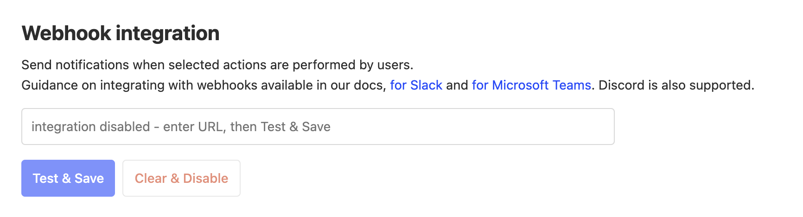
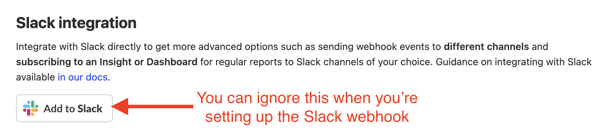
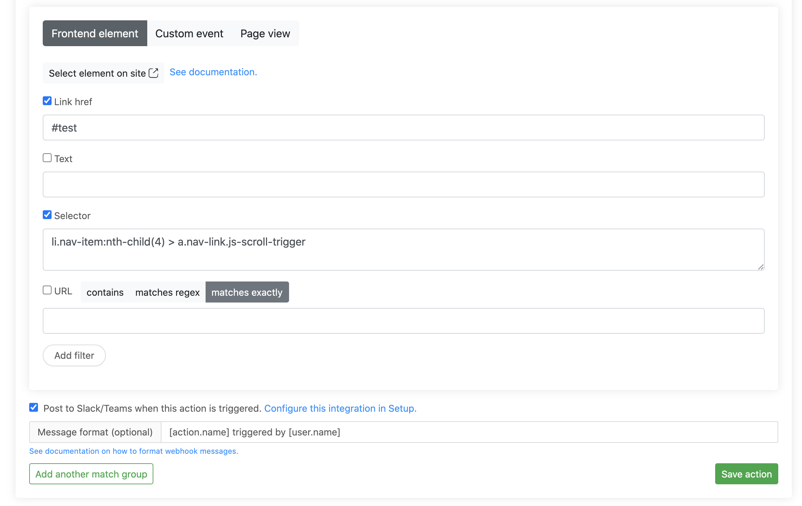
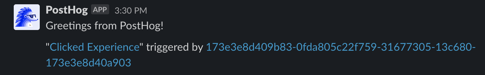

You can receive messages in Slack whenever your [actions](/docs/user-guides/actions) trigger. 

> **Note:** Currently it's only possible to receive messages in a single Slack channel. If you'd like to receive messages in more than one channel, you can use the [Zapier integration](/apps/zapier-connector).

## 1. Create an app in Slack
Go to the [Slack developer dashboard](https://api.slack.com/apps?new_app=1) and create a new app. Call it "PostHog" and connect it to the workspace of your choice.

Optional: Feel free to use an image from [here](/media) as the app's logo.

## 2. Create a webhook in Slack
Go to the 'Incoming Webhooks' page for your newly-created app and toggle 'Activate Incoming Webhooks' to turn it on. Then click on 'Add New Webhook to Workspace' and select the channel that the action posts to.

## 3. Connect your webhook to PostHog
Copy the Webhook URL from Slack, navigate to [project settings](https://app.posthog.com/project/settings) in PostHog, and paste the URL into the "Webhook integration section".

Click "Test & Save" and you should receive a message on Slack. 

> **Note:** In your project settings, you'll also see a "Slack integration" section. You can ignore this as this is not required for setting up the Slack webhook. It's only required for setting up [Subscriptions](/docs/data/subscriptions) to receive regular reports for any insight or dashboard.
> 
>  

## 4. Post actions to the webhook

In PostHog, navigate to the [action](https://app.posthog.com/data-management/actions) that you'd like to receive webhooks for. Then select "Post to webhook when this action is triggered". You can also modify the [message format](/docs/webhooks#message-formatting).

## 5. Celebrate!

