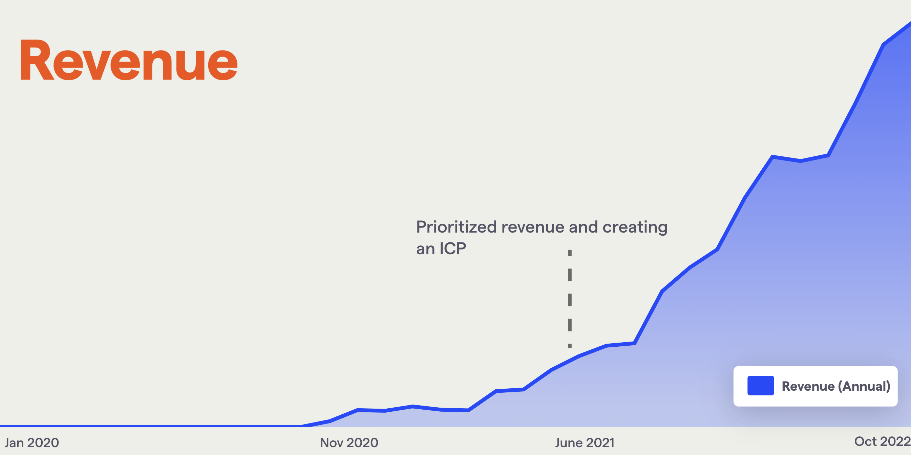

Creating an Ideal Customer Profile is one of the most important things we've ever done at PostHog.

You can see it in our revenue growth:

I _wish_ we had run this exercise sooner.

## Why should you care?

If the revenue chart isn't compelling enough, knowing very specifically the users you are building for, makes everything better.

These are all example decisions we've taken because of having a clear ICP:

**How do we describe what our company does?**
- We're [feature-focused versus benefit focused](/blog/features-sell) in our language because our users self serve and we don't go heavy on enterprise sales

**What should our website should look and feel like?**
- We are happy including code snippets

**What's our pricing model?**
- Transparent, self serve

**How do we generate demand, which marketing channels should we prioritize, and how do we use them?**
- We have no outbound sales
- Word of mouth growth by not spending too much outside of the product
- Useful, detailed content works well

**How do we position against competitors?**
- We add features developers will want that our competitors won't
- We can build a brand around being for developers

**How do we prioritize new features versus bugs?**
- We've found technical users have a higher bug tolerance _if_ we are very fast and communicative when a user finds one

**Which new features do we prioritize?**
- We're shipping features technical people want, like SQL access rather than tools for marketing reporting
- We focus on companies that have product market fit, which means scalability and data accuracy matter

## How we did it

> I'm going to assume you're building a SaaS product for paying users. You can apply these principles to other stuff as you see fit.

We had quite a bit of demand for a paid product last summer. We already had a large open source community, and we listed a paid product on our website – every week we were getting quite a few people asking about it. 

Whilst you may not have such an advantage, the same thing applies if you're having lots of outbound sales conversations and struggling to close deals consistently.

We had a rough idea of the features, we weren't 100% sure which customers to focus on or how to price it. To help, we created a list of very specific things that we felt _could_ be part of our ICP.

These were _needs_ and _haves_ that our customers had in common. Things like:

* Have they used one of our free products successfully?
* Have they got customers?
* Do they have a centralized data team?
* Is engineering making the purchasing decision?
* Do they have a data warehouse?
* Do they need to control their data?

Note, we didn't include things like industry, or revenue. We felt these are proxies and somewhat vague. For example, healthcare companies usually need to control their data, but it's the need to control data that is important.

## Track bad customers that don't buy too

We then looked at _every_ customer and how they got on. Tracking customers that never bought anything was jut as useful as tracking those that did.

We scored each customer on our big list of needs and haves. When we looked at the differences between those that bought and were successful versus those that dragged along or maybe bought and had less success, our ideal customer profile became very obvious.

## 5 reference customers

You should focus _completely_ on your ICP. That's the point. Everything else comes from it.

Hence, defining it was the only thing that mattered to us at the time.

We set a goal for the entire company of getting 5 reference customers. In the weekly all hands, we'd run through who was trying to buy from us, and what they needed, until we had 5 customers paying list price, delighted with us and using the product intensively. 

We'd rapidly change priorities and ship based on our aggregate view of everyone trying to buy things from us. This is exactly where having too many people at a startup, ahead of product market fit, causes you to struggle – it's harder to adapt like this.

Once that was done, we quickly had hundreds more.

## Dealing with pricing

At first, we had to make up pricing. We priced similarly to others.

As we sold some deals, and failed to sell others, we started [modifying pricing](pricing-lessons) to fit our specific users and go to market more specifically. In our instance, that meant going [transparent](transparent-enterprise-pricing) and self serve (eventually) with our pricing, and charging on usage with a generous free tier.

## How we're evolving this

So far, we've identified ICPs at a _company_ level. As we're getting more sophisticated, we're doing it at an _individual_ level. We want to have a set list of stakeholders we aim to delight, so we are clearer on those _within_ our ICP we're shipping for.
