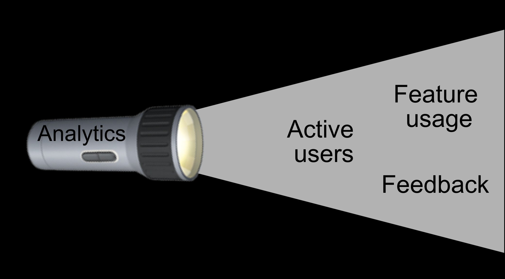
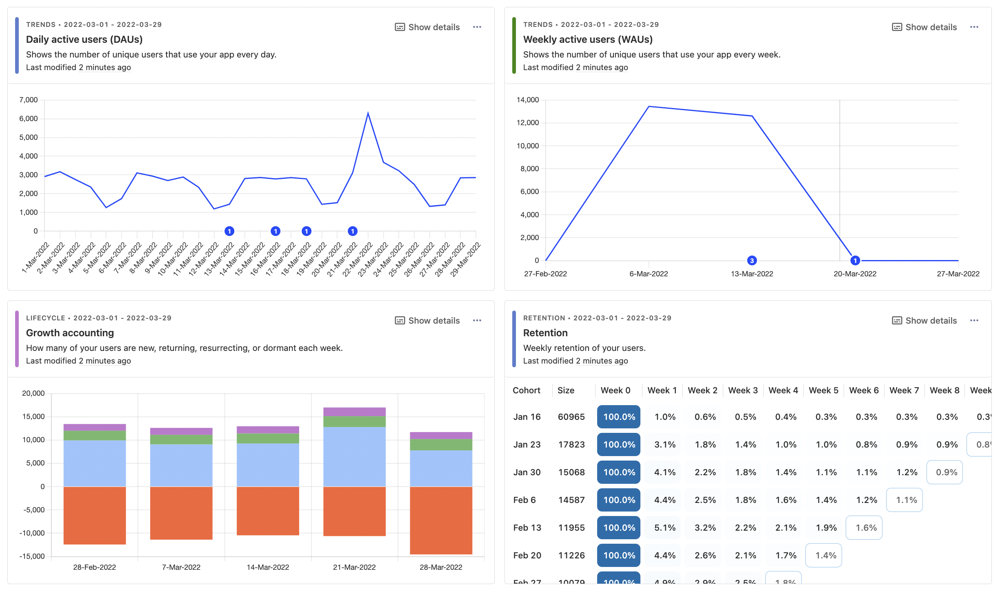
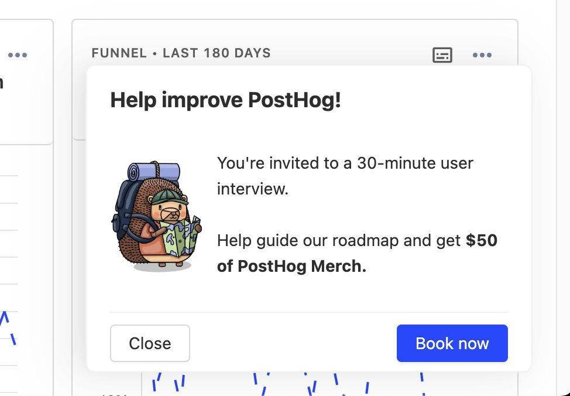

Building a startup is like trying to find the exit of a dark cave. Sometimes you hear sounds leading you somewhere, but it's mostly dark and hard to understand. In this cave, analytics is like a flashlight. It doesn’t automatically point you to the exit, but it shows you where you're going. You stumble less and spend less time moving in the wrong direction.

Our team works with a lot of high-growth startups (they are [our ideal customers](/handbook/strategy/ideal-customer-persona)). We succeed when they succeed. We know from experience that understanding your users is a vital part of finding early success, and you can't do that without analytics. Here we explain how to use analytics effectively at an early stage.

## Why do analytics matter for startups?

As a simple example, product analytics show you whether your users are actually using your product. Not just "oh yeah, I’ll check it out," but seeing if they are logging in, using the features you developed, and most importantly, returning to use them again. Analytics show what areas they are finding value in, what needs to improve, and what is broken.

From this usage, you can begin creating insights to help you track [key product metrics](/blog/b2b-saas-product-metrics) like traction, engagement, active users, revenue, and feature usage. Without this, you rely heavily on anecdotal evidence. You simply want to see these numbers go up and to the right, there’s not a lot of deep analysis needed here. If the metrics aren’t moving in the right direction, it is a sign to change.

And startups are defined by change. They're all about testing, rapid feedback, and constant improvement. Real usage analytics is the most rapid feedback there is, so starting early is a competitive advantage you shouldn't miss.

For example, we at PostHog use analytics to track OKRs, debug issues, test new features, discover opportunities, and more. To narrow in on OKRs, every team connects them to analytics:

- Team session recordings have "percentage of users per organization viewing recordings"
- Team product analytics have "top 10 US & EU clients 95th percentile of dashboard load time is under 5 seconds"
- Team experimentation have "double the number of organizations that use feature flags"

These metrics provide clear, rapid feedback on whether what we are building is valuable and making a difference. Without this, we would spend more time directionless and building features that might not matter to our users.

## The 80/20 of early-stage startup analytics

As much as we value analytics, we believe the best way to create a successful startup is to spend time building a better product, not obsessing over data. To ensure you have time to build, here's what we recommend to get the most benefit from analytics in the shortest time.

### 1. Set up and watch session recordings

Session recordings are the most useful analytical tool for early-stage startups. They help you learn exactly how early users are using your product, uncovering usage patterns, obvious failure modes, and unexpected behaviors. In other words, big problems.

PostHog includes 15k monthly recordings for free – more than enough for any early-stage product. Just include the [snippet or library](/docs/integrate) in your app and turn them on in project settings. Once done, you get a steady stream of session recordings (if you have users) in your PostHog instance. 

To maximize your problem-solving potential, add [Sentry](/docs/libraries/sentry) and connect it to PostHog to monitor errors. When Sentry captures an error, the PostHog connection links the session recording. The recording becomes the re-creation steps that make squashing bugs and fixing issues easier.

Session recordings replace number-crunching, database querying, and user testing to give you the details on the good and bad of your product fast.

### 2. Build a key metrics dashboard

A key metrics dashboard is useful for validating that users are actually using the product. This keeps metrics like signups, pageviews, and key feature usage all in one place for the team. Using one of our [pre-built templates](/templates) helps you set this up fast.

It's probably too early to start optimizing your conversion funnel or set up a [dashboard like AARRR](/blog/aarrr-pirate-funnel), though. It encourages premature optimization, or worse, hides bigger problems (like no one wanting your product). A key metrics dashboard strikes the balance between being useful and overanalyzing. 

PostHog's snippet or library [autocaptures](/docs/data/autocapture) the metrics you want, like pageviews, button clicks, and inputs without additional setup. We then offer a [template for a product analytics dashboard](/templates/product-analytics), and our insights make it easy to customize it to work for you. With PostHog, none of these tasks require a lot of work, and you can get back to building.

### 3. Gather feedback and talk to users

Metrics give an overview of the usage of your product, but nothing beats [talking to users](/blog/making-something-people-want). Session recordings and metrics dashboards show you what users are doing, but they can’t tell you how they are feeling or what they are thinking. You must actively ask users for this information, and setting up mechanisms to do this helps it happen more.

This means both asking for written quantitative feedback and booking user interviews. Organizing both take can take up lots of time. Luckily, PostHog has apps for both ([user interview](/apps/user-interview), [feedback](/apps/feedback-widget)). These apps connect to product data through feature flags and can display for a selection of users or after the use of specific features.

### 4. Monitor key actions and trigger processes

Once analytics, dashboards, and a process for getting feedback from users are in place, you can begin to leverage analytics in your business processes. This means triggering a process like reaching out to potential customers on signup or helping high-value users when they have trouble with a specific feature.

The analytics become a part of your business processes. PostHog helps this happen by enabling an action to trigger a webhook. This webhook can then connect to services like Zapier, [Slack](/docs/integrate/webhooks/slack), and [Discord](/tutorials/how-to-connect-discord-to-posthog-with-zapier) to trigger your team to reach out, update settings, offer support, or other processes.

## The balance of early-stage startup analytics

Analytics at early-stage startups is a balance. You need just enough information to know what to build next, without getting bogged down in overanalysis. Follow these steps and you'll have built an efficient flashlight to find your way to product-market fit. If this sounds helpful, [sign up for PostHog for free](https://app.posthog.com/signup).
