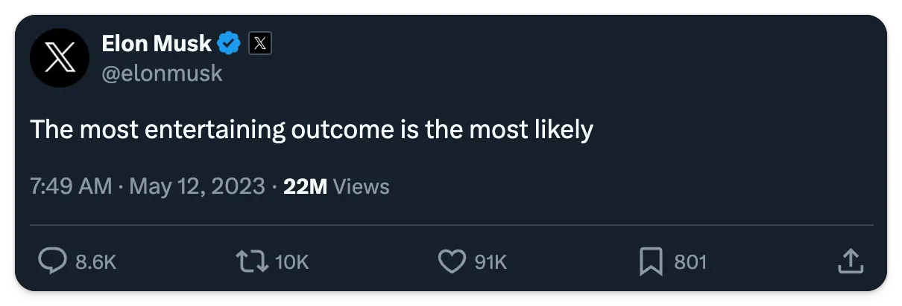

Elon Musk is many things. Erratic. Uncompromising. A prolific shitposter.

But, when I read Walter Isaacson’s biography of him over Christmas, one thing struck me above all: how practical his underlying businesses are.

Despite his wild ambitions to colonize Mars and revolutionize the automotive industry, there’s a strand of pragmatic business philosophy that any founder can learn from.

**This week’s theme is:** Learning from Elon

> This post was first published in our Substack newsletter, [Product for Engineers](https://newsletter.posthog.com/). It's all about helping engineers and founders build better products by learning product skills. We send it (roughly) every two weeks. [Subscribe here](https://newsletter.posthog.com/subscribe).

## 1. Be in the details, not the day-to-day
Elon attends very detailed design review sessions for the major projects he cares about – e.g. sessions to design a robot’s hands. But he also has 30+ direct reports, way too many to be across the day-to-day of everything.

As CTO and CEO, Tim and I are trying to work like this more and more. We aim to go deep on the projects we can help out on, and “build the org” to cover the daily execution of things like ops, marketing and customer success.

> **Takeaway:** Giving away some responsibility means you can add more value to the things you’re uniquely good at, stay motivated, and avoid micromanaging. [Making your first ops hire](/founders/first-ops-hire) is a key part of this journey.

## 2. Take fun seriously

Fun is undervalued in startup lore and Elon [clearly gets a kick out](https://www.youtube.com/watch?v=rWdavYiwh0I) of what he does, even if some of his weirder projects don’t work out!

Making decisions based on what we find fun and interesting has lead to remarkable things happening with our website, marketing, customer success, and product.

It’s also directly influenced one of our most important decisions: ceasing to monetize our self-hosted product.

We invested a great deal in making it work, but we eventually realized:

It was a worse business model.

We didn’t enjoy it.

We didn’t enjoy the sales process, and we didn’t enjoy debugging other people's infrastructure. Lifting those burdens instantly made PostHog more fun and forward-looking.

> **Takeaway:** The easiest way to fail is to simply lose interest. When we made that decision, we optimized for what would keep us and our team motivated in the long term. We optimized for (meaningful) fun.

## 3. When artificial deadlines do (and don’t) work

Elon is famous for creating urgency by setting unrealistic artificial deadlines – e.g. moving the 500k unit target for the Model 3 forward by two years.

This clearly works for him – see Tesla and SpaceX as evidence. In the software space, Supabase does something similar with its [launch weeks](https://supabase.com/blog/supabase-how-we-launch).

We tried this approach, but it didn’t work. We think it’s because:

1. **We hire intrinsically motivated people** because our goals and culture don’t work without them. The kind of people who [truly love building](https://newsletter.posthog.com/i/141291244/a-genuine-love-for-building) don’t need an artificial deadline to motivate them.

2. **We (mostly) bias to experience** because we give people autonomy, but they’re more likely to have families and not want to work until midnight on weekends.

3. **Artificial deadlines generate more technical debt**, which slows us down in the long term. We grow by shipping, not by hiring salespeople, so optimizing for long-term speed is better for us.

> **Takeaway:** Artificial deadlines are great for focusing large organizations. In startups, I think you need to either be all in on working 28 hours a day, 9 days a week with mostly younger team, or build a smaller, more experienced team. Artificial deadlines work for the former, not the latter.

**Further reading:** [How we decide what to build](https://newsletter.posthog.com/p/how-we-decide-what-to-build)

## 4. Product drives sales and marketing

Elon has a very product-first approach – many of his companies build things so cool they generate an extreme word of mouth growth. Case in point, Tesla’s [laundry robot](https://twitter.com/elonmusk/status/1746964887949934958)!

PostHog isn’t as cool as a laundry robot, but we also grow primarily through word of mouth. Elon’s shown this is a winning strategy at scale because:

1. It’s more efficient than a sales/marketing-led model.
2. You can reinvest everything back into the product, cementing your advantage.

> **Takeaway:** Product-led doesn’t work for all startups, but the benefits are incredibly powerful. Tesla is a famously efficient business as a result. Its cars are class-leading, superb value, and very cool.

**Further reading:** [Startup marketing for noobs](https://newsletter.posthog.com/p/startup-marketing-for-noobs-by-noobs)

## 5. Enjoy the taste of your own blood

Clickbait subtitle. You got me.

Elon gives very direct feedback and makes painful decisions quickly. He doesn’t dwell on any of this stuff. He went through a [very public process to buy Twitter](https://www.nbcnews.com/business/business-news/twitter-elon-musk-timeline-what-happened-so-far-rcna57532), then [laid off 80% of the workforce](https://www.cnn.com/2023/04/12/tech/elon-musk-bbc-interview-twitter-intl-hnk/index.html), for example.

We describe PostHog as a team, rather than a family, for this reason. This means we let go of people we like for performance and culture fit reasons, and do so decisively.

It can feel brutal, but we try and balance this by:

1. Talking directly and honestly with people.
2. Avoiding dehumanizing performance improvement programs.
3. Paying generous severance (four months) to people we let go.

> **Takeaway:** Optimize for your strongest performers. If make it OK not to push hard, everyone will feel it and eventually leave or “quiet quit”.

## 6. Harder missions attract more talent
Elon’s companies are wildly ambitious. They attract some of the smartest people in their industries. Literal rocket scientists.

We’ve seen this, too. Early on, we were very fortunate to find really great people, but we were choosing from the very small pool. As our ambition has grown, so has the pool of talent we can hire from.

We now get hundreds, sometimes thousands, of applicants for every role. Engineers have noticed how challenging it looks to build a huge suite of products – we've [built eight already](https://posthog.com/) and have a [list of 30 more](https://newsletter.posthog.com/i/140404838/map-everything-your-users-want).

> **Takeaway:** Your ambition – and how you communicate it – can make all the difference. And, as we constantly remind people, [talent compounds](/handbook/values#6-talent-compounds).

**Further reading:** [What we’ve learned about hiring](https://newsletter.posthog.com/p/everything-weve-learned-about-hiring)

## 7. You still need a real business to get there

Wild ambitions aren’t invulnerable. They need to survive contact with the real world. SpaceX has a very futuristic vision, one Elon may not live to see, but their heads are firmly out of the clouds. SpaceX created a mission and then figured out a business model – shipping things into space for money – that could fuel the mission.

Many VCs will tell you to hire like crazy when you have [product-market fit](/founders/product-market-fit-game). We have product-market fit, but we don’t do this at all. We take pride in our individual products being real businesses – potentially profitable, with revenue, and sane margins.

> **Takeaway:** Your first job as a founder is to survive. Yes, that means raising money from VCs, if you need to, but never take your eye off the fundamentals. The era of cheap money is over, after all.

## Good reads for product engineers 📖

- **[The state of SaaS pricing](https://www.growthunhinged.com/p/the-state-of-usage-based-pricing) – Kyle Poyar:** A comprehensive look at the current state of pricing for SaaS products, trends around usage-based pricing, and a potential new model for SaaS pricing.

- **[How we built our onboarding email flow (with actual performance data)](/blog/how-we-built-email-onboarding) – Joe Martin**: ”Marketers believe onboarding emails are a powerful. Everyone else thinks they're annoying and ineffective. The truth, as always, is a little more complicated.”

- **[My Sixth Year as a Bootstrapped Founder](https://mtlynch.io/solo-developer-year-6/) – Michael Lynch:** Lessons from Lynch in his sixth year bootstrapping, where he finally reached $1 million in revenue.

- **[How to fix broken teams](https://blog.staysaasy.com/p/how-to-fix-broken-teams) – Stay SaaSy:** StaySaaSy shares some actionable tips on how to fix to failing teams.
