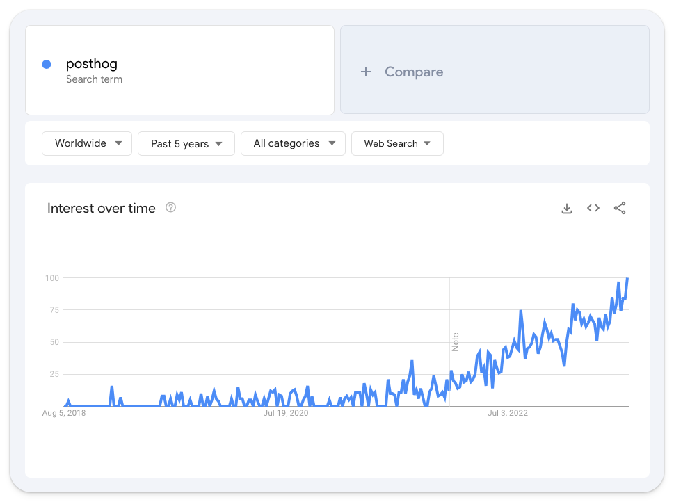
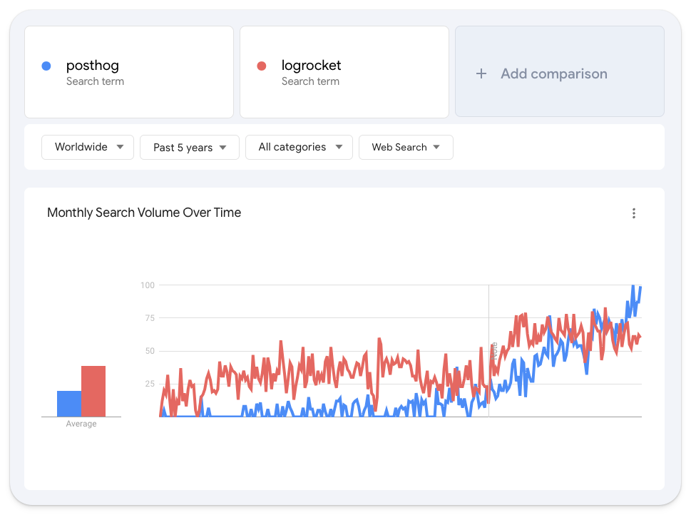
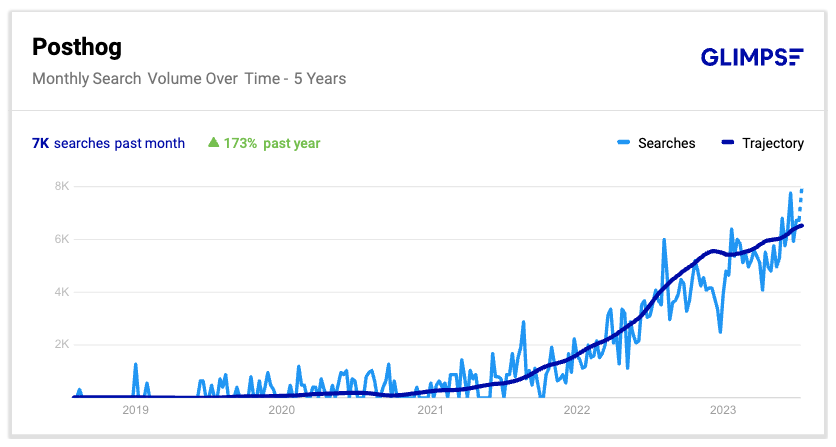
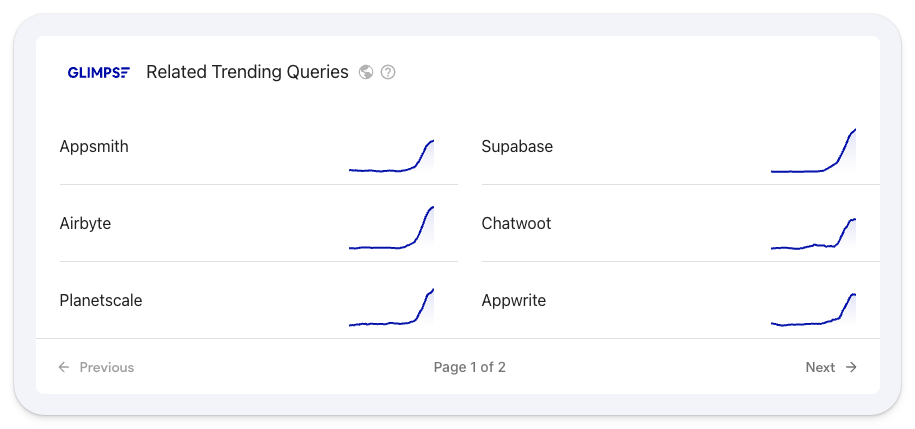
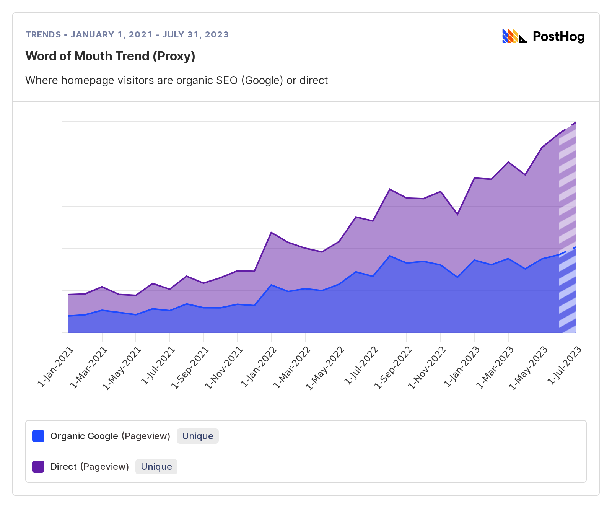
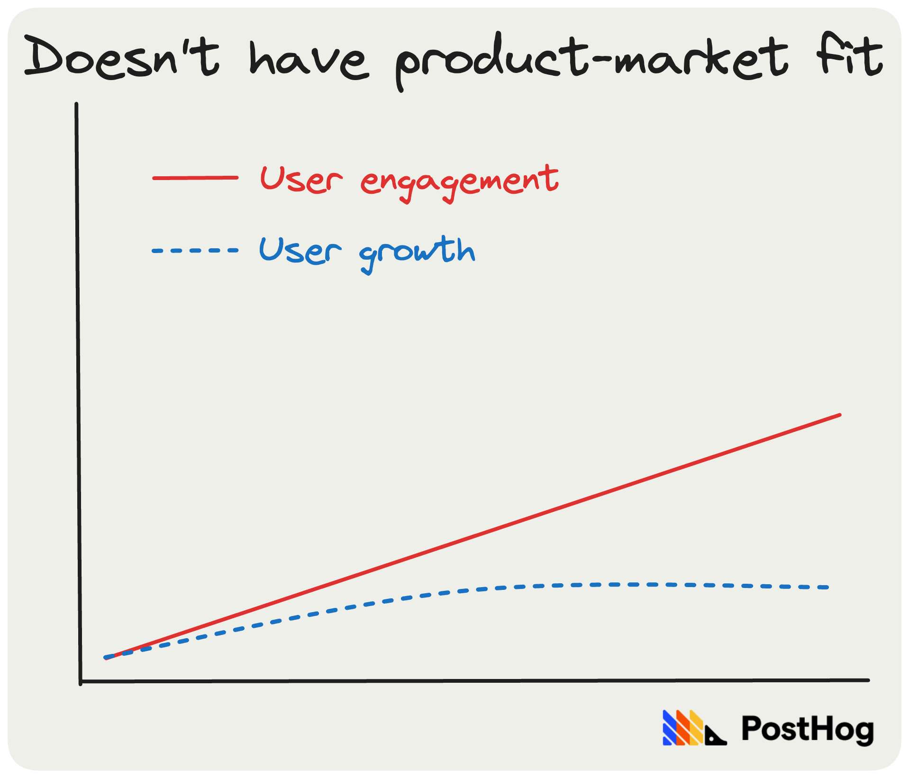
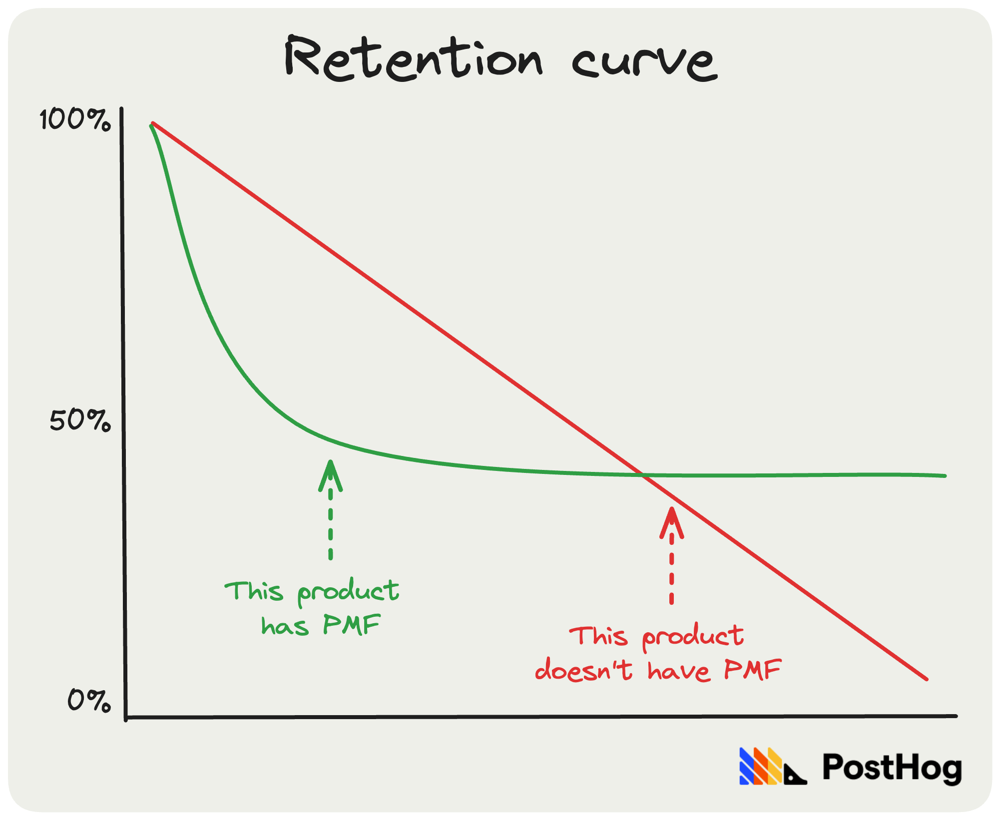

Startups can't succeed without [achieving product-market fit](/blog/product-market-fit-game) – it's one of the few things startup gurus agree on. It's often described as a feeling – a palpable excitement from users, or a sense you can't keep up with demand. You either have _it_, or you don't.

But product-market fit isn't just an ephemeral gut feeling. You can _measure_ it and _it moves_ as your customer's needs change. It's also a spectrum. Some products have rock solid product-market fit, others the green shoots of _potential_ fit. This guide will help you figure out where you are on that spectrum.

## First principles

Measuring product-market fit requires a combination of leading and lagging indicators:

**Leading indicators**, such as a surge in new users, suggest product-market fit.

**Lagging indicators**, such as those users returning repeatedly, confirm product-market fit.

Three metrics (two leading indicators and one lagging indicator) is a good starting point. You can add more if and when you need.

Why three? Because of what Brian Balfour, a serial co-founder and a former VP of Growth at Hubspot, calls The Trifecta:[^1]

Achieving all three is a reliable sign of product-market fit, but it rarely comes easily.

In the rest of this guide, I'll explain:

- The different ways to measure product-market fit
- The pros and cons of each method
- How to choose the right metrics for you

## Indicator #1: Word-of-mouth growth

- **Type:** Leading indicator
- **Good for:** Product-led companies

You _can't_ validate product-market fit _using word of mouth alone_. That way lies madness. But it is a useful indicator _when confirmed by other metrics_, such as user engagement.

Hopefully, you already have a strong grasp of your organic user growth via user signups, or whatever metric makes sense for your product. But you can, with a little work, also track word-of-mouth awareness and sentiment of your product. Here are a few options:

### 1. Brand mention alerts

Use a tool like [Syften](https://syften.com/) to monitor social media, communities, and newsletters for people talking about you. We use it at PostHog to send alerts to a `#brand-alerts` channel in our Slack. 

Tracking brand mentions is more about understanding what people are saying about you, rather than tracking a trend. People spontaneously sharing their love for your product is a good sign. Identify who these people are and why your product is such a good fit for them.

> **❗️Important:** It's _much easier_ to track mentions if your company has a unique name. You're bang out of luck if it's a common noun – e.g. Apple, Amplitude. 

### 2. Searches for your brand

**Google Trends** is a good option if you have a unique brand name. Just plug your brand into Trends to see how searches for your brand are trending over time.

It's also useful for comparing yourself to other companies, such as those you _know_ have product-market fit or competitors.

At PostHog, we also use [Glimpse](https://meetglimpse.com/) – an extension that augments Trends by adding trend lines, forecasts, and real search volumes. 

The above shows how PostHog showed signs of product-market fit in late 2021 / early 2022, which grew stronger from mid-2022 onwards. While exponential growth is desirable, linear growth is still a good sign.

Glimpse also suggests similar companies – useful for comparing your growth with those you know have product-market fit.

### 3. Organic traffic to your homepage

You can verify the above using organic visitors to your website homepage as a proxy for word of mouth. We track this in PostHog as an insight configured to show:

1. Unique users who visited the homepage via a search engine.
2. Unique users who visited the homepage directly.
3. While excluding users with an identified email address.

This captures new users who visit our homepage by searching for us, typing in our website address, or via dark social sources like Slack and WhatsApp.

Above shows our word-of-mouth trend since the beginning of 2021. It's similar to Google Trends. Again, exponential growth is a nice to have, not a must-have.

> 💡 **PostHog Tip:** If you're using PostHog, remember to add `UTM Source` = `Is not set` to filter out any paid ad campaigns you're running.

### Who should track word-of-mouth growth?

Word-of-mouth growth is good for any product-led company – i.e. a product that's self-serve and doesn't do outbound sales. It's a weak leading indicator, but useful so long as you verify it with other metrics, such as user engagement.

| **Pros**                                                                                                                 | **Cons**                                                                                                                 |
|--------------------------------------------------------------------------------------------------------------------------|--------------------------------------------------------------------------------------------------------------------------| 
| ✔ Easy to track                                                              | ✖ Not a reliable sign of product-market fit on its own                         |
| ✔ Useful when you're pre-revenue                                             | ✖ Spikes in awareness and user growth can be misleading                        |
| ✔ Easy to compare with other companies                                       | ✖ Not useful for companies with low-profile brands – e.g. enterprise products  |
| ✔ Positive feedback and growth is highly motivating                          | ✖ It's tempting (and easy) to rationalize negative word-of-mouth               |

## Indicator #2: PMF Survey

- **Type:** Leading
- **Good for:** Most B2B and B2C products

Like word of mouth, _consistently_ positive user feedback is an indicator of product-market fit. There's a decent chance you're onto a winner when people tell you they can't live without your product.

The [PMF Survey](https://pmfsurvey.com/) is a twist on the classic [Net Promoter Score (NPS)](/product-engineers/nps-vs-csat-vs-ces), but it's designed _specifically_ for finding product-market fit.

Created by entrepreneur Sean Ellis, the core question (among others) it asks is:

“How would you feel if you could no longer use [ProductName]?”

- a) Very disappointed
- b) Somewhat disappointed
- c) Not disappointed

Learn everything you can about people who answer "very disappointed". Organize a call with them. Ask open-ended, probing questions to understand why they love your product. Do the same for users in the "somewhat disappointed" cohort.

Based on his research of 100+ startups, Ellis believes 40% answering "very disappointed" is a strong signal of product-market fit. The more responses you get, the more reliable the signal. Ellis recommends a minimum of 30:

> "In my experience, a minimum of 30 responses is needed before the survey becomes directionally useful. At 100+ responses I am much more confident in the results." – Sean Ellis[^2]

An open research project[^3] run by Hiten Shah, co-founder of KISSmetrics, used the PMF Survey on 731 Slack users, the results showed:

- 51% responded they would be very disappointed if they couldn't use Slack
- These users believed it increased productivity and improved collaboration
- All groups said video conferencing was a must-have addition

It's no coincidence Slack has since added video conferencing.

### A PMF Survey case study

When email app Superhuman started using the survey in 2017, 22% of users answered "very disappointed". 52% answered "somewhat disappointed".[^4]

After the initial survey, Superhuman created a four-step process to convert the 52% and doubled-down on what the 22% loved.

1. **Segmenting users:** They assigned [user personas](/product-engineers/how-to-create-user-personas) to everyone who responded (e.g. founder, engineer, customer success) and created a cohort of those who appeared in the 22%. In this cohort, 32% of people responded "very disappointed", and they created a more detailed Ideal Customer Profile based on these users.

2. **Gathering feedback:** They analyzed feedback from "on-the-fence" users, and asked "how can we improve Superhuman for you?" They ignored users who answered "not disappointed". The most common thing the on-the-fence users wanted? A mobile app. They did the same for their strong supporters.

3. **Building a roadmap:** Armed with this feedback, Superhuman built a roadmap of new features. Half dedicated to improvements for their "very disappointed" cohort, the other for the users they wanted to convert.

4. **Rinse and repeat:** Superhuman continued to survey users, tracking progress towards the 40% mark. The score became the primary OKR for the product team and, after three quarters, Superhuman had doubled the score to 58%.

### Who should use the PMF Survey?

Feedback is essential to any startup, so it's more a question of how you collect it. Some teams may find an ad hoc approach suits their style. That's fine – we haven't used the PMF Survey at PostHog, for example, and we have strong product-market fit.

But, as Superhuman proves, the survey is a powerful way to systematize finding product-market fit. It's also useful for tracking whether it's improving as you ship new features, making it useful both before _and_ after you have it.

| **Pros**                                                                                                                 | **Cons**                                                                                                                 |
|--------------------------------------------------------------------------------------------------------------------------|--------------------------------------------------------------------------------------------------------------------------| 
| ✔ Can help guide product development in the right direction                  | ✖ Needs to be backed-up with 121 interviews                                    |
| ✔ Easy to break down into multiple cohorts to understand your ICP            | ✖ Not driven by real usage – always validate with engagement or retention data |
| ✔ Can be systematized to improve product-market fit over time                | ✖ Requires a minimum number of responses to be directionally useful            |
| ✔ Useful for tracking how your product-market fit changes over time          |            |
| ✔ Will help you understand _why_ you do or don't have product-market fit     |            |

## Indicator #3: User engagement

- **Type:** Leading indicator
- **Good for:** Any software product

Are users experiencing the _real value_ of your product? Spoiler: logging in ≠ engagement.

You want to see user engagement growing faster than, or in line with, new users. Engagement growing faster than signups is a strong predictor of product-market fit.

Growing signups with flat user engagement is flat suggests you _don't_ have product-market fit – most likely people are trying your product, but not coming back.

At PostHog, we created a user engagement metric we call Discoveries. We define a discovery as:

- **Analyzing any insight** – Viewing an insight for 10 seconds or more.
- **Analyzing a recording** – Watching a recording for 10 seconds or more.
- **Analyzing a correlation** – Viewing a correlation for 10 seconds or more.
- **Analyzing a dashboard** – Viewing a dashboard for 10 seconds or more.

We also track things like people inviting new team members, which we found correlates strongly with retention. 

If you find your chosen engagement metric doesn't correlate to retention, you either:

1. Don't have product-market fit.
2. Are tracking the wrong metric(s).

> 💡 **PostHog Tip:** You can create your own user engagement metric in PostHog by creating an [action](/docs/data/actions). Actions enable you to combine individual events (e.g. editing a page, sending a message, etc.) and track them as one metric. You can use actions in numerous insight types, including trends, funnels, and retention insights.

### Who should track user engagement?

Everyone. It's basically impossible to measure product-market fit without it. The real challenge is tracking the right things – i.e. avoiding vanity metrics. See our guide to the [most useful B2B product metrics](/blog/b2b-saas-product-metrics) for help here. 

| **Pros**                                                                                                                 | **Cons**                                                                                                                 |
|--------------------------------------------------------------------------------------------------------------------------|--------------------------------------------------------------------------------------------------------------------------| 
| ✔ Tracks the real value users gain from your product                         | ✖ High engagement isn't necessarily predictive of revenue                      |
| ✔ Passive to maintain – set it up once and track forever                     | ✖ Can provide a false positive if you're tracking the wrong things             |
| ✔ Easy to understand for all teams                                           | ✖ Requires user feedback or session replays to understand behavior             |
| ✔ Can be broken down by user cohorts for comparison                          |           |
| ✔ You can A/B test ways to improve user engagement                           |           |

## Indicator #4: Paying ICP customers

- **Type:** Leading indicator
- **Good for:** B2B SaaS products and subscription services

It's tempting to treat revenue as a measure of product-market fit, but it's imperfect. It's easily skewed by one or two big contracts, selling promises, or "design partners" who guide your product to solve their very specific needs.

Instead, create an [Ideal Customer Profile](/blog/creating-ideal-customer-profile) (ICP) and track growth among paying customers who fit your ICP. Your ICP should be specific, and include needs, haves, and common attributes. 

Here's PostHog's first ICP:

_How much_ your ICP customers are paying is less important than _how many_ ICP customers you have, and if they're growing in number. Can you onboard 5 paying ICP customers, then 10, 20, 50, and so on?

Consistent growth in ICP customers who pay is a strong sign of product-market fit. It means you have a product they want, and you can acquire similar customers with ease.

Flat growth suggests you don't have strong product-market fit for your ICP. Lots of growth from customers not in your ICP suggests you either:

1. Have product-market fit for a different type of customer
2. You're acquiring customers with few similarities between them

If (1) then recalibrate your ICP and check for consistent growth. If (2), you don't have product-market fit because it's hard to sell to customers who don't look alike.

### Who should track paying ICP customers?

It's essential for any B2B SaaS product – it doesn't matter if they're self-serve, or sales-led. It can also be useful for B2C subscription products and marketplaces.

| **Pros**                                                                                                                 | **Cons**                                                                                                                 |
|--------------------------------------------------------------------------------------------------------------------------|--------------------------------------------------------------------------------------------------------------------------| 
| ✔ Defining an ICP is an essential step toward product-market fit             | ✖ Not useful for ad-supported products (e.g. social networks)                  |
| ✔ Focuses on your most valuable users                                        | ✖ Not useful when you're pre-revenue                                           |
| ✔ Easy to understand – growth good, no growth bad!                           | ✖ Hard to track ICP automatically                                  |
| ✔ Won't tell you why you do or don't have product-market fit                 |                                 |

## Indicator #5: Retention curve

- **Type:** Lagging indicator
- **Good for:** Any software product

Retention is _the main_ lagging indicator of product-market fit for any type of product. If your retention curve flattens _at any point_, it's a strong sign you have product-market fit.

You'll want to track active users over a long(ish) period of time – weeks or months, rather than days. It's best to track events or actions where a user is experiencing the _real value_ of your product. Again, logging in does not count!

For our product PostHog, an [all-in-one analytics platform](http://posthog.com/), this might look like:

> Show `unique users` who performed a `discovery` for the first time in the last `12 months` and then came back to perform a `discovery` on any of the next months.

It's also a good idea to track different cohorts, such as retention for users who match your ideal customer profile. This will reveal how strong your fit is for different users, and plan your roadmap accordingly.

> 💡 **PostHog Tip:** It's easy to track retention in PostHog using the [retention insight type](/docs/product-analytics/retention), which you can segment by cohorts (e.g. users by job title, age, etc.). See also: [How to discover features that drive user retention](/tutorials/feature-retention).

### Who should use retention?

Nearly everyone. It's easy to understand and a reliable way to confirm product-market fit. Just remember to consider what "retention" means for your product. 

As a B2B SaaS product, we care about retaining organizations and individual users. Why? Because if individual users keep coming back, we're confident their respective orgs will retain well, too. A marketplace like Airbnb, meanwhile, will want to track retention for both:

1. Owners – do owners keep their properties listed on Airbnb?
2. End users – do customers return to book more stays?

As ever, track retention actions of real value both to you and your users.

| **Pros**                                                                                                                 | **Cons**                                                                                                                 |
|--------------------------------------------------------------------------------------------------------------------------|--------------------------------------------------------------------------------------------------------------------------| 
| ✔ Reliable lagging indicator of product-market fit                           | ✖ Not predictive of revenue – will users actually pay for your product?        |
| ✔ Can be broken down by cohort for comparison                                | ✖ You need several weeks or months of data to get a reliable signal            |
| ✔ Easy to understand – flat is good, not flat is bad!                        | ✖ Won't help you understand why you do or don't have product-market fit        |

## Indicator #6: The burn multiple

- **Type:** Lagging indicator
- **Good for:** Late-stage companies seeking investment

Created by former PayPal COO David Sacks, burn multiple measures how much you're spending to grow revenue. The less you spend, the more efficient your growth. More efficient growth = stronger product-market fit.

Because it measures efficiency rather than product-market fit directly, burn multiple is really a way to measure how _strong_ your product-market fit is. It's useful for late-stage startups seeking further investment, but it's a board-level metric – i.e. product teams won't find it useful.

To calculate it, divide your net burn during a period (e.g. a quarter) with net new annual revenue for the same period:

> Burn Multiple = Net Burn / Net New ARR

A company that burns $2 million to generate $1.5 million in new ARR would have a burn multiple of 1.33. Sacks offers these benchmarks for venture-stage startups:

| **Burn multiple** | **Efficiency** |
|-------------------|----------------|
| Under 1x          | Amazing        |
| 1 to 1.5x         | Great          |
| 1.5 to 2x         | Good           |
| 2 to 3x           | Suspect        |
| Over 3x           | Bad            |

Why is burn multiple useful? Here's Sacks (emphasis added):

> "The startup that generates $1M million in ARR by burning $2M is more impressive than one that does it by burning $5M. In the former case, it appears that **the market is pulling product out of the startup**, whereas in the latter case, the **startup is pushing its product onto the market**. VCs will make inferences about product-market fit accordingly." – David Sacks[^5] 

Sacks goes on to explain how burn multiple works because it's a catch-all metric. Factors such as costs, churn rate, and growth, all impact your burn multiple positively or negatively, giving you a complete picture of your company's health in one number.

### Who should use burn multiple?

It's a good metric to add once you believe you have the trifecta: consistent growth, real user engagement, and strong retention. It'll help you understand how investors will evaluate your product-market fit.

| **Pros**                                                                                                                 | **Cons**                                                                                                                 |
|--------------------------------------------------------------------------------------------------------------------------|--------------------------------------------------------------------------------------------------------------------------| 
| ✔ It's a cumulative metric that's influenced by all parts of your startup    | ✖ It's a significantly lagging indicator                                       |
| ✔ It's easy to calculate – it's just two numbers any founder should have     | ✖ It's not useful if you're pre-revenue or even early revenue                                      |
| ✔ A steady decline is a strong indicator of product-market fit               | ✖ It won't help you understand why you do or don't have product-market fit     |
| ✔ It's useful for investors                                                  | ✖ Skewed by non-product factors – e.g. poor cost control                       |
| ✔ It's easy to understand                                                    |        |
| ✔ Useful for mid to late-stage startups                                      |        |

## Indicator #7: CLV/CAC

- **Type:** Lagging indicator
- **Good for:** Late-stage, sales-led startups

> **CLV** = customer lifetime value – i.e. the total value of a customer after churn and the cost of supporting / retaining them.
>
> **CAC** = customer acquisition cost - i.e. total sales and marketing spend divided by how many customers you acquired.

CLV/CAC is a more targeted way to track efficiency than burn multiple. It's a ratio calculated by dividing your customer lifetime value[^6] (CLV) by your customer acquisition cost (CAC). 

The ratio reveals how efficiently you're acquiring customers. A ratio of 1x means your CLV and CAC are the same – i.e. you're only earning enough to cover your acquisition costs. A ratio of 2x means you're earning twice as much as you're spending to acquire new customers. 

A CLV/CAC of 3x and a CAC payback of less than 18 months ideal[^7] for sales-lead products.

| **CLV/CAC ratio** | **Product-market fit** |
|-------------------|----------------|
| Over 3x           | Very strong    |
| 2x to 3x          | Strong         |
| 1.5x to 2x        | Good           |
| 1x to 1.5x        | Promising      |
| Under 1x          | Weak           |

Unlike burn multiple, the ratio only considers the cost of supporting and acquiring customers, not all your other costs. It's useful for sales-led startups, which some argue can't have product-market fit until they can acquire customers for less than it costs to retain them.

### Who should use CLV/CAC ratio?

This is the metric to use if your product is sales-led. Unlike burn multiple, it'll help you isolate your acquisition costs from other parts of the business. You're on the right track once you can acquire customers for less than their lifetime value.

| **Pros**                                                                                                                 | **Cons**                                                                                                                 |
|--------------------------------------------------------------------------------------------------------------------------|--------------------------------------------------------------------------------------------------------------------------| 
| ✔ Reliable indicator of product-market fit and long-term financial health    | ✖ Complicated to calculate and understand                                      |
| ✔ Can't be gamed or rationalized                                             | ✖ Not useful for engineering or product teams                                  |
| ✔ Useful for enterprise products where acquisition costs are higher          | ✖ Not useful for early-stage startups                                          |
| ✔ Investors will love a high ratio                                           | ✖ Not useful for product-led growth companies                                  |
| ✔ Useful for sales-led companies                                             |                              |

## Summing up

How you measure product-market fit depends on a few factors, such as:

1. The stage of your company – are you pre- or post-revenue?
2. The type of product you're building – SaaS, marketplace etc.
3. Your ideal customers – are they consumers, SMBs, or enterprises?
4. How you generate / plan to generate revenue – are you self-serve, or sales-led?

For most early-stage startups, word-of-mouth growth, user engagement, and retention is the place to start. That's the traditional trifecta.

For any B2B product, it's important to add paying ICP customers as soon as you're ready to generate revenue. Breakdown retention by user cohorts to verify your ICP customers retain better than non-ICP customers. If they do, and your ICP customers are growing, it's a good sign you're on the right path.

The PMF Survey is best used to:

1. Figure out why you do or don't have product-market fit
2. To improve the strength of your product-market fit 
3. To track how strong your product-market fit is over time

But remember: [talking to users](/blog/10x-engineers-do-user-interviews) and gathering feedback remains essential whether you use the survey, or not.

So, what about burn multiple and CLV/CAC? 

They're outliers in that they aren't traditional measures of product-market fit. But they do prove how _strong_ your product-market fit is. They're useful when seeking investment, or if your model dictates heavy expenditure on acquisition.

And, if you find yourself unable to find product-market fit, we share how we found it for PostHog (and a step-by-step process achieving it) in [The Product-Market Fit Game](/blog/product-market-fit-game). The golden rule? If in doubt, pivot. 😅

#### Footnotes

[^1]: [The Never Ending Road To Product Market Fit](https://brianbalfour.com/essays/product-market-fit) – Brian Balfour – Dec 11, 2013

[^2]: [Using Product/Market Fit to Drive Sustainable Growth](https://blog.growthhackers.com/using-product-market-fit-to-drive-sustainable-growth-58e9124ee8db) – Sean Ellis – Apr 5, 2019

[^3]: [731 Slack Users Reveal Why It’s So Addictive](https://hitenism.com/slack-product-market-fit-survey/) – Hiten Shah – May, 18, 2015

[^4]: [How Superhuman Built an Engine to Find PMF](https://review.firstround.com/how-superhuman-built-an-engine-to-find-product-market-fit) – Rahul Vohra – Nov 13, 2018

[^5]: [The Burn Multiple](https://sacks.substack.com/p/the-burn-multiple-51a7e43cb200) – David Sacks – Apr 23, 2020

[^6]: CLV attempts to quantify how much customers are worth over their entire lifetime. This means you need to understand your average deal size, average deal length, gross margin, and you CAC payback period – i.e. how long it takes a customer to pay back the cost of acquiring them. TL;DR: it's a lot of work.

[^7]: [Growth at All Costs is Perilous](https://review.firstround.com/growth-at-all-costs-is-perilous-this-is-how-to-scale-sales-sustainably) – Karen Rhorer – Sep 25, 2018