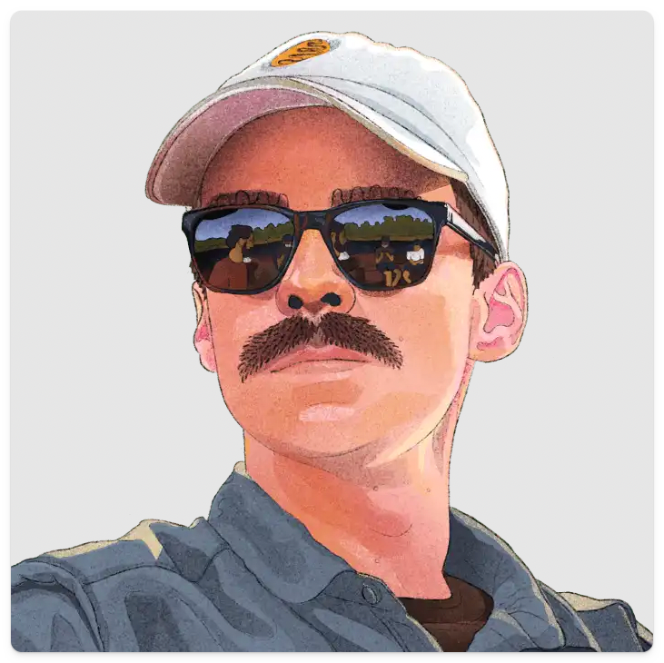
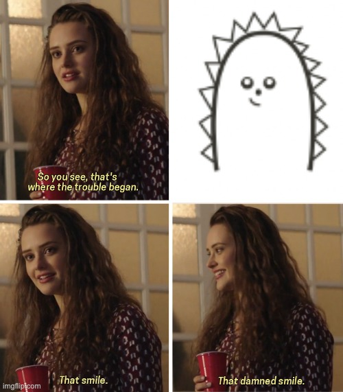

Our CEO and co-founder, James Hawkins, [recently joined Y Combinator](https://www.youtube.com/watch?v=gF1NGUsjxLU) to talk about the first five hires PostHog ever made, how we made them, and why. This is the story behind each hire, and the lessons we learned along the way.

## 1. Marius Andra

James and co-founder Tim (CTO) were frantically trying to hit their launch deadline, but there was a problem. They wanted libraries for mobile, desktop, and other programming languages, but they didn't have capacity to complete the work themselves.

Handily, James noticed a similar hobby project that launched on Hacker News recently. He reached out to the creator to offer them some contract work to build the SDKs. Marius was the creator.

James: "Just from watching him do some actual work with us, it was really clear that he was very talented, and that's why we thought, hey, we should just get him in full-time."

And that's how Marius become employee no.1 at PostHog.

> **What we learned:** Testing people with paid work is a great way to understand if they're a good fit for your business. The Super Week / Super Day concept is something we've baked into our [hiring process](/handbook/people/hiring-process). Great people will find ways to shine if you give them the chance. 

## 2. Eric Duong

After PostHog's seed round, James and Tim decided PostHog would be a remote company. They then began outlining our now famous [public company handbook](/handbook/).

The handbook was important for a few reasons:

1. It made the company look more mature from an outsider's perspective.

2. It helped James and Tim think through their philosophy, and what kind of company they wanted to build.

3. It was a great advert for potential hires.

Eric was the first employee to actually apply for a job at PostHog. James and Tim interviewed him separately, and both concluded he was smart and scrappy – two values we crave in every PostHog employee.

Again, it started out with a trial "Super Week" (actually three days) of paid work. 

James: "He was supposed to start on a Monday, but over the weekend he'd already shipped a bunch of stuff. So before he even started, we already knew that we were going to end up hiring this person too."

> **What we learned:** Think about your culture from the start! Crafting the company handbook helped us understand the kind of people who would make PostHog a success. It's hard to retrofit a culture when you've already hired a dozen or so people, so don't wait.

## 3. James Greenhill

In the early days, CEO James would check out people who starred the repo and sometimes get in touch to gather feedback. He saw James G was a data engineer at Uber and this piqued his interest.

On a call, James G explained Uber had built a bunch of internal tools like PostHog for data control reasons. He found the project interesting and wanted to work on it, so he did a 3-day Super Week like Eric and Marius.

James: "It was obvious, we were learning tons from him around how to make the platform more scalable. I would've never have thought we'd be able to hire a data engineer. He'd worked at a ton of other really impressive places, but we didn't go outbound looking for him. He was someone who'd used the project, or he thought it was cool on the internet first. So he was kind of already qualified, just being interested."

> **What we learned:** Look beyond job ads (and your first users could be your best hires). While we post adverts for all our open roles, many of PostHog's hires have come from recommendations, connecting with communities, and serendipitous conversations.

## 4. Lottie Coxon

Lottie is a graphic designer, and PostHog's first non-engineering hire. Why did we hire Lottie? Well, there's a short version and a long version. Here's the short version...

Believe it or not, this is PostHog's original logo/mascot – lovingly dubbed "hairy thumb". Do you really need the long version? Here it is, anyway.

It all started with that damned smile... or when James and Tim considered what would make a developer want to try PostHog, or put them off. Good documentation, and evidence of people using it were important, but they decided good design and a unique brand would be important too.

James: "Everyone else has blue websites that are super boring. You're on their pricing page, there's no pricing information; it's "talk to sales". So we're going to name ourselves after a hedgehog. We're going to have just like a weird, unusual style, because we are the weird and unusual one that's joined, and that's how we'll win, we're not going to win by being the same."

With that decided, James sought out a graphic designer, and found Lottie on Twitter. Her portfolio was "really weird" and "kinda cool" according to James.

Like previous hires, Lottie did some paid contract work first and immediately impressed. As Tim said at the time: "Watching Lottie do her job, felt like watching someone perform magic to us."

> **What we learned:** [Talent compounds](/handbook/company/values#talent-compounds). Lottie was early in her career when she joined PostHog, but she quickly showed she had bags of talent. Don't just look for plausible looking CVs, look for talent that will motivate others to do their best.

## 5. Michael Matloka

Michael found PostHog via a "Who's hiring?" thread on Hacker News when he was an 18-year-old still at school. Because our product is built for developers, it's a great place for us to hire. Our open source approach, and transparent processes, help us stand out.

Michael's was the first role where James and Tim interviewed multiple candidates for the role. Despite being just two weeks from finishing high school, Michael stood out for many reasons: 

1. He already had a successful side project with 10,000 users. It proved he could ship products from front to back and do full stack. 

2. He was passionate about development.

3. He thought a little like a product person.

Once again, he did a paid 3-day "Super Week" and proved he had the same characteristics that made Marius, Eric, Lottie and James G successful.

> **What we learned:** Look for T-shaped people. This is especially important for your early hires. You can't afford to hire specialists in every arena, so it's vital to find people who are experts in one or two disciplines, but are capable in others as well. Michael's experience of shipping his own project showed he had that quality.

## Final thoughts

Hiring is one of the most important but stressful things you'll do as a startup. We're always learning and getting better at it, but we're pleased to say that (as of writing) all our first five are still with us. For us, the key takeaways were:

1. Test people out before you hire them full time
2. Define your culture and your "ideal hires" from the start
3. Go looking for great people in different places
4. Hire great talent, not (just) impressive looking CVs
5. Scrappy and self-motivated T-shaped people FTW

There's also a broader theme here. 

While it's tempting to search for "that hire" who will magically transform your product and company, this is a fool's errand. 

Successful companies are built on collective strength, which is why talent compounds is one of our [core values](/handbook/company/values).

<iframe width="560" height="315" src="https://www.youtube-nocookie.com/embed/gF1NGUsjxLU" title="YouTube video player" frameborder="0" allow="accelerometer; autoplay; clipboard-write; encrypted-media; gyroscope; picture-in-picture" allowfullscreen></iframe>
