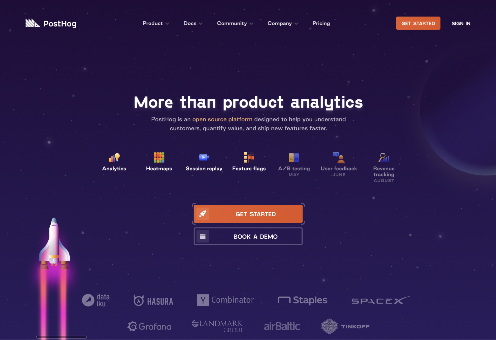
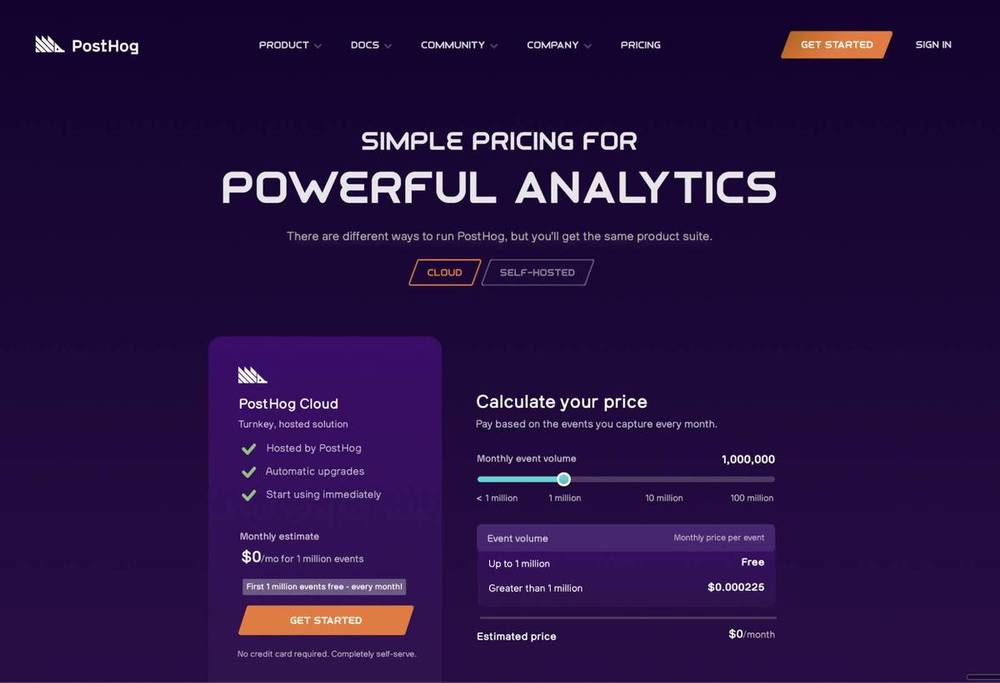
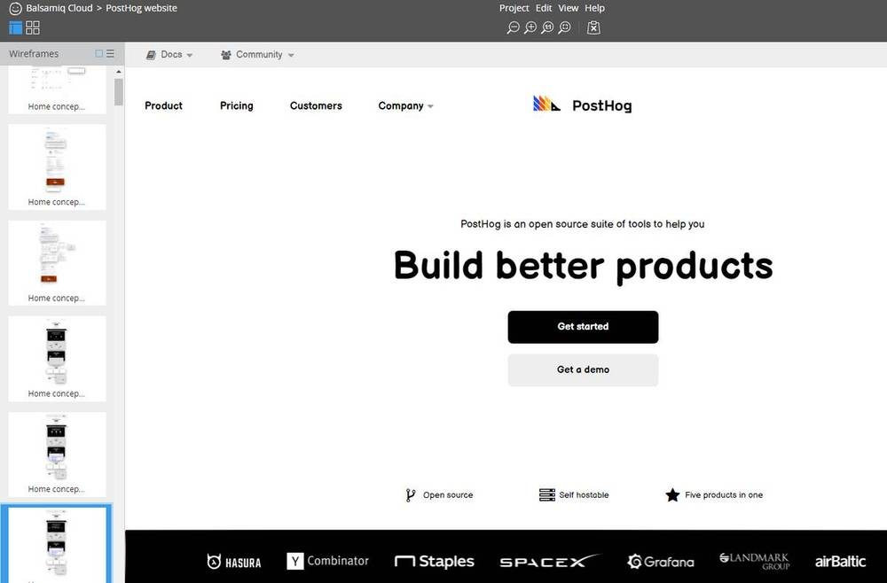
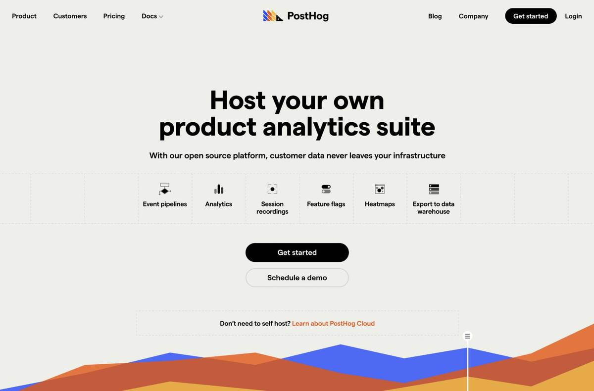
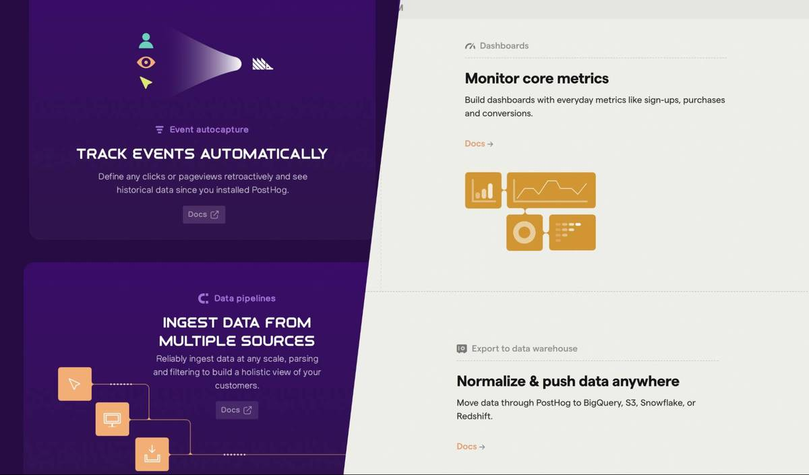
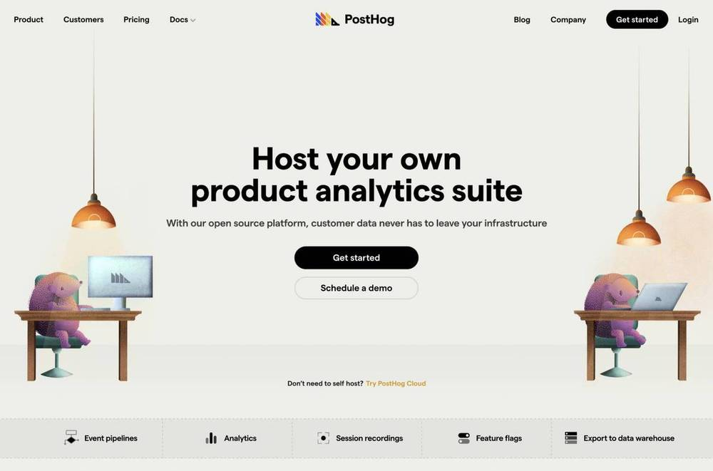

We recently completed an entire rebrand of our website. From start to finish, it took less than a month. This sounds like an incredible feat of discipline - and in a way, it was. But the path to success wasn't linear; it took us more than six months to get to this point, with plenty of diversions along the way.

Since we're an open source company and our [communication is public](/handbook/company/communication#public-by-default), it seemed like a public post-mortem was in order, despite how vulnerable this makes me feel as a designer.

## Joining PostHog during a pivot

When I started at PostHog, our primary focus was selling PostHog Cloud, our hosted analytics solution. More recently we've shifted toward our self-hosted analytics solution. We've also grown into a more full-featured platform that offers feature flags, session recording, and data pipelines.

As a designer, my task is to package our unique product suite into something visitors can quickly understand in a quick glimpse of the homepage.

But being new to the team, I felt it wasn't in my best interest to propose massive design changes on day one. PostHog already had a [Graphic Designer](/community/profiles/227) and a defined visual style. Instead of making waves, I decided the best route would be to take time to understand who I would be working with and what was important to them. Reading the dynamic of the team is far more important than flexing a design muscle in the first week.

## The pixel art and space era
When I joined, PostHog's visual style involved pixel art that was reminiscent of 8-bit videogames. I opted to keep the existing visual concept, and instead focused my efforts on communicating our new value propositions while _slowly_ evolving the brand.

This led into my first major project: redesigning our homepage. This was the natural place to start, as it was the most visited page, the best place to start updating our messaging, and a great way to set the tone for other pages of the site.

We kept the 8-bit style but evolved it to incorporate the idea of PostHog as "the future of analytics" - _which naturally meant we needed rockets, planets, and a space theme!_

It also retained a blocky font that CEO James Hawkins had personally negotiated with [Font Foundry](http://www.fontfoundry.com/) to use in our open source product. (I didn't dare touch that so early on.)

When we built this new homepage, it felt light years ahead of the previous version while still retaining the essence of the brand: _fun, quirky, and unashamed to be the antithesis of other companies in our space._ It felt like a win.

We soon built out other internal pages, like our product, pricing, and careers pages, even as we were still finding our stride with an updated brand aesthetic. 

## Iteration over perfection

At PostHog, we believe that iterating is better than not shipping anything. Making small improvements on a daily basis is much better than disappearing into a bunker and not pushing any changes for a month. Not only do customers see daily improvements, but it's also hugely beneficial for the momentum of the team since their work is constantly reaching customers.

But what does this look like when it comes to design? As we were still establishing the updated feel of our brand, each new page we released had a slightly different visual style - each one a little better than the last. The goal was to release a new page, then quickly update older pages to make them match the latest look and feel.

Our new pricing page introduced a new, futuristic font that we implemented site-wide, as well as a more refined visual style.

 
But given that we always had new projects to work on, we never went back and updated the original pages. In retrospect, this was a huge failure on my part, as it led to a very inconsistent brand.

## Website & docs as a product
A few months ago, our Head of Product proposed we treat our website and docs _as a product itself._ This was a new concept to me, as I've mostly worked in early stage startups (usually as the sole designer) where I don't typically have the luxury of spending all my time focusing on a single aspect of the company.

In reality, this is the best decision a startup like ours could have made.

If you look at any successful later-stage startup (especially in B2B SaaS), their website and docs become a pillar in their overall image. Take [Stripe and their docs](https://stripe.com/docs) as an example. The product works great, but what makes it special is the experience a visitor has with the _brand_.

Settling into the role of guiding the roadmap for our website and docs has opened up a whole new world to me. Our product design team has alleviated the need for me to be involved in the day-to-day of product design, which has freed me up to focus on the bigger picture - and how people interact with our brand.

## Leading up to the rebrand
There were several factors that led to our rebrand. Our [Graphic Designer, Lottie](/community/profiles/227), was really honing in on a consistent style for blog artwork as we began focusing on having [unique blog art for every post](https://posthog.com/blog). She was tired of designing for the space theme, the 8-bit style felt a little dated, and she was absolutely killing it with [hedgehog-themed art](https://posthog.com/media).

This is also where refocusing on self-hosted customers came into play. In a 1:1 with James, he explained what was resonating with prospective customers. I took notes ferociously and created [a wireframe](https://balsamiq.cloud/sd0i9zq/pxvojo4/r0A75).

At the same time, James encouraged exploring a simpler, cleaner aesthetic. As I also wasn't thrilled with the space theme as a long-term look and feel, this conversation gave me the liberty to explore entirely new ideas. 

After a lot of thought (and the "space" to explore ideas), I settled on an early concept with some ideas of what the future of PostHog could look like.

## Finally, the rebrand

Not too long before this, we hired an incredible Front End Developer. ("Incredible" is actually an understatement - the word “no” doesn't exist in his vocabulary.) After a few weeks of working with [Eli](/community/profiles/3) and seeing the pace at which he could crank through complex tasks, I had the confidence to know that we could build out a new website experience quickly.

_A team with a can-do attitude can do anything._

Our company offsite in Porto, Portugal was a few weeks away, so I set an arbitrary deadline of completing the redesign by then.

After designing a few pages and defining some basic styles for our new brand (like colors, fonts, header tags, paragraph tags, and links),  we started work in an iterative fashion. I would design one step ahead of Eli, and he would follow shortly behind in code.

Our outgoing space-age theme had a dark purple background, but the new style called for a light background. So we split the project into two segments: some pages we redesigned, and with others we simply modified the color scheme. This way, we could reduce the amount of time the redesign would take. For the pages where we were simply changing the color scheme, it just took updating the colors of those graphics in Figma and re-exporting.

## Before/after (product page)

Since we use [TailwindCSS](http://tailwindcss.com/) on our website, we leveraged [TailwindUI](https://tailwindui.com/) components where it made sense, so we didn't have to write a bunch of components from scratch.

We didn't complete the redesign before the offsite started - but we worked ferociously throughout the week of offsite to finish it - and we were able to wrap it up and demo it at our offsite hackathon.

Some of the design decisions landed outside of what might be considered best practices. For example, we use black buttons for calls to action and header links. This might be far from the norm, but it's important to consider our audience. As a B2B SaaS product with a very technical audience, I wasn't worried they would be confused about where to click. As the Dalai Lama said, “Learn the rules so you know how to break them.”  (Didn't know that quote was by the Dalai Lama? Neither did I until writing this post!)

What we did over the month was not sustainable. Eli worked literally every day, despite many instructions to take weekends off. But what we accomplished over the course of four weeks was nothing short of incredible. It set a new benchmark for what we can do - when we need to.

A huge shout-out goes to Eli and Lottie for their work on what we shipped.

## The (nearly) final result

And this is just the start! As with everything at PostHog, we still have [a huge roadmap](https://docs.google.com/document/d/16tORGZcfazvWMSONd7MrKqFjh98RJcfDdqxtZfCFrGs/edit?usp=sharing) of things we'd like to accomplish on the website and docs. This is a living, breathing website which will improve over time. If you have feedback on how we can improve the experience of our site, we'd love to hear from you. [Filing an issue](https://github.com/posthog/posthog.com/issues) in our GitHub repo is the best way for us to track feedback.

Most importantly, we hope our website is a reflection of who we are: quirky, outside-the-box, and enthusiastic about tackling large problems in unique and creative ways.

*P.S. If you want to join in on the fun, [we're always hiring talented people](https://posthog.com/careers). If this post resonates with you, we'd love to hear from you!*

_Enjoyed this? Subscribe to our [newsletter](https://newsletter.posthog.com/subscribe) to hear more from us twice a month!_

