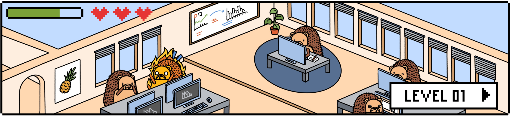
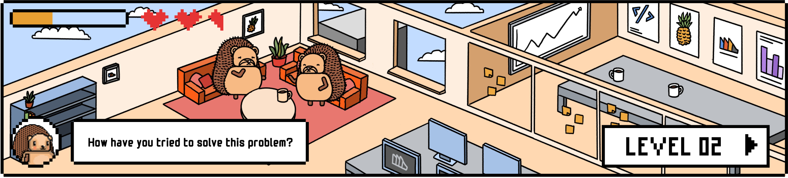
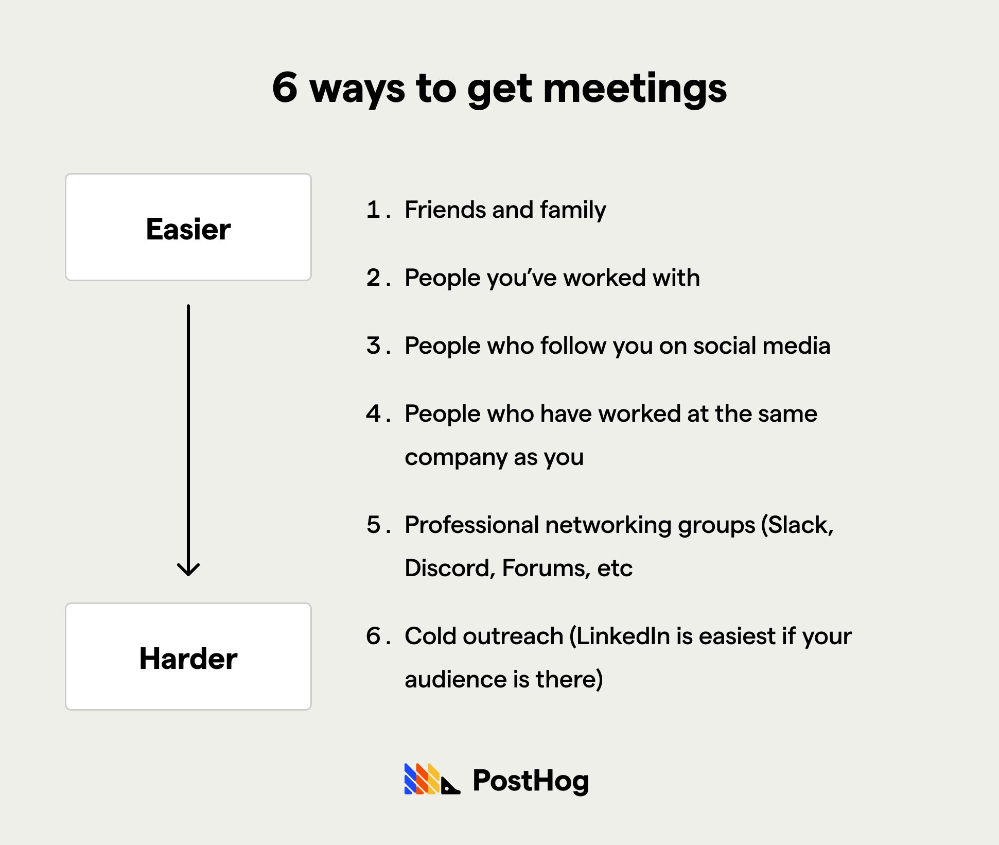
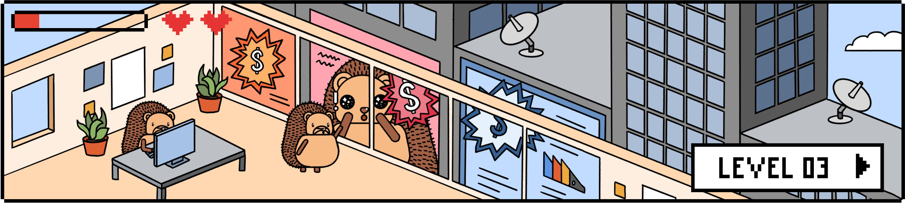
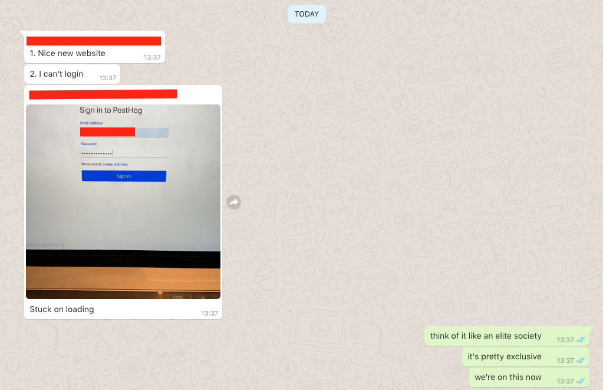
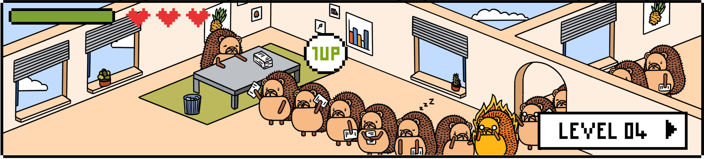
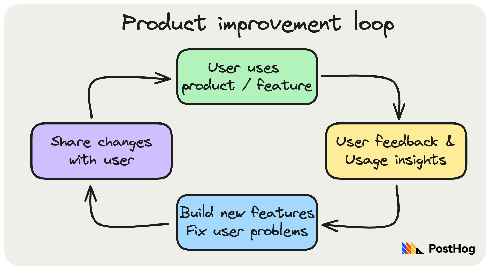
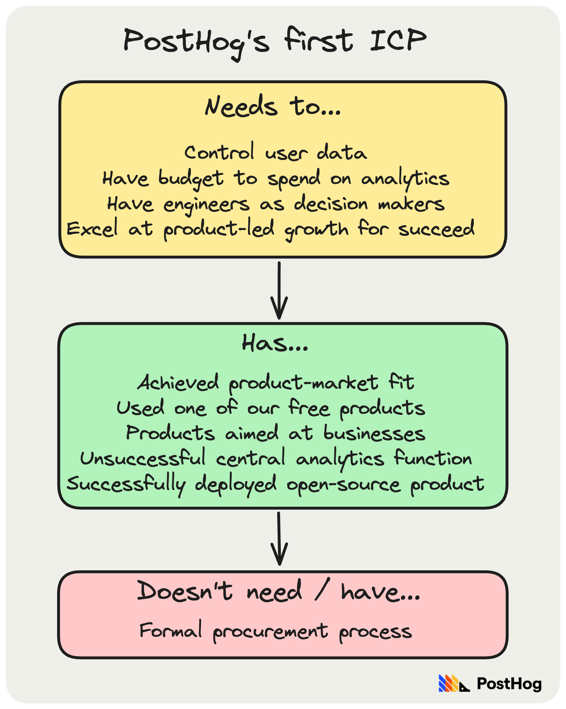

In a startup, the _only_ objective that matters _before_ you have product-market fit, is _finding_ product-market fit. 

Knowing when you've found it is easy – there's no shortage of descriptions of how it _feels_ to have product-market fit, or [how to measure product-market fit](/blog/measure-product-market-fit). _How_ you find it is much harder, hence this guide.

To me, finding product-market fit is a bit like playing [snakes and ladders](https://en.wikipedia.org/wiki/Snakes_and_ladders). There are numerous traps, winning takes a little luck, and the only certainty is it's never a straight line to the finish.  

This guide is based on what I've learned as CEO of PostHog through 6 pivots, eventually finding product-market fit, growing revenue to $MM, and onboarding more than 20k customers. It also incorporates what we've seen from ~50 Y Combinator startups we've consulted with on this topic.

## The 5 levels of product-market fit

Finding product-market fit is a game, and games have levels. My product-market fit game has five levels:

1. Find a significant problem to work on
2. Validate the problem by talking to users
3. Get users to use your product
4. Keep users coming back 
5. Onboard your first 5 reference customers

You need to complete all five levels to win. All but the first have multiple failure modes, which I've listed – go through them sequentially. You might find you cannot complete a level. This is a sign you need to pivot your entire company. I touch on this at the end.

Remember to keep detailed notes on all the conversations you have with potential / actual customers at each level. You may want to come back to a detail, and your notes may be useful for a different idea later. At PostHog, we built a Google Doc over 100 pages long in the first few weeks.

Let's press start...

### Level 1 - Find a significant problem to work on

Start by solving a problem you've had yourself. It needs to be a problem you've _both had, and actually tried to solve_, otherwise it can't be a significant problem.

The type of idea, _and_ thus the types of users you are targeting, will greatly influence your life. I recommend trying out a bunch of ideas _and then_ figuring out what you like and why.

Here are some pointers:

- **Pursue ideas for users you want to work with.** Early in PostHog's life, we worked on a tool for sales leaders. We quickly grew frustrated at extroverted people who were positive on calls, but didn't follow through on promises. We switched to ideas for customer support or engineers, who we felt would be more reliable.

- **Known problems are easier to validate,** but your solution must be very different. If you want to build a venture-scale business, your solution must be 10x better, or 10x cheaper, than the existing solutions.

- **Be careful when validating problems no one else has worked on.** Maybe you see something others are missing, but it's more likely the problem isn't important.

- **Be wary about building what's trendy.** It's easier to beat unsexy, badly run, non-innovative companies than software companies with VC funding _and_ using the latest technology. Do not be fooled huge fundraises by startups working in these areas: `big funding rounds + press ≠ product-market fit`. In fact, the trendier the space, the less likely a big round means the company is succeeding.[^1]

- **Conservative buyers demand differentiation.** You could probably get someone to try a new social app, but you won't get an enterprise to use an unproven CRM. A rip and replace strategy is harder to execute than a blue ocean strategy. It is easier to sell a product to someone who hasn't got anything in place.

Many people spend months or years attempting to validate their idea in advance, and make no progress as a result. You will always get more clarity by building something and getting it into users' hands, so don't spend ages at this level.

### Level 2 - Validate the problem really exists by talking to users

Now that you _think_ there is a problem, you should figure out if others see the same issue. To do this, talk to them.

This can be very challenging – you're asking people to give up their time in the vague hope that you _might_ one day decide to solve their problem, if indeed they even have the problem. 

It's too late to tell you this, but the more helpful you've been to other people in your career, the easier you'll find this phase!

Here are a list of ways to get meetings, ranked from easiest to hardest:

Some tips for getting meetings:

- **Be as concise as you can** when asking for a meeting. That means 2-3 sentences – not a wall of text. Remember: anything you're doing on the internet is competing with cat videos.

- **Be clear about what you want** both when you message them and during the meeting. If you want feedback, state that. If you want to sell to them, be transparent about it. You can always come back to a prospect to sell to them after you've validated they have your problem.[^2]

- **Avoid heavily automated outreach** – it's a waste of energy. Sure, hustle and send lots of messages, but don't set up dedicated software to mass email thousands of people. You're already in failure mode if you go to this extreme – it proves no one cares.

- **Some groups have naturally lower response rates.** Cold outreach may not work at all for competitive groups, or high-level execs. If your product _only_ works for Fortune 500s, I'd question if it's a good idea to build unless you've already got a huge network.

- **Speed matters.** You should aim to respond within 30 seconds if someone messages you back – yes, it's that extreme. In a past life, I ran a call center business. We had a 90% greater chance of booking time if we called back potential customers within 5 minutes. Startups win on speed. Be glued to your messages.

Be aware that many people you talk to will show interest out of politeness, or because they genuinely _could_ see themselves using your product one day. Neither will help you get actual usage. [The Mom Test](https://www.momtestbook.com/) is an essential read on how to talk to potential customers and users.

If the problem is a high priority one, it's likely your potential customer will have already gone to considerable lengths to solve it. Recalling the words of Dalton Caldwell, one of the YC partners we worked most closely with: 

> _"If a company has a crappy self-built system that they're reliant on, there's probably a good business to be built providing exactly that product"._ 

In the early days of PostHog, we found that teams who needed more control of their data were building their own analytics infrastructure, instead of using the existing SaaS products. Invariably, their solutions were hideously complex to build and underwhelming.

Try to find as specific a problem as you can. The clearer the problem is, the simpler it'll be for you to validate and solve it. Specificity doesn't just come from what your product _does_, it also comes from the _user_ you are targeting. For example, PayPal realized that power sellers on eBay had issues with payments.

Yet, despite all this, there's only so much you can validate in this way.

You will get the clearest lessons from seeing if people _actually_ use, return to, and pay for your product – hence the need to move onto the next level. Do not spend too much time validating. This should be a quick, intense period – a weeks-not-months exercise.

In the early days of PostHog, we found it best to have Tim (my co-founder) coding constantly, while I spent most of my time getting feedback. We were willing to throw away all our work. And we did, through six pivots. This approach enabled us to validate our ideas much faster.

If there's an obvious desire from the user to see if you can solve their problem, be ultra-accessible to these early potential users. People's emails are filled with junk, and it's weirdly formal. Instead, add your customer to a WhatsApp group or a private Slack/Discord channel – whatever channel _they_ prefer. This channel is critical throughout the rest of the levels.

Try to move to level 3 as quickly as possible. Tim and I typically spent one week per idea in level 2. If you spend two weeks at level 2, it may be time to pivot back to level 1.

#### Failure modes

Work your way from top to bottom:

* **You aren't working hard enough.** Realize no one else is going to do this for you. Set a goal for how many meetings you want to get. I got 2 meetings a day, 5 days a week while doing any other random tasks, like building a website. Try to meet in person if you can afford to do so – most communication is non-verbal, so it'll make it easier to learn what people are thinking. Move to a hub for your industry if you can. Also consider moving in with your co-founder, so you can focus 100% on the work for this intense period. Running out of momentum is your biggest risk.

* **You can't clearly describe the problem,** making it hard to recruit users to validate it. Create a simple, single sentence description of the problem you think you're solving, and the user you are targeting. You'll get a lukewarm response if what you're working on feels vague. Do not use benefits-language here. Users won't have the attention span to figure out what your product does. We were working on "open source product analytics", so people could "self-host their product analytics". We weren't "helping engineers build better products", "providing a product optimization system" or "saving time for data analysts".

* **You are talking to the wrong users.** If so, no one will take calls, or if they do, they don't have your problem. Ask yourself – why did you have this problem, but those speaking to you don't? When you do get calls, ask who would have this problem. Change the user you are targeting.

* **You aren't a good listener.** You're doing calls, users are seemingly confirming that they have your problem, but they don't use the product later. Why? Ask some open-ended questions to users in each call – perhaps you're close but not _quite_ right with your problem and target user statement. Ask your co-founder to shadow you on some calls, and give each other direct feedback afterwards on which questions worked well. This may help you find a new problem, in case...

* **The problem you want to solve isn't there.** Pivot. Find a new problem to solve.

### Level 3 - Validate your MVP by recruiting real users

You should start level 3 as soon as you have something for users to use. You _must_ keep talking to users throughout this level, but now you can validate better because you have a product they can see.

The goal here is to see if people actually care, as quickly as possible. No matter how excited you get after interviewing people about their problems, there's no substitute for seeing what people _do_ instead of what they _say_. 

With one of the ideas Tim and I worked on before we pivoted to PostHog, we had 15 companies who "wanted to try it". We built a product, sent the invite link, and only _one_ clicked the link and started using it. It's a good thing we hadn't spent 6+ months building the "perfect" product before this happened!

The most obvious users to start with are the ones you've already met during levels 1 and 2. You should have been identifying a _problem_ that these users have during those calls. Now you have a _solution_, you should message and email them saying so.

#### Failure modes

These are all the reasons why users may not use your product:

* **Users have no idea what your solution is**, so they think it will be a waste of time. Even if your product is free, people's time is not. The more senior your users, the stronger the effect. Can you work with someone that _reports_ to the person you were targeting to get things set up? If you struggle to get responses, start questioning if something else is causing issues – even a senior stakeholder will put in work to solve a serious problem they have.

- **You're not explaining your product clearly.** The way you explain your product matters. If it's complicated, people won't understand it. Describe it like you would when speaking to a friend. Ask users for direct feedback on your explanation.

- **You lack credibility.** Businesses won't take a chance on you if your website is a mess, or you appear disorganized. At best, it'll be a waste of time for them; at worst, your product may be a security risk, or cause them issues. Hopefully, during level 1, you picked this idea because you've encountered it personally. That might mean you're well-qualified to solve it for others. When you interact with them, clarify your credentials, if relevant and impressive. People (mostly) won't voice their fears, so they may go silent or, worse, give you misleading feedback that it's something else.

* **Users are skeptical your solution will solve the problem**, so there's no point trying. Potential customers are unlikely to try your product if they disagree with your approach. Signs here include statements like "software can't solve a people problem" or "AI looks cool, but won't work in real-life applications because it's not accurate enough".

* **Users cannot access your solution.** Here's what happened with the very first PostHog users. Triple check it's possible to start using your product.

* **Users are worried about using your solution.** Does your solution require, for example, personal or private company data to operate? Seek feedback: "Hey, I saw you've not used it yet – could I get some really blunt feedback. Did something put you off?" Can you reduce how much data you need access to? Can you make your product, website and approach feel more mature to signify competence? If the perceived security risk doesn't outweigh the benefit of solving the problem, the problem may not be big enough.

* **Users don't want to solve this problem.** Many problems aren't high priority, and your solution feels like a hassle to them. Can you make the product feel 10x simpler to use, or 10x more compelling to them? If not... pivot to a new problem. Back to Level 0.

* **Users don't really have the problem** you thought they had from your interviews. Pivot to a new problem. Back to Level 0.

### Level 4 – Validate your product by retaining users

Hooray, so people are showing up. Now you need to see if they're coming back or not. Figure out what your expected frequency is for usage, and check if that's roughly how often users are using your product. Users will return if you can repeatedly solve a problem for them. If you haven't already, [setup analytics to track retention](/blog/early-stage-analytics). 

Avoid relying on things like reminder emails or push notifications purely designed to get users to log back into your product. If it takes this sort of effort to retain users, your product probably isn't valuable to them. Focus _exclusively_ on building features that make your product more powerful or easier to use.

Once you've got some usage, get qualitative and quantitative feedback. Measure which features are being used the most, ask for feedback calls, and watch users using your product. There are plenty of good session replay tools... ours is [one of them](/session-replay)!

If they're willing, ask them to perform tasks live in front of you, and ask them why they clicked certain things. You'll be shocked at how many ways people get confused – that's a _great_ problem to have if they're coming back.

Start "closing the loop" with users. This is a simple process to improve your product:

Closing the loop above is the way to cement your product-market fit because:

1. **Your product will get better fast.** You should weight user feedback very heavily compared to your instincts around what to build. 

2. **It will generate word of mouth growth.** The one thing you can compete on is speed – you can outperform any competitors by providing a ridiculously excellent experience to your early users, so they will tell their friends. 

3. **Listening to users compounds.** Like a snowball rolling down a hill, the more you listen to users and act on their feedback, the more useful feedback they'll share with you. 

#### Failure modes

* **Users aren't activating.** This means they _signed up_, but can't _configure_ or _get started_ with your product, so they _never_ get any value from it. You have two options here:

  1. Activate your users manually. The classic example is the founders of Stripe, who [used to visit their first users in person](http://paulgraham.com/ds.html#Manual) to set up their product for them. Do things that don't scale. You'll develop a closer relationship doing this, which helps you get more feedback.
  
  2. Make your activation/onboarding simpler. Can you make it 10x simpler?

* **You are getting conflicting feedback on what to build.** Go to level 5, this will help clarify which users are your Ideal Customer Profile, and which aren't. This provides a clearer direction.
 
* **Your product isn't solving your users' problem**, hence there is no point coming back. Build a new product for the same problem, or fix your existing product. Restart level 3.

* **Your product is painful to use.** Get feedback from users, watch session replays, or watch people trying to use it.

* **Your users don't need to come back repeatedly.** Perhaps you've automatically solved the problem with no further user work. Proceed to level 5 and validate their willingness to pay. Don't force product engagement if it's irrelevant to solving the problem.

* **Users use your product but don't encounter your problem often.** Proceed to level 5. It may be hard to get significant revenue for an infrequent problem, or you may not experience much demand. A low order value is okay if the potential market is huge. Go back to level 1, however, if it's extremely hard to recruit users _and_ you can't charge much. This means your problem isn't big enough.

### Level 5 - Onboard your first 5 reference paying customers

Start by figuring out your [Ideal Customer Profile](/newsletter/ideal-customer-profile-framework).

Write down needs, haves, and attributes you think your Ideal Customer Profile users might have in common. These should be _very_ specific. They could be individual-level and/or company-level things.

Do not just assume one or two things like "engineers in startups with over 100 staff". Definitely do not just list an industry. The specific things we considered at PostHog were:

Feel free to include some anti-needs and haves too – i.e. things your Ideal Customer Profile _doesn't_ need or have.

List out all the potential users you could sell down the first column in a spreadsheet, and score them against all of these attributes. Color-code the spreadsheet so you can spot patterns easily. As you start to see if people are happy to pay.

Be upfront with customers. This step may prove tricky if you never set any commercial expectation with them early on. If so, you may find it easier to sell to newer users with clearer expectations. Use your website to make clear that your service is a paid one, or will be once you're of beta. 

You will also need some pricing. You are likely to change this numerous times:
- **Step 1** is to create some kind of internal table for you to use and iterate with each handful of sales calls.

- **Step 2** may be to make this transparent online. Don't do this until step 1 is working reasonably well.

- **Step 3**, for companies focusing on self-serve, is to enable people to pay without talking to you. Do this only after step 2, and only if it suits your go to market. If you're enterprise focused and selling from the top down, it's a bad idea. If you're product-led then go for it.

> **Important:** Don't leap straight to self-serve. Remember that, at this stage, you're optimizing for learning, not revenue. Jumping too soon to self-serve will reduce your opportunities for learn. I (with hindsight, correctly) felt it was very important to talk to our early users about what they're prepared to pay.

Now it's to get your first reference customer. This means a customer that pays full list price, is using the product as you expect, and would happily recommend you to others. If you manage this five times – congratulations, you've completed the product-market fit game.

Once you get 5 reference customers, you are _well_ on your way to product market fit. After this:

* Repeat your formula to around $1M in ARR, by yourself. I'd advocate for a minimum of $500K if you are confident at sales and everything is feeling easy and repeatable, more than $1M if you are still feeling things are different every time you sell, or it's proving tough.

* Then see if other people are successful at following your playbook. Try with two other people to reduce the chance it's a person problem, not a product market fit problem.

Now you're likely at product market fit - it should just feel easy to grow. If not, [talk to me](https://twitter.com/james406).

#### Failure modes

* **You outsource sales to someone else.** Achieving product-market fit is already a multivariate problem, so avoid adding an additional "is it the product, or the person selling it?" variable. Realistically, a founder is, regardless of experience, _the_ best person in the world to sell the product they made. Founders outsource or skip this step for various reasons (e.g. fear of failure, lack of confidence, laziness, or ego), but you must resist these. Having a valid business model is critical _and_ getting there may require lots of iteration on product, pricing, positioning, and so on. A founder can change all these things more quickly and easily than an employee.

* **You can't get the first customer.** If people are repeatedly using your product, but not willing to pay – it's either (i) they have a bad problem and wish your product could solve it, but it doesn't or (ii) the problem is there but not very high value. If it's the former, you need to figure out how to make your product solve the problem better. Are you missing a key piece of functionality? Is it just hideously bug, so people resent paying? If the problem is low value, go back to Level 1 – find a new idea to work on.

* **People are paying but aren't truly happy.** It's likely you have the combination of charging very little but not actually solving the problem – i.e. they're paying _something_ out of politeness, or a hope you'll one day solve their problem. If they aren't happy _and_ are paying a lot, they must have a huge problem and are just hopeful you'll figure it out. In either case, go back to the previous level and try to solve the problem more fully. 

* **You can't get all five customers to look like each other** Well done on getting something sold. However, you can't sell a different product to every customer and call that product market fit! Can you repeat one of the sales you made four more times? Then you've completed this level. If not, go back a level.

* **You keep getting stuck on this step.** If you repeatedly get a little traction but cannot convert that to revenue, you perhaps don't have the skills to solve the problem you're tackling properly, even if the problem exists. If you _want_ to keep trying again, I suggest you do, but if this has happened a bunch of times, you'll probably have an easier time if you just choose an easier problem.

## The things you need to complete the game

### A co-founder

The Product-Market Fit Game is a co-op game, especially if you're looking to build a huge, VC-backed company. It'll take a long time, there will be thousands of decisions to make. The only true way to fail is to give up. You're more likely to persist with two people.

For a SaaS business, there are some principles I'd follow:

* **Optional:** Ideally _both_ of you are technical. You need a machine than can rapidly get through the levels above – and your ability to ship software quickly is going to be the biggest blocker in the early days.

* **Critical:** At least _one_ of you must be happy doing sales _most_ of the time. You don't need experience here, but you must embrace this challenge. There is a lot of sales in startups – recruiting early users, a team, investors and so on.

* **Critical:** You _both_ must be happy to talk to users. The person who winds up writing the code the most, will need to fix problems with users – and is often better placed to understand them, so will still need to talk to users to do this well.

You're both getting committing to something that may outlast the average marriage. Let that sink in. Your goal is never to be right, but to figure out problems out together.

Treat each other as partners. Failure mode is when the CEO bosses the CTO around and makes all the decisions. Then you aren't co-founders. There are a few ways we've done this:

* **Company design / people and hiring / culture:** Your company is the parent product you are building – and it's the one input you can directly control. You should both think frequently about what kind of company you want to build, and the people and hiring/culture decisions/behaviors you value most.

* **Strategy / vision:** While one co-founder may drive, the other is closely involved. If you can't get on the same page as each other, it'll be 10x worse for everyone else.

* **Roles and responsibilities:** Be willing to swap responsibilities around to play to your strengths. The first $1M in sales are different to scaling to $10M, and pre-product-market fit and post-product-market fit may require a different approach to product. Tim and I have switch roles periodically as PostHog has evolved.

* **Board / fundraising:** This ties closely to company strategy. While the CEO should do _all_ investor calls, so the other can drive the business in the meantime, it's important to update each other on progress via shared notes, or weekly discussions. Both co-founders should attend board meetings / existing investor catch ups, and have areas they own in them.

> #### Choosing a co-founder
> 
> I could write a whole article on this, but here are some questions you can discuss with potential co-founders:
>
> * How long are we willing to try to hit product market fit?
> * How long can we afford to try?
> * Do we want to raise money or bootstrap the company?
> * What will you want to look back on having achieved when you're 80?
> * What sort of company do you want to run? How would it look and feel day to day?
> * What roles would we each have? Will you feel happy about this in 5 years?
> * Would you sell for $1M / $10M / $100M / $1Bn?
> * What kind of work do you want to do / what don't you want to do?

### A simple, well-designed website

Website design is probably more important than you think.

When it comes to the website, most people will grab a template to get something thrown together quickly, which is fine at first.

Cory, PostHog's lead designer, and self-proclaimed webmaster, put this really nicely: "We didn't start by thinking we could build the slickest website, so we built one that felt different instead".

When it comes to the product, you want to ship a competent-feeling product, but in most cases, it doesn't need to be best-in-class. I'd argue that your website's design is _more_ important when you're in a phase of trying to get anyone to sign up, since it's probably where you're losing 90% or more of potential signups.

The good news is that design starts with copy. If you get simple, clear language onto your website that explains what you _do_, and meets the other use cases your visitors may have, then you're ahead of 75% of other websites.

Don't worry about pixel perfection. I once met [Malthe Sigurdsson](https://twitter.com/malthe), who ran design at Stripe. I went into the conversation expecting to hear that they spent months and months in Figma before shipping anything. Instead, he told me that great designers are fast and iterative. They don't get things perfect first time around.

### A "build fast" mentality

As with most early-stage startup stuff, you're more likely to be wrong than right (the vast majority of startups fail, after all), so optimize for this scenario.

You are trying to figure out if anyone cares, so the speed you can ship your first feature is the most important factor. Scalability is irrelevant. Use a software stack you've used before, as long as it's reasonably popular. We used Django and React in the early days.

Ship features embarrassingly early. Appeal to the kind of user that'll pick up a random piece of software that no one has ever used before. 

Unless your product's unique selling point is superior design, it's preferable to ship clunky/ugly/slightly broken functionality, and quickly improve it, than to waste months on something no one cares about.

### An open and responsive attitude 

Don't put anyone or anything between the person(s) writing the code and your users. This slows you down and causes confusion. It's more effective to productize answers to user problems than triaging issues, and users will appreciate spending time with the people who actually built the product

Set a clear responsibility for this with your co-founder. When Tim and I started getting users, I kept trying to get _more_ users while he focused completely on our existing ones.

Remember that users are human beings, and your success entirely depends on them. The way you open a call sets the tone for the whole conversation. Be energetic and happy to be there! Do the legwork for them – write-up notes and create issues/tickets for them, keep them in the loop, respond within minutes if you can.

### A simple, repeatable sales motion

Do _not_ prioritize scaling your sales when you're trying to get to product-market fit. Just focus on getting one deal done at a time. User your network, directly approach companies you think your product is perfect for, go to events.

In general, don't expect sales from marketing (paid ads / content) – these are more scalable methods. Instead, be hands-on. Early on, you'll win on the quality and personalization of your sales approach.

Keep yourself accountable – set some goals for meetings booked and stick to them. As with booking feedback calls, be hyper responsive.

Once you're on a call, get the prospect to open up about their challenges, and figure out with them if your product could solve their problems. It's worth qualifying the lead as you do this. The simplest method is BANT (Budget, Authority, Need, Timeline).

Layer your questions.

* **Level 1** – "What are the requirements for this project?", "how will you pick a vendor?", "do you have a set budget?"

* **Level 2** – "This sounds important, why?", "would you consider a product that didn't include that feature?" and so on. 

* **Level 3** – "If your end users were thoroughly trained and using this product effectively, what impact would that have on your revenue?", "what does solving this mean for you?".

Prioritize time with those that are best-qualified.

Once someone decides to move forward, you'll need something for people to sign. YC provides a [free sales agreement](https://www.ycombinator.com/sales_agreement/) for SaaS companies. Be flexible around your earliest customers for the terms they need – it's not about maximizing revenue or contract length, it's about getting your first deal signed and learning.

### Risk-free pricing

Structure your early pricing for getting _something_ sold.

This means reducing the risk for your earliest customers. Charge them monthly rather than annually, unless they prefer the latter.

If you're dealing with companies that expect or want annual contracts, give them a break clause to give them an out and reduce their risk.

Offering a small free tier or a free trial for a set period will allow customers to try out your software before they spend anything, which (again) helps them reduce risk.

## The why, when, and how of pivoting

A lot of the hustle/grind culture around startups would have you believe the very best startups took years and years of work to get off the ground. The reality, once we got into YC, was the opposite. 

It felt like the _majority_ of the best companies there pivoted. Since most startups fail, you're probably doing something wrong if you _don't_ pivot! At PostHog, we pivoted six times in the first six months!

The five levels of product-market fit should help you work out when you need to pivot, but here are a few more pointers:

- **Motivation matters.** If you aren't excited about what you're working on, pivot. It's as simple as that. You'll achieve more if you're working on something that feels _yours_.

- **Be decisive.** During our YC batch, we saw a few companies have one founder work on X, while another worked on Y. Finding product-market fit is already complex, so don't make it harder by dividing your effort. Pick one idea and go all in. If you fail, quickly move to the other idea.[^3]

- ** _Do not_ become a solution looking for a problem.** It's easy to become attached to your existing code or problem. Be especially wary of very fractional pivots. One of our first ideas was a tool to monitor tech debt – it inserted a survey as a GitHub check asking the engineer where they encountered problems, and how much time was wasted. We had to pivot when it was impossible to sell it. When then moved into using the same surveys to monitor engineering happiness, re-using our code. The result? A week of wasted meetings.

## Final thoughts

Getting to product-market fit is hard because it's a multivariate problem. Most of the time, you simply do not know _exactly_ why things are, or are not, working. As a result, you'll (rightly) be filled with doubt in the early days. This is normal.

In hindsight, a vital element of PostHog's success was the regular downtime Tim and I shared when driving to and from YC dinners a few times each week.

Why?

Because the ultimate failure mode is not grasping the big picture. Those hour-long drives without our laptops forced us to reflect. Forced us to step away from the grind and interrogate everything we'd learned so far.

You can't complete the product-market fit game without hard work and persistence. But sometimes you need to pause, look at the map, find your bearings, and carefully choose your next objective. So, every week – make time to reflect.

> Thanks for reading. If you found this guide useful, consider [subscribing to our Substack](https://newsletter.posthog.com/) – Product for Engineers. It's all about helping engineers and founders flex their product muscles. We send it every few weeks.
