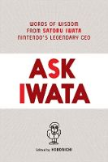
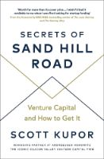
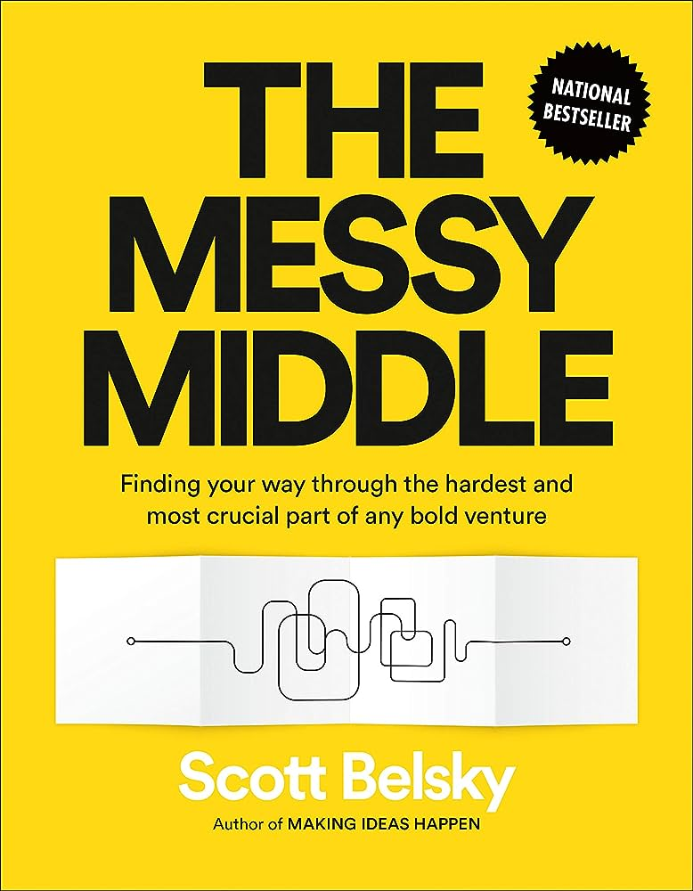
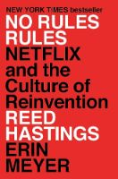
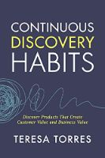
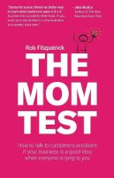
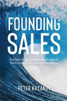
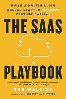

The PostHog team includes a number of voracious readers — we even have [our own book club](/handbook/people/training)! — so here’s a collection of the books our teams recommend. 

There are thousands of books which will tell you how to build a product and launch a new startup, but it can be hard to know which are actually worth reading and which are full of generic advice (or written by AI). If you’re looking for inspiration, where should you turn?

The PostHog team includes a number of voracious readers — we even have [our own book club](/handbook/people/training)! — so here’s a collection of the books our teams recommend.

If you're looking for more startup advice or support, don't forget to check out [PostHog for Startups](/startups), our program for helping early-stage teams get to product market fit. Our startup program includes $50,000 in PostHog credit, exclusive events and promotional opportunities, and is available to any company less than 2 years old and with less than $5M in funding. 

## [Ask Iwata: Words of Wisdom from Nintendo’s Legendary CEO by Hobonichi](https://www.goodreads.com/book/show/54736620-ask-iwata)
**Recommended by [Joe Martin, Product Marketing](/community/profiles/59)**

Former games journalist Joe has repeatedly recommended this collection of essays by Satoro Iwata in our book club Slack group. It’s one of the only books about management that he’s ever been able to finish. 

**Joe's review:** “I love Iwata's humble approach. He doesn’t gussy things up into a rigid framework for the sake of seeming like an expert, he just lays out his personal philosophy plainly and with plenty of examples. Iwata wasn’t a forceful idealogue; he wasn’t like Steve Jobs or [Elon Musk](/blog/learnings-from-elon). He believed in empathetic leadership, kindness and providing space for others. I really respect and respond well to that. 

"I don’t agree about the importance of a dress code, though.”

> **Putting it into practice:** We encourage everyone at PostHog to [write a personal README](/team) about their style of work and how they like to collaborate and be communicated with. 

## [From Switzerland by Counterprint](https://www.goodreads.com/book/show/60695040-from-switzerland)
**Recommended by [Lottie Coxon, Graphic Designer](/community/profiles/227)**

Lottie claims she doesn’t read very much, but when pressed for recommendations offered up From Switzerland as a representative of the entire Counterprint collection. Each book in the series collects work from some of the best agencies, designers and artists in each country — Switzerland, in this case.

**Lottie's take:** “This whole series is a good reset button for any designer stuck for inspiration. It has a heavy focus on typographical print case studies, with experimental use of layout, negative space and color.

“Honestly, I'm just a sucker for Swiss design.”

> **Putting it into practice:** Our approach to design has evolved a lot over time, [as has our brand](/blog/postmortem-rebrand). Iteration is part of how we keep things fresh!

## [Secrets of Sand Hill Road by Scott Kupor](https://www.goodreads.com/book/show/42348376-secrets-of-sand-hill-road)
**Recommended by [James Hawkins, CEO & Co-founder](/community/profiles/71)**

James reads a lot and could likely recommend enough books to fill an article all on his own but, when we asked for recommendations for first-time founders, this was one of the first books that came to mind. It focuses on explaining how startups operate from a VC’s perspective.

**James' review:** “Sand Hill Road was helpful for me when we started PostHog because we didn’t have any Silicon Valley insiders in our network. It taught me that all the returns in venture are based on just a tiny handful of companies — they simply can’t make their model work from companies that don’t totally smash it. 

“If you’re thinking about how to finance a business, it helps to be naturally aligned with this — which we are, it turns out!”

> **Putting it into practice:** Understanding how VCs think about startup has helped us raise funding, even when [we’ve decided to do it ahead of schedule](/blog/why-we-raised-a-15m-series-b-ahead-of-schedule)!

## [The Messy Middle by Scott Belsky](https://www.goodreads.com/book/show/40179007-the-messy-middle)
**Recommended by [Charles Cook, Operations & Marketing](/community/profiles/254)**

If there’s one person whose book recommendations are really worth listening to, then it’s Charles. Not only is he the leader of both our Operations and Marketing teams — he’s _also_ the founder of our internal book club.

**Charles' review:** “I like The Messy Middle because, as the title suggests, it covers the really important interim period for startups that are starting to scale. Most startup type books cover either the very beginning when you’re validating your idea, or the later stages when you are 50+ people. This book is full of specific, actionable advice for the time in between those stages.”

> **Putting it into practice:** When it comes to ops, there’s no silver bullet. Instead, [you need a whole toolkit](/blog/startup-ops-toolkit) to help you solve messy problems!

## [High Output Management by Andrew Grove](https://www.goodreads.com/book/show/324750.High_Output_Management)
**Recommended by [Grace McKenzie, Finance & Operations Lead](/community/profiles/718)**

Andrew Grove was Intel’s third employee, third CEO, and the man who led the company to the world’s largest producer of semiconductors. He also somehow found time to write this book about organizational theory which is beloved by our chief organizer, Grace.

**Grace's take:** “High Output Management is filled with light-touch and thoughtful management advice which can lead to increases in productivity. In particular it advocates for the importance of gathering relevant information, making decisive decisions, and nudging teams towards a goal rather than setting a specific direction.”

> **Putting it into practice:** We’ve templated [our approach to goal-setting](/handbook/company/goal-setting) so that we can make fast decisions, and not waste time discussing formats. 

## [No Rules Rules by Reed Hastings](https://www.goodreads.com/book/show/49099937-no-rules-rules) 
**Recommended by [James Hawkins, CEO & Co-founder](/community/profiles/71)**

When it came to envisioning the sort of culture he wanted to build at PostHog, no was more influential for James as this exploration of Netflix’s company culture. PostHog doesn’t copy Netflix’s approach completely, but we definitely share some of the underlying philosophies. 

**James' review:** “No Rules Rules clarified how we should totally trust each person here. It also helped us realize just how much a smaller, stronger, and better paid group of people can accomplish... It’s just so counter to the way that other companies operate, where they focus on the whole function.”

> **Putting it into practice:** We validated a lot of Netflix’s rules when [hiring our first five employees](/blog/posthog-first-five) — and we’ve rolled them into [our overall culture](/about).

## [Getting Real by Basecamp](https://basecamp.com/gettingreal)
**Recommended by [David Newell, Software Engineer](/community/profiles/860)**

Basecamp’s online manifesto about how they build products echoes a lot of the same principles we believe in, from the importance of iterative development to the focus on user feedback. David, who built several successful products before joining PostHog, thinks it’s a resource everyone can benefit from — not just engineers. 

David's review: “It very simply talks about avoiding ‘work work’. The focus on getting your product in front of customers as early as possible so that you avoid a bunch of implicit assumptions and sunk costs is particularly resonant.” 

> **Putting it into practice:** User feedback is _really_ important to us. So important that [we encourage everyone to get it!](/handbook/product/user-feedback)

## [Continuous Discovery Habits by Teresa Torres](https://www.goodreads.com/book/show/58046715-continuous-discovery-habits) 
**Recommended by [Annika Schmid, Product Manager](/community/profiles/221)**

In addition to the The Mom Test, Annika recommends this book for its practical advice on gathering information from users and turning that information into actionable change. 

“It explains a method around continuously talking to users as opposed to doing interviews in big batches around specific topics, like larger organizations do,” says Annika. “I think it’s particularly useful for startups and it’s something we definitely do at PostHog.”

> **Putting it into practice:** Talking to users is great, but only if you invest the time in turning it into [actionable snapshots](/blog/interview-snapshot-guide).

## [The Mom Test by Rob Fitzpatrick](https://www.goodreads.com/book/show/52283963-the-mom-test)
**Recommended by [basically everyone](/team)**

One of the most universally popular books among the team (shortly followed by The Design of Everyday Things by Dan Norman), The Mom Test has helped shape the way we think about product design and user feedback at a fundamental level. 

James recommends it in his guide to [finding product-market fit](/blog/product-market-fit-game), and Product Manager Annika Schmid is a big fan:

“The Mom Test is just a classic. Honestly, I recommend it for anyone who ever has to talk to users.” 

> **Putting it into practice:** Getting to product-market fit is a vital step for every startup — [including us!](/blog/product-market-fit-game)

## [Founding Sales: The Startup Sales Handbook by Daniel Kazanjy](https://www.goodreads.com/book/show/46019973-founding-sales---the-startup-sales-handbook)
**Recommended by [Simon Fisher, Customer Success](/community/profiles/49)**

PostHog doesn’t have a sales team, but if we did then this book by Daniel Kazanjy would likely be an important resource for them. It covers a lot of ground and much of it isn’t directly relevant to a team like ours, but it remains worth reading for the practical discussion of how to scale customer-facing functions. 

**Simon's review:** “Founding Sales is written primarily for Founders and CEOs, and covers all of the bases when it comes to sales. I personally skipped some of the founder-centric stuff and focused on the advice for scaling Customer Success teams, which I found really useful.”

> **Putting it into practice:** We don’t have a Sales team, but [our Customer Success team](/handbook/small-teams/customer-success#mission) is very successful!

## [The SaaS Playbook by Rob Walling](https://www.goodreads.com/book/show/178816351-the-saas-playbook)
**Recommended by [Lior Neu-ner, Technical Content Marketer](/community/profiles/684)**

The SaaS Playbook isn’t your normal startup how-to guide, according to Lior. It doesn’t offer the usual hype around massive valuations and the importance of venture capital. Instead, it offers down-to-earth, practical advice for launching a new SaaS product in a repeatable way. 

**Lior's review:** “It’s a very alternative guide to building a startup. While most books center around hyper growth and fundraising, the SaaS Playbook teaches you how to achieve financial independence to build a sustainable and bootstrapped business.”

> **Putting it into practice:** Product launches are a perpetual activity at PostHog, so our marketing team is always working in bootstrap mode — with help from [their favourite tool](/blog/posthog-marketing).