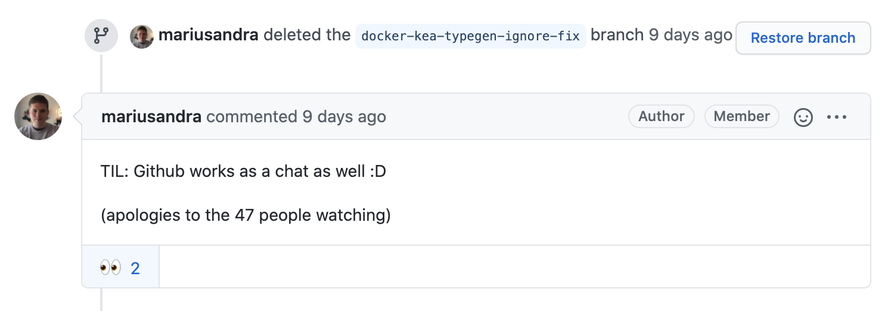
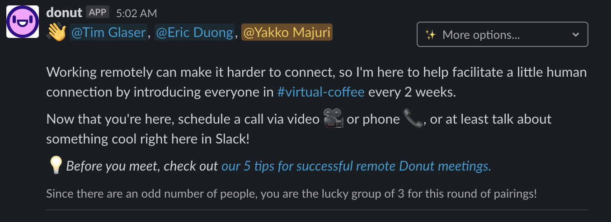
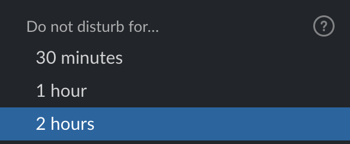
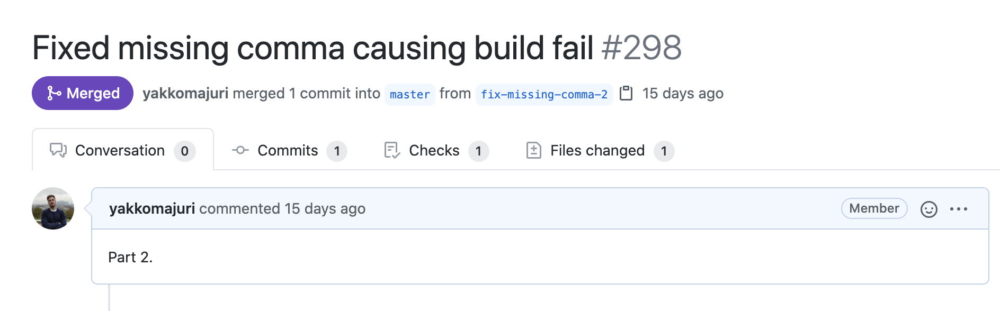

Many companies are currently having to adjust to remote work, but what about the ones that started this way from scratch?

PostHog has a team of 12, 10 of whom have never met each other in real life. 

So, what's it like building an all-remote company from the very first day?

## Communication 

 

Communication is perhaps the single most important value for us at PostHog. In our view, getting this right is essential to running an all-remote company successfully. As such, we highly value the following concepts:

#### Asynchronous Communication
Async communication means people shouldn't rely on getting an immediate response from someone else in order to do their work. 

In our case, most of our communication happens openly on GitHub. This is great because each conversation occurs within a specific context (e.g. of an issue or PR) and all the information needed to discuss the topic should be readily available within that context. Additionally, people aren't pressed to reply immediately, and will get to it when they get to it (sometimes with a little nudge).

We also don't send internal emails. Zero, zilch, _nada_. 99% of the time, we're talking on GitHub, Slack, or a call. We also mostly use Slack for non-work-related, private, and more urgent conversations. If it doesn't fit one of those categories, chances are it could be on GitHub.

#### Transparency
Transparency means that if some information or a particular conversation can be public, we should try to make it public. 

This way, we create an ever-growing record of things that have been previously discussed, questions that have been asked, and answers that have been found. 

As such, when someone needs some info, they don't need to message a team member to get what they need. They can just find it immediately. 
We extend this concept quite deeply, having our entire [Company Handbook](/handbook) public, which outlines things like how we do sales calls, our approach to talking to investors, and how we hire people. As such, if there's ever a question about how we operate as a company, referring to the handbook will usually get you the answer. 

Additionally, our massive backlog of issues and pull requests also contains very useful information regarding how we've come to certain decisions, from engineering to marketing. 

Transparency pairs up especially well with the fact that we are an open source company: it's not only our code that is "open source". Heck, James, our CEO, even [used to keep his to-do list public](https://jefhawkins.com/todo/). 

#### Written Communication
Underpinning the aforementioned points is our preference for written communication. 

The mantra goes: WRITE STUFF DOWN

At PostHog, a large part of our async and transparent culture is underpinned by written communication. In our view, writing things down is great because it is:

* **Faster:** If something doesn't need to be a call, it shouldn't be a call. Calls are great for the social aspect they bring, but for day-to-day work, they often are a slower process for making decisions, given that they include small-talk, internet issues, and scheduling difficulties. Communicating via writing can help save time.

* **Referenceable:** Unless you record all your calls, chances are you might forget something that was discussed in a meeting. However, by trying to write instead of calling, and taking notes when we do call, we can always refer back to what was discussed and easily expand on the discussion later on.

* **Clearer:** Writing something out requires some effort to communicate your point of view effectively. As such, writing can help you distill your thoughts into concrete points, as well as present these points to others in a more solid way. 

## Socializing

 

Being all-remote, our team is unable to grab a beer together after a week of hard work. 

As such, we have to make up for this somehow! 

In order to socialize virtually, we do a lot of the traditional things remote companies generally do. We have a bot that schedules virtual coffee meetings between random team members, we have banter in Slack, and we plan offsites. 

However, our favorite concept is what we call "Life Story Fridays". Every Friday, someone from our team spends about an hour telling the entire company about their life. It's entirely up to them how they go about this, but we generally get a bit about their professional background, a good amount of childhood photos, and a whole lot of interesting facts, such as:

* Max, our Software Development Intern, ranks in the Top 5 for Pi digit memorization in the UK, is an accomplished ballet dancer, and runs a popular website for learning Latin.

* James, our CEO, wanted to be a professional cyclist. Being a programmer on the side was just a way to keep that dream alive. 

* The other James, one of our Engineers, is on his way to get a pilot license.

* Tim, our CTO, was first paid for work as a programmer at 13!

We're big fans of our Friday event, and it's brought us closer as a result. 

## Flexibility

 

At PostHog we simply don't track hours at all. All we care about is output.

If you're getting your work done, that's what matters. It's not important where you like to work, when you like to work, or how you like to work. We just expect team members to:

* Do the tasks that have been organically assigned to them
* Be proactive in helping out where they recognize they can lend a hand
* Enjoy their work

All we ask if that you join our daily standup and make sure you keep up with our team communication. However, we don't need you to be online all the time, since we generally prefer asynchronous communication. More on this means later. 

We also believe you shouldn't overwork yourself. As a result, anyone at PostHog can have unlimited time off, and we strongly suggest taking at least 25 days a year. It's not good for the individual nor the company if team members are feeling stressed or low on energy. 

As a result, it's not uncommon to hear something along the lines off "I'm renting a 4x4 and going off to the mountains tomorrow" on Thursday's standup. 

It all comes down to trust. We hire people we believe in and give them autonomy and flexibility to drive us forward. 

## Ship, iterate, ship

 

<small class="centered">Photo by Shaah Shahidh
</small>

 

When you're working with a remote team, especially one distribute across timezones, it can be difficult to get things done fast if they rely on more than one person's work.

For this reason, we believe in asynchrony, as mentioned before, but also the concept of [shipping whenever](/blog/we-ship-whenever).

The idea is: you've done some work, either individually or as a team, and it feels like it is ready to be published, even if it's not perfect. Well, just ship it. 

This can mean a blog post, a tweet, or a new software version. If a failure wouldn't have massive consequences, just put out your work. Once it's live, you can review it, gather feedback, and improve upon it. We do this **a lot**. 

At PostHog, on a small scale, this means not waiting for our designer to make an amazing blog illustration to put our a new post, or waiting for QA to change a typo on the website. On a larger scale, it can also mean not waiting for a feature to be perfect to launch it to our users. The [PostHog Toolbar](/docs/user-guides/toolbar) is a perfect example of this.

The key to this is a culture of iteration, as well as giving the team a sense of autonomy and responsibility. You should always aim to unblock yourself if you feel it's right and can do it without serious negative consequences.

## Pull requests > Issues

 

At PostHog, we try our best to create a culture of submitting pull requests over opening issues. 

The idea is, if you find a bug that needs fixing, or want to build a new feature, if you can do it without much work, you should just do it.
Rather than opening a ticket for someone else to handle, just pick it up on the spot and fix it. 

This requires a culture of flexibility, where people's work is allowed to diverge based on what ideas they have or issues they encounter throughout the day. 

However, with such a culture in place, you build a team of doers who are consistently pushing product quality and willing to help out with things outside of their official job description.

## Diversity

 

In addition to having access to a much broader talent pool, building an all-remote team across various countries gives you the unique chance to get people on board who have distinct backgrounds, speak different languages, and most importantly: think differently.

This can mean [discussions about what a "biscuit" is](https://www.youtube.com/watch?v=8EUSPmz6n-E), as well as having a team member run a call with a customer because they share a native language. 

Since our goal is to build an innovative product, it's important to be exposed to multiple perspectives, and there are few better ways to do so professionally than hiring people from various corners of the Earth.

At PostHog, for example, we currently have people based in the US, Brazil, England, Senegal, Belgium, Estonia, Germany, and many other countries. As a result, we consistently get exposed to perspectives we may not have come across before, growing both as individuals and as a company. 

## It's in our DNA 🧬

PostHog has been remote from day 1, and we don't intend on changing that. 

It's been a journey full of "Wait, so where are you right now?" questions, through which we've managed to put together a world-class team to build an ambitious product. 

And while it hasn't been the easiest, sometimes because of bureaucracy, sometimes because of bad internet connections, we wouldn't trade it for anything. 

After all, we want to continue hiring talented 18-year-olds from Poland and experienced founders from Mexico. Because remote isn't what we do - it's who we are. 

_Enjoyed this? Subscribe to our [newsletter](https://newsletter.posthog.com/subscribe) to hear more from us twice a month!_

