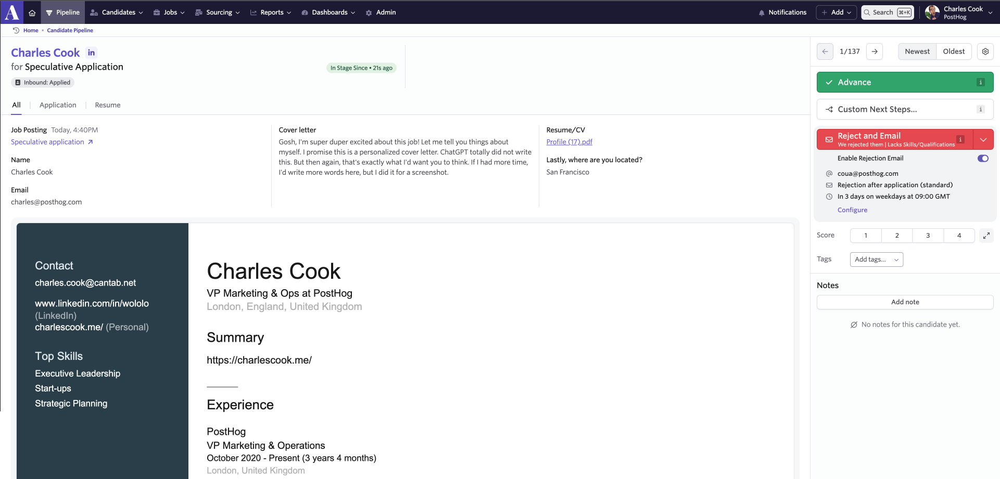

Last week we opened a new marketing role at PostHog, and we got 300 applicants in the first 2 days. This was high, but not unusual for a startup – my record is 900 in a day, but I bet folks working at giant companies like Google see way way more. Of these 300, 12 got an interview. 

As I sifted through these, I realized a very obvious thing - there is a _much_ bigger gap between what applicants and recruiter experience than either group realizes:

- What applicants and recruiters see on their screens are _completely_ different. This leads to some needlessly funky looking applications – luckily this is easy to solve. 

- You may spend 30min+ researching a company, crafting a cover letter and applying. At these numbers, I was able to spend **less than 1min** reviewing each application. And this is just an average – some applications took me 5s(!) to realize they were a no, so I could spend 5min+ reading good ones carefully.

Remember, professional recruiters don't just spend their time reviewing applications, they're also: conducting and scheduling interviews, collating feedback, negotiating offers, onboarding new hires, creating headcount plans, putting up job ads, etc.

So, while it may seem extremely harsh that your application only gets a quick review, bear in mind we're trying to figure out whether to invest dozens of people hours putting you through the full hiring process. 

By sharing a bit of insight into how the _application_ bit of the hiring process actually works at a startup like PostHog, hopefully I can help increase your chances of landing a first round interview at least! Beyond that, no promises...

## But first, some context

I'm talking about startups with a reasonable degree of brand recognition – i.e. not a startup founded last week). In PostHog's case, we are:

- 42 people, $27m raised
- Team is 70% engineers
- 1 in-house recruiter, no agencies

In the last 12 months, we received over 9,000 applications, or an average of **460 applicants per role**. That's a lot of applications to sift through, many of which are automated/no-effort one click applications.

Let’s get into it. 

## So, what happens to my application after I hit send?

If you're applying for a job at a startup, chances are they are using an applicant tracking system (ATS) like Ashby, Greenhouse, Lever, or Workable. We use Ashby, but the process a recruiter follows generally doesn't vary massively between these systems. This is what a typical application looks like:

## How do I maximize my chances of getting through?

This stuff is subjective, but generally these are the things that can increase the chances of a good application making it through:

- Write a short and _obviously_ personalized proper cover note
  - A few sentences about why you are interested in this role specifically is fine
  - You don't need 5 paragraphs that are just your resumé slightly reworded - it's just more text we will skim over
  - Our ATS will wreck your formatting beyond line breaks
  - Writing 'hi I'm X' is a waste of words (we know who you are!)
  - Match the tone of the company - for example, we are informal so please no 'Dear Sir/Madam'
  - If you can figure out what the company cares about, or who is in it - talk about how you think you could help them achieve their goals and why
  - Write _something_ - if it's too much hassle, that's ok, you're probably not that interested!
  - No ChatGPT - they're really obvious
- No profile pictures - this isn't social media, and you're wasting the space
- Stick to boring formatted CVs - prioritize clarity over design
  - I'd go so far as to say that exporting your LinkedIn profile as a PDF is totally fine, but...
- Keep your LinkedIn up to date - it makes us suspicious when there are big discrepancies between the two
- Don't have your CV end in 2021 or whenever, we don't have time to contact you to query it - we don't care if you had a career break, just put that
- Emailing the recruiter/hiring manager directly causes more stress because we then have to add you to our ATS - please apply directly, we are dying here

## I did all this and it didn't work – where's my feedback, you assholes?

When you apply for a job at a startup and don't get past the first stage, you'll either get nothing back (booo) or an automated email saying you have been unsuccessful. Applicants who felt they were a great fit might, quite reasonably, ask for feedback as to why they weren't successful. 

But, here's the thing... we say no to a lot of candidates who actually meet the spec on paper. This doesn't mean you are a bad candidate, it just means that _relatively speaking_ you were not as strong as other candidates who applied this time. 

We find ~5% of candidates ask for feedback. If we replied to each one and spent ~5min writing each email, we'd be spending 30-60min on a typical day sending people feedback. This is why we tell people to only expect feedback after any interview stage. I expect this picture is similar for most startups.

## Recruiters love this - one weird hack to bypass all of this

Get a proper, warm referral. Annoying, right? But it works. Of the 12 people who got an interview for our recent marketing role, 4 were enthusiastic referrals from an existing member of the PostHog team. We trust our existing team's judgement incredibly highly - they already met the bar to join our team _and_ they help us pre-filter applicants. 

This doesn't mean "randomly hassle X who works at PostHog for an intro to Y" - work hard wherever you are to leave a good impression on everyone you talk to at the company. We do talk to each other!

## Moar reading

- Got the interview? [Here are the questions](/founders/what-to-ask-in-interviews) you should be asking. 
- [Literally everything](/newsletter/hiring-at-posthog-lessons) we've learned about hiring at PostHog
- How do you make your [first ops hire](/founders/first-ops-hire)?
- A bunch of [myths and truths](/founders/early-stage-startup-hiring-strategy) I've learned about startup hiring in the last 10 years
