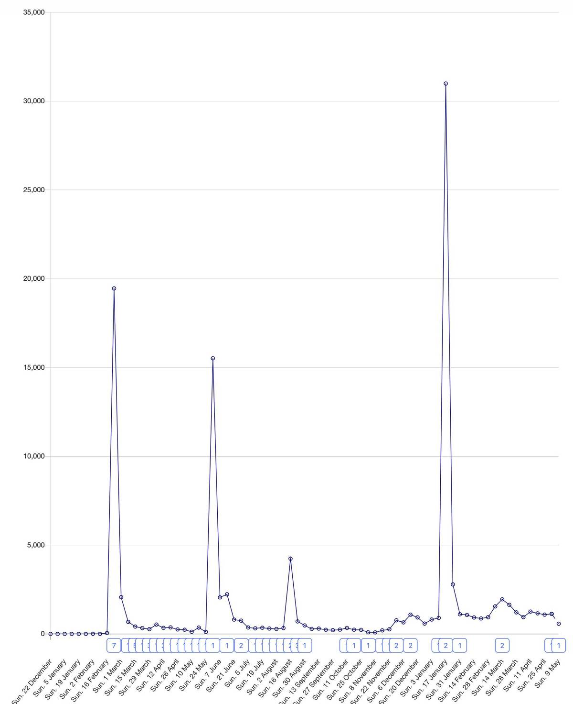

As a founder, one of the most surprisingly important skills I've realized I have is hitting the front page of [Hacker News](https://news.ycombinator.com).

Out of five posts that I hoped would get there, four did. Look mom, lots of traffic:

I don't claim to be a well-established writer. Amongst other things, I'm inconsistent with publishing and being British means I wrestle with US English. On the flipside, I've spent an embarrassingly large amount of time reading content that engineers find engaging.

This is what I have learned thus far. I've created a framework for those also working at developer-focused companies, writing for the same audience as me. You may also [what we've learned about dev tool marketing](/blog/dev-marketing-for-startups) interesting, too.

> Disclaimer: my company doesn't care about appealing (directly) to CTOs. If you work at Top Down Enterprise Technology Corp, just do the opposite of what I say.

## Be human

Personal theory: humans evolved to care about other humans - it's how we survived as a race through prehistoric times. Companies are mostly a bunch of humans, so if you get that across then people will want to read your writing.

*Do:*

* Give character to the _humans_ involved in what you write about. Go into unexpected detail. Tell [stories](https://hbr.org/2014/07/how-to-tell-a-great-story). They don't need to be impressive - the goal is to make things real.
* Make it real by adding real life photos, chat logs, social media posts, social media profiles, etc. 
* Add humor - be self deprecating where appropriate. No one is perfect. We make mistakes, and being willing to open up builds trust. 

*Don't:*

* Give clichéd startup advice. If what you're writing is generic advice that 90% of people already know, and is something that PostHog just followed, then assume the audience will already know it. 

## Be concise

Think about your audience here, folks.

The life of a developer involves rapidly finding answers to sometimes-what-feels-like-endless problems. Whilst not universal, my grand theory here is that many have an impatient reading style developed by scanning for relevant information all day... probably something to do with googling Stack Overflow a lot.

<iframe src="https://giphy.com/embed/10eJOwQ9BKrF72" width="480" height="270" frameBorder="0" class="giphy-embed" allowFullScreen></iframe>

"I would have written a shorter letter, but I did not have the time." - [Blaise Pascal](https://en.wikipedia.org/wiki/Blaise_Pascal)

Most of your time should be spent *re*writing.

*Do:*

* [Omit needless words](https://en.wikipedia.org/wiki/The_Elements_of_Style). 
* Keep sentences short, varying them every now and again.

*Don't:*

* Use generic segues like "Here are five elements that..."
* Use lines like "This has brought us many benefits"
* Use complicated or cliched words like "disruption"
* Repeat yourself
* Tell people what they are about to read or what they just read

## Pick a side

The world is full of information - but if you can get them right, it's more valuable to give recommendations distilled from the information available.

It's especially interesting to read well-reasoned, contrarian points of view. For example, at PostHog we focused on engineering instead of sales from early on - it's interesting to learn why we did this and the impact it had.

*Do:*

* Be opinionated
* Provide contrary points of view, if you believe in them
* Give lots of anecdotes

*Don't:*

* Say things like, "Ultimately, it's up to you"
* Lead with, "This article will help you decide"

## Be engaging

There are 1.8 *billion* websites on the internet, [apparently](https://www.internetlivestats.com/watch/websites/).

[Alex Ohanian](https://twitter.com/alexisohanian) does the best job of summing up what this means for your readers - "They're only a click away from a picture of a funny cat".

*Do:*

* Get the title right, first. It sets direction. Do not create a title after the piece - if you can't get it right up front, you haven't got a clear enough idea of what you want to write. The end result will be a vague, unopinionated, and dull piece of writing. You may need to start writing the piece to get a sense of what the article _should_ be (see ideas on [creative faucets](https://twitter.com/Julian/status/1327765347936522240)). If this happens you should smile, throw away most of your previous work and get writing!
* Frequently link to the places that you reference - Wikipedia, Twitter accounts or threads, GitHub issues. This encourages people to explore each topic further for themselves.

*Do not*:

* Use clickbaity titles. Developers are power internet users who will see through them. "How to make X not suck", "Top 10 ways to X". They _should_ be interesting and engaging but not a cliché.
* Be very careful if you are being dismissive about others. You should _never_ alienate your own audience. Be kind.

## Be precise

Being concise means giving a lot of information clearly and in a few words. It doesn't mean skipping details.

*Do:*

* Be specific. Developers are interested in this stuff. Name the database we use for scalability, drop a link to it.
* Add quantities where you can. "We grew a lot because of X" -> "We had our first 100 users from X"
* Say what things do and use diagrams to explain stuff. Don't use high level language.

*Do not* use any of the following phrases:

* "A lot"
* "Soon"
* "Quickly"
* "Better"

## Start

Whatever you do, make sure you actually get something out. You can't improve something that doesn't exist.
