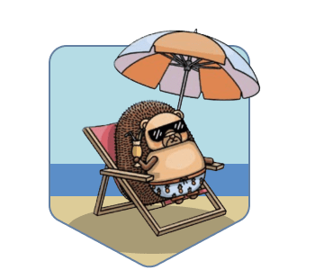
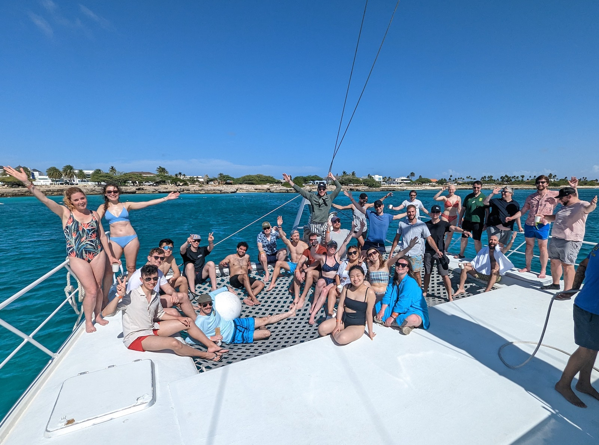

<!-- Temp, until it's added correctly below -->

<OffsiteHeader 
  badge="../../../images/offsites/2023-aruba/offsite-badge-2023-aruba.png"
  location="Oranjestad, Aruba" 
  date="March 2023" 
  team="Whole company" 
/>

<OffsiteDescription>
Aruba is one happy island. (Also very windy.) The team stayed at the all-inclusive Renaissance Hotel and enjoyed some R&R on their private island. We enjoyed an afternoon on a catamaran and went snorkeling.
</OffsiteDescription>

<OffsiteAttendees count="28" />

<OffsitePhotos />

<!-- Temp, until it's added correctly above -->

<OffsiteHackathons>
  <OffsiteHackathonsItem name="Event-based automations" url="#" />
  <OffsiteHackathonsItem name="Hedgehog mode for Toolbar" url="#" />
  <OffsiteHackathonsItem name="Beta feature opt-in" url="#" />
  <OffsiteHackathonsItem name="Multi-tenant data warehouse" url="#" />
  <OffsiteHackathonsItem name="AI docs chatbot" url="#" />
  <OffsiteHackathonsItem name="User-facing bug report portal" url="#" />
  <OffsiteHackathonsItem name="Dashboard templates" url="#" />
  <OffsiteHackathonsItem name="ClickHouse manager" url="#" />
</OffsiteHackathons>

<OffsiteMerch>
  <OffsiteMerchItem name="Beach towel" image="/contents/images/offsites/2023-aruba/merch/aruba-towel.png" />
  <OffsiteMerchItem name="Tote bag" image="/contents/images/offsites/2023-aruba/merch/aruba-tote.png" />
  <OffsiteMerchItem name="Laptop stickers" image="/contents/images/offsites/2023-aruba/merch/aruba-stickers.png" />
</OffsiteMerch>

