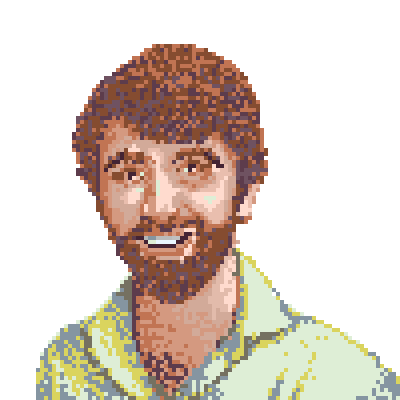
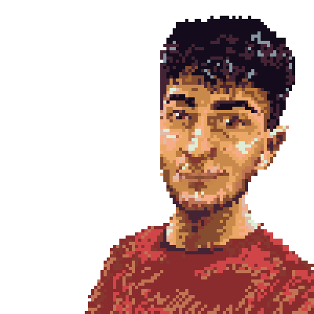

<!--- Intro Info -->

<h3> We are proud to be misfits. Why? </h3>

Building an unusually great company starts with an unusual team.

We don't care if you haven't finished (or attended) school, if you were super important at a FAANG company or if you ran a startup that crashed and burned.

What we do care about is your ability to learn, iterate, and ship.

That's why we have people in Belgium, Brazil, the East and West coast of the US, England, Estonia, the Netherlands, Senegal, among other places. Learn more about [diversity](diversity) at PostHog.

 <small class="centered">Our team of 13 is distributed across 10 countries and no two team members live in the same city. </small>

<!--- Core Team Section -->

## Core Team

<!--- James Hawkins Bio -->

### James Hawkins, Co-Founder & CEO

I spent the first 10 years of my career trying to be a professional cyclist. I used to do web development part time to make some money on the side. I wasn't particularly good at either.

I live in Cambridge with Fran (wife), Ruby (daughter), and Wally (cat). Since you're probably wondering, the cat's name is a reference to [WALL-E](https://en.wikipedia.org/wiki/WALL-E) - work for us to find out why.

After a growing sense of my own mortality combined with a bunch of large crashes put me off continuing with my cycling career, I bootstrapped an online marketing company to several million dollars a year.

I wanted more experience of working in a VC backed startup, so I could work on something really ambitious. I moved to [Arachnys](https://arachnys.com), and somehow wound up as a their VP of Sales for a little over 4 years, where I used to manage a team selling very large enterprise software deals. We learned how to take our sales from an average of \$5K/year to over \$1M/year.

I started working with Tim on a few ideas that didn't work out in August 2019. We built PostHog during the YCombinator W20 batch, and launched in February. You can work out what I've been up to since by stalking me online.

<!--- Tim Glaser Bio -->

### Tim Glaser, Co-Founder & CTO

I've been coding since I've been 11, which isn't as long ago as I'd like it to be. Someone first paid me to write code when I was 13 (though I'm sure they regretted it) and [someone else](https://en.wikipedia.org/wiki/Cloud9_IDE) gainfully employed me when I was 16.

Originally from the Netherlands, though I quickly moved to London (I do not generally enjoy nice weather) where I joined Arachnys and shortly afterwards met James Hawkins. I went from being a software engineer, to product manager, to "leading" an R&D team, which consisted of just me.

After four years I thought it was time to go do something else and had lined up a new job. Roughly 37 seconds after it was announced James wanted to "grab a beer." While plying me with alcohol, he convinced me to give up this fancy new job and instead start a startup with him.

In my 'spare' time, I fall down snowy mountains, wrestle in the mud over an egg-shaped ball and watch a lot of Bondi beach in order to perfect my Australian accent.

<!--- Marius Andra Bio -->

### Marius Andra, Software Engineer

I first got into programming in 1994 when I wanted to make my own computer games... and asked my father for help. He sat me behind a Turbo Basic interpreter, wrote `PRINT "Marius on tubli poiss"` and then left me there. I was 8 years old.

Luckily we had a [Yamaha YIS-805/128R2](https://www.msx.org/wiki/Yamaha_YIS-805-128R2) lying around... with floppy disks full of random .BAS files. I was hooked. Cue to the beautiful loops of CLS, PRINT and GOTO statements that ensued. I even made some games where you could move two dinosaurs who got points when they kissed each other. It was glorious.

I also got into "web development" in 1997 after seeing Netscape at my mother's university. They even provided me with a generous 10MB of space to host my own [beautiful website](https://web.archive.org/web/19980128032518/http://rasi.lr.ttu.ee/~marius/), complete with animated gifs, a Mortal Kombat fanpage and a strong recommendation to use 800x600 with HiColor!

This was followed by years of writing games in C++ and then [writing tutorials](https://web.archive.org/web/20110626030555/http://cone3d.gamedev.net/) about them, coding websites in Perl, PHP, Java and Ruby... and "losing" a decade as the CTO of two failed startups.

On the side I built an [open source database analytics platform](https://github.com/mariusandra/insights)... and when that [got on Hacker News](https://news.ycombinator.com/item?id=22347516), James reached out... and the rest is history.

These days I live in Belgium and code [state management libraries](https://kea.js.org/) in JavaScript for fun.

<!--- Eric Duong Bio -->

### Eric Duong, Software Engineer

I recently graduated and while in college I helped cofound a social dining platform. I spent two years trying to get strangers to cook and dine with each other. In reality, it turned into a 2 year stint of teach yourself as much mobile development as you can while simultaneously trying to build a usable platform. My cofounders and I had our fair share of contemplating dropping out of school and becoming a unicorn in 5 years—it didn't work out.

Somewhere along the way I fell down the bitcoin rabbit hole and after realizing day trading crypto wasn't a feasible nor fulfilling long term goal, I remained fascinated by digital currency. This led me to briefly work with a company building a digital cash transfer system for developing economies.

I currently work as a generalist around most of Posthog's stack building many of the user-facing features but occasionally pick up backend tasks.

To end with an obligatory "I dO MoRE ThAN COdE" detail: I plan to take advantage of Posthog's all remote policy to travel and hike as many major mountain treks around the world as possible. Ambitions subject to change as always though.

<!--- James Greenhill Bio -->

### James Greenhill, Software Engineer

When I was a kid the first thing I remember wanting to be was a pilot, so naturally here I am knee deep in code and data!

Growing up was slightly different in Florida. Things that are normal there are growing up in the water and spending almost all of your free time in it. In the Gulf of Mexico for me. We’d go swimming, scuba diving, or fishing in that warm body of water almost every weekend.

Nowadays I’m spending my free time on a bike finding some new trail up in the northern bits of the Bay Area that I call home now. If not on a bike you’ll find my friends and I on a hike either around here or over in Tahoe or some National Forest east of here. Lately I’m trying to get back into flying. I’ve got about 80 hours of flight in the book, but still don’t have my ticket! It’s time to change that. In the winter time you can find me ruining skis on some mountain.

In my professional life I’ve generally managed mopping up the 1’s and 0’s. I’ve led data at an [upstart music streaming company](https://en.wikipedia.org/wiki/Grooveshark), and dove way too deep into the depths of the comment section leading data at [Disqus](https://en.wikipedia.org/wiki/Disqus). Kept an eye on a fleet of [Autonomous Ubers](https://en.wikipedia.org/wiki/Uber#Self-driving_car_research). Most recently I combined my interest in bikes with data leading data engineering at [Jump](https://en.wikipedia.org/wiki/Jump_(transportation_company)), still the best micromobility company out there.

When I’m not out and about in nature you can find me at home with my cat Tesla and Taco our goofball of a Lab Corgi mix.

<!--- Michael Matloka Bio -->

### Michael Matloka, Software Engineer

Got into software by tinkering with bada OS – if anyone even remembers that! – and just never stopped (though I did move to Android soon and later became an iOS fan).

Before graduating from high school here in Poland – and having some open-source projects under my belt, including [a Discord bot with thousands of users that became my gateway to Python](https://github.com/Twixes/somsiad) – I decided that the most interesting way to grow and meet some great people along the way will be to work on a quality product commercially. 

Happy to report that I ended up joining PostHog, where open-source software, a quality product and great people all mix freely!
In free time, I dabble in [outer space](https://www.kerbalspaceprogram.com/), [math](https://codepen.io/Twixes/pen/Zwxxdv), [design](https://www.lingscars.com/), [photography](https://unsplash.com/@twixes) and [cinema](https://www.nowehoryzonty.pl/index.do?lang=en). Decidedly a fan of precipitation and overcast weather, I have a secret plan to move to the Nordics or the UK one day.

<!--- Paolo D'Amico Bio -->

### Paolo D'Amico, Product Team

I started coding when I was about 9 years old, starting with the very basic LEGO RCX & Turbo Pascal language. I always enjoyed learning new languages, frameworks or technologies on my own, especially with a good book. Funnily enough, I decided not to study computer science.

Before joining PostHog, I lead a product team at Grow Mobility, the largest micro-mobility company in Latin America at the time. Before that, I co-founded Flinto, a Y Combinator startup targeting financial inclusion in developing economies. I enjoy reading while walking around strange places, and have tripped more than once.

<!--- Lottie Coxon Bio -->

### Lottie Coxon, Graphic Designer

I am from the UK - so by default I love the pub, marmite and tea (but not all at once, that would be a sin).

I spent my youth trying to master fine art, after my teacher said I was awful and that I should try something else.
In my stubbornness I decided to prove her wrong, and here I am - a designer.

I was quite a weird child. I once ran a race with locked legs (Forest Gump style) because I had a dream the night before that I won by doing so. For those who are wondering, no I did not win. But I would rather be the weird child than the boring one.

I took Graphic Design at university and graduated this summer and instead of a summer of fun, I was faced with a crashing economy, a pandemic and and a collapsing job market. But thankfully, after putting my portfolio on twitter, I was contacted by PostHog a mere 24 hours later.

I am now their Graphic Designer, and spend my days composing layouts for the website, designing the product’s aesthetic, and most importantly drawing hedgehogs with sunglasses on.

On a side note I have decided to move to Senegal (Africa) to be with my boyfriend George. It’s a bold decision really as I cannot speak French, but I will (try) learn.

*French accent* C’est la Vie

<!--- Yakko Majuri Bio -->

### Yakko Majuri, Technical Writer and Developer

Often on the move, sometimes by choice, and sometimes by chance, I'm a Brazilian-Finn who has lived in 5 countries across 4 continents.

Passionate about teaching (but far from an academic), I taught an official high school course before graduating high school, became a Visiting Scholar before joining university, and presented my first paper at the European Central Bank during my freshman year (anonymous submission - they thought I had a PhD).

Prior to PostHog, I was a technical consultant for clients which included a Fortune 500 company. A fan of building useful things, I'm a self-taught developer who has worked on an a wide variety of projects, from a travel app, to multiple websites and browser extensions, and even some white-hat hacking. Most failed, but there are a few I'm very proud of, especially my work in the blockchain space.

For the past three years, I developed a nice habit of writing about my projects, which led me to a [Medium page](https://medium.com/@yakko.majuri) that surpassed 250k views in just 30 days. I then decided writing should be more than a hobby, and so, here I am.

When I'm not working, I have been found hitchiking in foreign lands, taking pictures of political demonstrations, and trying to learn Korean after one too many beers. I'll pick playing cards with my grandmother over the club on any Friday night, and my favorite place to spend the Saturday is on top of a mountain.

Oh, and I'm also part of the select group of software developers who have won a dunk contest in their lifetime. If that means anything.

<!--- Karl Bio -->

### Karl-Aksel Puulmann, Software Engineer

I spent my childhood in a tiny village in the middle of nowhere (Väätsa, Estonia), playing football, working in construction and driving tractors. I used it buy my own computer, but did not do much more than listen to music, play games and watch anime with it.

Things changed in highschool, where we had a programming class. I started creating my own games, participating in competitions (even going to International Olympiad once) and generally learning and reverse engineering anything I could get my hands on.

Some time has passed since then - I have since been a student, teacher, first engineer at a guitar learning startup, worked in fintech, helped scale a database cluster holding 1PB of data at an analytics company, learned and helped automate manufacturing of stickers, been a CTO in agritech startup and now learning how this open source business works.

In personal life, you can find me in the wilderness looking for geocaches or hiking, buying too many books and recently trying to figure out this parenting thing.

<!--- Charles Bio -->

### Charles Cook, Business Operations

Born and raised in the United Arab Emirates, I'm half British, half Lebanese, and lived in a variety of places growing up across the Middle East, Africa and Europe. Now based in London, I live with my wife Steph and son Remy, who was serendipitously born right at the beginning of lockdown here in the UK. 

I take care of all things business ops-related at Posthog, across finance, people, legal and basically anything else that doesn't involve actually building the product! Posthog is now my 3rd startup - I was previously COO at [Vitl](https://vitl.com), (personalised nutrition), and before that I was Director of Product at [ROLI](https://roli.com) (electronic music products). 

I'm a big fan of terrible jokes, beautifully crafted sandwiches and looking at [designer houses](https://www.themodernhouse.com/) I will never live in. I like to occasionally torment my son with my piano playing and spend more time than is probably reasonable making lists of things, à la [High Fidelity](https://en.wikipedia.org/wiki/High_Fidelity_(film)). 

<!--- Eltje Lange Bio -->

### Eltje Lange, People and Talent

Originally from Northern Germany, I moved to the UK in 2017 and I am now based in East London. 

Just like James, I used to be a professional cyclist until I realised you can’t make a living as a female cyclist. After a short identity crisis, I started university with the goal to become a management consultant. That never happened, I luckily realised my skills and personality are much better suited in a people (I guess non-startup people call it HR) role. 

At PostHog I look after our People and Talent function and my goal is make PostHog THE best company to work for. Previously I worked in very a similar role at a startup called [Farewill](https://farewill.com), who offer services around death (yes, you read right). Prior to that, I worked for a couple of companies later on the scaling journey, like [TransferWise](https://transferwise.com/) and [Xing](xing.com).

Outside of work, I am working on my [Masterchef](https://en.wikipedia.org/wiki/MasterChef) skills and I love to go for a run or cycle around London, do yoga and drink coffee. 

<!--- Cory Bio -->

### Cory Watilo, Lead Designer

As one of the few PostHoggers who never attempted to enter the world of professional cycling, I instead spend much of my free time exploring new coffee shops or wine bars, generally sipping a cold brew iced coffee in the morning and a nice rosé once it hits 5:00 somewhere.

Due to the fact that I generally require both warmth and sunshine to function at any normal capacity, my wife and I bought an RV a couple years ago and hit the road fulltime, our sole requirement being that wherever we travel _must_ have a [UV index](https://www.google.com/search?sxsrf=ALeKk010aYaVBhFgzWm_AysLPp_ytPyFRg:1610376210393&q=What+is+the+best+UV+index+to+tan%3F&sa=X&ved=2ahUKEwjMk-bvjpTuAhXBp1kKHXVtDIwQzmd6BAgTEAU&biw=1080&bih=946&dpr=2) of 6 or greater. (At 45 feet long, our RV is larger by square footage than many apartments in New York or San Francisco!)

Our party of 2 became a party of 3 last year. 🎉 Now that I am officially a dad, I am now legally entitled to make dad jokes. So in light of the rich cycling history of our company, I present the following: "Why couldn't the bicycle stand up by itself? It was two tired."

<!--- Contributors Section -->

## Contributors

