<!--- Intro Info -->

<h3> We are proud to be misfits. Why? </h3>

Building an unusually great company starts with an unusual team.

We don't care if you haven't finished (or attended) school, if you were super important at a 'Big Tech' company or if you ran a startup that crashed and burned.

What we do care about is your ability to learn, iterate, and ship.

That's why we have people in Belgium, the East and West coast of the US, England, Estonia, South Africa, the Democratic Republic of Congo, among other places. Learn more about [diversity](/handbook/company/diversity) at PostHog.

 
<small class="centered">Our team of 30 is distributed across 11 countries. </small>

<!--- Core Team Section -->

## Core team

<!--- James Hawkins Bio -->

### James Hawkins, Co-Founder & CEO

<GithubIcon username="jamesefhawkins" />

I spent the first 10 years of my career trying to be a professional cyclist. I used to do web development part time to make some money on the side. I wasn't particularly good at either.

I live in Cambridge with Fran (wife), Ruby (daughter), and Wally (cat). Since you're probably wondering, the cat's name is a reference to [WALL-E](https://en.wikipedia.org/wiki/WALL-E) - work for us to find out why.

After a growing sense of my own mortality combined with a bunch of large crashes put me off continuing with my cycling career, I bootstrapped an online marketing company to several million dollars a year.

I wanted more experience of working in a VC backed startup, so I could work on something really ambitious. I moved to [Arachnys](https://arachnys.com), and somehow wound up as a their VP of Sales for a little over 4 years, where I used to manage a team selling very large enterprise software deals. We learned how to take our sales from an average of $5K/year to over $1M/year.

I started working with Tim on a few ideas that didn't work out in August 2019. We built PostHog during the YCombinator W20 batch, and launched in February. You can work out what I've been up to since by stalking me online.

[See my README for tips on how to work with me](/handbook/company/team/james-hawkins)

🇬🇧

<!--- Tim Glaser Bio -->

### Tim Glaser, Co-Founder & CTO

<GithubIcon username="timgl" />

I've been coding since I've been 11, which isn't as long ago as I'd like it to be. Someone first paid me to write code when I was 13 (though I'm sure they regretted it) and [someone else](https://en.wikipedia.org/wiki/Cloud9_IDE) gainfully employed me when I was 16.

Originally from the Netherlands, though I quickly moved to London (I do not generally enjoy nice weather) where I joined Arachnys and shortly afterwards met James Hawkins. I went from being a software engineer, to product manager, to "leading" an R&D team, which consisted of just me.

After four years I thought it was time to go do something else and had lined up a new job. Roughly 37 seconds after it was announced James wanted to "grab a beer." While plying me with alcohol, he convinced me to give up this fancy new job and instead start a startup with him.

In my 'spare' time, I fall down snowy mountains, wrestle in the mud over an egg-shaped ball and watch a lot of Bondi beach in order to perfect my Australian accent.

[See my README for tips on how to work with me](/handbook/company/team/tim-glaser)

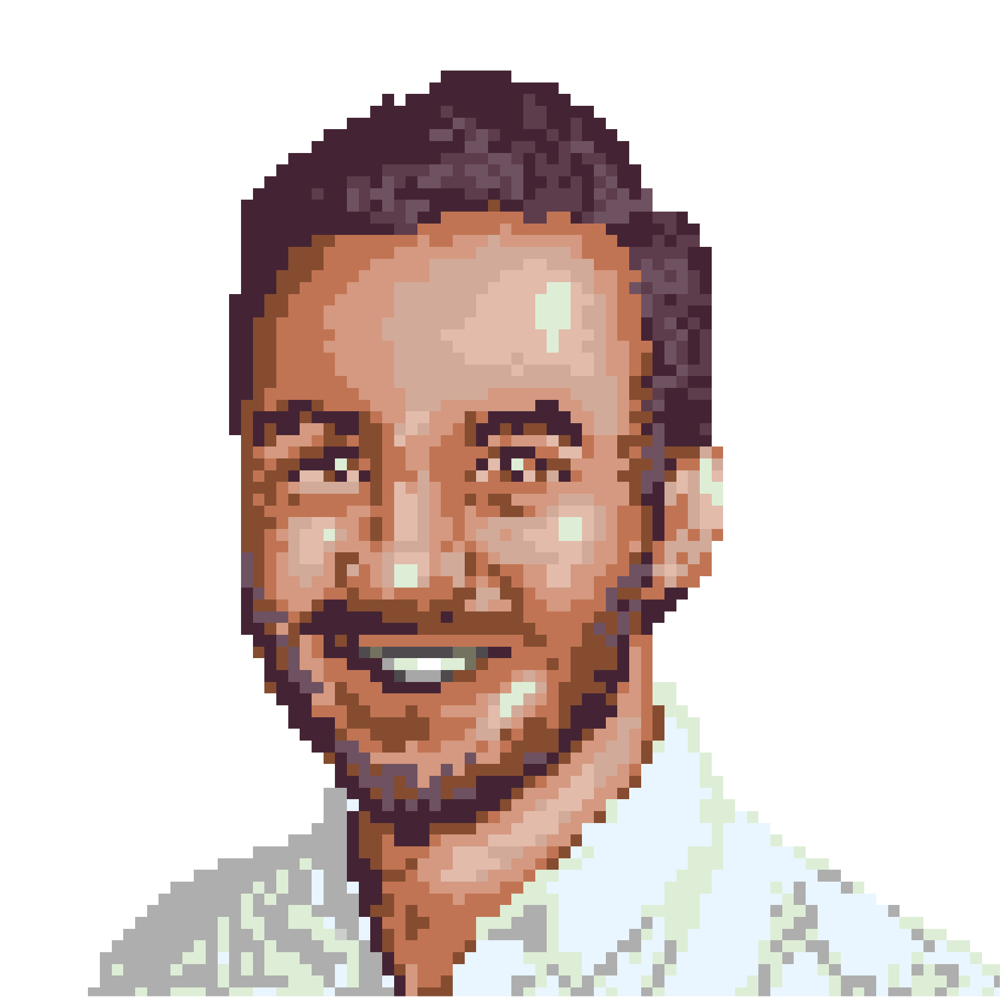

🇬🇧

<!--- Marius Andra Bio -->

### Marius Andra, Software Engineer

<GithubIcon username="mariusandra" />

I first got into programming in 1994 when I wanted to make my own computer games... and asked my father for help. He sat me behind a Turbo Basic interpreter, wrote `PRINT "Marius on tubli poiss"` and then left me there. I was 8 years old.

Luckily we had a [Yamaha YIS-805/128R2](https://www.msx.org/wiki/Yamaha_YIS-805-128R2) lying around... with floppy disks full of random .BAS files. I was hooked. Cue to the beautiful loops of CLS, PRINT and GOTO statements that ensued. I even made some games where you could move two dinosaurs who got points when they kissed each other. It was glorious.

I also got into "web development" in 1997 after seeing Netscape at my mother's university. They even provided me with a generous 10MB of space to host my own [beautiful website](https://web.archive.org/web/19980128032518/http://rasi.lr.ttu.ee/~marius/), complete with animated gifs, a Mortal Kombat fanpage and a strong recommendation to use 800x600 with HiColor!

This was followed by years of writing games in C++ and then [writing tutorials](https://web.archive.org/web/20110626030555/http://cone3d.gamedev.net/) about them, coding websites in Perl, PHP, Java and Ruby... and "losing" a decade as the CTO of two failed startups.

On the side I built an [open source database analytics platform](https://github.com/mariusandra/insights)... and when that [got on Hacker News](https://news.ycombinator.com/item?id=22347516), James reached out... and the rest is history.

These days I live in Belgium and code [state management libraries](https://kea.js.org/) in JavaScript for fun.

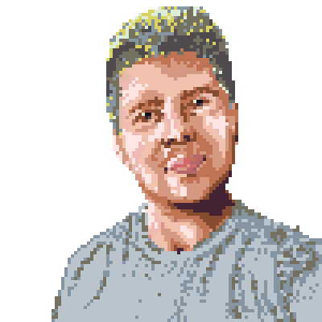

🇧🇪

<!--- Eric Duong Bio -->

### Eric Duong, Software Engineer

<GithubIcon username="EDsCODE" />

I recently graduated and while in college I helped cofound a social dining platform. I spent two years trying to get strangers to cook and dine with each other. In reality, it turned into a 2 year stint of teach yourself as much mobile development as you can while simultaneously trying to build a usable platform. My cofounders and I had our fair share of contemplating dropping out of school and becoming a unicorn in 5 years—it didn't work out.

Somewhere along the way I fell down the bitcoin rabbit hole and after realizing day trading crypto wasn't a feasible nor fulfilling long term goal, I remained fascinated by digital currency. This led me to briefly work with a company building a digital cash transfer system for developing economies.

I currently work as a generalist around most of PostHog's stack building many of the user-facing features but occasionally pick up backend tasks.

To end with an obligatory "I dO MoRE ThAN COdE" detail: I plan to take advantage of PostHog's all remote policy to travel and hike as many major mountain treks around the world as possible. Ambitions subject to change as always though.

🇺🇸

<!--- James Greenhill Bio -->

### James Greenhill, Software Engineer

<GithubIcon username="fuziontech" />

When I was a kid the first thing I remember wanting to be was a pilot, so naturally here I am knee deep in code and data!

Growing up was slightly different in Florida. Things that are normal there are growing up in the water and spending almost all of your free time in it. In the Gulf of Mexico for me. We’d go swimming, scuba diving, or fishing in that warm body of water almost every weekend.

Nowadays I’m spending my free time on a bike finding some new trail up in the northern bits of the Bay Area that I call home now. If not on a bike you’ll find my friends and I on a hike either around here or over in Tahoe or some National Forest east of here. Lately I’m trying to get back into flying. I’ve got about 80 hours of flight in the book, but still don’t have my ticket! It’s time to change that. In the winter time you can find me ruining skis on some mountain.

In my professional life I’ve generally managed mopping up the 1’s and 0’s. I’ve led data at an [upstart music streaming company](https://en.wikipedia.org/wiki/Grooveshark), and dove way too deep into the depths of the comment section leading data at [Disqus](https://en.wikipedia.org/wiki/Disqus). Kept an eye on a fleet of [Autonomous Ubers](https://en.wikipedia.org/wiki/Uber#Self-driving_car_research). Most recently I combined my interest in bikes with data leading data engineering at [Jump](<https://en.wikipedia.org/wiki/Jump_(transportation_company)>), still the best micromobility company out there.

When I’m not out and about in nature you can find me at home with my cat Tesla and Taco our goofball of a Lab Corgi mix.

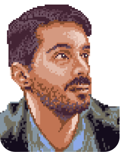

🇺🇸

<!--- Michael Matloka Bio -->

### Michael Matloka, Software Engineer

<GithubIcon username="Twixes" />

Got into software by tinkering with bada OS – if anyone even remembers that! – and just never stopped (though I did move to Android soon and later became an iOS fan).

Before graduating from high school here in Poland – and having some open-source projects under my belt, including [a Discord bot with thousands of users that became my gateway to Python](https://github.com/Twixes/somsiad) – I decided that the most interesting way to grow and meet some great people along the way will be to work on a quality product commercially.

Happy to report that I ended up joining PostHog, where open-source software, a quality product and great people all mix freely!
In free time, I dabble in [outer space](https://www.kerbalspaceprogram.com/), [math](https://codepen.io/Twixes/pen/Zwxxdv), [design](https://www.lingscars.com/), [photography](https://unsplash.com/@twixes) and [cinema](https://www.nowehoryzonty.pl/index.do?lang=en). Decidedly a fan of precipitation and overcast weather, I have a secret plan to move to the Nordics or the UK one day.

🇵🇱

<!--- Paolo D'Amico Bio -->

### Paolo D'Amico, Product

<GithubIcon username="paolodamico" />

I started coding when I was about 9 years old, starting with the very basic LEGO RCX & Turbo Pascal language. I always enjoyed learning new languages, frameworks or technologies on my own, especially with a good book. Funnily enough, I decided not to study computer science.

Before joining PostHog, I lead a product team at Grow Mobility, the largest micro-mobility company in Latin America at the time. Before that, I co-founded Flinto, a Y Combinator startup targeting financial inclusion in developing economies. I enjoy reading while walking around strange places, and have tripped more than once.

You can find my goals in [My README](/handbook/company/team/paolo-damico).

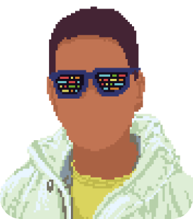

🇺🇸

<!--- Lottie Coxon Bio -->

### Lottie Coxon, Graphic Designer

<GithubIcon username="lottiecoxon" />

I am from the UK - so by default I love the pub, marmite and tea (but not all at once, that would be a sin).

I spent my youth trying to master fine art, after my teacher said I wasn't very good and that I should try something else.
In my stubbornness I decided to prove her wrong, and here I am - a designer.

After studying art through school, I took Graphic Design at university and graduated in summer 2020 with a first class degree. But instead of a summer of fun, I was faced with a crashing economy, a pandemic and and a collapsing job market. But thankfully, after putting my portfolio up on twitter, I was contacted by PostHog a mere 24 hours later, and the rest is history.

I am now their Graphic Designer, and I couldn't be happier. I spend my days composing layouts for the website, designing the product’s aesthetic, and most importantly drawing hedgehogs.

Oh and another thing, I live in the DRC (Democratic Republic of Congo) with my boyfriend G. We tend to move a lot and used to live in Senegal, but for the moment we are here.

[Check my README](/handbook/company/team/lottie-coxon) to see all my loves, hates and quirks. 

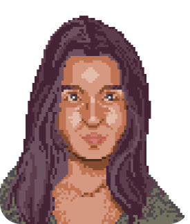

🇨🇩

<!--- Yakko Majuri Bio -->

### Yakko Majuri, Software Engineer

<GithubIcon username="yakkomajuri" />

Often on the move, sometimes by choice, and sometimes by chance, I'm a Brazilian-Finn who has lived in 5 countries across 4 continents.

Passionate about teaching (but far from an academic), I taught an official high school course before graduating high school, became a Visiting Scholar before joining university, and presented my first paper at the European Central Bank during my freshman year (anonymous submission - they thought I had a PhD).

Prior to PostHog, I was a technical consultant for clients which included a Fortune 500 company. A fan of building useful things, I'm a self-taught developer who has worked on an a wide variety of projects, from a travel app, to multiple websites and browser extensions, and even some white-hat hacking. For the past three years, I developed a nice habit of writing about my projects, which led me to a [Medium page](https://yakkomajuri.medium.com) that surpassed 250k views in just 30 days.

When I'm not working, I have been found hitchiking in foreign lands, taking pictures of political demonstrations, and trying to learn Korean after one too many beers. I'll pick playing cards with my grandmother over the club on any Friday night, and my favorite place to spend the Saturday is on top of a mountain.

Oh, and I'm also part of the select group of software developers who have won a dunk contest in their lifetime. If that means anything.

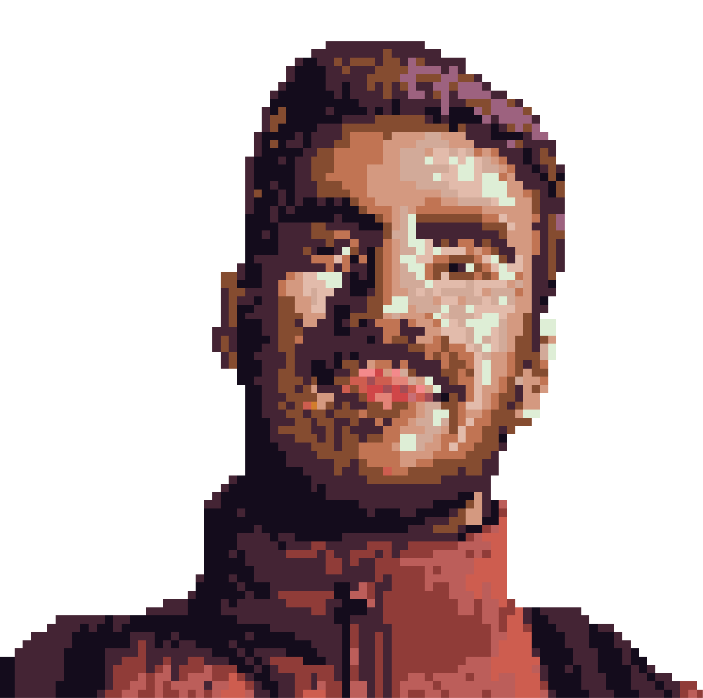

🇧🇷

<!--- Karl Bio -->

### Karl-Aksel Puulmann, Software Engineer

<GithubIcon username="macobo" />

I spent my childhood in a tiny village in the middle of nowhere (Väätsa, Estonia), playing football, working in construction and driving tractors. I used it buy my own computer, but did not do much more than listen to music, play games and watch anime with it.

Things changed in highschool, where we had a programming class. I started creating my own games, participating in competitions (even going to International Olympiad once) and generally learning and reverse engineering anything I could get my hands on.

Some time has passed since then - I have since been a student, teacher, first engineer at a guitar learning startup, worked in fintech, helped scale a database cluster holding 1PB of data at an analytics company, learned and helped automate manufacturing of stickers, been a CTO in agritech startup and now learning how this open source business works.

In personal life, you can find me in the wilderness looking for geocaches or hiking, buying too many books and recently trying to figure out this parenting thing.

You can find more on how to work with me at [My README](/handbook/company/team/karl-aksel-puulmann).

🇪🇪

<!--- Charles Bio -->

### Charles Cook, Business Operations

<GithubIcon username="piemets" />

Born and raised in the UAE, I'm half British, half Lebanese, and grew up in various countries across the Middle East, Africa and Europe. Now based in the north of the UK, I live with my wife Steph and 1-year old son Remy.

I take care of all things ops at PostHog, across finance, people, legal and sales. I was previously COO at [Vitl](https://vitl.com), (personalised nutrition), and before that I held various roles including Director of Product at [ROLI](https://roli.com) (electronic music hardware and software).

I love terrible jokes, beautifully crafted sandwiches and looking at [designer houses](https://www.themodernhouse.com/) I will never live in. I like to occasionally torment my son with my piano playing and spend more time than is probably reasonable making lists of things, à la [High Fidelity](<https://en.wikipedia.org/wiki/High_Fidelity_(film)>).

[See my README](/handbook/company/team/charles-cook) for tips on how to work with me.

🇬🇧

<!--- Eltje Lange Bio -->

### Eltje Lange, People and Talent

<GithubIcon username="eltjehelene" />

Hi, I'm Eltje (_pronounced Elt-ie_), originally from Northern Germany, I moved to the UK in 2017 and I am now based in East London.

Just like James, I used to be a professional cyclist until I realised you can’t make a living as a female cyclist. After a short identity crisis, I started university with the goal to become a management consultant. That never happened, I luckily realised my skills and personality are much better suited in a people (I guess non-startup people call it HR) role.

At PostHog I look after our People and Talent function and my goal is make PostHog THE best company to work for. Previously I worked in very a similar role at a startup called [Farewill](https://farewill.com), who offer services around death (yes, you read right). Prior to that, I worked for a couple of companies later in their scaling journey, like [TransferWise](https://transferwise.com/) and [Xing](https://xing.com).

Outside of work, I am working on my [Masterchef](https://en.wikipedia.org/wiki/MasterChef) skills and you can usually find me outdoors - either on my bike or during a long walk with a coffee in my hands.

[Check my README](/handbook/company/team/eltje-lange) to learn more about me and the way I work.

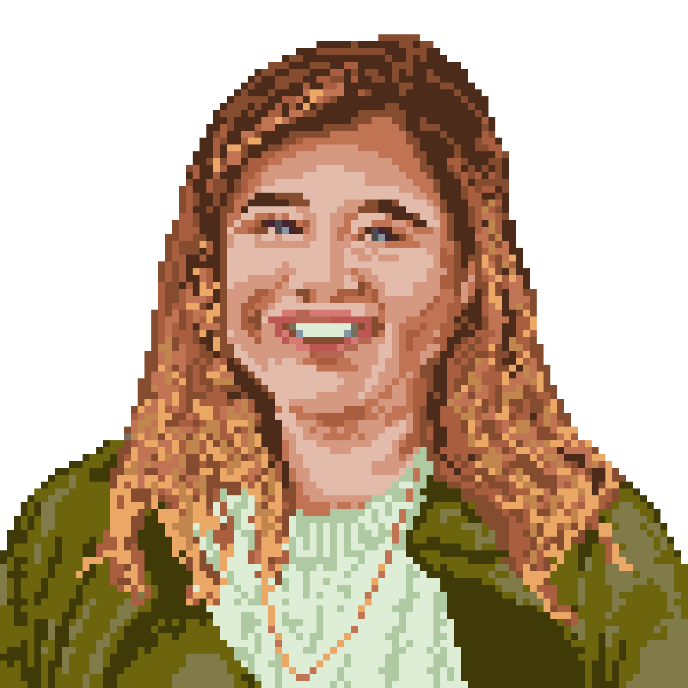

🇬🇧

<!--- Cory Bio -->

### Cory Watilo, Lead Designer

<GithubIcon username="corywatilo" />

(It's pronounced WADDLE-low.)

As one of the few PostHoggers who never attempted to enter the world of professional cycling, I instead spend much of my free time exploring new coffee shops or wine bars, generally sipping a cold brew iced coffee in the morning and a nice rosé when it hits 5:00 somewhere.

I was once labeled "The migrating goose of PostHog" by CEO James Hawkins. Since I generally require both warmth and sunshine to function at any normal capacity, my wife and I bought an RV a couple years ago and hit the road fulltime, with our sole requirement being that wherever we travel _must_ have a [UV index](https://www.google.com/search?sxsrf=ALeKk010aYaVBhFgzWm_AysLPp_ytPyFRg:1610376210393&q=What+is+the+best+UV+index+to+tan%3F&sa=X&ved=2ahUKEwjMk-bvjpTuAhXBp1kKHXVtDIwQzmd6BAgTEAU&biw=1080&bih=946&dpr=2) of 6 or greater. (Fun fact: At 45 feet long, our RV is larger by square footage than many apartments in New York or San Francisco!)

Our party of 2 became a party of 3 last year. 🎉 Now that I am officially a dad, I am now legally entitled to make dad jokes. So in light of the rich cycling history of our company, I present the following: "Why couldn't the bicycle stand up by itself? It was two tired."

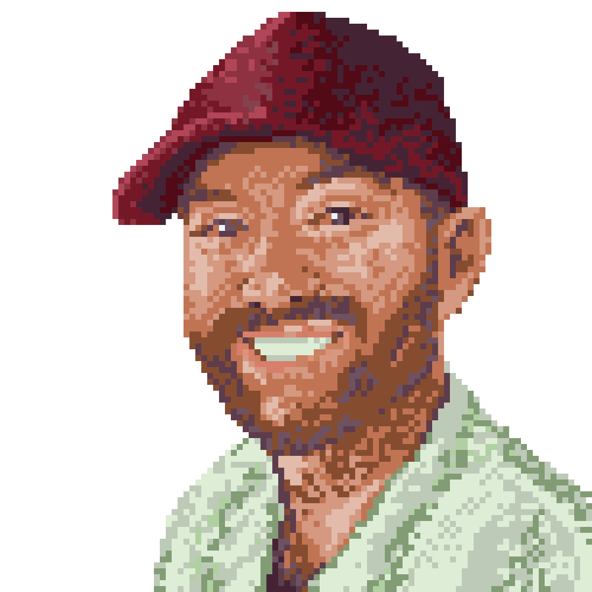

🇺🇸

<!--- Kunal Bio -->

### Kunal Pathak, Growth Engineer

<GithubIcon username="kpthatsme" />

Hi! My name is Kunal. I'm a Bay Area native and a bit of a startup vet.

I love helping teams discover new ways to apply data, product, and engineering to drive business outcomes. Most recently, I led the growth team at Amplitude and at an education technology startup prior to that.

When I'm not working on growth, you'll find me studying the Mamba Mentality, re-learning guitar chords, or making some ravioli (a lasagna if it's going poorly).

In terms of cycling– a friend once convinced me to go on a bike ride from San Francisco to Mill Valley. We took the ferry home.

🇺🇸

<!--- Li Bio -->

### Li Yi Yu, Full Stack Engineer

<GithubIcon username="liyiy" />

HI! I'm Li from NYC. I fell in love with coding towards the end of college, jumped into a programming bootcamp right after, worked at a healthtech company for two years, and here I am today!

Some things I enjoy: karaoke, Switch/PC/board games, a good movie or series, struggling on hikes because I've spent too much time indoors, and exploring the NYC food scene.

🇺🇸

<!--- Sam Bio -->

### Sam Winslow, Full Stack Engineer

<GithubIcon username="samwinslow" />

Hi! I’m Sam. I recently graduated from NYU, where I studied the interaction of media, technology & society. My earliest experiences with programming were building games on a TI-83 calculator and teaching myself BASIC at age 10. The first application I made was an MS Paint clone. I have worked in design, marketing, and software engineering since then.

In my free time, I love building hardware projects, reading about logic & philosophy, cycling around NYC, and taking care of my puppy, Louie.

One of the projects I'm most proud of was a social network for sharing music reviews. We had modest success among college students, and the biggest lesson I learned was that I wanted to spend more time coding new features and less time fighting the analytics tools in order to figure out what to build.

I am always at the beginning of my journey to learn.

🇺🇸

<!--- Neil Kakkar Bio -->

### Neil Kakkar, Software Engineer

<GithubIcon username="neilkakkar" />

There's three things I love:

1. Learning new things
2. Applying them
3. Doing something useful

Software happens to tick all those boxes, so there's no wonder I enjoy coding.

Before PostHog, I was at Bloomberg for ~2.5 years, before which I was studying Mathematics and Computing (ouch) at IIT Delhi. I've built a few fun projects, but one of my favourites is a crypto-currency I started in university that aimed to resolve the issues with Bitcoin. Even with a metric-tonne of funding, that didn't work out as expected, which clued me in to learn about non-technical skills and how startups work.

When I'm not coding, I [write my blog](https://neilkakkar.com), which also not surprisingly, ticks all the boxes above. I've had more than a few posts reach the top of HackerNews, which is epic.

When the above two exhaust me, I spend time travelling, bouldering, hiking, or dancing. Sometimes, I swim too, but the only stroke I know is the panic-stroke. Some other times, I spend time meeting interesting people [on Twitter](https://twitter.com/neilkakkar).

Fun Fact: I usually find out about "current" affairs ~2-6 months after they happen. Yes, I learned about Brexit after it happened... ...It happened, right?

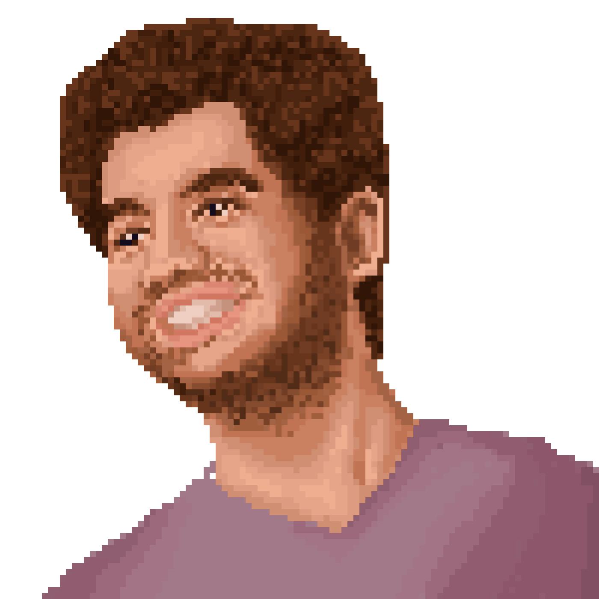

🇬🇧

<!--- Tiina Bio -->

### Tiina Turban, Software Engineer

<GithubIcon username="tiina303" />

As another Estonian I also first got exposed to coding in high school.
From there things escalated pretty fast and while my friends were eating ice-cream and enjoying the lovely sunny spring day outside I was in the computer lab programming a Snake game.

During my CS studies I did a quick detour and spent a summer selling books door-to-door in the US, which confirmed my suspicions that software engineering is a much better fit, but left me with an invaluable experience and thicker skin =)

I explored the fabulous life in Silicon Valley working at Facebook for 5 years and Twitter for 1. However I missed Europe and my love/obsession for dancing brought me back, this time to the land of croissants and cheese - Paris, France.
Outside of work and dancing I am currently on a quest to learn French, like to frequent the gym, and listen to non-fiction audiobooks.

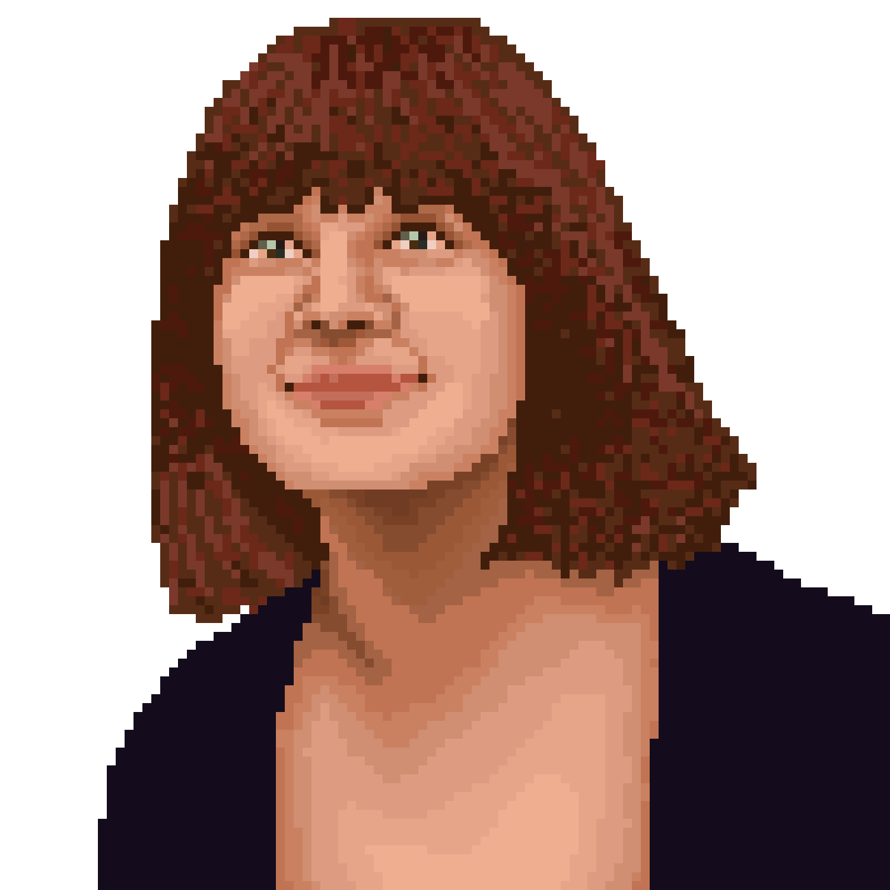

🇫🇷

<!--- Joe Bio -->

### Joe Martin, Product Marketer

<GithubIcon username="joethreepwood" />

This is my fifth startup. Before moving to Product Marketing I was a Content Marketer, a Copywriter and a Journalist. Before that, a Clown and a Chainsaw Salesman. I've had a strange life.

[See my README for tips on how to work with me](/handbook/company/team/joe-martin)

🇬🇧

<!--- Alex Bio -->

### Alex Kim, Full Stack Engineer

<GithubIcon username="alexkim205" />

Hi, I'm Alex. I have a degree in Biomedical Engineering because for the longest time, I thought I wanted to be a doctor. One summer, I wrote my first R app (blasphemous!) to crunch some genomic data, and I haven't looked back!

Since then, I've built a website for my parent's local business, co-founded a data product startup in college (LionBase), and helped build out a pub/sub broker (AWS IoT) that can handle hundreds of millions of messages every day.

As a New York native, I love pepperoni pizza but still enjoy the occasional pineapple slice. My other interests in no particular order, are: NYK basketball, The Strokes, hiking, competitive laundry folding, and recently bouldering.

🇺🇸

<!--- Marcus Bio -->

### Marcus Hyett, VP of Product

<GithubIcon username="marcushyett-ph" />

I’ve had quite a varied career, starting with joining a “bedroom business” to build super-simple product that enabled local businesses to contact their customers. Then I hard pivoted to the Rail industry spending 5+ years in railway operations and management (think going to train crashes and pushing buttons to move trains around).

More recently I met James and Tim at a Financial crime startup (Arachnys), where we built products for banks and other businesses to reduce financial crime. For the last roughly 4 years I’ve been at Facebook working in the E-commerce space, connecting the world through social shopping experiences on Instagram and the family of apps.

I’m originally from the UK and currently live in North West London, I love to hike, mountain bike and ski in my spare time.

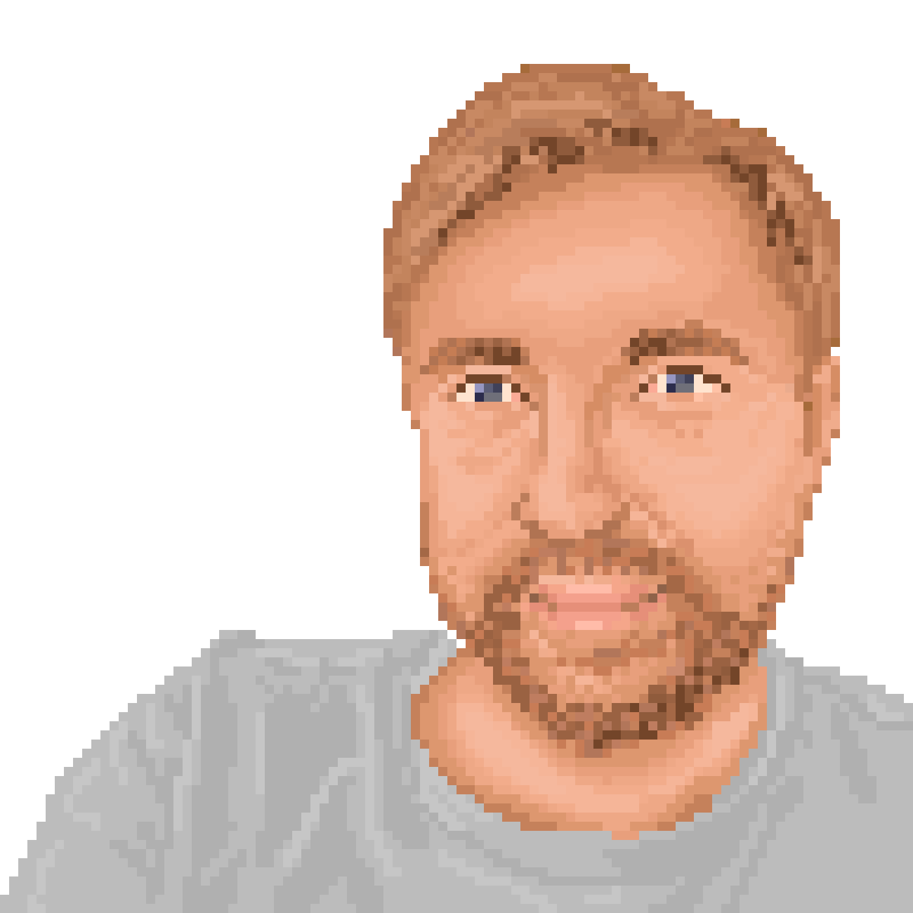

🇬🇧

<!--- Chris Bio -->

### Chris Clark, Product Designer

<GithubIcon username="clarkus" />

Hey, y'all. My name is Chris. Some friends and colleagues refer to me as "clarkus". I'm originally from the Gulf Coast in Alabama, but now reside just outside of Portland, Oregon with my wife, two children, four goats, three cats, two pigs, innumerable chickens, and one really surly goose.

I built my first website in high school. I don't remember much about the website other than it had an animated gif of a tiger. Since that time I've been interested in semantics, browsers, systems-thinking, and how people interact with technology. In college, I couldn't decide between computer science and graphic design, so I did both. This lead me to product design, and specifically, designing and building for web browsers. I've been doing that professionally ever since.

In my free time, I enjoy learning new things. I'm currently learning more about archery, leather working, and wood carving (mostly spoons). I also enjoy camping, hiking, cooking, and generally being outdoors. I love animals and hope to one day own a donkey.

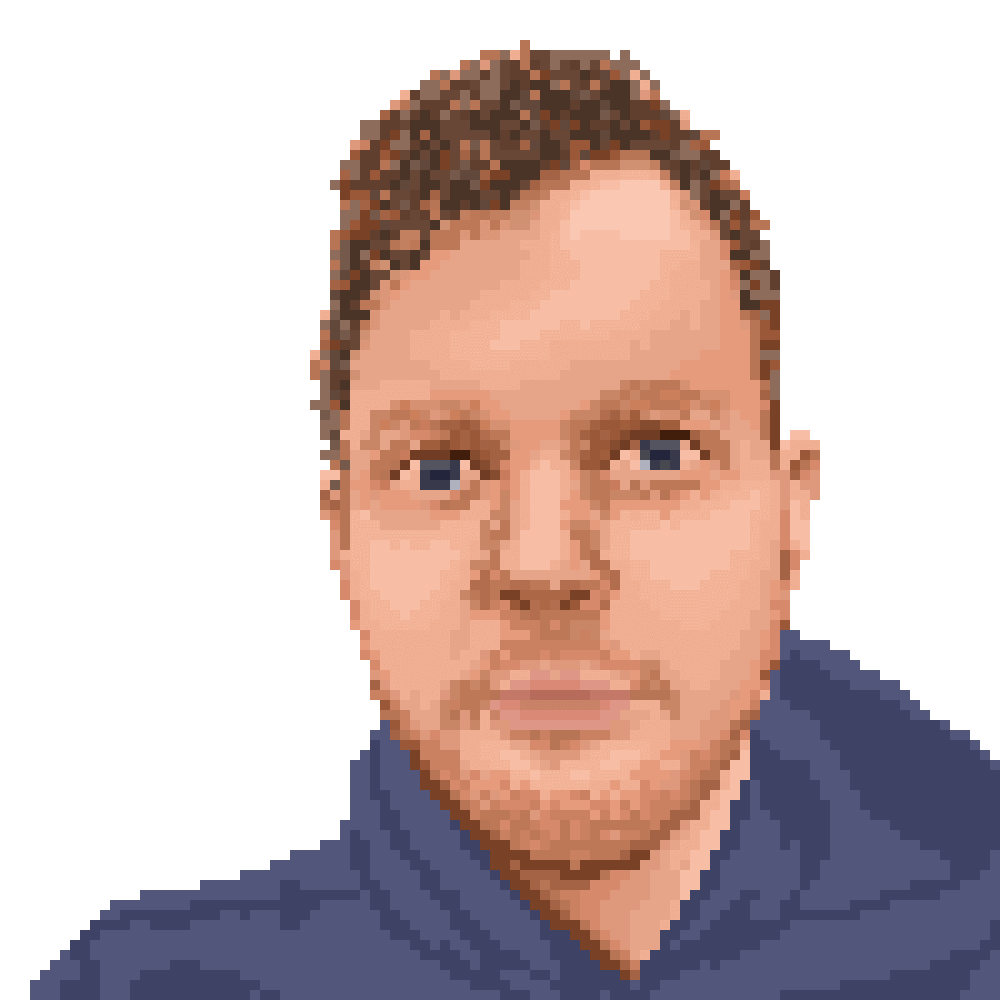

🇺🇸

<!--- Eli Bio -->

### Eli Kinsey, Front End Developer

<GithubIcon username="smallbrownbike" />

When I was 12, I was obsessed with trying to access MySpace from our school computers. At some point, after entering `ping myspace.com` 500 times, my teacher began wondering what I was doing, as did I. He yelled, "Hey, stop messing around in DOS!" I didn't tell him it wasn't DOS. Mostly because I had no idea it wasn't DOS.

When I'm not working, I enjoy creating and listening to music. I also enjoy cooking (haven't killed anyone yet), hiking Mt. Tam, and drinking a good beer. Sometimes at the same time.

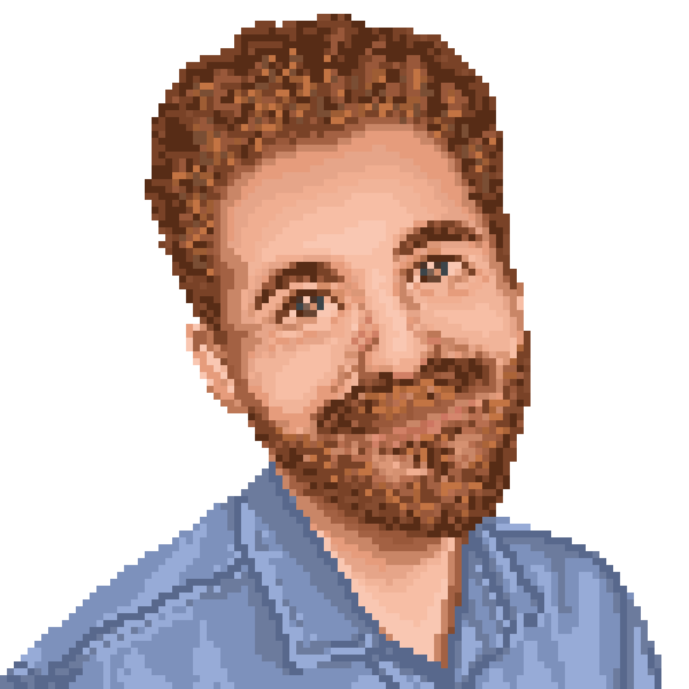

🇺🇸

<!--- Rick Bio -->

### Rick Marron, Software Engineer

<GithubIcon username="rcmarron" />

Hey, I’m a software engineer from Rochester, New York - a cold and cloudy place. After moving around the US, I discovered that Southern California exists, and now, I live in Los Angeles spending as much time in the sun as I can.

I owe my love of software and computers to my dad. He’s a scientist. If you’ve ever seen “Honey I Shrunk the Kids”, he’s that dad. There was always a lab in the basement, and he was always excited to show me the latest tools, lasers, computer chips, etc that he was working with. I spent as much time as I could “helping him” and learning how things worked.

Since college, I’ve worked on a pretty wide range of products from developer tools and vehicle trackers to an immersive audio app and a German podcast app. I’ve flipped back and forth from being a product manager to a software engineer a few times, and even played the role of a local journalist and a (not very good) sleep therapist for a bit.

🇺🇸

<!--- Paul Bio -->

### Paul D'Ambra, Software Engineer

<GithubIcon username="pauldambra" />

I've always wanted to solve problems. So, I studied biochemistry. And discovered I am not a biochemist. During and after university, I played in several bands. Without changing the world of music. And fell into a job in I.T. support. For several years I managed I.T. for The British Mountaineering Council. I taught myself to program. Studied an MSc in Computer Science part-time. And discovered that writing software is how I love solving problems.

I'm half Italian. When I was young I refused to learn to speak Italian. Ma sto imparando ora! To make amends I've been learning to make Neapolitan style pizza and [getting pretty good](https://twitter.com/search?q=from%3Apauldambra%20AND%20pizza%20time&src=typed_query&f=live).

There is a worrying link between the number of programming languages I've used and the number of children I've had. For a while, I was saying I had five children. Until someone pointed out I was counting the dog. My labrador retriever Yoko is - [as measured by photos taken](https://twitter.com/search?q=from%3Apauldambra%20AND%20house%20wolf&src=typed_query&f=live) - my favourite child.

Since becoming a software engineer full-time. I've worked at software agencies. [At a startup](https://twitter.com/footclicksus), building Google Analytics for the physical world (which was like magic *when it worked*). And spent several fulfilling years leading teams at [Co-op Digital](https://twitter.com/coopdigital). I think in diagrams and draw on tables. And I am never happier than in the moments after I have managed to figure out how to make something simpler.

I've been keeping a [weekly work diary](https://pauldambra.dev/weeknotes) for most weeks since the start of 2020. It's been a great tool for practising being more reflective. And to help me remember you can work hard and still have fun.

🇬🇧🇮🇹

<!--- Guido Bio -->

### Guido Iaquinti, Software Engineer

<GithubIcon username="guidoiaquinti" />

👋 Hi! I’m Guido. I define myself as a curious human, always eager to learn new things.
Professional wise, I’m an engineer with an academic background and experience in high volume/high availability Internet architectures. I’m a technology enthusiast excited about open source software. My passion is to develop, scale, and automate complex systems.
Here are few fun facts about me:
- I’m originally from Italy but in the past I’ve lived in Ireland, Germany and New Zealand. I'm currently living Spain.
- I’m a sailor, a former member of the national Italian sailing team and a certified sailing instructor. In 2018, I crossed the Atlantic Ocean on a 10 m / 34 ft sailboat.
- I completed a solo hiking trip, starting in France and arriving at the end of Spain covering about 730 km / 450 miles in around 20 days.
- I climbed Mount Kilimanjaro (5,895 m / 19,341 ft above sea level) via the Lemosho Route.
- My working experience spans from little startups to multi-billion dollar companies.
- I love challenges and throw myself into difficult situations.
- I’m always interested in learning something new (in both tech and non-tech fields).

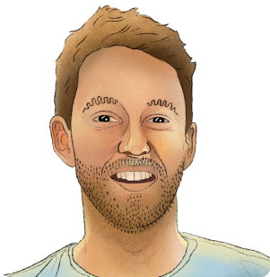

🇮🇹

<!--- Contributors Section -->

## Contributors

    
    
    
    
    
    
    
    
    
    
    
    
    
    
    
    
    
    
    
    
    
    
    
    
    
    
    
    
    
    
    
    
    
    
    
    
    
    
    
    
    
    
    
    
    
    
    
    
    
    
    
    
    
    
    
    
    
    
    
    
    
    
    
    
    
    
    
    
    
    
    
    
    
    
    
    
    
    
    
    
    
    
    
    
    
    

