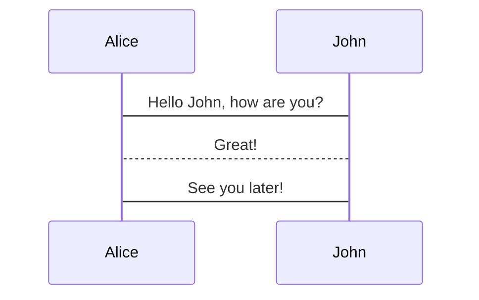

First, you should start with two assumptions about our users:

1. They're busy and don't have time to read long docs.
2. They're not experts and don't know what we know.

This means our docs should be:

- As short and to the point as possible.
- Easy enough to understand so that a new user can read it and get what they need.

The below is a style guide for writing good docs based on the above assumptions. It's not exhaustive, but it's a good starting point.

## Wikipedia-style internal links

The first mention on a page of a PostHog term, feature, or SDK should link to its docs page.

> **Example:** "To create an [insight](/docs/product-analytics/insights), first [capture events](/docs/product-analytics/capture-events). Then, select the data you want to see and create an insight."

## Include examples for complex concepts

When explaining complex features or concepts, provide real-world use cases and examples. This makes it easier for our users to understand and apply the concept.

## Structure content for scannability

- Use short paragraphs (3-4 lines maximum)
- Use bullet points and numbered lists
- Break up long sections with subheadings
- Put the most important information first

## Link to PostHog app

You can also link to the PostHog app directly by using `https://us.posthog.com/${path}`. This saves time for our users and makes it easier for them to find what they need. Make sure to remove `project/2/` from the URL so it redirects them to their project. EU Cloud users are redirected automatically.

> **Example:** "To create an insight, first [capture events](/docs/product-analytics/capture-events). Then, go to the [insights tab](https://us.posthog.com/insights) and click **+ New insight**."

## Bold button and tab names

Put button, tab, and other navigation names in bold. This makes it easier for our users to skim through the docs, and it's cleaner than using quotes all the time.

> **Example:** "Go to the [insights tab](https://us.posthog.com/insights) and click **+ New insight**."

## Navigating UI
When documenting UI steps, references to UI elements should be in chronological order. When possible, hyperlink to the correct location.

> **Do:** Under **Settings** > **User**, under the [Two-factor section](https://us.posthog.com/settings/user#2fa), click the **Set up 2FA** button.

> **Don't:** Under **User** in your **Settings**, click the **Set up 2FA** button under **Two-factor** authentication.

Using exact label names in chronological order helps when searching with `⌘+F`. It also makes it easier to follow on a screen reader.

For long UI flows, like big menus or settings, use `>` to show the menu or heading hierarchy. Use exact names for headers and labels for easier searching. Clearly state actions like clicks.

> **Do:** Under **Settings** > **Product analytics** > **Correlation analysis exclusions**, under **Excluded events**, click **+ Add exclusion**.

> **Don't:** Under **Settings**, find **Product analytics**, then find **Correlation analysis exclusions**, then in the second subheading, **Add exclusion**.

Using `>` in long flows and explicitly stating actions makes it easier to scan. If the flow is complex, consider [adding a video](#record-video).

## The backtick is your friend

Remember to use backticks around inline code snippets, and triple backticks around multiline code samples.

## Follow the style standards of each programming language

In code samples, use the conventions of the language the code is written in.

For example, JavaScript uses `PascalCase` for class/constructor names, and `camelCase` for most other names. Python uses `PascalCase` for classes, and `snake_case` for most other names. And so on.

## Use snake case for PostHog events and properties.

Use `snake_case`, not `camelCase` or `PascalCase` for PostHog event and property names. For example:

```js
posthog.capture('user_signed_up', {
  user_id: '123',
  username: 'Jane Doe',
})
```

## Screenshots

To keep screenshots consistent and clear, here are tips to follow:
- Make sure you're not showing any user data, like user emails or names.
- Focus on the main element, leave out sidebars and irrelevant UI.
- Use a device width of 1000px - 1400px in devtools. This avoids unnecessary empty space and keeps text readable.
- Prefer taking **node screenshots** of the DOM node element you're trying to capture. This takes an **upscaled** screenshot by DPR of the DOM node element. 
- Use DPR (device pixel ratio) of 3, this will **upscale** rendering to 3x the size of the screen.


### Record videos

For flows with many steps, it's often more helpful to include a video instead of a screenshot. We use [Screen Studio](https://screen.studio/) to record videos. Feel free to buy yourself a license.

Use the following settings:
- <PrivateLink url="https://posthog.slack.com/archives/C01FHN8DNN6/p1729759474007969">Preset</PrivateLink>
- Remove any zooming-in for clicks, as this can sometimes make videos hard to follow.
- For exporting: use MP4, 720, 60 fps, and "web" quality

## Docs components

### Callout boxes

import { CalloutBox } from '../../../src/components/Docs/CalloutBox'


You can add callout boxes to documentation to ensure skimmers don't miss essential information.

```jsx
<CalloutBox icon="IconInfo" title="Here is some information" type="fyi">

Here is some information

</CalloutBox>
```

Three styles are available:

- `fyi`: this is for stuff that's helpful but not critical
- `action`: these are tasks developers should complete and not miss
- `caution`: these flag the potential for misconfiguration, data loss, and other churn vectors

They look like this:

<CalloutBox icon="IconInfo" title="Here is some information" type="fyi">

Provide detail here. You can go on at length if necessary.

</CalloutBox>

<CalloutBox icon="IconInfo" title="Here is some information" type="action">

Provide detail here. You can go on at length if necessary.

</CalloutBox>

<CalloutBox icon="IconWarning" title="Here is some information" type="caution">

Provide detail here. You can go on at length if necessary.

</CalloutBox>

Valid icons are listed in PostHog's <PrivateLink url="https://github.com/posthog/icons#posthogicons">icon library</PrivateLink>.

### Max AI

You can also link to Max AI with a pre-loaded question if you want to give users an easy way to try building using the Max AI.

Be aware that Max AI works best with straightforward questions that have predictable answers, e.g. "How many users completed the $pageview event this week?". It may struggle with more open-ended questions such as "Where are users struggling?". For this reason, you should test questions on Max before adding him to docs. 

To add a preloaded question to docs or tutorials, you can use the MaxCTA component and add the question you'd like to preload in the question field, like so:

```
<MaxCTA question="What's my churn rate?" />
```

This creates the following component in the docs, where the final link will divert to the relevant question. 

<MaxCTA question="What's my churn rate?" />

This component is globally available and doesn't need to be imported per page, but doesn't automatically run the query with Max AI (currently).

### AskMax

The `<AskMax>` component opens the Max AI chat window directly on the website. Use this for documentation pages where users might need help understanding concepts or troubleshooting. Unlike `<MaxCTA>` which links to the PostHog app, this keeps users in the docs context.

```jsx
<AskMax
    title="Need help with feature flags?"
    quickQuestions={[
        'Why is there a delay in loading flags?',
        'How do I create a multivariate flag?',
        'Can I override a flag?',
    ]}
/>
```

<AskMax
    title="Need help with feature flags?"
    quickQuestions={[
        'Why is there a delay in loading flags?',
        'How do I create a multivariate flag?',
        'Can I override a flag?',
    ]}
/>

Available props:
- `title`: Custom title text (defaults to "Questions?")
- `quickQuestions`: Array of suggested questions to preload
- `border`: Add top/bottom borders (defaults to false)
- `linkOnly`: Render as a button only without the full UI (defaults to false)

The component automatically tracks when users open Max AI and includes the current page context.

### Steps

Use the `<Steps>` component for content that walks the reader through a strict sequence of instructions. Think how-to guides or step-by-step tutorials. 

<Steps>

<Step title="Install the SDK" badge="required">

Steps are automatically numbered.

</Step>

<Step title="Call the capture method" badge="required">

Write the *content* in **markdown**.

</Step>

<Step checkpoint title="Check for events in PostHog" subtitle="Log in to your PostHog account" badge="optional">

You can also use components <TeamMember name="Edwin Lim" photo /> <TeamMember name="Vincent Ge" photo />

Add more steps!

</Step>

</Steps>

<CalloutBox icon="IconInfo" title="Watch the whitespace" type="fyi">

  Our mdx parser does not play nice with certain whitespace. When using the component, make sure you:

  - Add a line break after the opening component tags
  - Avoid using 4-space indents

</CalloutBox>

```mdx
---
showStepsToc: true # for table of contents with steps only
---
<Steps>

<Step title="Install the SDK" badge="required">

Steps are automatically numbered.

</Step>

<Step title="Call the capture method" badge="required">

Write the *content* in **markdown**.

</Step>

<Step checkpoint title="Check for events in PostHog" subtitle="Log in to your PostHog account" badge="optional">

Add checkpoints to help readers know they're on the right track.

You can also use components <TeamMember name="Edwin Lim" photo /> <TeamMember name="Vincent Ge" photo />

</Step>

</Steps>
```

### Quest log

The `<QuestLog>` component is for syllabus-style pages. Inspired by video games, it outlines each section as a "quest" to give the reader a visual roadmap of what's needed to reach a larger goal or milestone – like fully adopting our error tracking product.

<ProductScreenshot
    imageLight="https://res.cloudinary.com/dmukukwp6/image/upload/SCR_20250731_oiej_cdce484c1c.png"
    alt="Questlog example"
    classes="rounded"
    padding={false}
/>

<CalloutBox icon="IconInfo" title="Watch the whitespace" type="fyi">

  Our mdx parser does not play nice with certain whitespace. When using the component, make sure you:

  - Add a line break after the opening component tags
  - Avoid using 4-space indents

</CalloutBox>

```mdx
---
hideAnchor: true # for a wider content column
---

<QuestLog firstSpeechBubble="Let's go on an adventure!" lastSpeechBubble="Time to build products!">

<QuestLogItem title="Capture your first exception" subtitle="Required" icon="IconCode">

Write the *content* in **markdown**.

</QuestLogItem>

<QuestLogItem title="Integrate customer data" subtitle="Recommended" icon="IconLogomark">

You can also use components <TeamMember name="Edwin Lim" photo /> <TeamMember name="Vincent Ge" photo />

</QuestLogItem>

</QuestLog>
```

## Code blocks 

PostHog uses extended markdown syntax for more expressive code blocks. Here are the code block features we support:

import Tab from "components/Tab"

### File names

You can identify the file you're editing by adding `filename=` to the code block. This is displayed in the code block's title.

<Tab.Group tabs={[
'Preview',
'Markdown']}>
<Tab.List>
  <Tab>Preview</Tab>
  <Tab>Markdown</Tab>
</Tab.List>
<Tab.Panels>
<Tab.Panel>

```js filename=index.js
console.log('Hello, world!')
```

</Tab.Panel>
<Tab.Panel>

``````mdx
```js filename=index.js
console.log('Hello, world!')
```
``````

</Tab.Panel>
</Tab.Panels>
</Tab.Group>

### Multi-language code blocks

You can use the `<MultiLanguage>` component to show code blocks in multiple languages.

<Tab.Group tabs={[
'Preview',
'Markdown']}>
<Tab.List>
  <Tab>Preview</Tab>
  <Tab>Markdown</Tab>
</Tab.List>
<Tab.Panels>
<Tab.Panel>

<MultiLanguage>

```js filename=index.js
console.log('Hello, world!')
```

```python filename=index.py
print('Hello, world!')
```

</MultiLanguage>

</Tab.Panel>
<Tab.Panel>

``````mdx
<MultiLanguage>
```js filename=index.js
console.log('Hello, world!')
```

```python filename=index.py
print('Hello, world!')
```
</MultiLanguage>
``````

</Tab.Panel>
</Tab.Panels>
</Tab.Group>

### Magic placeholders

You can use magic placeholders to replace the project API key, project name, app host, region, and proxy path in the code block.

- If the user is logged into the PostHog app, the placeholder will be replaced with the actual value from their project.
- If the user is not logged into the PostHog app, the placeholder will display as is.

| Placeholder | Description | Default |
| --- | --- | --- |
| `<ph_project_api_key>` | Your PostHog project API key | `<ph_project_api_key>` |
| `<ph_project_name>` | Your PostHog project name | `<ph_project_name>` |
| `<ph_app_host>` | Your PostHog instance URL | `<ph_app_host>` |
| `<ph_client_api_host>` | Your PostHog client API host | `https://us.i.posthog.com` |
| `<ph_region>` | Your PostHog region (us/eu) | `<ph_region>` |
| `<ph_posthog_js_defaults>` | Default values for posthog-js | `2025-05-24` |
| `<ph_proxy_path>` | Your proxy path | `relay-XXXX` (last 4 digits of project token) |

You can use these placeholders in the code block like this:

```js
const client = new PostHog('<ph_project_api_key>', { host: '<ph_client_api_host>' })
```

### Code highlighting

Especially in long tutorials, you can highlight the important differences between steps using highlighting comments. It's much easier to read visual diffs than reading through the code block line by line.

| Comment | Effect | Usage |
| --- | --- | --- |
| `// +` | Green highlight | Represents additions in diffs |
| `// -` | Red highlight | Represents removals in diffs |
| `// HIGHLIGHT` | Yellow highlight | General emphasis without special meaning |

<Tab.Group tabs={[
'Preview',
'Markdown']}>
<Tab.List>
  <Tab>Preview</Tab>
  <Tab>Markdown</Tab>
</Tab.List>
<Tab.Panels>
<Tab.Panel>

```js filename=index.js
const a = 1
const b = 2
const c = a + b // +

console.log(a+b) // -
console.log(c) // +

console.log('end') // HIGHLIGHT
```

</Tab.Panel>
<Tab.Panel>

``````mdx
```js filename=index.js
const a = 1
const b = 2
const c = a + b // +

console.log(a+b) // -
console.log(c) // +

console.log('end') // HIGHLIGHT
```
``````

</Tab.Panel>
</Tab.Panels>
</Tab.Group>


### Collapsed code blocks

In some cases, such as large nested config files, you need readers to focus on a specific part of the code block while maintaining the context. You can do this by adding `focusOnLines=` to the code block. This collapses the code block and only shows the lines of code you specify.

<Tab.Group tabs={[
'Preview',
'Markdown']}>
<Tab.List>
  <Tab>Preview</Tab>
  <Tab>Markdown</Tab>
</Tab.List>
<Tab.Panels>
<Tab.Panel>

```json file=angular.json focusOnLines=4-14
{
  "projects": {
    "my-app": {
      "architect": {
        "build": {
          "builder": "@angular-devkit/build-angular:application",
          "options": {
            "sourceMap": {
              "scripts": true, // +
              "styles": true, // +
              "hidden": true, // +
              "vendor": true // +
            }
          }
        }
      }
    }
  }
}
```

</Tab.Panel>
<Tab.Panel>

``````mdx
```json file=angular.json focusOnLines=4-14
{
  "projects": {
    "my-app": {
      "architect": {
        "build": {
          "builder": "@angular-devkit/build-angular:application",
          "options": {
            "sourceMap": {
              "scripts": true, // +
              "styles": true, // +
              "hidden": true, // +
              "vendor": true // +
            }
          }
        }
      }
    }
  }
}
```
``````

</Tab.Panel>
</Tab.Panels>
</Tab.Group>

### Mermaid diagrams

Code blocks can also be used to show mermaid UML diagrams. When using these diagrams, make sure to include a text description of the diagram afterwards for accessibility and LLMs.

<Tab.Group tabs={[
'Preview',
'Markdown']}>
<Tab.List>
  <Tab>Preview</Tab>
  <Tab>Markdown</Tab>
</Tab.List>
<Tab.Panels>
<Tab.Panel>



</Tab.Panel>
<Tab.Panel>

``````mdx

``````

</Tab.Panel>
</Tab.Panels>
</Tab.Group>

## Debugging

Gatsby's MDX parser has some quirks that can be hard to debug. Gatsby tends to throw 404s when it fails to build an MDX page. 

To debug, check for the common issues below:

- Avoid indenting by over 2 spaces. More indentation can confuse the parser.
- Every JSX tag with inner markdown should have a line break after the opening tag and before the closing tag.
- Make sure you're not missing imports and the imports are correct.
- Every empty newline should actually be empty. Spaces on empty lines can confuse the parser.
- Different snippets cannot share the same file name and import alias. When they do, they override each other.

You can also try running the formatter script to fix some of the issues:

```bash
yarn format:docs
```

This will run the formatter against the current changes.