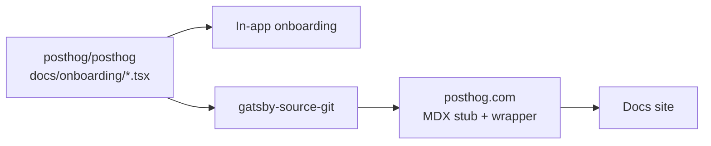

Onboarding docs are special because these instructions are **shared** between the [in-app onboarding](https://github.com/PostHog/posthog/tree/master/frontend/src/scenes/onboarding) flow and the getting started pages on the [posthog.com website](https://github.com/PostHog/posthog.com). These are the first pieces of docs a new user will see, so they need to be up to date and accurate.

To help keep in-app and website onboarding docs in sync, there is a **single source** of truth for the onboarding docs in the [`posthog/posthog`](https://github.com/PostHog/posthog) repository under the [`docs/onboarding`](https://github.com/PostHog/posthog/tree/master/docs/onboarding) directory. This means you only need to update the in-app onboarding docs in the `posthog/posthog` repository, and the website docs will be updated automatically.

<ProductVideo src="https://res.cloudinary.com/dmukukwp6/video/upload/Shared_onboarding_e454da0def.mp4" alt="How shared onboarding docs work" />

## Which products have shared onboarding docs

This is a relatively new feature, so we're still migrating old onboarding docs to the new system. As of January 2026:

| Product | Status |
|---------|--------|
| LLM analytics | ✅ Migrated |
| Product analytics | ✅ Migrated |
| Web analytics | ⏳ Not yet migrated |
| Session replay | ⏳ Not yet migrated |
| Feature flags | ✅ Migrated |
| Experiments | ✅ Migrated |
| Error tracking | ⏳ Not yet migrated |
| Surveys | ⏳ Not yet migrated |
| Data pipelines | ⏳ Not yet migrated |
| Data warehouse | ⏳ Not yet migrated |
| Revenue analytics | ⏳ Not yet migrated |
| PostHog AI | ⏳ Not yet migrated |
| Workflows | ⏳ Not yet migrated |
| Logs | ⏳ Not yet migrated |
| Endpoints | ⏳ Not yet migrated |

## How it all works

Onboarding content is written once as React components in the [`posthog/posthog`](https://github.com/PostHog/posthog) repo, then rendered in two places:

1. **In-app onboarding:** The PostHog app imports these components directly and wraps them with [`OnboardingDocsContentWrapper`](https://github.com/PostHog/posthog/blob/master/frontend/src/scenes/onboarding/OnboardingDocsContentWrapper.tsx), which provides UI components like `Steps`, `CodeBlock`, etc.
2. **Docs site:** posthog.com pulls the components via `gatsby-source-git`, then renders them through MDX stub files that use [`OnboardingContentWrapper`](https://github.com/PostHog/posthog.com/blob/master/src/components/Docs/OnboardingContentWrapper.tsx) to provide the same UI components

Both wrappers provide the same component names (`Steps`, `CodeBlock`, `CalloutBox`, etc.) so the shared content renders correctly in either place. When you merge changes to `master` in `posthog/posthog`, the website automatically pulls the updated content on its next build.



If you need some help with structuring your files, this is the architecture for each repo:

```
posthog/posthog
├── docs/onboarding/
│   └── your-product/
│       ├── sdk-name.tsx          # getSteps + createInstallation
│       └── _snippets/
│           └── reusable-snippet.tsx
│
└── frontend/src/scenes/onboarding/
    └── sdks/your-product/
        └── YourProductSDKInstructions.tsx  # withOnboardingDocsWrapper

posthog/posthog.com
└── contents/docs/your-product/
    └── installation/
        ├── sdk-name.mdx          # MDX stub
        └── _snippets/
            ├── sdk-name-wrapper.tsx   # OnboardingContentWrapper
            └── shared-helpers.tsx     # modifySteps helpers
```

For a complete working example, see the **[Feature Flags Python](/docs/feature-flags/installation/python)** implementation:

| Repo | File |
|------|------|
| posthog/posthog | [`docs/onboarding/feature-flags/python.tsx`](https://github.com/PostHog/posthog/blob/master/docs/onboarding/feature-flags/python.tsx) |
| posthog.com | [`python.mdx`](https://github.com/PostHog/posthog.com/blob/master/contents/docs/feature-flags/installation/python.mdx) |
| posthog.com | [`ff-python-installation-wrapper.tsx`](https://github.com/PostHog/posthog.com/blob/master/contents/docs/feature-flags/installation/_snippets/ff-python-installation-wrapper.tsx) |

## How to update existing onboarding docs

1. Find the shared content file in the [`posthog/posthog`](https://github.com/PostHog/posthog) repository under [`docs/onboarding`](https://github.com/PostHog/posthog/tree/master/docs/onboarding). For example, `docs/onboarding/llm-analytics/openai.tsx`.
2. Edit the `.tsx` file directly in the `posthog/posthog` repository. Make your changes to the component.
3. Test locally by running the app in development mode and verifying the changes in the in-app onboarding. You can trigger onboarding by navigating to `localhost:8010/products`.
4. Commit and open a PR to merge your changes into `master` in `posthog/posthog`. This will trigger a Vercel preview build of the website. Verify these changes and merge the PR.
5. If you need more confidence, verify the website locally by setting the `GATSBY_POSTHOG_BRANCH` environment variable to your PR branch and rebuilding the website locally.
6. Verify on website: The website will automatically pull the changes on its next build.

## How to create/migrate new onboarding docs

### Step 1: Create the shared component in posthog/posthog

1. Navigate to the product directory in `docs/onboarding/`. If it doesn't exist, create it: `docs/onboarding/your-product/`
2. Create a new `.tsx` file: `docs/onboarding/your-product/filename.tsx`
3. Export a step function and Installation component. Use `createInstallation` to automatically handle the rendering:

   ```tsx file=docs/onboarding/feature-flags/python.tsx
   import { OnboardingComponentsContext, createInstallation } from 'scenes/onboarding/OnboardingDocsContentWrapper'
   import { getPythonSteps as getPythonStepsPA } from '../product-analytics/python'
   import { StepDefinition } from '../steps'

   // Step function receives a single context object with all components
   export const getPythonSteps = (ctx: OnboardingComponentsContext): StepDefinition[] => {
       const { CodeBlock, Markdown, dedent, snippets } = ctx

       // Reuse installation steps from product-analytics
       const installationSteps = getPythonStepsPA(ctx)

       // Add feature-flag-specific steps
       const flagSteps: StepDefinition[] = [
           {
               title: 'Evaluate feature flags',
               badge: 'required',
               content: (
                   <>
                       <Markdown>Check if a feature flag is enabled:</Markdown>
                       {snippets?.BooleanFlagSnippet && <snippets.BooleanFlagSnippet />}
                   </>
               ),
           },
       ]

       return [...installationSteps, ...flagSteps]
   }

   // createInstallation wraps your step function into a ready-to-use component
   export const PythonInstallation = createInstallation(getPythonSteps)
   ```

   **Key patterns:**
   - Step functions receive a single `OnboardingComponentsContext` object
   - Use `createInstallation(getSteps)` to create the Installation component, it handles all the rendering
   - Reuse steps from product analytics by calling their step function with the same context
   - Step badges include `required`, `optional`, or `recommended`

4. For reusable snippets, create them in `docs/onboarding/<product>/_snippets/` and export a named component.
5. Create the in-app wrapper in `frontend/src/scenes/onboarding/sdks/your-product/`. Use the `withOnboardingDocsWrapper` helper:

   ```tsx file=frontend/src/scenes/onboarding/sdks/feature-flags/FeatureFlagsSDKInstructions.tsx
   import { PythonInstallation, BooleanFlagSnippet, MultivariateFlagSnippet } from '@posthog/shared-onboarding/feature-flags'
   import { PythonEventCapture } from '@posthog/shared-onboarding/product-analytics'
   import { withOnboardingDocsWrapper } from '../shared/onboardingWrappers'

   const PYTHON_SNIPPETS = {
       PythonEventCapture,
       BooleanFlagSnippet,
       MultivariateFlagSnippet,
   }

   const FeatureFlagsPythonInstructionsWrapper = withOnboardingDocsWrapper({
       Installation: PythonInstallation,
       snippets: PYTHON_SNIPPETS,
   })

   export const FeatureFlagsSDKInstructions: SDKInstructionsMap = {
       [SDKKey.PYTHON]: FeatureFlagsPythonInstructionsWrapper,
       // ... other SDKs
   }
   ```

6. Test in the app by running the monorepo locally and navigate to `localhost:8010/products`. From this page, you can select your product and test.

### Step 2: Create the website stub in posthog/posthog.com

1. To test your changes locally, temporarily edit `gatsby-config.js` to point to your branch:

   ```js
   {
       resolve: `gatsby-source-git`,
       options: {
           name: `posthog-main-repo`,
           remote: `https://github.com/posthog/posthog.git`,
           branch: 'your-branch-name', // Change from 'master' to your branch
           patterns: ['docs/published/**', 'docs/onboarding/**'],
       },
   },
   ```

   <CalloutBox type="caution" title="Don't forget to revert this change!">
   Do not merge changes to `gatsby-config.js` that point to a non-master branch. This is only for testing.
   </CalloutBox>

2. Create the TSX wrapper file at `contents/docs/<product>/installation/_snippets/<name>-installation-wrapper.tsx`:

   ```tsx file=contents/docs/feature-flags/installation/_snippets/ff-python-installation-wrapper.tsx
   import React from 'react'
   import { PythonInstallation, BooleanFlagSnippet, MultivariateFlagSnippet, OverridePropertiesSnippet } from 'onboarding/feature-flags'
   import { PythonEventCapture } from 'onboarding/product-analytics'
   import { OnboardingContentWrapper } from 'components/Docs/OnboardingContentWrapper'
   import { addNextStepsStep } from './shared-helpers'

   export const FFPythonInstallationWrapper = () => {
       return (
           <OnboardingContentWrapper
               snippets={{
                   PythonEventCapture,
                   BooleanFlagSnippet,
                   MultivariateFlagSnippet,
                   OverridePropertiesSnippet,
               }}
           >
               <PythonInstallation modifySteps={addNextStepsStep} />
           </OnboardingContentWrapper>
       )
   }
   ```

   The `modifySteps` prop lets you add website-specific steps (like "Next steps") that aren't needed in-app.

3. Create the MDX stub file at `contents/docs/<product>/installation/<name>.mdx`:

   ```mdx file=contents/docs/feature-flags/installation/python.mdx
   ---
   title: Python feature flags installation
   platformLogo: python
   showStepsToc: true
   ---

   import { FFPythonInstallationWrapper } from './_snippets/ff-python-installation-wrapper.tsx'

   <FFPythonInstallationWrapper />
   ```

4. Test locally: Run `pnpm start` and verify the page renders correctly at the expected URL.
5. Commit and merge both the `posthog/posthog` and `posthog/posthog.com` PRs.

<CalloutBox type="caution" title="Before committing">
Make sure you've reverted any changes to `gatsby-config.js` before pushing your PR.
</CalloutBox>
