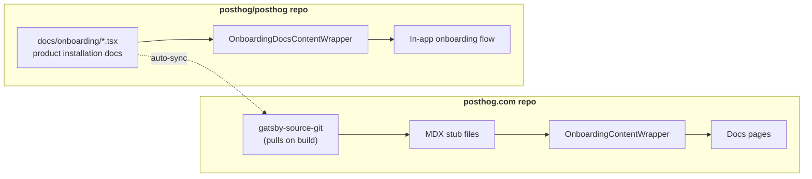

Onboarding docs, or product installation docs, are special because these instructions are **shared** between the [in-app onboarding flow](https://github.com/PostHog/posthog/tree/master/frontend/src/scenes/onboarding) and the getting started pages on the [posthog.com website](https://github.com/PostHog/posthog.com). 


These are some of the first pieces of docs a new user will see. They show users how to quickly set up and install a product, so they need to be up to date and accurate.

To help keep in-app and website onboarding docs in sync, there is a **single source** of truth for the onboarding docs in the [`posthog/posthog`](https://github.com/PostHog/posthog) repository under the [`docs/onboarding`](https://github.com/PostHog/posthog/tree/master/docs/onboarding) directory. This means you only need to update the in-app onboarding docs in the PostHog monorepo, and the website docs will be updated automatically.

<ProductVideo
    videoLight= "https://res.cloudinary.com/dmukukwp6/video/upload/posthog_onboarding_docs_13eddf168e.mp4" 
    alt="How shared onboarding docs work" 
    classes="rounded"
    autoPlay={false}
    muted={false}
/>

<Caption>
Video explainer of how onboarding docs and shared rendering work
</Caption>

## Which products have shared onboarding docs

This is a relatively new feature, so we're still migrating old onboarding docs to the new system. As of February 2026:

| Product | Status |
|---------|--------|
| LLM analytics | ✅ Migrated |
| Product analytics | ✅ Migrated |
| Web analytics | ✅ Migrated |
| Web analytics | ✅ Migrated |
| Session replay | ✅ Migrated |
| Feature flags | ✅ Migrated |
| Experiments | ✅ Migrated |
| Error tracking | ✅ Migrated |
| Surveys | ⏳ In progress |
| Data pipelines | ⏳ Not yet migrated |
| Data warehouse | ⏳ Not yet migrated |
| Revenue analytics | ⏳ Not yet migrated |
| PostHog AI | ⏳ Not yet migrated |
| Workflows | ⏳ Not yet migrated |
| Logs | ⏳ Not yet migrated |
| Endpoints | ⏳ Not yet migrated |

## How it all works

Onboarding content is written once as React components in the [`posthog/posthog`](https://github.com/PostHog/posthog) repo, then rendered in two places:

1. **PostHog monorepo:** For in-app onboarding, the PostHog app imports these docs components directly and wraps them with [`OnboardingDocsContentWrapper`](https://github.com/PostHog/posthog/blob/master/frontend/src/scenes/onboarding/OnboardingDocsContentWrapper.tsx), which provides UI components like `Steps`, `CodeBlock`, etc.
2. **Posthog.com repo:** The website pulls the docs components from the monorepo via `gatsby-source-git`, a Gatsby plugin, and then renders them through MDX stub files that use a similar but different [`OnboardingContentWrapper`](https://github.com/PostHog/posthog.com/blob/master/src/components/Docs/OnboardingContentWrapper.tsx) to provide compatible UI components.

Both wrappers provide the same component names (`Steps`, `CodeBlock`, `CalloutBox`, etc.) so the shared content renders correctly in either place. When you merge changes to `master` in `posthog/posthog`, the website automatically pulls the updated content on its next build.



If you need some help with structuring your files, this is the architecture for each repo:

```
posthog/posthog
├── docs/onboarding/
│   └── your-product/
│       ├── sdk-name.tsx          # getSteps + createInstallation
│       └── _snippets/
│           └── reusable-snippet.tsx
│
└── frontend/src/scenes/onboarding/
    └── sdks/your-product/
        └── YourProductSDKInstructions.tsx  # withOnboardingDocsWrapper

posthog/posthog.com
└── contents/docs/your-product/
    └── installation/
        ├── sdk-name.mdx          # MDX stub
        └── _snippets/
            ├── prefix-installation-wrapper.tsx  # Single file with ALL wrappers
            └── shared-helpers.tsx               # modifySteps helpers
```

For a complete working example, see the **[Session Replay](/docs/session-replay/installation)** implementation:

| Repo | File |
|------|------|
| posthog/posthog | [`docs/onboarding/session-replay/`](https://github.com/PostHog/posthog/blob/master/docs/onboarding/session-replay/) |
| posthog.com | [`react.mdx`](https://github.com/PostHog/posthog.com/blob/master/contents/docs/session-replay/installation/react.mdx) |
| posthog.com | [`sr-installation-wrapper.tsx`](https://github.com/PostHog/posthog.com/blob/master/contents/docs/session-replay/installation/_snippets/sr-installation-wrapper.tsx) (single file with all wrappers) |

## How to create/migrate new onboarding docs

### Step 1: Create the shared component in posthog/posthog

1. Navigate to the product directory in `docs/onboarding/`. If it doesn't exist, create it: `docs/onboarding/your-product/`
2. Create a new `.tsx` file: `docs/onboarding/your-product/filename.tsx`
3. Export a step function and Installation component. Use `createInstallation` to automatically handle the rendering:

   ```tsx file=docs/onboarding/feature-flags/python.tsx
   import { OnboardingComponentsContext, createInstallation } from 'scenes/onboarding/OnboardingDocsContentWrapper'
   import { getPythonSteps as getPythonStepsPA } from '../product-analytics/python'
   import { StepDefinition } from '../steps'

   // Step function receives a single context object with all components
   export const getPythonSteps = (ctx: OnboardingComponentsContext): StepDefinition[] => {
       const { CodeBlock, Markdown, dedent, snippets } = ctx

       // Reuse installation steps from product-analytics
       const installationSteps = getPythonStepsPA(ctx)

       // Add feature-flag-specific steps
       const flagSteps: StepDefinition[] = [
           {
               title: 'Evaluate feature flags',
               badge: 'required',
               content: (
                   <>
                       <Markdown>Check if a feature flag is enabled:</Markdown>
                       {snippets?.BooleanFlagSnippet && <snippets.BooleanFlagSnippet />}
                   </>
               ),
           },
       ]

       return [...installationSteps, ...flagSteps]
   }

   // createInstallation wraps your step function into a ready-to-use component
   export const PythonInstallation = createInstallation(getPythonSteps)
   ```

  <CalloutBox type="fyi" title="Key patterns">

    - You can reuse installation steps from product analytics by calling their step function with the same context.
    - Step badges include `required`, `optional`, or `recommended`.

  </CalloutBox>

4. For reusable snippets, create them in `docs/onboarding/<product>/_snippets/` and export a named component.
5. Create the in-app wrapper in `frontend/src/scenes/onboarding/sdks/your-product/`. Use the `withOnboardingDocsWrapper` helper:

   ```tsx file=frontend/src/scenes/onboarding/sdks/feature-flags/FeatureFlagsSDKInstructions.tsx
   import { PythonInstallation, BooleanFlagSnippet, MultivariateFlagSnippet } from '@posthog/shared-onboarding/feature-flags'
   import { PythonEventCapture } from '@posthog/shared-onboarding/product-analytics'
   import { withOnboardingDocsWrapper } from '../shared/onboardingWrappers'

   const PYTHON_SNIPPETS = {
       PythonEventCapture,
       BooleanFlagSnippet,
       MultivariateFlagSnippet,
   }

   const FeatureFlagsPythonInstructionsWrapper = withOnboardingDocsWrapper({
       Installation: PythonInstallation,
       snippets: PYTHON_SNIPPETS,
   })

   export const FeatureFlagsSDKInstructions: SDKInstructionsMap = {
       [SDKKey.PYTHON]: FeatureFlagsPythonInstructionsWrapper,
       // ... other SDKs
   }
   ```

6. Test in the app by running the monorepo locally and navigate to `localhost:8010/onboarding`. From this page, you can select your product and test.

### Step 2: Create the website stub in posthog/posthog.com

1. To test your changes locally, temporarily edit `gatsby-config.js` to point to your branch:

   ```js
   {
       resolve: `gatsby-source-git`,
       options: {
           name: `posthog-main-repo`,
           remote: `https://github.com/posthog/posthog.git`,
           branch: 'your-branch-name', // Change from 'master' to your branch
           patterns: ['docs/published/**', 'docs/onboarding/**'],
       },
   },
   ```

   <CalloutBox type="caution" title="Don't forget to revert this change!">
   Do not merge changes to `gatsby-config.js` that point to a non-master branch. This is only for testing.
   </CalloutBox>

2. Create a **single TSX wrapper file** at `contents/docs/<product>/installation/_snippets/<prefix>-installation-wrapper.tsx` that exports all SDK wrappers:

   ```tsx file=contents/docs/session-replay/installation/_snippets/sr-installation-wrapper.tsx
   import React from 'react'
   import {
       JSWebInstallation,
       ReactInstallation,
       NextJSInstallation,
       // ... import all SDK installations
       SessionReplayFinalSteps,
   } from 'onboarding/session-replay'
   import { OnboardingContentWrapper } from 'components/Docs/OnboardingContentWrapper'
   import { addNextStepsStep } from './shared-helpers'

   const SNIPPETS = {
       SessionReplayFinalSteps,
   }

   // Export a wrapper for each SDK
   export const SRJSWebInstallationWrapper = () => (
       <OnboardingContentWrapper snippets={SNIPPETS}>
           <JSWebInstallation modifySteps={addNextStepsStep} />
       </OnboardingContentWrapper>
   )

   export const SRReactInstallationWrapper = () => (
       <OnboardingContentWrapper snippets={SNIPPETS}>
           <ReactInstallation modifySteps={addNextStepsStep} />
       </OnboardingContentWrapper>
   )

   export const SRNextJSInstallationWrapper = () => (
       <OnboardingContentWrapper snippets={SNIPPETS}>
           <NextJSInstallation modifySteps={addNextStepsStep} />
       </OnboardingContentWrapper>
   )

   // ... repeat for all SDKs
   ```

   The `modifySteps` prop lets you add website-specific steps (like "Next steps") that aren't needed in-app.

3. Create an MDX stub file for each SDK at `contents/docs/<product>/installation/<name>.mdx`:

   ```mdx file=contents/docs/session-replay/installation/react.mdx
   ---
   title: React session replay installation
   platformLogo: react
   showStepsToc: true
   ---

   <!--
   This page imports shared onboarding content from the main PostHog repo.
   Source: https://github.com/PostHog/posthog/blob/master/docs/onboarding/session-replay/react.tsx
   -->

   import { SRReactInstallationWrapper } from './_snippets/sr-installation-wrapper.tsx'

   <SRReactInstallationWrapper />
   ```

4. Test locally: Run `pnpm start` and verify the page renders correctly at the expected URL.
5. Commit and merge both the `posthog/posthog` and `posthog/posthog.com` PRs.

<CalloutBox type="caution" title="Before committing">
Make sure you've reverted any changes to `gatsby-config.js` before pushing your PR.
</CalloutBox>
