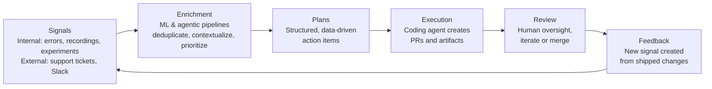

## What is the AI platform?

The PostHog AI platform is our infrastructure for building and delivering AI-powered features across all PostHog products. Instead of each team building isolated AI capabilities, we provide shared architecture, reusable components, and a consistent framework that lets everyone contribute toward our AI capabilities while maintaining quality and consistency.

Think of it like HogQL: rather than having every team write their own query engines, we built one shared system that everyone can use and extend. The AI platform follows the same philosophy — avoid reinventing AI infrastructure and prevent "death by random AI widgets."

## Why we built it

Almost every team at PostHog either is building or needs to build AI features. Without a platform approach, we'd face:

- **Fragmented user experience**: Different AI interactions across products with inconsistent quality and UX patterns
- **Duplicated effort**: Multiple teams solving the same problems (authentication, error handling, rate limiting, tool calling)
- **Maintenance burden**: Each team maintaining their own AI infrastructure, models, and prompt engineering
- **Limited capabilities**: Teams constrained to simple AI features because building advanced functionality (like multi-step reasoning or agentic workflows) from scratch is too expensive

The AI platform solves these problems by providing:

1. **Shared architecture**: A single-loop agent system that any product can extend with domain-specific tools and expertise
2. **Reusable components**: Common tools (search, data access, taxonomy reading) that work across all AI features
3. **Consistent UX**: Standard patterns for AI interactions, loading states, error handling, and result presentation
4. **Platform-level improvements**: When we improve the core agent (better reasoning, faster responses, cheaper inference), all products benefit automatically

## Vision: Product autonomy

The overarching goal of PostHog's AI direction is **product autonomy** — a closed loop where PostHog data automatically drives product improvements with minimal human intervention.

Here's how the loop works:

1. **Signals**: PostHog collects signals from all products and external sources — error patterns, frustration in session recordings, experiment results, survey responses, insight thresholds, support tickets, Slack threads, and more. These signals represent real problems or opportunities.

2. **Enrichment**: PostHog processes and enriches these signals, deduplicating across data sources and adding context. A vague signal like "users seem frustrated during checkout" becomes a concrete, contextualized finding.

3. **Plans**: The enriched signals are transformed into structured plans — similar to how Claude Code works, but driven by data rather than human prompts. Each plan describes what needs to happen, why, and what evidence supports it.

4. **Execution**: A sandboxed coding agent takes these plans and acts on them. Today, we're focused on automatically creating pull requests. The agent also handles instrumentation automatically — adding tracking events, feature flags, and experiments as part of the code it ships. Better instrumentation produces better signals, making the entire loop smarter over time. In the future, other artifact types will be supported — decks, growth reviews, and more.

5. **Review**: Product engineers review, iterate on, and merge (or decline) the proposed changes.

6. **Feedback**: Once a change ships, a new signal is created so the system can evaluate what happened after the PR was merged. Did the metric improve? Did new errors appear? This feeds back into step 1.

7. **Loop**: The cycle continues until the agent finds an exit condition — low actionability, non-important signals, noisy signals, de-prioritized work, etc.

This vision connects all the individual AI products. PostHog products and external sources (support tickets, Slack) generate signals, ML and agentic pipelines enrich them into structured plans, background and local coding agents execute on those plans, and product engineers review and collaborate on the changes. The loop closes when shipped changes generate new signals that feed back into the cycle.

For how product teams can contribute to this vision, see [Integration vectors for product teams](/handbook/engineering/ai/team-structure#integration-vectors-for-product-teams).

## Architecture at a glance

The AI platform has three main layers:

### 1. User-facing products

These are the AI features users interact with directly:
- **[PostHog AI](/handbook/engineering/ai/products#posthog-ai)**: In-app conversational agent for interacting with PostHog
- **[Deep research](/handbook/engineering/ai/products#deep-research)**: Automated investigative research for complex, open-ended problems
- **[Session summaries](/handbook/engineering/ai/products#session-summaries)**: Batch analysis of session recordings to find patterns
- **[PostHog Code](/handbook/engineering/ai/products#posthog-code)**: Agent development environment that gives each task its own isolated workspace
- **[Wizard](/handbook/engineering/ai/products#wizard)**: CLI tool for automated PostHog installation and setup
- **[MCP Server](/handbook/engineering/ai/products#mcp)**: Protocol integration for third-party AI tools like Claude Code

### 2. Core infrastructure

The shared components that power all products:
- **Single-loop agent**: An agent architecture that maintains full context and can dynamically load domain expertise
- **Agent modes**: Pluggable modules that give the agent specialized knowledge and tools (SQL, Analytics, CDP, etc.)
- **Core tools**: Universal features like search, data reading, and task tracking
- **MCP integration**: Exposes agent features to external tools via Model Context Protocol

### 3. Integration points

How everything connects together:
- Products share the same agent features through the MCP server
- Task generation systems (from Deep Research, Session Summaries, PostHog signals) feed PostHog Code
- The Wizard and PostHog Code consume MCP tools to interact with PostHog

For a detailed technical overview, see [AI platform architecture](/handbook/engineering/ai/architecture).

## Products overview

### PostHog AI [General availability]
Your primary interface for working with PostHog. Instead of clicking through forms and menus, describe what you want in natural language. PostHog AI can create dashboards, write SQL queries, set up surveys, and answer questions about your data — all through conversation.

**Best for**: Quick answers, creating resources, learning PostHog, iterative exploration
**Status**: Beta | **Pricing**: Paid with free tier

[Learn more →](/handbook/engineering/ai/products#posthog-ai)

### Deep research [Beta]
When you need to investigate complex, open-ended problems, Deep research digs deep. It systematically explores your data — session recordings, analytics, error logs — and produces comprehensive research reports that would take a human analyst hours to create.

**Best for**: Understanding why metrics changed, investigating user behavior patterns, root cause analysis
**Status**: Under development | **Pricing**: Paid with free tier

[Learn more →](/handbook/engineering/ai/products#deep-research)

### Session summaries [Alpha]
Analyze hundreds of session recordings in minutes instead of hours. Session summaries finds patterns, clusters similar issues, and shows you what's actually happening across your user sessions — not just what you caught in the first few recordings you watched.

**Best for**: Understanding UX issues, debugging problems affecting multiple users, finding edge cases
**Status**: Alpha | **Pricing**: Paid with free tier

[Learn more →](/handbook/engineering/ai/products#session-summaries)

### PostHog Code [Under development]
An agent development environment that solves the messy workflow problem of engineering with coding agents. Each task gets its own isolated workspace where an agent works — you can guide the agent, review changes, and switch between workspaces, with everything related to a task in one place instead of across your terminal, editor, and GitHub.

**Best for**: Product engineers who work on multiple tasks simultaneously and already use agents heavily
**Status**: Under development | **Pricing**: TBD

[Learn more →](/handbook/engineering/ai/products#posthog-code)

### Wizard [General availability]
Get PostHog set up in minutes instead of hours. The Wizard detects your tech stack, generates integration code, verifies the installation, and gets you collecting data with minimal manual work.

**Best for**: New PostHog users, setting up new projects, quick integration
**Status**: General availability | **Pricing**: Free

[Learn more →](/handbook/engineering/ai/products#wizard)

### MCP server [General availability]
Bring PostHog into your development environment. The MCP server makes PostHog AI's features available to Claude Code, VS Code, and other MCP-compatible tools, so you never have to leave your editor to check analytics or create insights.

**Best for**: Engineers who prefer editor-based workflows, combining PostHog with other data sources
**Status**: General availability | **Pricing**: Free

[Learn more →](/handbook/engineering/ai/products#mcp)

## Key concepts
For a list of key concepts definitions, see the [Glossary](/handbook/engineering/ai/architecture#glossary).

## Getting started

### For users
- **Want to try PostHog AI?** Open the chat interface in PostHog and start asking questions. See [user documentation](/docs/posthog-ai).
- **Prefer working in your editor or coding agent?** Set up the [MCP server](/handbook/engineering/ai/products#mcp) in Claude Code or VS Code.
- **Need deep investigation?** Toggle to Deep research feature in PostHog AI.

### For engineers building AI features
- **Not sure where to start?** See [Integration vectors for product teams](/handbook/engineering/ai/team-structure#integration-vectors-for-product-teams) for the different ways your team can contribute — MCP tools, skills, signals, and more.
- **Adding AI to your product?** Start with [Team structure and collaboration](/handbook/engineering/ai/team-structure) to understand the process.
- **Want to add a new agent mode?** See [Architecture](/handbook/engineering/ai/architecture) for technical details.
- **Need implementation guidance?** Check [Implementation guide](/handbook/engineering/ai/implementation) for best practices and patterns.

### For product managers
- **Planning an AI feature?** Read [Pricing and product positioning](/handbook/engineering/ai/implementation#pricing-and-product-positioning) to understand our approach.
- **Want to understand capabilities?** See [Products](/handbook/engineering/ai/products) for detailed breakdowns of each product.

## What's next?

The AI platform is actively evolving. Major initiatives include:

- **Third-party context integration**: Connect PostHog AI to Slack, Zendesk, and other tools for richer context
- **PostHog Code expansion**: Moving from alpha dogfooding to broader availability
- **Deep research refinement**: Improving research strategies and denoising algorithms
- **Mode expansion**: Adding more specialized agent modes as product teams identify needs

For details on upcoming work, see [Future directions](/handbook/engineering/ai/implementation#future-directions).

## Documentation navigation

- **[Products](/handbook/engineering/ai/products)**: Detailed information about each user-facing product
- **[Architecture](/handbook/engineering/ai/architecture)**: Technical deep dive on agent systems and infrastructure
- **[Team Structure](/handbook/engineering/ai/team-structure)**: How teams collaborate on AI features
- **[Implementation Guide](/handbook/engineering/ai/implementation)**: Best practices, pricing, and implementation patterns

## Contact

For questions about working with the AI platform:
- **Slack**: #team-posthog-ai
- **Team page**: <SmallTeam slug="posthog-ai" />
- **Objectives**: [Current goals and initiatives](/teams/posthog-ai/objectives)
