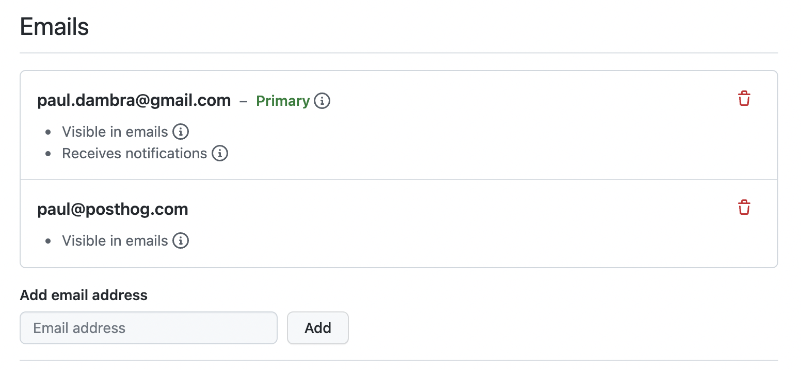
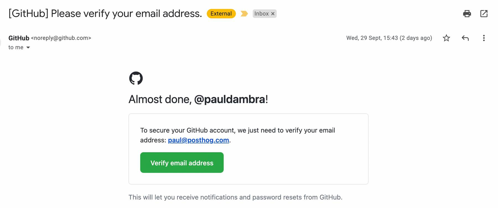
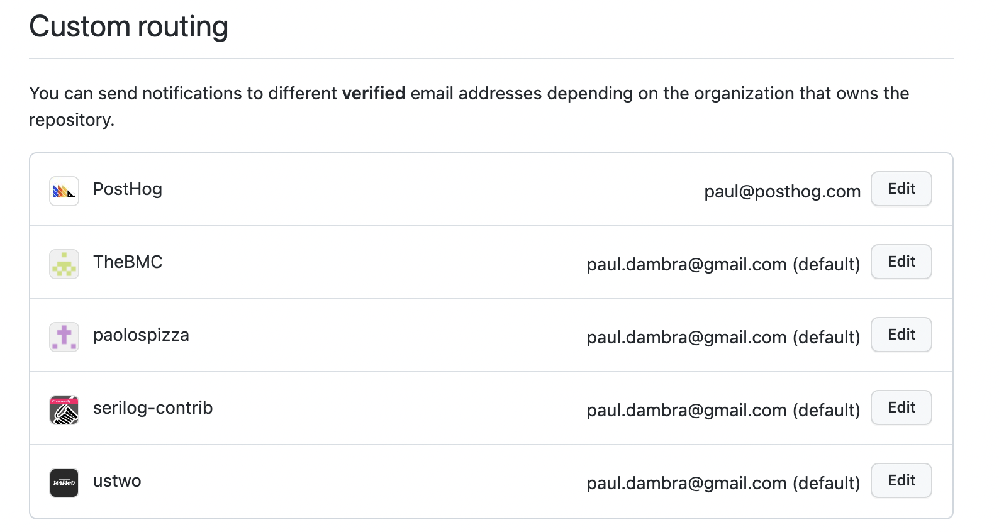

# GitHub Setup

## Email

It is a common scenario to use a GitHub account that is associated with your personal (or non-PostHog) email address.

That will mean that notifications about PostHog work don't go to your PostHog account. Which can make them easier to miss.

To avoid this you can add additional email addresses to your GitHub account, and set certain notifications to go to that email address.

### First, add an email address

[GitHub have instructions here](https://docs.github.com/en/account-and-profile/setting-up-and-managing-your-github-user-account/managing-email-preferences/adding-an-email-address-to-your-github-account)

* Visit https://github.com/settings/emails
* Enter your PostHog email address into the add email address input field
* Click "Add"
* GitHub will email you to verify the address
* Click the verification link in that email

  
## Notifications

You can then associate notifications with the newly added PostHog email address.

* Visit https://github.com/settings/notifications
* Scroll to the bottom to the 'Custom Routing' section
* Click Edit on the PostHog organisation row
* Select your PostHog email address
* Click Save

PostHog notifications will now be delivered to your PostHog email address.

**[Back: Technologies to learn](../technologies-to-learn)**
