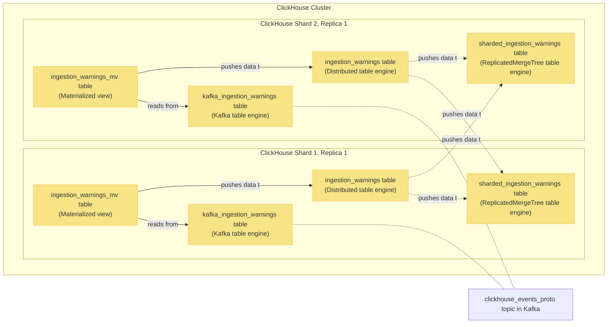

This document covers:
- Different options for ingesting data into MergeTree tables and trade-offs involved
- How Kafka table engine works?
- What are materialized views?
- Examples of a full schema setup

## Using `INSERT`s for ingestion

As any database system, ClickHouse allows using `INSERT`s to load data.

However each `INSERT` creates a new part in ClickHouse, which
comes with a lot of overhead and in a busy system will lead to errors due to exceeding
[`parts_to_throw` MergeTree table setting](https://clickhouse.com/docs/en/operations/settings/merge-tree-settings/#parts-to-throw-insert) (default 300).

ClickHouse provides a bunch of options to make `INSERT`s still work. For example:
- Batch inserts
- [`async_insert` setting](https://clickhouse.com/docs/en/operations/settings/settings/#async-insert)
- [Buffer table engine](https://clickhouse.com/docs/en/engines/table-engines/special/buffer/)

However these come with their own trade-offs, consistency problems and requires the ClickHouse cluster to always be accessible.
As such, PostHog instead leverages Kafka engine tables for ingestion.

## Why we ingest via Kafka tables

We instead rely on the [Kafka table engine](https://clickhouse.com/docs/en/engines/table-engines/integrations/kafka/) to handle ingestion
into ClickHouse.

The benefits are:
- Resiliency: It handles sudden spikes in traffic and ClickHouse cluster unavailability gracefully
- PostHog already uses Kafka throughout the app, making it a safe technical choice

It also has minimal overhead in terms of memory used and allows us to always temporarily stop ingestion by removing the tables in question.

## How kafka tables work

Kafka engine tables act as Kafka consumers in a given [consumer group](https://docs.confluent.io/platform/current/clients/consumer.html#concepts).
Selecting from that table advances the consumer offsets.

A kafka table on it's own does nothing beyond allowing to select from Kafka - it needs to be paired with other tables for ingestion
to work.

Example kafka engine table:

```sql
CREATE TABLE kafka_ingestion_warnings
(
    team_id Int64,
    source LowCardinality(VARCHAR),
    type VARCHAR,
    details VARCHAR CODEC(ZSTD(3)),
    timestamp DateTime64(6, 'UTC')
)
ENGINE = Kafka('kafka:9092', 'clickhouse_ingestion_warnings_test', 'group1', 'JSONEachRow')
```

It is important to send correctly formatted messages to the topic you're selecting from.  When selecting from a kafka table,
ClickHouse assumes messages in the topic are formatted correctly. If not, this may stall the consumer depending on the value
of `kafka_skip_broken_messages`, breaking ingestion.

## Materialized views

[Materialized views](https://clickhouse.com/docs/en/sql-reference/statements/create/view/#materialized-view) in ClickHouse
can be thought of as triggers - they react to new blocks being INSERTed into source tables and allow transforming and piping
that data to other tables.

Note that materialized views come with a lot of gotchas.

A great resource for learning more is [this presentation](https://den-crane.github.io/Everything_you_should_know_about_materialized_views_commented.pdf).

## Example schema - reading and writing ingestion events

Consider the following sharded table schema together with `kafka_ingestion_warnings`:

```sql
CREATE TABLE sharded_ingestion_warnings
(
    team_id Int64,
    source LowCardinality(VARCHAR),
    type VARCHAR,
    details VARCHAR CODEC(ZSTD(3)),
    timestamp DateTime64(6, 'UTC'),
    _timestamp DateTime,
    _offset UInt64,
    _partition UInt64
)
ENGINE = ReplicatedMergeTree('/clickhouse/tables/{shard}/posthog.sharded_ingestion_warnings', '{replica}')
PARTITION BY toYYYYMMDD(timestamp)
ORDER BY (team_id, toHour(timestamp), type, source, timestamp)

CREATE TABLE ingestion_warnings ON CLUSTER 'posthog'
(
    team_id Int64,
    source LowCardinality(VARCHAR),
    type VARCHAR,
    details VARCHAR CODEC(ZSTD(3)),
    timestamp DateTime64(6, 'UTC'),
    _timestamp DateTime,
    _offset UInt64,
    _partition UInt64
)
ENGINE = Distributed('posthog', 'posthog', 'sharded_ingestion_warnings', rand())

CREATE MATERIALIZED VIEW ingestion_warnings_mv
TO posthog.ingestion_warnings
AS SELECT
    team_id,
    source,
    type,
    details,
    timestamp,
    _timestamp,
    _offset,
    _partition
FROM posthog.kafka_ingestion_warnings
```

In this schema:
- `sharded_ingestion_warnings` MergeTree is responsible for storing the ingested data
- `ingestion_warnings` table is responsible for fielding queries and distributing writes to `sharded_ingestion_warnings` tables across shards
- `ingestion_warnings_mv` regularly polls `kafka_ingestion_warnings` and pushes the data to `ingestion_warnings` distributed table
    - Note it also forwards `_timestamp`, `_offset` and `_partition` virtual columns containing Kafka message metadata so they can be stored and used during debugging.

### Visualized

This is the same schema visualized in a ClickHouse cluster with 2 shards and 1 replica each:



## Further reading

- https://clickhouse.com/docs/en/sql-reference/statements/insert-into/#performance-considerations
- https://clickhouse.com/docs/en/integrations/kafka/kafka-table-engine
- https://clickhouse.com/docs/en/engines/table-engines/integrations/kafka/
- https://docs.confluent.io/platform/current/clients/consumer.html#concepts
- https://altinity.com/blog/clickhouse-materialized-views-illuminated-part-1
- https://posthog.com/blog/clickhouse-vs-postgres#clickhouses-not-so-secret-weapon-materialized-views
- https://den-crane.github.io/Everything_you_should_know_about_materialized_views_commented.pdf
