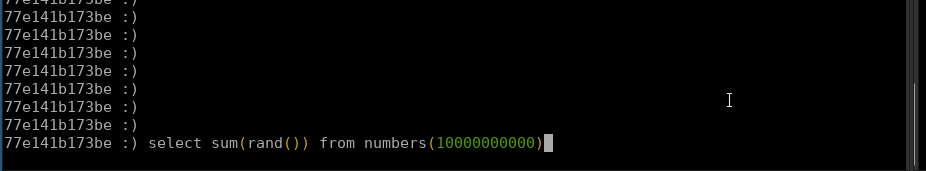

This document goes over:
- what tools are available to understand and measure query performance
- importance of page cache
- general tips and tricks for performant queries

## Tooling

### clickhouse-client

`clickhouse-client` is a command-line application for running queries against ClickHouse.

When executing queries, it details progress, execution time, how many rows and gigabytes of data were processed, and how much
CPU was used.



### `system.query_log`

ClickHouse saves all queries it runs into [`system.query_log`](https://clickhouse.com/docs/en/operations/system-tables/query_log/) table.

It includes information on:
- What query was run and when
- How long did it take to execute
- How many resources did it take up: memory, rows/bytes read
- In case of errors, exception information
- For distributed queries, `is_initial_query` to disambiguate distributed queries

At PostHog, we also often add metadata to the query as a comment to make it easier to analyze later.

An example query to get recent slow queries:

```sql
SELECT
    query_duration_ms,
    query,
    event_time,
    read_rows,
    formatReadableSize(read_bytes) as read_size,
    result_rows,
    formatReadableSize(result_bytes) as result_size,
    formatReadableSize(memory_usage) as memory,
    columns,
    query_id
FROM system.query_log
WHERE
    query NOT LIKE '%query_log%'
    AND type = 'QueryFinish'
    AND event_time > now() - interval 3 day
    AND query_duration_ms > 30000
ORDER BY query_duration_ms desc
LIMIT 10
```

Note that this table is not distributed - on a cluster setting you might need to run query against each node separately or
do [ad-hoc distributed queries](/handbook/engineering/clickhouse/replication#ad-hoc-distributed-queries).

### `EXPLAIN`

Previous pages in this manual [showed various examples](/handbook/engineering/clickhouse/data-storage#aggregation-supported-by-order-by)
of using the ClickHouse `EXPLAIN` statement to your advantage.

Various forms of explain can detail:
- If and how much data ClickHouse was able to avoid processing thanks to schema setup
- If and how ClickHouse "optimizes" the query by moving columns to `PREWHERE`
- Detailing how the query is planned to be executed

Read more about `EXPLAIN` in [ClickHouse's EXPLAIN Statement docs](https://clickhouse.com/docs/en/sql-reference/statements/explain/).

### Flame graphs

For CPU-bound calculations, [flamegraphs](https://github.com/Slach/clickhouse-flamegraph) can help visualize what ClickHouse worked on during query execution.

<div
  class="relative mt-2 mb-4"
>
  <object
    data={'/images/flamegraph.svg'}
    type="image/svg+xml"
  />
</div>

We've built flamegraph support into PostHog. You can find tools to generate flamegraphs for queries under PostHog instance settings.

## Importance of the page cache

When running queries, you might encounter an odd artifact: the first time you run a query, it's really slow but it speeds up significantly
when run again.

This behavior is due to [page cache](https://www.thomas-krenn.com/en/wiki/Linux_Page_Cache_Basics) in linux. In broad terms, the operating
system caches recently read files into memory, speeding up subsequent reads of the same data.

As most queries in ClickHouse are dependent on fast I/O to execute fast, this can have a significant effect on query performance. It is a reason
why at PostHog our ClickHouse nodes have a lot of memory available.

### Effect on benchmarking

This behavior can be a problem for profiling: users constructing new queries might not hit the page cache and receive a worse
experience than benchmarking may show.

This means it's often important to wipe page cache on ClickHouse when doing queries. This can be achieved with the following command on a ClickHouse node:

```bash
sudo sh -c "/usr/bin/echo 3 > /proc/sys/vm/drop_caches"
```

## Tips for achieving well-performing queries

Previous pages in the ClickHouse manual have highlighted the importance of
[setting up the correct schema](/handbook/engineering/clickhouse/data-storage)
and detailing how [queries work in a distributed setting](/handbook/engineering/clickhouse/replication).

This section highlights some general rules of thumb that can help speed up queries:

- [Make sure query is supported by **ORDER BY**](/handbook/engineering/clickhouse/data-storage#aggregation-supported-by-order-by). This is frequently the single biggest factor in query performance.
- [Avoid JOINs and sub-queries whenever possible](/handbook/engineering/clickhouse/data-storage#weak-join-support). Denormalizing data can help here.
- [Partition data so old partitions can be skipped](/handbook/engineering/clickhouse/data-storage#partition-by).
- Push down any and all WHERE conditions to in queries as deep as possible, as ClickHouse [won't do it for you](/handbook/engineering/clickhouse/data-storage#no-query-planner).
- Avoid reading columns that are not needed for the query.
- Test if [moving small column filters to `PREWHERE`](/handbook/engineering/clickhouse/data-storage#no-query-planner) helps performance.
- [Avoid reading large columns in `PREWHERE`](/handbook/engineering/clickhouse/data-storage#no-query-planner).
- [Compress columns with appropriate codecs](/handbook/engineering/clickhouse/data-storage#data-compression).
- Make use of the [extensive catalogue aggregation functions available in ClickHouse](https://clickhouse.com/docs/en/sql-reference/aggregate-functions/).
- [Looking up single rows is frequently slow](/handbook/engineering/clickhouse/data-storage#point-queries-not-supported-by-order-by).
- [ORDER BY and LIMIT/OFFSET can be slow in sharded settings](/handbook/engineering/clickhouse/replication#example-query-limit-filter-and-aggregate).
- Cheat: [preaggregate data](/handbook/engineering/clickhouse/schema/app-metrics) or leverage materialized columns to pull out data from large columns.
- Leverage [query settings in special cases](https://clickhouse.com/docs/en/operations/settings/settings/).

Also always do your benchmarking in a realistic setting: on large datasets on powerful machines.

Next in the ClickHouse manual: [Operations](/handbook/engineering/clickhouse/operations)
