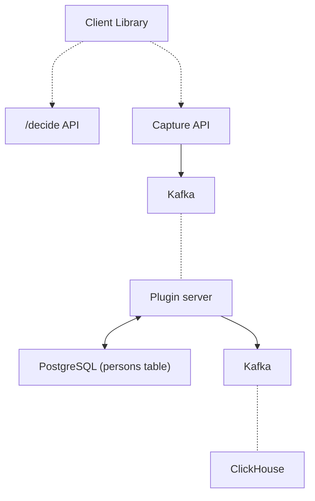

In its simplest form, PostHog is an analytics data store where events come in and get analyzed.

This document gives an overview of how data ingestion works.

## Ingestion data flow

The following sections break each part down in more detail.

### Client libraries

Client libraries are responsible for capturing user interactions and sending the events to us.

Note that various client libraries also can call `/decide` endpoint for:
- `posthog-js`: on load for compression, session recording, feature flags and other autocapture-related settings
- other libraries: for checking feature flags

### Capture API

Capture API is responsible for capturing data.

It is responsible for:
- Validating API keys.
- Anonymizing IPs according to project settings.
- Decompressing and normalizing the shape of event data for the rest of the system.
- Sending processed to `events_plugin_ingestion` Kafka topic.
- If communication with Postgres fails, logging events to kafka `dead_letter_queue` table.

The design goal of this service is to be as simple and resilient as possible to avoid dropping events.

### App server

On a high level during ingestion, app server:
- Reads events from `events_plugin_ingestion` kafka topic
- Runs user-created apps on the events, potentially modifying the shape of the events.
- Handles `person` (and groups) creation and updates, using `posthog_person` postgresql table as the source of truth.
- Sends events, persons, groups to specialized kafka tables for clickhouse to read.
- Does that in a highly parallelized way to handle high ingestion volume.

### Kafka

Kafka is used as a resilient message bus between different services.

You can find relevant kafka topics [in the PostHog codebase](https://github.com/PostHog/posthog/blob/master/posthog/kafka_client/topics.py).

## ClickHouse

ClickHouse is our main analytics backend.

Instead of data being inserted directly into ClickHouse, it ingests data from Kafka. This makes our ingestion pipeline more resilient towards outages.

Read more in the [ClickHouse manual](/handbook/engineering/clickhouse/data-ingestion).

### Persons ingestion

Persons ingestion works similarly to events, except there's two tables involved: `person` and `person_distinct_id`.

Note that querying both tables _requires_ handling duplicated rows. Check out [PersonQuery code](https://github.com/PostHog/posthog/blob/master/posthog/queries/person_query.py) for an example of how it's done.

In sharded setups, `person` and `person_distinct_id` tables are not sharded and instead replicated onto each node to avoid JOINs over the network.
