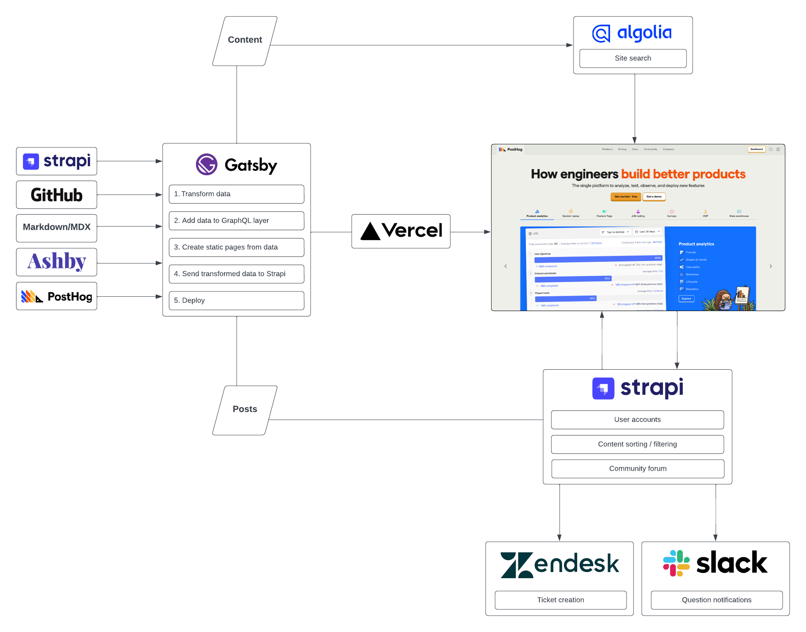

PostHog.com is built and maintained in-house by the [Website & Docs team](/handbook/small-teams/website-docs).

| Service 	| Purpose 	|
|---	|---	|
| Vercel 	| Hosting 	|
| Gatsby 	| Static site framework 	|
| GitHub 	| Source code repository 	|
| Ashby (API) 	| Applicant tracking system 	|
| Algolia (API) 	| Site search 	|
| Strapi 	| Headless CMS 	|
| PostHog 	| Analytics, feature flags 	|

Website content is stored in two places:

1. Markdown/MDX files (in the [GitHub repo](https://github.com/posthog/posthog.com/)) - _most website content_
    - Docs, handbook, most pages
1. Strapi - _user-generated content_
    - Community forum posts, community profiles
